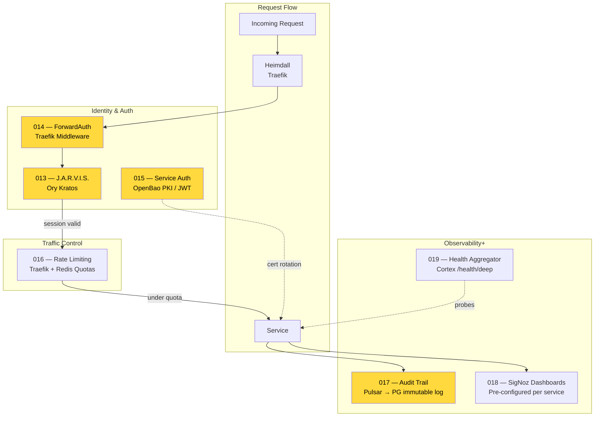

# A.R.C. Platform — Roadmap

> **Version**: 1.0.0 | **Date**: 2026-03-01
> **Agentic Reasoning Core** — open-source Platform-in-a-Box for distributed AI agents.

---

## Platform Today

### What's Missing

---

## Architecture Target State

---

## Phase 1 — Intelligence Layer

> *Build what thinks. You can't demo an AI platform without AI.*

| # | Feature | Description | Lang | Deps |
|---|---------|-------------|------|------|
| 009 | **Sherlock Reasoning Engine** | LangGraph v1.0 + Qdrant + NATS — stateful RAG with 3-tier memory | Python | Qdrant, PG, NATS, Pulsar |
| 010 | **Scarlett Voice Agent** | LiveKit Agents SDK — STT → Sherlock → TTS real-time voice loop | Python | LiveKit, Sherlock |
| 011 | **Agent Memory SDK** | `arc-memory` package — Qdrant + Postgres dual-store for any agent | Python | Qdrant, PG |
| 012 | **Multi-Agent Orchestration** | LangGraph supervisor delegating to specialist sub-agents | Python | Sherlock, NATS |

---

## Phase 2 — Platform Hardening

> *Make it safe. No auth = no users.*

| # | Feature | Description | Lang | Deps |
|---|---------|-------------|------|------|
| 013 | **J.A.R.V.I.S. Identity** | Ory Kratos — registration, login, sessions, API keys | Config | PG, Redis |
| 014 | **Gateway Auth Middleware** | Traefik ForwardAuth validating Kratos sessions per-request | Config | Traefik, Kratos |
| 015 | **Service-to-Service Auth** | mTLS via OpenBao PKI or JWT validation between services | Config | OpenBao |
| 016 | **Rate Limiting & Quotas** | Per-user token quotas in Redis, enforced at Traefik | Config | Traefik, Redis |
| 017 | **Audit Trail** | Immutable event log — Pulsar topic → Postgres materialized | Python | Pulsar, PG |
| 018 | **SigNoz Dashboards** | Pre-built dashboards for latency, errors, throughput per service | JSON | SigNoz |
| 019 | **Health Aggregator** | Cortex probes all services, returns aggregate deep health | Go | Cortex |

---

## Phase 3 — CLI & Developer Experience

> *Make it usable. The CLI is how developers touch ARC.*

| # | Feature | Description | Deps |
|---|---------|-------------|------|
| 020 | **CLI Bootstrap** | `arc` Go binary — Cobra commands, XDG paths, embedded BoltDB state | None |
| 021 | **CLI Run** | `arc run --profile think` — compose orchestration from single binary | Docker |
| 022 | **CLI Status** | `arc status` — BubbleTea TUI grid of service health + resource usage | Services |
| 023 | **CLI Agent** | `arc agent create/list/inspect/delete` — agent CRUD via NATS commands | NATS, Sherlock |
| 024 | **CLI Chat** | `arc chat` — interactive Lipgloss REPL talking to Sherlock | Sherlock |
| 025 | **CLI Config** | `arc config init/show/edit` — manage `arc.yaml` source of truth | None |
| 026 | **CLI Logs** | `arc logs [service]` — multiplexed Docker log tailing with colors | Docker |

---

## Phase 4 — Ecosystem & Release

> *Make it shippable. From repo to community.*

| # | Feature | Description |
|---|---------|-------------|
| 027 | **Python SDK** | `pip install arc-sdk` — typed async client for chat, memory, agents, real-time |
| 028 | **Go SDK** | `go get arc-framework/sdk` — Go client for CLI and infrastructure integrations |
| 029 | **Docker Image Publishing** | GitHub Actions pipeline — build, test, publish all images to ghcr.io with semver |
| 030 | **E2E Test Suite** | Spin up `think` profile → run agent conversation → verify traces in SigNoz |
| 031 | **T-800 Chaos Testing** | Chaos Mesh — kill services, partition networks, verify auto-recovery |
| 032 | **Documentation Site** | Docusaurus — quickstart, architecture guide, API reference, tutorials |
| 033 | **CLI Installer** | `curl -fsSL install.sh` + Homebrew tap + apt/dnf repos |
| 034 | **Agent Marketplace** | Template registry — `arc agent create --template customer-support` |
| 035 | **Plugin System** | Python hooks for custom tools, memory providers, LLM backends |
| 036 | **Cloud Deploy** | `arc deploy` — generate K8s manifests or push to Fly.io |
| 037 | **Ivan Drago Adversarial** | Prompt injection, hallucination, and safety testing for agents |
| 038 | **Piper Data Pipeline** | ETL for document ingestion — PDF, markdown, web → Qdrant vectors |
| 039 | **Web UI** | React dashboard — chat, agent management, memory explorer, trace viewer |

---

## Dependency Graph

---

## Timeline & Milestones

---

## Service Matrix — Full Roster

---

## Profile Evolution

> **★** = new services added by this roadmap

---

## Build Order — Critical Path

### Why This Order

1. **Intelligence first** — Sherlock + Scarlett give you the demo: *"talk to an AI agent that remembers."* Everything else is plumbing until reasoning works.
2. **Hardening before CLI** — the CLI calls services. If auth doesn't exist, the CLI ships insecure. J.A.R.V.I.S. must exist before `arc chat` sends tokens.
3. **CLI before SDK** — the CLI *is* the first user. Building it defines the UX: what does `arc run` do? What does `arc agent create` need? The SDK wraps what the CLI already validated.
4. **SDK before ecosystem** — E2E tests, docs, and the web UI all consume the SDK. Ship the SDK, then build everything on top of it.
