# A.R.C. AI Infrastructure — Design Document

> Status: FIRST DRAFT
> Date: 2026-03-05
> Branch: 014-decouple-service-codenames

## Philosophy

**ARC is not a framework. ARC is AI infrastructure.**

A framework tells you how to build. Infrastructure gives you the primitives and gets out of your way.

ARC bends completely to the user:
- Use one service as a sidecar next to your existing app
- Use the full platform as your AI backbone
- Grow from one to the other without re-architecture

Every ARC service exposes endpoints (REST + async Pulsar topics). Users compose them however they want. ARC has no opinions about how they are wired together — that is the user's domain.

```
ARC provides:  reasoning, memory, retrieval, guardrails, evaluation, training signals
User provides: their data, their models, their business logic, their composition
```

---

## Vision

ARC is AI infrastructure with a **dual deployment spectrum**:

```
← Sidecar ────────────────────────────────────────── Full Platform →
  docker run arc-sherlock               arc run --profile ultra-instinct
  one service, their existing system    entire platform pre-wired, one command
  ARC bends to their stack              their stack grows into ARC
```

Any team (e-commerce, fintech, healthcare, internal tooling) can:

- Drop a single ARC service as a sidecar next to their existing application
- Or adopt ARC fully as a Platform-in-a-Box
- Or grow from sidecar → full platform incrementally, at their own pace

ARC takes enterprise data (static documents + live systems) and exposes intelligent AI primitives as endpoints. What you build with those endpoints is entirely up to you.

---

## How Users Talk to ARC

Every ARC service has exactly two interfaces. No exceptions.

```
REST API       sync    →  immediate response    →  call any service directly, like any HTTP API
Pulsar topic   async   →  event-driven          →  publish work, consume results when ready
```

This applies to ALL services — reasoning, ingestion, search, guardrails, evaluation, everything.

### Access Surface (by priority)

```
1. API   — OpenAI-compatible REST  (Heimdall / arc-gateway → Sherlock / arc-brain)
           drop-in replacement for any existing LLM integration
2. MCP   — Bidirectional MCP hub   (Sherlock as server + client)
           deep enterprise tool integration, AI client connectivity
3. SDK   — Python + Go             (deferred — wraps REST + Pulsar, built after core is stable)
```

Users bring their own LLM API, their own credentials, their own infra. ARC is the AI layer in the middle — it does not own the model, the data, or the business logic.

---

## System 1 — Overall Architecture

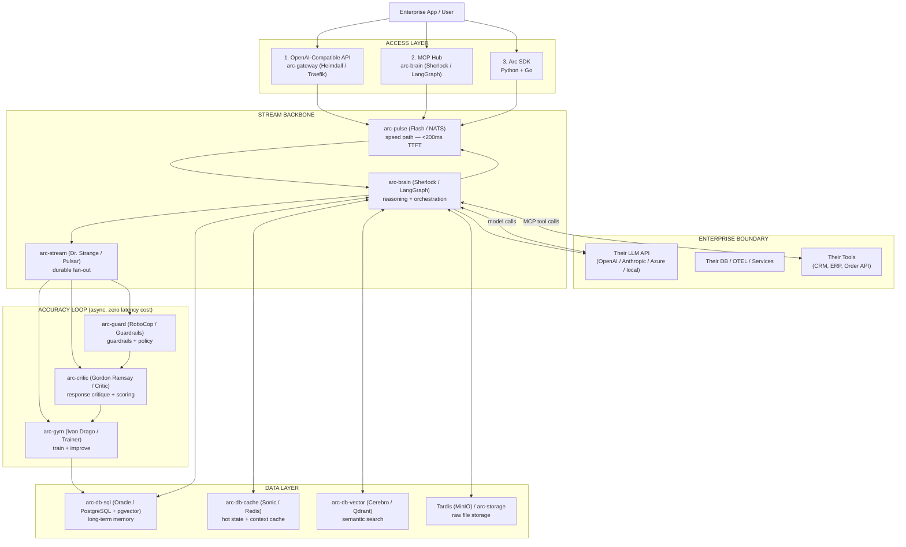

### Two Request Flows

```mermaid
sequenceDiagram
    participant C as Client
    participant H as Heimdall (arc-gateway)
    participant N as Flash (arc-pulse / NATS)
    participant S as arc-brain (Sherlock / LangGraph)
    participant L as LLM API

    rect rgb(20, 60, 20)
        Note over C,L: SYNC FLOW — chat / voice (<200ms TTFT)
        C->>H: POST /v1/chat/completions
        H->>N: publish reasoner.request
        N->>S: deliver
        S->>L: stream tokens
        S-->>N: token chunk 1
        N-->>C: token chunk 1
        S-->>N: token chunk 2
        N-->>C: token chunk 2
        S-->>N: [DONE]
        N-->>C: [DONE]
    end

    rect rgb(20, 20, 60)
        Note over C,L: ASYNC FLOW — background / event-driven
        C->>N: publish to Pulsar topic
        N->>S: Pulsar subscriber triggered
        S->>L: invoke (batch)
        S->>N: publish result to Pulsar out-topic
        N-->>C: consume result when ready
    end
```

---

## System 2 — Data Intelligence Pipeline

How ARC turns enterprise data into smart AI.

> **Core principle:** Static data = context at rest. Live data = context in motion.
> Both are retrieved in parallel at inference time.

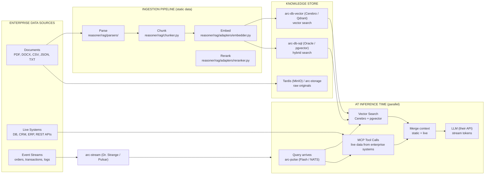

### Ingestion Entry Points

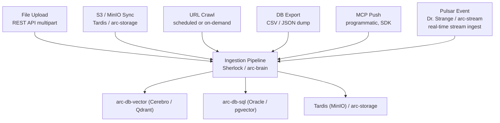

---

## System 3 — Accuracy Loop

Runs async on every inference via arc-stream (Dr. Strange / Pulsar) fan-out. Zero latency impact on the speed path.

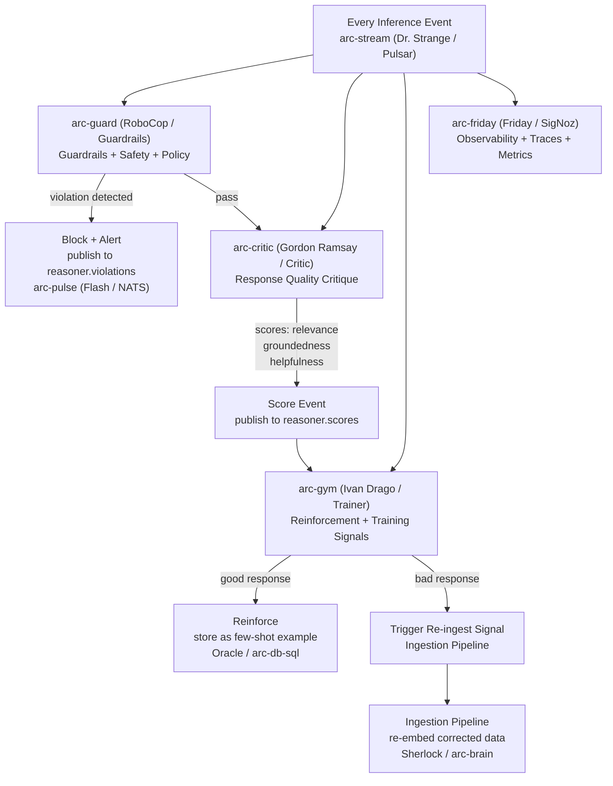

### How the System Gets Smarter Over Time

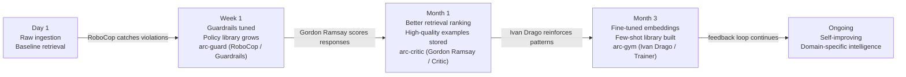

---

## Deployment Spectrum

ARC grows with you. No re-architecture required between stages.

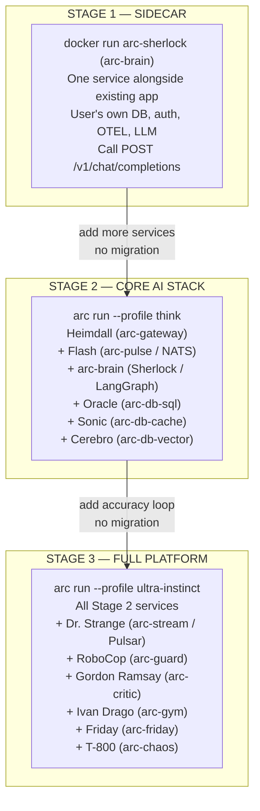

### Sidecar Mode — how it looks in practice

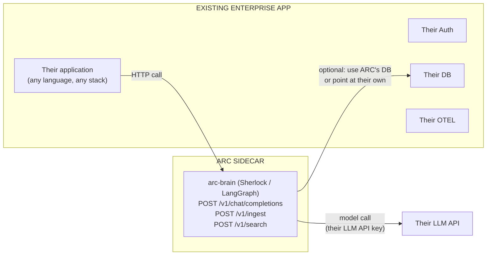

---

## Service Reference

| Codename         | Role               | Technology                      | Arc Image            |
| ---------------- | ------------------ | ------------------------------- | -------------------- |
| Heimdall         | Gateway            | Traefik                         | arc-gateway          |
| JARVIS           | Identity           | Kratos                          | arc-identity         |
| Nick Fury        | Secrets            | Infisical                       | arc-vault            |
| Mystique         | Feature Flags      | Unleash                         | arc-flags            |
| Flash            | Messaging          | NATS                            | arc-pulse            |
| Dr. Strange      | Streaming          | Pulsar                          | arc-stream           |
| Oracle           | LT Memory          | PostgreSQL + pgvector           | arc-db-sql           |
| Sonic            | Cache              | Redis                           | arc-db-cache         |
| Cerebro          | Semantic Search    | Qdrant                          | arc-db-vector        |
| Tardis           | Object Storage     | MinIO                           | arc-storage          |
| Sherlock         | Reasoner           | LangGraph                       | arc-brain            |
| Scarlett         | Voice Agent        | LiveKit VAD                     | arc-voice-agent      |
| Daredevil        | Realtime Server    | LiveKit                         | arc-voice-server     |
| RoboCop          | Guardrails         | NeMo Guardrails / Guardrails AI | arc-guard            |
| Gordon Ramsay    | Critic / Evaluator | RAGAs / DeepEval                | arc-critic           |
| Ivan Drago       | Gym / Trainer      | TRL (Hugging Face) + Axolotl    | arc-gym              |
| Friday Collector | OTEL Collector     | SigNoz OTEL                     | arc-friday-collector |
| Friday           | Observability UI   | SigNoz                          | arc-friday           |
| T-800            | Chaos              | Chaos Mesh                      | arc-chaos            |
| Cortex           | Bootstrap          | Go                              | arc-cortex           |

---

## Design Decisions (resolved)

| #   | Question                             | Decision                                                                                              |
| --- | ------------------------------------ | ----------------------------------------------------------------------------------------------------- |
| 1   | MCP direction                        | Bidirectional — Sherlock as MCP server + MCP client hub                                               |
| 2   | SDK                                  | Deferred — build core interfaces + REST API + async topics first. SDK wraps these later.              |
| 3   | RoboCop / Gordon Ramsay / Ivan Drago | Wrap open source: NeMo Guardrails, RAGAs/DeepEval, TRL+Axolotl                                        |
| 4   | Enterprise connectors                | Docker image per connector, enterprise provides connection details (host, creds via Nick Fury)        |
| 5   | Two ways to talk to the system       | REST API (sync) + arc-stream (Dr. Strange / Pulsar) topics (async) — applies to ALL operations, not just ingestion |
| 6   | Profile composition                  | Defer — categorize once services are built                                                            |

---

## System 4 — Resource + Event Pattern (how users extend ARC)

Every ARC resource has two interfaces automatically. This is the **extension model** — enterprises don't need to fork ARC, they subscribe to events.

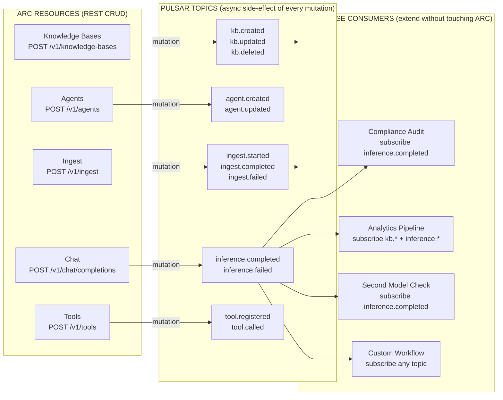

> Same pattern as Stripe (REST + webhooks) but Pulsar topics replace webhooks.
> Enterprises subscribe to `Dr. Strange (arc-stream)` topics directly.

---

## System 5 — MCP Hub (bidirectional)

Sherlock sits **in the middle** of the MCP protocol — server to AI clients above, client to enterprise tools below.

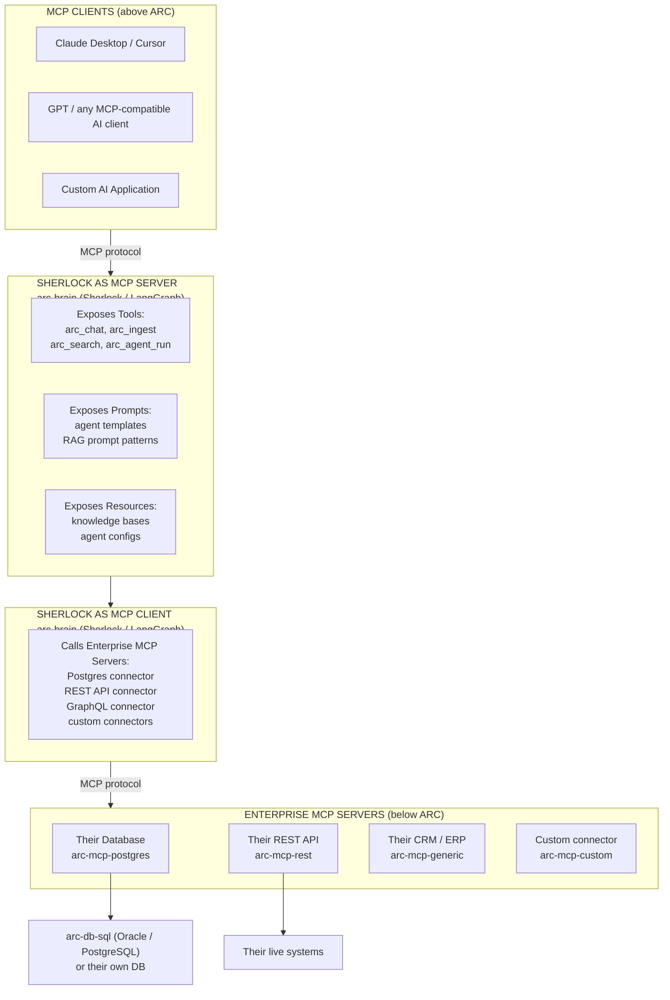

### MCP Topic Wiring (async path)

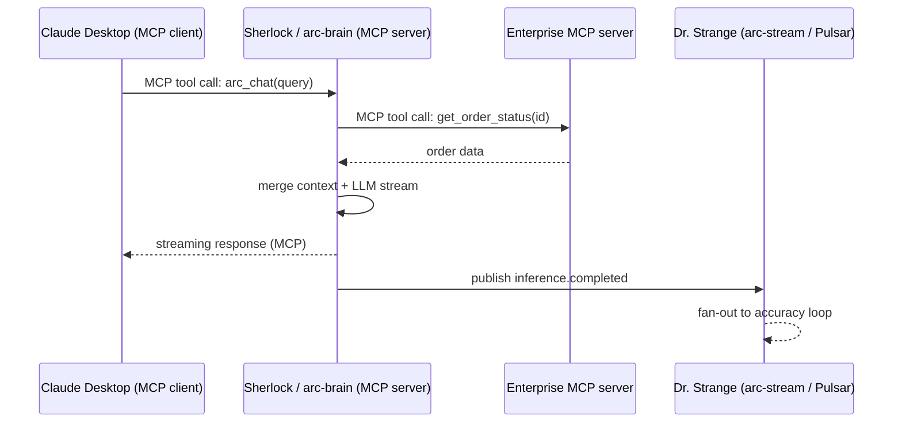
