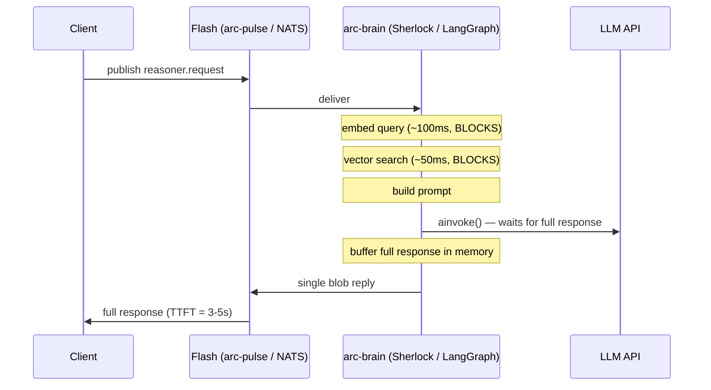
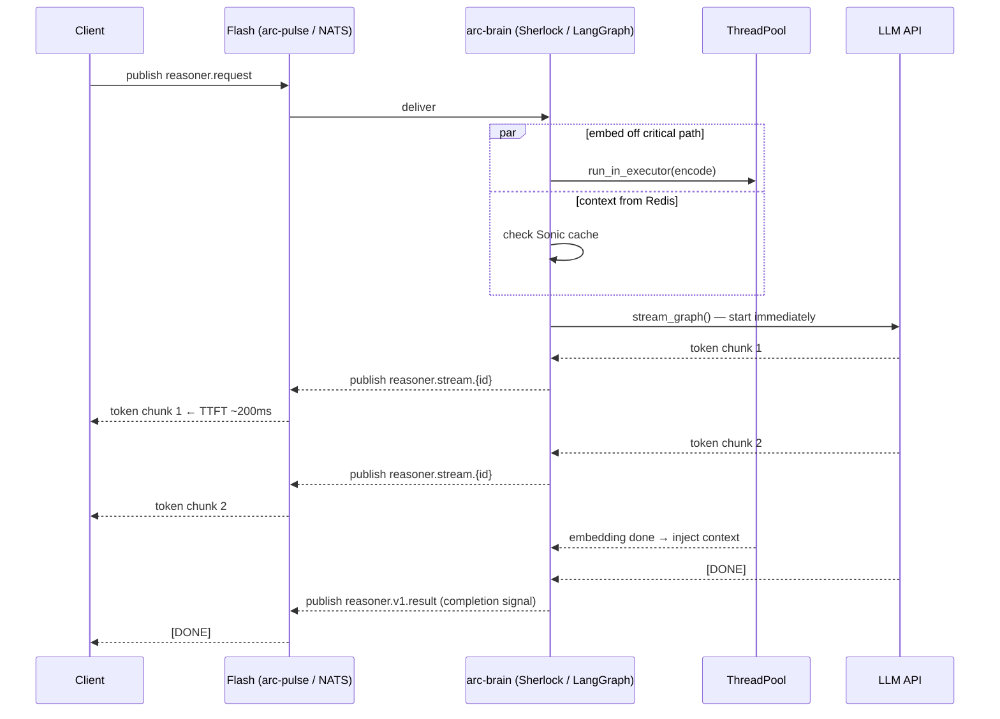
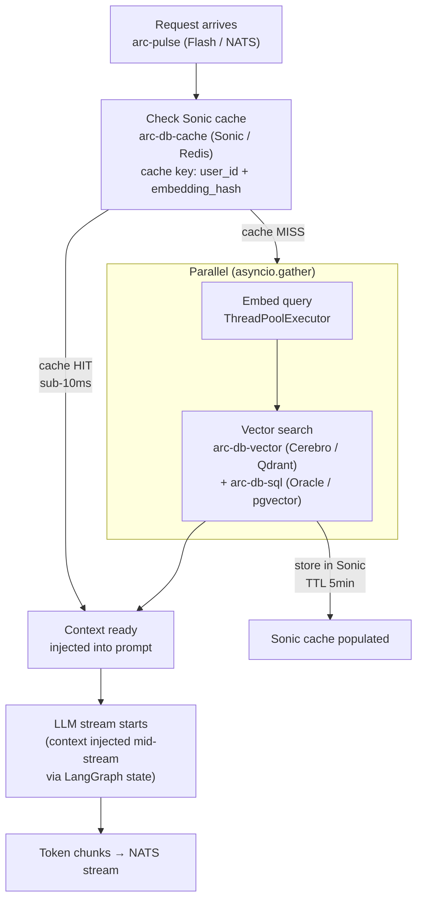
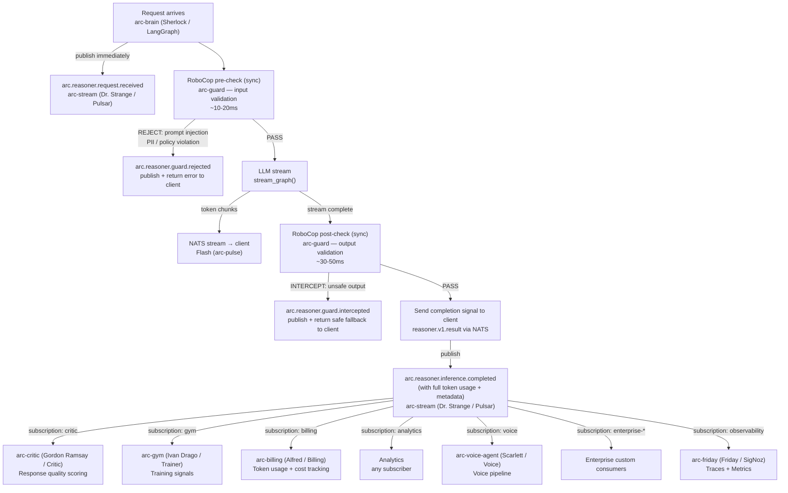
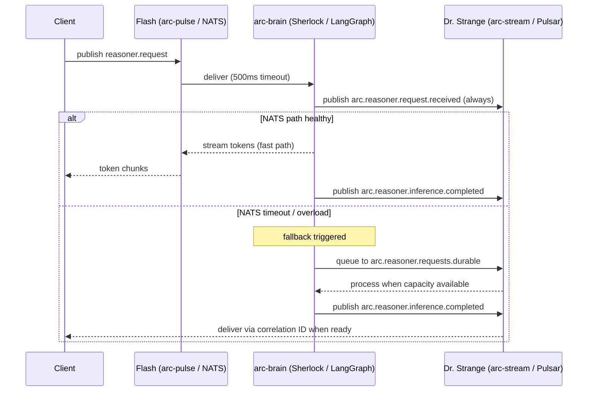
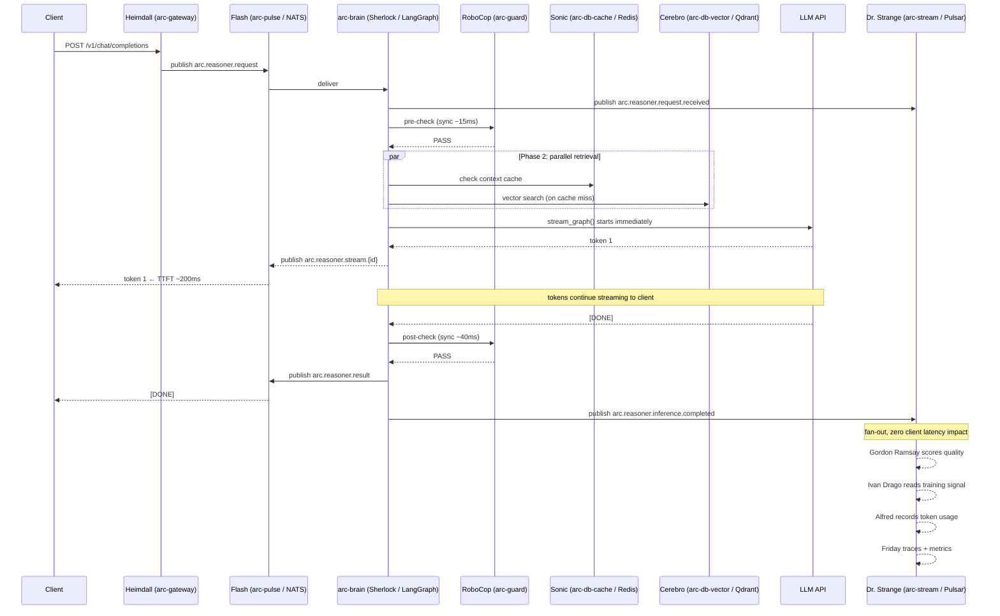

# Nervous System — High Level Design

> Date: 2026-03-05
> Spec: `docs/ard/NERVOUS-SYSTEM.md`
> Feature branch: will be created from `main` after `014-decouple-service-codenames` lands

## The Pattern

```
NATS (Flash / arc-pulse)          = fast nerves    — ephemeral, <1ms, request-reply, token streaming
Pulsar (Dr. Strange / arc-stream) = spinal cord    — durable, fan-out, replay, analytics, billing
Redis (Sonic / arc-db-cache)      = muscle memory  — hot state, context cache, sub-10ms retrieval
```

**Rule:** Every request that enters ARC and every response that leaves it is published to Pulsar. No exceptions. This gives analytics, billing, compliance, and the accuracy loop a complete picture of every interaction — regardless of which transport the client used (HTTP, NATS, MCP).

***

## Phase 1 — Fast Nerves (NATS Streaming)

### Current state (bottleneck)



### After Phase 1 (target state)



### Phase 1 changes

| File | Change |
|------|--------|
| `reasoner/nats_handler.py` | Replace `invoke_graph()` → `stream_graph()`, publish chunks to `reasoner.stream.{id}` |
| `reasoner/openai_nats_handler.py` | Same — replace buffered invoke with streaming publish |
| `reasoner/memory.py:92` | Wrap `SentenceTransformer.encode()` in `asyncio.run_in_executor()` |
| `reasoner/observability.py` | Add `ttft_seconds` histogram (request receive → first token emitted) |
| `reasoner/contracts/asyncapi.yaml` | Add stream subject definitions |

***

## Phase 2 — Parallel Pipeline (Muscle Memory)

### Parallel retrieve + generate



### Redis cache key design

```
key:   arc:ctx:{user_id}:{sha256(query_embedding)}
value: [chunk_1, chunk_2, ...chunk_k]  (JSON)
TTL:   300s (5 min default, configurable)

invalidation:
  - TTL expiry (automatic)
  - explicit: DEL on new message appended to conversation history
```

### Phase 2 changes

| File | Change |
|------|--------|
| `reasoner/graph.py` | Restructure: start LLM with partial context, inject retrieval via LangGraph state update |
| `reasoner/memory.py` | Add Redis cache layer — check cache first, populate on miss |
| `reasoner/config.py` | Add `sonic_url`, `context_cache_ttl` settings |

***

## Phase 3 — Spinal Cord (Pulsar Durable Fan-out)

### Every request AND response is a Pulsar event

Pulsar is not only for post-inference fan-out. Every inbound request is published to Pulsar on arrival. This gives analytics and billing a complete audit trail — including requests that fail, time out, or are rejected by RoboCop.



### RoboCop sequence — why guard comes first

```
REQUEST PATH
  1. Request arrives
  2. arc.reasoner.request.received → published to Pulsar (audit trail always starts here)
  3. RoboCop pre-check (sync, ~10-20ms)
       → checks: prompt injection, PII in input, policy violations
       → REJECT: publish arc.reasoner.guard.rejected, return 4xx to client
       → PASS: continue

INFERENCE PATH
  4. LLM stream starts (Phase 1/2 optimizations apply)
  5. Token chunks → client via NATS (fast path)

RESPONSE PATH
  6. Stream completes
  7. RoboCop post-check (sync, ~30-50ms on full output)
       → checks: unsafe content, hallucination signals, policy on output
       → INTERCEPT: publish arc.reasoner.guard.intercepted, return safe fallback
       → PASS: send completion signal to client

POST-DELIVERY (async, zero latency to client)
  8. arc.reasoner.inference.completed → Pulsar fan-out
  9. Gordon Ramsay scores quality (async)
 10. Ivan Drago reads training signal (async)
 11. Alfred records token usage for billing (async)
```

### NATS → Pulsar graceful degradation



### Phase 3 changes

| File | Change |
|------|--------|
| `reasoner/pulsar_handler.py` | Publish `arc.reasoner.request.received` on arrival; publish `arc.reasoner.inference.completed` with token usage |
| `reasoner/nats_handler.py` | Add RoboCop pre-check call before `stream_graph()`, post-check before completion signal |
| `reasoner/graph.py` | Pass token usage counters from LLM response to completion event |
| `reasoner/config.py` | Add all Pulsar topic names; `SHERLOCK_PULSAR_ENABLED` default → true in `reason` profile |
| `reasoner/contracts/asyncapi.yaml` | Full event contract (all topics + schemas) |
| `services/streaming/service.yaml` | Verify Dr. Strange healthy in `reason` profile |

***

## Event Contract

Formal schema for every NATS subject and Pulsar topic. All events use JSON. All Pulsar events include the base envelope.

### Base Envelope (all Pulsar events)

```json
{
  "event_id":    "uuid-v4",
  "event_type":  "arc.reasoner.inference.completed",
  "schema_version": "1.0",
  "timestamp":   "2026-03-05T10:00:00.000Z",
  "source":      "arc-brain",
  "payload":     {}
}
```

### NATS Subject Schema

```
arc.reasoner.request              inbound requests (queue group: reasoner-workers)
arc.reasoner.stream.{request_id}  outbound token chunks to client
arc.reasoner.result               completion signal (sync path)
arc.reasoner.error                error signal (GraphErrorResponse or transport error)

arc.ingest.request                inbound ingest trigger
arc.ingest.progress.{ingest_id}   progress updates during ingestion
```

### Pulsar Topic Schema

```
REASONER
  arc.reasoner.request.received       every inbound request, published on arrival
  arc.reasoner.inference.completed    every completed inference (see payload below)
  arc.reasoner.inference.failed       failed inference with error + partial token count
  arc.reasoner.guard.rejected         RoboCop pre-check rejected the input
  arc.reasoner.guard.intercepted      RoboCop post-check intercepted the output

INGESTION
  arc.ingest.started                  ingestion pipeline triggered
  arc.ingest.completed                ingestion done, chunks stored, embedding count
  arc.ingest.failed                   ingestion error with source + reason

KNOWLEDGE BASE
  arc.kb.created                      new knowledge base created
  arc.kb.updated                      knowledge base updated (re-ingestion)
  arc.kb.deleted                      knowledge base deleted

AGENT LIFECYCLE
  arc.agent.created
  arc.agent.updated
  arc.agent.deleted

TOOLS
  arc.tool.registered
  arc.tool.called                     every tool invocation (for billing + audit)

ACCURACY LOOP
  arc.guard.violation                 RoboCop policy violation details
  arc.critic.scored                   Gordon Ramsay quality score
  arc.gym.signal                      Ivan Drago training signal
  arc.billing.usage                   Alfred token usage record
```

### arc.reasoner.request.received payload

```json
{
  "request_id":  "uuid-v4",
  "user_id":     "user-123",
  "session_id":  "session-456",
  "model":       "gpt-4o",
  "transport":   "nats | http | mcp",
  "messages":    [{"role": "user", "content": "..."}],
  "timestamp":   "2026-03-05T10:00:00.000Z"
}
```

### arc.reasoner.inference.completed payload

```json
{
  "request_id":      "uuid-v4",
  "user_id":         "user-123",
  "session_id":      "session-456",
  "model":           "gpt-4o",
  "transport":       "nats | http | mcp",
  "ttft_ms":         187,
  "total_latency_ms": 2340,
  "usage": {
    "input_tokens":  512,
    "output_tokens": 384,
    "total_tokens":  896
  },
  "guard_status":    "passed | intercepted",
  "response_text":   "...",
  "context_chunks":  3,
  "cache_hit":       true,
  "timestamp":       "2026-03-05T10:00:02.340Z"
}
```

> `usage` is the primary field Alfred (arc-billing) reads for token-based billing.
> `ttft_ms` feeds Friday (arc-friday) observability dashboards.
> `guard_status` feeds RoboCop audit reports.

### arc.billing.usage payload (arc-billing (Alfred / Billing))

```json
{
  "request_id":    "uuid-v4",
  "user_id":       "user-123",
  "org_id":        "org-456",
  "model":         "gpt-4o",
  "input_tokens":  512,
  "output_tokens": 384,
  "total_tokens":  896,
  "cost_usd":      0.00448,
  "timestamp":     "2026-03-05T10:00:02.340Z"
}
```

***

## End-to-End: Full Nervous System (all phases active)



***

## TTFT Targets

| Phase | Optimization | Latency Saved | Target |
|-------|-------------|---------------|--------|
| 1 | NATS token streaming | 1.9–4.9s | P50 < 500ms |
| 1 | Embedding off critical path | ~100ms | — |
| 2 | Parallel retrieve + generate | 150–300ms | P50 < 300ms |
| 2 | Redis context cache (hits) | 200–400ms | P50 < 200ms |
| 3 | Pulsar fan-out | throughput scale-out | P95 improvement |
| 3 | NATS/Pulsar fallback | eliminates dropped requests | P99 improvement |

**Final target: P50 TTFT < 200ms** (from current 3–5s)

> Note: RoboCop pre-check adds ~15ms and post-check adds ~40ms to total latency.
> These run on critical path but are bounded. TTFT (first token) is unaffected by post-check.

***

## What Phase 3 Unlocks for the Broader Platform

Once Phase 3 is complete, every higher-level ARC capability has a Pulsar topic to subscribe to:

```
RoboCop (arc-guard)      pre/post check on arc.reasoner.request.received
Gordon Ramsay (arc-critic) subscribe arc.reasoner.inference.completed
Ivan Drago (arc-gym)     subscribe arc.reasoner.inference.completed
Alfred (arc-billing)     subscribe arc.reasoner.inference.completed → arc.billing.usage
Voice (Scarlett)         subscribe arc.reasoner.inference.completed (async TTS)
Analytics                subscribe arc.reasoner.request.received + arc.reasoner.inference.completed
Compliance audit         subscribe arc.reasoner.guard.* + arc.reasoner.inference.completed
Custom enterprise        subscribe any arc.* topic via Dr. Strange (arc-stream)
```

No changes to Sherlock needed after Phase 3. All extension is via Pulsar subscription.
