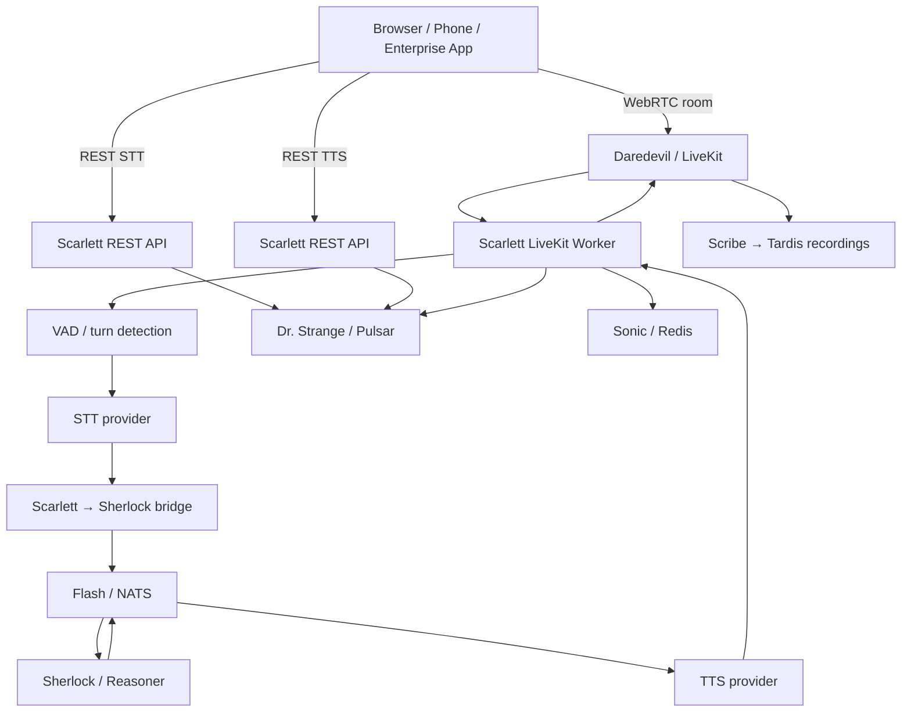
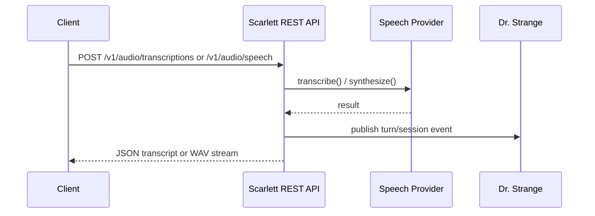
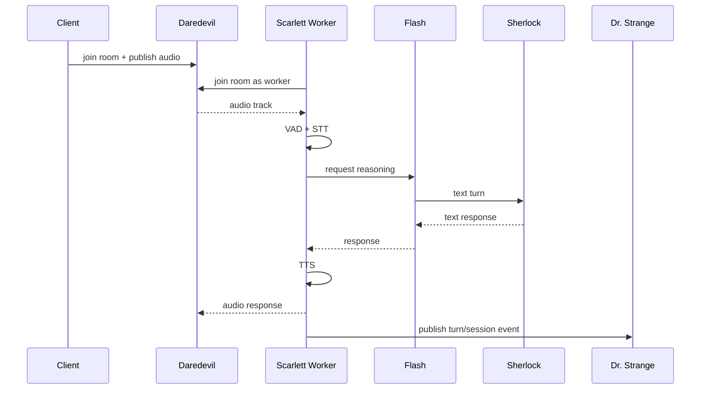

# Voice System — High-Level Design

> Date: 2026-03-06
> Spec: `docs/ard/VOICE-SYSTEM.md`
> Feature spec: `specs/016-voice-system/`
> Framework: `docs/ard/ARC-ENTERPRISE-AI-FRAMEWORK.md`

## Design Intent

Scarlett is ARC's speech orchestration layer. It must make voice a first-class modality without creating a second reasoning system. The design follows the enterprise framework directly:

- **Daredevil** remains the realtime media transport.
- **Scarlett** handles turn orchestration, speech providers, and room participation.
- **Sherlock** remains the only reasoning engine.
- **Flash** is used internally for low-latency turn exchange.
- **Dr. Strange** is the durable async contract for voice lifecycle events.

This keeps voice aligned with the framework's central rule: ARC services expose stable REST and async contracts, while low-latency internals stay implementation details.

## System Context



## Current Foundation

### Already in the platform

| Service               | Role                        | Why it matters                                     |
| --------------------- | --------------------------- | -------------------------------------------------- |
| `services/realtime/`  | Daredevil / Sentry / Scribe | Realtime room transport, ingest, and recordings    |
| `services/reasoner/`  | Sherlock                    | Text reasoning, prompt orchestration, tool calling |
| `services/messaging/` | Flash                       | Internal low-latency request/reply path            |
| `services/streaming/` | Dr. Strange                 | Durable async topics for analytics and compliance  |
| `services/cache/`     | Sonic                       | Hot room/session state                             |
| `services/storage/`   | Tardis                      | Recording and artifact storage                     |

### Proven spike

The spike at `platform-spike/services/arc-scarlett-voice/` proves the core room loop works:

```text
User audio → Daredevil → Scarlett worker
            → VAD → STT → Sherlock bridge → TTS → room audio
```

The missing step is not feasibility. It is productionizing the capability in `services/voice/` with contracts, health, observability, profile wiring, and a durable async story.

## Service Boundary

### Public interfaces

Scarlett exposes two stable service contracts:

1. **REST**
   - `POST /v1/audio/transcriptions`
   - `POST /v1/audio/speech`
   - `GET /health`
   - `GET /health/deep`
2. **Pulsar topics**
   - `arc.voice.session.started`
   - `arc.voice.session.ended`
   - `arc.voice.turn.completed`
   - `arc.voice.turn.failed`

### Realtime transport

Audio-to-audio is delivered through Daredevil's WebRTC room transport. This is not a separate Scarlett API surface; it is the media substrate Scarlett joins as a worker.

### Internal speed path

Scarlett sends text turns to Sherlock over Flash. Default subject is `reasoner.request` to match current deployment, but the subject is configuration-driven so Scarlett can adopt `arc.reasoner.request` when naming converges.

## Proposed Service

```text
Codename : Scarlett
Role     : voice
Port     : 8803
Image    : ghcr.io/arc-framework/arc-voice-agent:latest
Tech     : FastAPI + livekit-agents + faster-whisper + piper
Profile  : reason, ultra-instinct
```

### Directory layout

```text
services/voice/
├── service.yaml
├── Dockerfile
├── pyproject.toml
├── contracts/
│   ├── openapi.yaml
│   └── asyncapi.yaml
└── src/voice/
    ├── main.py
    ├── config.py
    ├── interfaces.py
    ├── health_router.py
    ├── stt_router.py
    ├── tts_router.py
    ├── livekit_worker.py
    ├── nats_bridge.py
    ├── pulsar_events.py
    ├── models_v1.py
    ├── observability.py
    └── providers/
        ├── stt_whisper.py
        └── tts_piper.py
```

## Request Flows

### STT and TTS REST flow



### Room-based audio-to-audio flow



## Speech Provider Strategy

### Offline-first defaults

| Capability | Default          | Why                                                   |
| ---------- | ---------------- | ----------------------------------------------------- |
| STT        | `faster-whisper` | Local, multilingual, no external account              |
| TTS        | `piper`          | Local, CPU-friendly, deterministic packaging          |
| VAD        | Energy-based RMS | RMS threshold (default 500.0), no external dependency |

### Cloud-ready adapters

All providers stay behind protocol interfaces (hexagonal architecture):

- `STTPort` — implemented by `WhisperSTTAdapter`
- `TTSPort` — implemented by `PiperTTSAdapter`
- `LLMBridgePort` — implemented by `NATSBridge`

This allows Deepgram, Azure, ElevenLabs, or OpenAI to be enabled without changing routing, health, or contracts.

## Latency Budget

| Stage                    | Target           |
| ------------------------ | ---------------- |
| VAD speech end detection | ~20 ms           |
| STT                      | 200–400 ms       |
| Sherlock round trip      | 400–800 ms       |
| TTS                      | 100–300 ms       |
| WebRTC delivery          | ~20 ms           |
| **End-to-end turn**      | **~750–1550 ms** |

Sub-second turns remain achievable with smaller local models and fast Sherlock configurations.

## Observability

Scarlett follows the same OTEL pattern as Sherlock.

### Metrics

Four OTEL histograms exported under the `arc-voice` meter:

```text
voice.stt.latency_seconds     STT transcription latency per request
voice.tts.latency_seconds     TTS synthesis latency per request
voice.bridge.latency_seconds  NATS bridge round-trip latency (Scarlett → Sherlock → Scarlett)
voice.turn.latency_seconds    Full turn pipeline latency (VAD end → audio out)
```

### Traces

- Root span per voice turn
- Child spans for VAD, STT, Sherlock bridge, and TTS
- Trace propagation into Sherlock where possible

### Logging

- Structured JSON logs via `structlog`
- No transcript bodies or secrets in logs by default

## Security and Resilience

- Offline-first providers reduce external dependency and credential exposure.
- `GET /health` is shallow; `GET /health/deep` probes Daredevil, Flash, and provider readiness.
- Room failures publish `arc.voice.turn.failed` rather than silently dropping turns.
- Scarlett must fail gracefully when Sonic or Tardis are unavailable; REST APIs still boot.
- Container runs non-root and follows the same service conventions as Sherlock.

## Delivery Plan

### Phase 1 — Foundation

- scaffold `services/voice/`
- define contracts and settings
- boot FastAPI with health probes

### Phase 2 — REST speech APIs

- implement STT endpoint
- implement TTS endpoint
- validate OpenAI-compatible payloads

### Phase 3 — Realtime agent

- start LiveKit worker in lifespan
- join rooms and run VAD → STT → Sherlock → TTS loop
- emit session and turn events

### Phase 4 — Hardening

- add CI/release workflows
- add profile integration
- add OTEL dashboards, failure tests, and docs updates

## Resolved Decisions

1. **LiveKit stays** — no Janus, mediasoup, or Pipecat abstraction layer.
2. **Scarlett does not own reasoning** — Sherlock remains the only reasoning engine.
3. **Public async contract uses Pulsar** — NATS is internal only.
4. **Default subject is config-driven** — current default `reasoner.request`, future-ready for `arc.reasoner.request`.
5. **Voice belongs in `reason` profile** — model footprint is too heavy for `think`.

## API Contracts

Two spec files (same convention as `services/reasoner/contracts/`):

**`contracts/openapi.yaml`**

- `POST /v1/audio/transcriptions`
- `POST /v1/audio/speech`
- `GET /health`
- `GET /health/deep`

**`contracts/asyncapi.yaml`**

Pulsar topics (durable, public):
- `arc.voice.session.started` — room join event
- `arc.voice.session.ended` — room leave / timeout event
- `arc.voice.turn.completed` — successful turn with latency and token metadata
- `arc.voice.turn.failed` — turn failure with error type and context

NATS subjects (internal speed path):
- `reasoner.request` — utterance forwarded to Sherlock; subject is config-driven

---

## Stories (SpecKit Backlog)

| #    | Story                                | Notes                                                                           |
| ---- | ------------------------------------ | ------------------------------------------------------------------------------- |
| S-1  | Scaffold `services/voice/` structure | service.yaml, Dockerfile, pyproject.toml, config.py                             |
| S-2  | Migrate voice pipeline from spike    | Update livekit-agents deps, align NATS subjects                                 |
| S-3  | STT REST endpoint                    | `POST /v1/audio/transcriptions`, Whisper adapter, OpenAI-compatible             |
| S-4  | TTS REST endpoint                    | `POST /v1/audio/speech`, Piper adapter, OpenAI-compatible                       |
| S-5  | Voice pipeline wiring                | VAD → STT → Sherlock NATS → TTS → room audio                                    |
| S-6  | OTEL instrumentation                 | Per-stage latency histograms, session counters                                  |
| S-7  | API contracts                        | `contracts/openapi.yaml` + `contracts/asyncapi.yaml`                            |
| S-8  | Profile integration                  | Add `voice` to `reason` profile in `services/profiles.yaml`                     |
| S-9  | CI/CD                                | `voice-images.yml` + `voice-release.yml` (follow `realtime-images.yml` pattern) |
| S-10 | Health probes                        | Shallow + deep health endpoints                                                 |

---

## Reference Files

| What                         | Path                                                                     |
| ---------------------------- | ------------------------------------------------------------------------ |
| Voice agent pipeline (spike) | `platform-spike/services/arc-scarlett-voice/src/agent.py`                |
| NATS LLM plugin (spike)      | `platform-spike/services/arc-scarlett-voice/src/plugins/sherlock_llm.py` |
| Piper TTS plugin (spike)     | `platform-spike/services/arc-scarlett-voice/src/plugins/piper_tts.py`    |
| OTEL setup (spike)           | `platform-spike/services/arc-scarlett-voice/src/observability.py`        |
| Sherlock config pattern      | `services/reasoner/src/sherlock/config.py`                               |
| Sherlock router pattern      | `services/reasoner/src/sherlock/files_router.py`                         |
| Sherlock interfaces          | `services/reasoner/src/sherlock/interfaces.py`                           |
| Sherlock main/lifespan       | `services/reasoner/src/sherlock/main.py`                                 |
| Sherlock OpenAPI contract    | `services/reasoner/contracts/openapi.yaml`                               |
| Sherlock AsyncAPI contract   | `services/reasoner/contracts/asyncapi.yaml`                              |
| LiveKit server config        | `services/realtime/livekit.yaml`                                         |
| Realtime service definition  | `services/realtime/service.yaml`                                         |
| Service profiles             | `services/profiles.yaml`                                                 |
| Existing voice spec          | `specs/007-voice-stack/spec.md`                                          |
