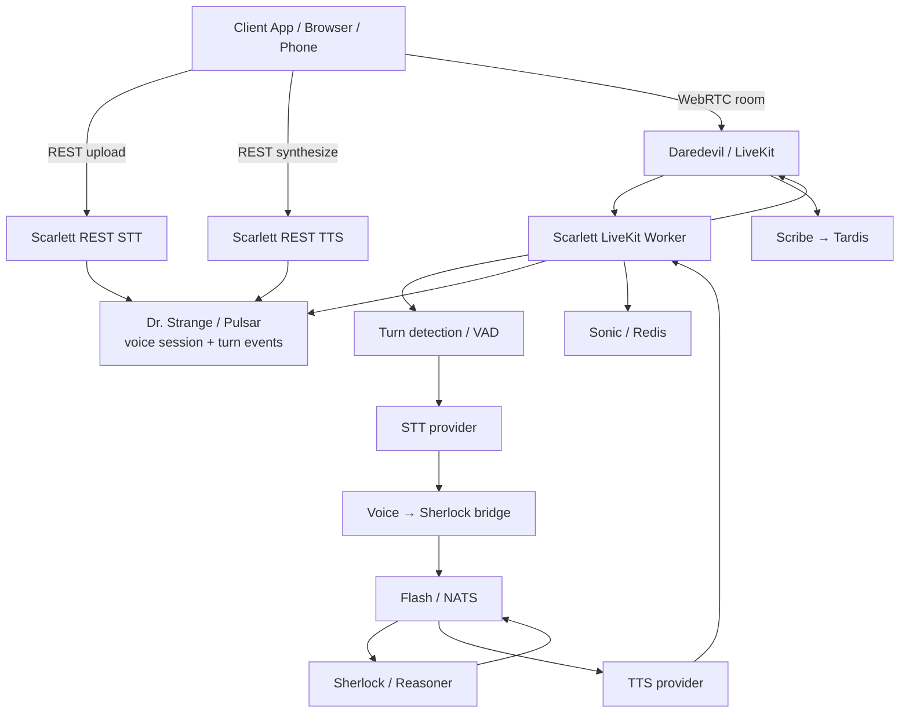

# Feature: voice-system

> Spec folder: `specs/016-voice-system/`
> HLD: `docs/ard/VOICE-HLD.md`
> Framework: `docs/ard/ARC-ENTERPRISE-AI-FRAMEWORK.md`
> Date: 2026-03-06

## Concept

Voice is ARC's multimodal synchronous access surface. It turns speech into the same reasoning primitives as chat, then returns speech or room audio without creating a parallel AI stack. Daredevil handles media transport, Scarlett orchestrates voice turns, Sherlock remains the reasoning brain, Flash is the low-latency request path, Dr. Strange carries durable session events, Sonic stores hot session state, and Tardis stores recordings and artifacts.

```text
Daredevil   = ears + mouth transport
Scarlett    = voice orchestration
Sherlock    = language reasoning
Flash       = low-latency impulse path
Dr. Strange = durable voice events
Sonic       = hot session state
Tardis      = recordings + artifacts
```

**Rule:** Voice never bypasses the ARC backbone. Audio may enter through REST upload or LiveKit rooms, but reasoning always flows through Sherlock and voice lifecycle events always publish through the platform async contract.

## Role in the Broader ARC Infrastructure

The voice system is the concrete realization of the sync path described in `docs/ard/ARC-ENTERPRISE-AI-FRAMEWORK.md`:

* It extends the framework's **chat / voice** synchronous flow into an actual speech pipeline.
* It preserves the framework's **REST + async topic** pattern: Scarlett exposes REST for STT/TTS and emits durable voice lifecycle topics on Dr. Strange.
* It preserves the **sidecar → full platform** spectrum: enterprise teams can run Scarlett against existing Sherlock + Daredevil, or run the full `reason` profile.
* It respects **Two-Brain Separation**: Go services continue to own transport/orchestration infrastructure, while Python owns speech and agent intelligence.

## What Already Exists

### Available platform primitives

* `services/realtime/` already provides Daredevil, Sentry, and Scribe.
* `services/reasoner/` already provides Sherlock for text reasoning.
* `services/messaging/` already provides Flash for low-latency request-reply.
* `services/streaming/` already provides Dr. Strange for durable fan-out.
* `services/cache/` and `services/storage/` already provide Sonic and Tardis.
* A working spike exists in `platform-spike/services/arc-scarlett-voice/`.

### Missing capability

ARC still lacks the production `services/voice/` service that:

* exposes OpenAI-compatible STT and TTS APIs,
* runs a LiveKit worker for room-based audio-to-audio interaction,
* bridges voice turns to Sherlock without duplicating reasoning logic,
* emits durable session and turn events for analytics, compliance, and billing,
* operates offline by default with local speech providers.

## Target Architecture



## Interaction Modes

### 1. STT — file to text

`POST /v1/audio/transcriptions`

* Input: multipart audio file
* Output: transcript text, detected language, duration metadata
* Primary use: batch upload, mobile voice memo, async ingestion pre-processing

### 2. TTS — text to audio

`POST /v1/audio/speech`

* Input: JSON text payload
* Output: WAV stream with duration and sample-rate headers
* Primary use: assistant playback, IVR, accessibility, speech previews

### 3. Audio-to-Audio — room conversation

* Client joins Daredevil room.
* Scarlett worker auto-joins the room.
* Speech end triggers STT → Sherlock → TTS loop.
* Audio returns into the room with sub-second target turn latency.

## External and Internal Contracts

### Stable external interfaces

* **REST** for STT and TTS
* **Pulsar topics** for durable lifecycle events:
  * `arc.voice.session.started`
  * `arc.voice.session.ended`
  * `arc.voice.turn.completed`
  * `arc.voice.turn.failed`

### Internal speed-path integration

* Scarlett sends text turns to Sherlock over Flash.
* Default subject remains `reasoner.request` to match today's reasoner deployment.
* Subject naming is config-driven so Scarlett can move to `arc.reasoner.request` when namespace normalization lands.

## Default Provider Strategy

### Local-first defaults

* **STT:** `faster-whisper`
* **TTS:** `piper`
* **VAD:** Silero / LiveKit-native VAD integration

This keeps voice usable offline and aligned with the local-first constitution.

### Cloud-ready extension points

Provider choice stays behind protocol interfaces so Deepgram, ElevenLabs, Azure, or OpenAI can be enabled without changing the orchestration path.

## Phased Delivery

### Phase 1 — Service foundation

Create `services/voice/` with Dockerfile, `service.yaml`, `pyproject.toml`, config, health endpoints, OpenAPI/AsyncAPI contracts, and profile wiring.

### Phase 2 — REST speech APIs

Implement offline-first STT and TTS endpoints with provider abstraction, validation, and contract tests.

### Phase 3 — Realtime room agent

Run a LiveKit worker in Scarlett, bridge turns to Sherlock, stream synthesized audio back to the room, and persist session events.

### Phase 4 — Hardening

Add OTEL metrics/traces, failure handling, retries/timeouts, CI/release workflows, and documentation updates.

## Key Files

```text
services/voice/
├── service.yaml
├── Dockerfile
├── pyproject.toml
├── contracts/
│   ├── openapi.yaml
│   └── asyncapi.yaml
└── src/voice/
    ├── main.py
    ├── config.py
    ├── interfaces.py         # STTPort, TTSPort, LLMBridgePort protocols
    ├── health_router.py
    ├── stt_router.py
    ├── tts_router.py
    ├── livekit_worker.py     # VoiceAgentWorker — VAD → STT → bridge → TTS
    ├── nats_bridge.py        # NATSBridge — LLMBridgePort over NATS
    ├── pulsar_events.py      # VoiceEventPublisher — durable Pulsar events
    ├── models_v1.py          # Event schemas (VoiceSession*, VoiceTurn*)
    ├── observability.py      # OTEL tracer + 4 latency histograms
    └── providers/
        ├── stt_whisper.py    # WhisperSTTAdapter (faster-whisper)
        └── tts_piper.py      # PiperTTSAdapter
```

## Dependencies

* Realtime infrastructure in `services/realtime/` must remain healthy in the `reason` profile.
* Sherlock request/reply contracts must remain stable and configurable.
* Sonic and Tardis remain optional runtime dependencies for session state and recordings, but the core REST APIs must still boot when they are unavailable.
* The framework reference in `docs/ard/ARC-ENTERPRISE-AI-FRAMEWORK.md` remains the governing system context.

## Decisions

1. **No separate voice brain** — Scarlett orchestrates speech only; Sherlock stays the single reasoning engine.
2. **No Pipecat layer** — LiveKit-native orchestration remains the baseline.
3. **REST + Pulsar are the public contracts** — NATS is internal for low latency.
4. **Offline-first speech providers are defaults** — cloud providers are opt-in adapters.
5. **Voice lives in the `reason` profile** — too heavy for `think`, but still one-command boot in the full reasoning profile.

## Implementation Status

| Area                                         | Status      |
| -------------------------------------------- | ----------- |
| Realtime transport (`services/realtime/`)    | Implemented |
| Voice production service (`services/voice/`) | Implemented |
| Voice REST contracts                         | Implemented |
| Realtime voice agent                         | Implemented |
| Durable voice event contracts                | Implemented |
