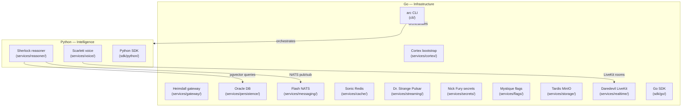
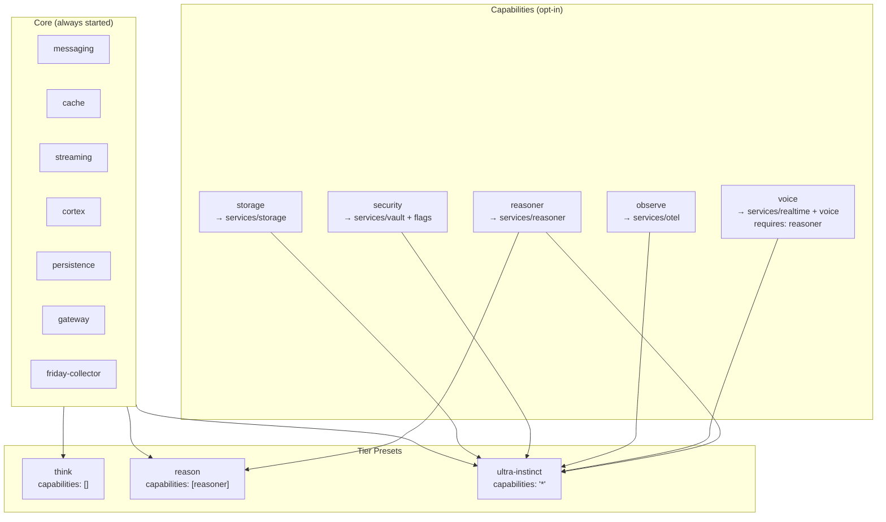
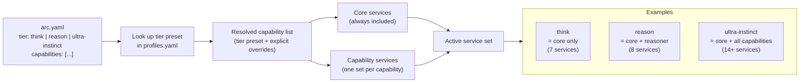

# Architecture

This page explains the three structural concepts that govern how A.R.C. Platform is built and
extended: the Two-Brain separation, the capability system, and service resolution at runtime.

## Two-Brain Separation

The platform separates infrastructure concerns (Go) from intelligence concerns (Python). Go owns
everything that wires the platform together — the CLI, bootstrap, gateway, persistence, messaging,
and cache. Python owns everything that reasons, speaks, and infers — the LLM engine and the voice
agent.

This boundary is a first-class architectural constraint (Constitution §IV). Crossing it (e.g.,
adding Python to a gateway component) requires an ARD.

## Capability System

Services are grouped into capabilities. Capabilities are opt-in — a tier preset selects which
capabilities are active. Core services always run regardless of the selected tier.

The `services/profiles.yaml` file is the single source of truth for capability membership and tier
composition.

## Service Resolution Flow

When `arc run --profile <tier>` (or `make dev PROFILE=<tier>`) is called, the platform resolves the
active service set by combining core services with the services required by each selected
capability.

The CLI passes the resolved set to Docker Compose (or to the container runtime). No service outside
the active set is started, which keeps resource usage proportional to the selected tier.
