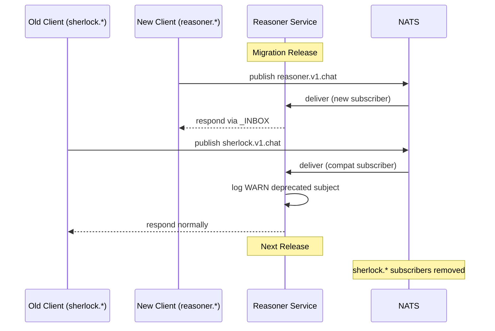
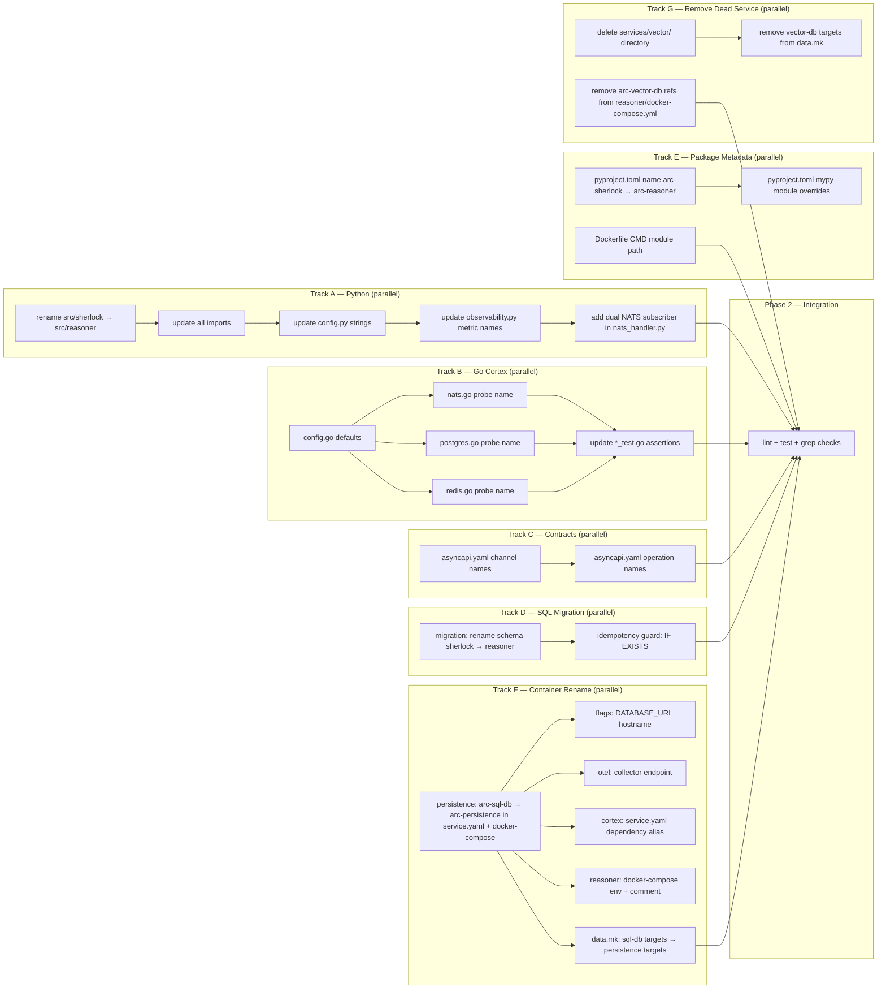
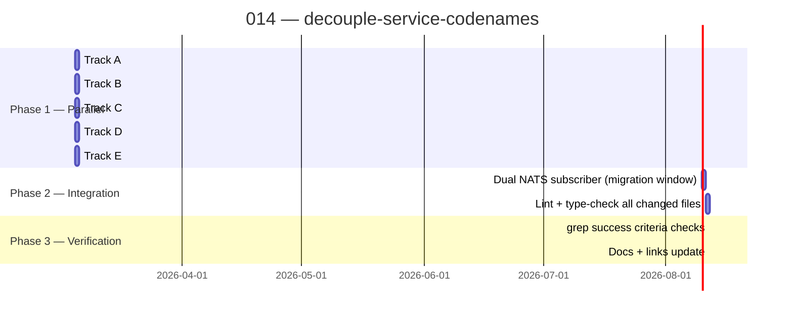

# Implementation Plan: decouple-service-codenames

> **Spec**: 014-decouple-service-codenames
> **Date**: 2026-03-05

## Summary

Rename the `sherlock` Python package to `reasoner`, update all NATS subjects and Pulsar topics from `sherlock.*` to `reasoner.*`, rename the Postgres schema, update Cortex Go config defaults to use functional hostnames, and update OTEL metric/service names — all without breaking existing consumers by maintaining a NATS dual-subscription migration window for one release cycle.

## Target Modules

| Module | Language | Changes |
|--------|----------|---------|
| `services/reasoner/src/sherlock/` | Python | Directory rename + all import paths + config strings + OTEL names |
| `services/reasoner/pyproject.toml` | TOML | Package name + mypy module refs + uvicorn CMD |
| `services/reasoner/Dockerfile` | Dockerfile | CMD module path; Linux user name (optional, P3) |
| `services/reasoner/contracts/asyncapi.yaml` | YAML | All channel/operation/server names |
| `services/reasoner/docker-compose.yml` | YAML | Remove stale `arc-vector-db` network comment; update postgres URL hostname |
| `services/cortex/internal/config/config.go` | Go | 3 `SetDefault` hostname values (`arc-persistence`, `arc-messaging`, `arc-cache`) |
| `services/cortex/internal/clients/{nats,postgres,redis}.go` | Go | 3 probe name constants |
| `services/cortex/internal/clients/*_test.go` | Go | Test assertions hardcoding old names |
| `services/persistence/` | YAML | Container rename `arc-sql-db` → `arc-persistence` (service.yaml, docker-compose, volume) |
| `services/flags/docker-compose.yml` | YAML | DATABASE\_URL hostname `arc-sql-db` → `arc-persistence` |
| `services/otel/telemetry/config/otel-collector-config.yaml` | YAML | OTEL collector Postgres endpoint hostname |
| `services/data.mk` | Makefile | Remove `vector-db-*` targets; rename `sql-db-*` → `persistence-*` |
| `services/vector/` | — | **Delete entirely** — dead Qdrant service, zero code consumers |
| SQL migration | SQL | Rename schema `sherlock` → `reasoner` |

## Technical Context

| Aspect | Value |
|--------|-------|
| Languages | Python 3.13, Go 1.23 |
| Frameworks | FastAPI + pydantic-settings (Python), Viper (Go config) |
| Storage | Postgres (schema rename), NATS (dual subjects), Pulsar (topic rename in config) |
| Testing | pytest + ruff + mypy (Python), go test + golangci-lint (Go) |
| Key constraint | Python package rename touches every file in `src/sherlock/` — must be atomic |
| Key constraint | `arc-sql-db` rename touches 6 service directories — must update all consumers atomically |
| Key constraint | `services/vector/` deletion is safe — confirmed absent from all profiles and zero code consumers |

## Architecture





## Constitution Check

| # | Principle | Status | Evidence |
|---|-----------|--------|----------|
| I | Zero-Dep CLI | N/A | No CLI changes |
| II | Platform-in-a-Box | PASS | Cortex defaults fix ensures `arc run --profile think` works with zero env overrides |
| III | Modular Services | PASS | Each service remains self-contained; changes are internal |
| IV | Two-Brain | PASS | Python rename stays in Python brain; Go fix stays in Go brain — no cross-brain mixing |
| V | Polyglot Standards | PASS | ruff + mypy (Python), golangci-lint (Go) must pass; table-driven tests preserved |
| VI | Local-First | N/A | No CLI changes |
| VII | Observability | PASS | OTEL service name `arc-reasoner`; metric names updated; no metric gaps |
| VIII | Security | PASS | Non-root user preserved in Dockerfile; no secrets involved |
| IX | Declarative | N/A | No arc.yaml changes |
| X | Stateful Ops | N/A | No CLI state changes |
| XI | Resilience | PASS | Dual NATS subjects maintain zero-downtime for old consumers |
| XII | Interactive | N/A | No CLI changes |

## Project Structure

```
services/reasoner/
├── src/
│   ├── sherlock/              # DELETE after rename
│   └── reasoner/              # RENAME from sherlock/ — all files identical, package path changed
│       ├── __init__.py
│       ├── config.py          # NATS subjects, Pulsar topics, service_name updated
│       ├── main.py            # all imports: from sherlock.* → from reasoner.*
│       ├── nats_handler.py    # + compat dual subscription for sherlock.request
│       ├── openai_nats_handler.py  # + compat dual subscription for sherlock.v1.chat
│       ├── observability.py   # meter → arc-reasoner, metrics → reasoner.*
│       └── rag/
│           └── nats_handler.py  # imports updated
├── pyproject.toml             # name, mypy module overrides updated
├── Dockerfile                 # CMD module path updated
└── contracts/
    └── asyncapi.yaml          # all channel/operation ids updated

services/cortex/
└── internal/
    ├── config/
    │   └── config.go          # 3 SetDefault values updated
    └── clients/
        ├── nats.go            # natsProbeNameConst updated
        ├── postgres.go        # probeName updated
        ├── redis.go           # redisProbeName updated
        ├── nats_test.go       # test assertions updated
        └── postgres_test.go   # test assertions updated

migrations/
└── 002_rename_schema_sherlock_to_reasoner.sql  # new idempotent migration
```

## Parallel Execution Strategy



**Tracks A–E are fully independent and can run concurrently.**
Track A (Python rename) must complete before the dual NATS subscriber work (it modifies the renamed package).

## Detailed Task Breakdown

### Track A — Python Package Rename

**A1 — Rename directory**

```bash
git mv services/reasoner/src/sherlock services/reasoner/src/reasoner
```

**A2 — Update all imports in renamed package**
All `from sherlock.xxx import` → `from reasoner.xxx import` across:

* `main.py` (20 import lines)
* `observability.py`, `graph.py`, `memory.py`, `streaming.py`
* `nats_handler.py`, `openai_nats_handler.py`, `pulsar_handler.py`
* `openai_router.py`, `embeddings_router.py`, `files_router.py`
* `models_router.py`, `vector_stores_router.py`, `fake_router.py`
* `rag/nats_handler.py`, `rag/application/retrieve.py` (and any sub-modules)
* `interfaces.py`, `llm_factory.py`

**A3 — Update config.py subject strings**

| Field | Before | After |
|-------|--------|-------|
| `service_name` | `arc-sherlock` | `arc-reasoner` |
| `nats_subject` | `sherlock.request` | `reasoner.request` |
| `nats_queue_group` | `sherlock_workers` | `reasoner_workers` |
| `pulsar_request_topic` | `…/sherlock-requests` | `…/reasoner-requests` |
| `pulsar_result_topic` | `…/sherlock-results` | `…/reasoner-results` |
| `pulsar_subscription` | `sherlock-workers` | `reasoner-workers` |
| `nats_v1_chat_subject` | `sherlock.v1.chat` | `reasoner.v1.chat` |
| `nats_v1_result_subject` | `sherlock.v1.result` | `reasoner.v1.result` |
| `minio_bucket` | `sherlock-files` | `reasoner-files` |

Note: env var aliases (`SHERLOCK_NATS_SUBJECT` etc.) stay unchanged — renaming env var aliases is a deployment breaking change not in scope.

**A4 — Update observability.py metric names**

| Before | After |
|--------|-------|
| `metrics.get_meter("arc-sherlock")` | `metrics.get_meter("arc-reasoner")` |
| `sherlock.requests.total` | `reasoner.requests.total` |
| `sherlock.errors.total` | `reasoner.errors.total` |
| `sherlock.latency` | `reasoner.latency` |
| `sherlock.context.size` | `reasoner.context.size` |
| `sherlock.v1.requests.total` | `reasoner.v1.requests.total` |
| `sherlock.v1.errors.total` | `reasoner.v1.errors.total` |
| `sherlock.v1.latency` | `reasoner.v1.latency` |
| `sherlock.v1.stream.chunks` | `reasoner.v1.stream.chunks` |

Also update logger names:

* `structlog.get_logger("sherlock.health_probe")` → `"reasoner.health_probe"`
* `structlog.get_logger("sherlock.startup")` → `"reasoner.startup"`
* `structlog.get_logger("sherlock.http")` → `"reasoner.http"`

**A5 — Add dual NATS subscriber (migration window)**

In `nats_handler.py`: subscribe to both `reasoner.request` (primary) and `sherlock.request` (compat).
On compat subject receipt, emit:

```python
logger.warning("deprecated NATS subject received", subject="sherlock.request",
               migrate_to="reasoner.request")
```

Then process normally.

Same pattern in `openai_nats_handler.py` for `sherlock.v1.chat` → `reasoner.v1.chat`.

### Track B — Cortex Go Config

**B1 — `config.go` defaults**

```go
// Line 108
v.SetDefault("bootstrap.postgres.host", "arc-persistence")
// Line 116
v.SetDefault("bootstrap.nats.url", "nats://arc-messaging:4222")
// Line 122
v.SetDefault("bootstrap.redis.host", "arc-cache")
```

**B2–B4 — Probe name constants**

```go
// nats.go:16
const natsProbeNameConst = "arc-messaging"
// postgres.go:17
const probeName = "arc-persistence"
// redis.go:16
const redisProbeName = "arc-cache"
```

**B5 — Test assertions**

```go
// nats_test.go:73,77
cfg := config.NATSConfig{URL: "nats://arc-messaging:4222"}
assert.Equal(t, "nats://arc-messaging:4222", client.url)
// postgres_test.go:116
assert.Equal(t, "arc-persistence", result.Name)
```

### Track C — AsyncAPI Contracts

Update `services/reasoner/contracts/asyncapi.yaml`:

| Before | After |
|--------|-------|
| `Event-driven interfaces for Sherlock (arc-sherlock)` | `Event-driven interfaces for Reasoner (arc-reasoner)` |
| Channel id `sherlockRequest` | `reasonerRequest` |
| `address: sherlock.request` | `address: reasoner.request` |
| Channel id `sherlockRequests` (Pulsar) | `reasonerRequests` |
| `address: …/sherlock-requests` | `address: …/reasoner-requests` |
| Channel id `sherlockResults` | `reasonerResults` |
| `address: sherlock.v1.chat` | `address: reasoner.v1.chat` |
| All server tags `sherlock-core`, `sherlock-v1` | `reasoner-core`, `reasoner-v1` |
| Queue group refs `sherlock_workers` | `reasoner_workers` |

Add a `x-deprecated-addresses` extension block documenting old subjects for the migration window.

### Track D — SQL Migration

Create `migrations/002_rename_schema_sherlock_to_reasoner.sql`:

```sql
-- Idempotent: rename schema sherlock → reasoner
-- Safe to re-run on already-migrated schemas.
DO $$
BEGIN
    IF EXISTS (SELECT 1 FROM information_schema.schemata WHERE schema_name = 'sherlock') THEN
        ALTER SCHEMA sherlock RENAME TO reasoner;
        RAISE NOTICE 'Schema renamed: sherlock → reasoner';
    ELSIF EXISTS (SELECT 1 FROM information_schema.schemata WHERE schema_name = 'reasoner') THEN
        RAISE NOTICE 'Schema already named reasoner — no-op';
    ELSE
        CREATE SCHEMA reasoner;
        RAISE NOTICE 'Schema reasoner created (sherlock did not exist)';
    END IF;
END;
$$;
```

Also update any `CREATE SCHEMA sherlock` or `search_path` references in existing migration files.

### Track E — Package Metadata

**pyproject.toml**:

* `name = "arc-sherlock"` → `name = "arc-reasoner"`
* mypy `[[tool.mypy.overrides]]` module refs: `sherlock.pulsar_handler` → `reasoner.pulsar_handler`, etc.
* uvicorn entry in `[tool.mypy]` ignore list if any

**Dockerfile**:

* `RUN mkdir -p src/sherlock && touch src/sherlock/__init__.py` → `src/reasoner/`
* `CMD ["uvicorn", "sherlock.main:app", ...]` → `CMD ["uvicorn", "reasoner.main:app", ...]`
* Linux user `sherlock` and group: **keep as-is** (P3/optional — OS user is not a wire protocol or import, changing it requires Dockerfile layer rebuild with no functional benefit in this scope)

## Reviewer Checklist

After implementation, the reviewer agent must verify:

* \[ ] `grep -r "from sherlock" services/reasoner/src/` returns zero results
* \[ ] `grep -r '"sherlock\.' services/reasoner/src/reasoner/config.py` returns zero results
* \[ ] `grep -r '"sherlock\.' services/reasoner/src/reasoner/observability.py` returns zero results
* \[ ] `ruff check services/reasoner/src/` passes with zero errors
* \[ ] `mypy services/reasoner/src/` passes with zero errors
* \[ ] `golangci-lint run ./...` in `services/cortex/` passes
* \[ ] `go test ./...` in `services/cortex/` passes
* \[ ] Dual NATS subscription exists for `sherlock.request` and `sherlock.v1.chat` in migration handlers
* \[ ] Deprecation WARNING is logged (not ERROR) on old subject receipt
* \[ ] SQL migration is idempotent — `DO $$ BEGIN IF EXISTS...` guard present
* \[ ] `asyncapi.yaml` has zero remaining `sherlock` channel/operation IDs
* \[ ] Dockerfile CMD references `reasoner.main:app`
* \[ ] pyproject.toml `name` is `arc-reasoner`
* \[ ] No `FIXME` or `TODO` left without a tracking note
* \[ ] `CODENAME-DECOUPLING.md` docs & links section updated

## Risks & Mitigations

| Risk | Impact | Mitigation |
|------|--------|------------|
| Missed import in a nested RAG sub-module | H | SC-1 grep check catches it; mypy will also fail on unresolved imports |
| Old NATS subject not covered by compat subscriber | H | Integration test (SC-6) explicitly verifies old subject still responds |
| SQL migration on live DB with active connections | M | Migration runs in a DO block with advisory lock if needed; idempotent so safe to re-run |
| SDK/external code pinned to `arc-sherlock` package | M | Noted in edge cases — SDK must bump; documented in this plan |
| Env var aliases (`SHERLOCK_*`) not renamed | L | Out of scope; env aliases are deployment-level; config defaults are updated |
| Cortex hostname defaults changed but container names in compose not matching | H | Verify `services/*/service.yaml` container names match new defaults before merge |
