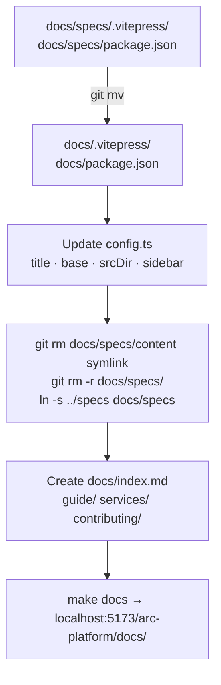
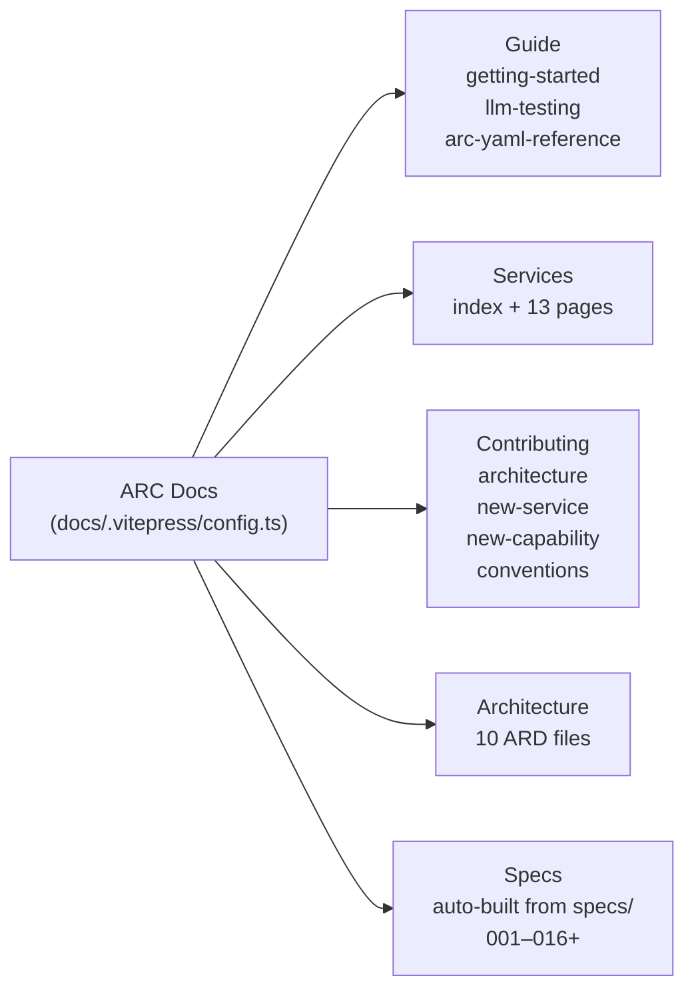
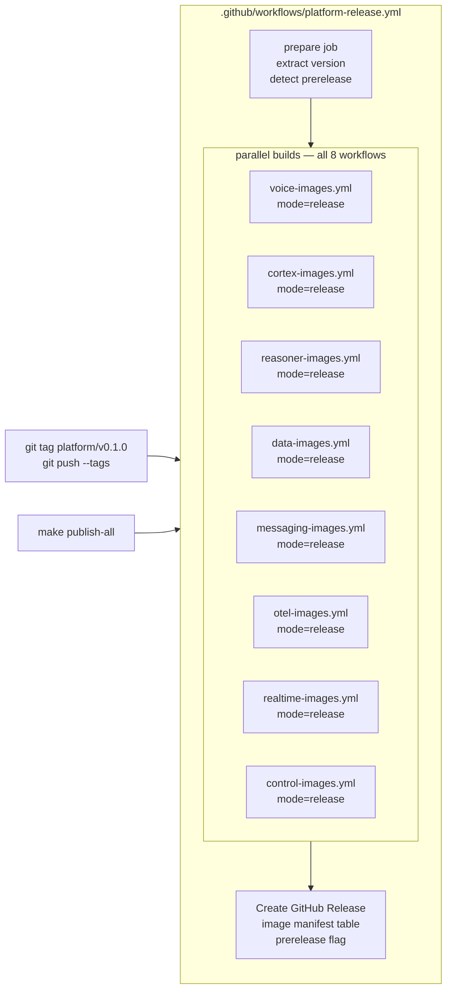

# Implementation Plan: 017-pre-release

> **Spec**: 017-pre-release
> **Date**: 2026-03-10

## Summary

Two-phase pre-release readiness: Phase 1 migrates the VitePress site from `docs/specs/` → `docs/`, renames it "ARC Docs", and adds Guide / Services / Contributing content sections. Phase 2 creates a `platform-release.yml` workflow triggered by `platform/v*` tags that builds all 8 service images in parallel and creates a GitHub Release, plus a `make publish-all` convenience target.

The two phases are independent — Phase 2 does not depend on Phase 1.

## Target Modules

| Module | Language | Changes |
|--------|----------|---------|
| `docs/` | TypeScript / MDX | VitePress root migration, new content directories |
| `Makefile` | bash | Remove `specs-dev`, add `docs` / `docs-build` / `docs-preview` / `publish-all` |
| `.github/workflows/` | YAML | Add `platform-release.yml` |
| `CLAUDE.md` | Markdown | Update commands section |

## Technical Context

| Aspect | Value |
|--------|-------|
| Framework | VitePress + `vitepress-plugin-mermaid` + `@nolebase/*` + `vitepress-plugin-llms` |
| Package manager | npm (existing `package-lock.json` is canonical) |
| srcDir change | `./content` → `.` (docs/ itself becomes the source root) |
| Symlink | `docs/specs/content → ../../specs` becomes `docs/specs → ../specs` |
| CI | `gh workflow run` for `make publish-all` |
| Key constraint | `resolve.preserveSymlinks: true` must be kept — VitePress follows symlinks for the specs sub-tree |

## Architecture

### Phase 1 — Migration Flow



### Phase 1 — Sidebar Structure



### Phase 2 — Release Pipeline



## Constitution Check

| # | Principle | Status | Evidence |
|---|-----------|--------|----------|
| I | Zero-Dep CLI | N/A | Docs module only |
| II | Platform-in-a-Box | N/A | No impact on service orchestration or profiles; docs module only |
| III | Modular Services | N/A | No services changed |
| IV | Two-Brain | N/A | No Go/Python code added |
| V | Polyglot Standards | PASS | TypeScript config follows existing style; markdown comments explain *why*, not *what* |
| VI | Local-First | PASS | `make docs` runs entirely offline |
| VII | Observability | N/A | Static site |
| VIII | Security | N/A | No secrets, no containers |
| IX | Declarative | PASS | `config.ts` is single declarative source of truth for sidebar |
| X | Stateful Ops | N/A | No state tracking required |
| XI | Resilience | N/A | No infrastructure |
| XII | Interactive | N/A | VitePress handles the interactive experience |

## Project Structure

```
arc-platform/
├── docs/                           # VitePress root (was docs/specs/)
│   ├── .vitepress/
│   │   └── config.ts               # MODIFY — title, base, srcDir, multi-section sidebar
│   ├── package.json                # MODIFY — rename to arc-platform-docs
│   ├── package-lock.json           # MOVE from docs/specs/
│   ├── index.md                    # CREATE — site home page
│   ├── specs -> ../specs           # NEW symlink (replaces docs/specs/content -> ../../specs)
│   ├── ard/                        # EXISTING — 10 ARD files, now inside srcDir
│   │   └── *.md                    # No changes needed
│   ├── guide/
│   │   ├── getting-started.md      # CREATE
│   │   ├── llm-testing.md          # CREATE
│   │   └── arc-yaml-reference.md   # CREATE
│   ├── services/
│   │   ├── index.md                # CREATE — service map table
│   │   ├── reasoner.md             # CREATE — full API reference
│   │   ├── voice.md                # CREATE — full API reference
│   │   ├── gateway.md              # CREATE — stub
│   │   ├── vault.md                # CREATE — stub
│   │   ├── flags.md                # CREATE — stub
│   │   ├── sql-db.md               # CREATE — stub
│   │   ├── vector-db.md            # CREATE — stub
│   │   ├── storage.md              # CREATE — stub
│   │   ├── messaging.md            # CREATE — stub
│   │   ├── streaming.md            # CREATE — stub
│   │   ├── cache.md                # CREATE — stub
│   │   ├── realtime.md             # CREATE — stub
│   │   └── friday.md               # CREATE — stub (observability stack)
│   └── contributing/
│       ├── architecture.md         # CREATE — Two-Brain, capability system, service resolution
│       ├── new-service.md          # CREATE — 7-step checklist
│       ├── new-capability.md       # CREATE — 6-step checklist
│       └── conventions.md          # CREATE — Go, Python, git, Docker, OTEL, naming
├── .github/workflows/
│   └── platform-release.yml        # CREATE — Phase 2 orchestrator
├── Makefile                        # MODIFY — specs-dev → docs/docs-build/docs-preview, add publish-all
└── CLAUDE.md                       # MODIFY — update commands section
```

**Files deleted:**

* `docs/specs/.vitepress/` (moved to `docs/.vitepress/`)
* `docs/specs/package.json` + `package-lock.json` (moved to `docs/`)
* `docs/specs/content` symlink (replaced by `docs/specs` symlink)
* `docs/specs/` directory itself

## Parallel Execution Strategy

Phase 1 and Phase 2 are independent and can run in parallel. Within Phase 1, the VitePress scaffold (TASK-100) must complete before content tasks run, but all content tasks are parallel.

```mermaid
gantt
    title 017-pre-release Parallelism
    dateFormat X
    axisFormat %s

    section Phase 1 — Foundation
    TASK-100 VitePress migration scaffold     :a1, 0, 3
    TASK-101 Update config.ts                :a2, after a1, 1

    section Phase 1 — Content (parallel after TASK-101)
    TASK-102 guide/ pages (3 files)          :a3, after a2, 2
    TASK-103 services/index.md + reasoner + voice :a4, after a2, 2
    TASK-104 11 service stubs                :a5, after a2, 1
    TASK-105 contributing/ pages (4 files)   :a6, after a2, 2

    section Phase 1 — Polish
    TASK-106 Makefile + CLAUDE.md updates    :a7, after a3, 1
    TASK-107 Verify make docs-build          :a8, after a5, 1

    section Phase 2 — Independent
    TASK-200 platform-release.yml           :b1, 0, 2
    TASK-201 make publish-all target        :b2, after b1, 1
```



## Implementation Notes

### Phase 1 — Migration Steps (TASK-100)

The migration must be done carefully to avoid breaking git history:

```bash
# 1. Move VitePress root files
git mv docs/specs/.vitepress docs/.vitepress
git mv docs/specs/package.json docs/package.json
git mv docs/specs/package-lock.json docs/package-lock.json

# 2. Remove old symlink and specs directory
git rm docs/specs/content          # remove old symlink from git
# delete remaining docs/specs/ contents
git rm -r docs/specs/

# 3. Create new simplified symlink
ln -s ../specs docs/specs
git add docs/specs

# 4. Commit
git commit -m "chore(docs): move VitePress root to docs/ — rename to ARC Docs"
```

### Phase 1 — config.ts Changes

Three targeted changes to `docs/.vitepress/config.ts`:

1. **title**: `'A.R.C. Platform — Specs'` → `'ARC Docs'`
2. **base**: `'/arc-platform/specs-site/'` → `'/arc-platform/docs/'`
3. **srcDir**: `'./content'` → `'.'`
4. **CONTENT\_DIR**: `resolve(__dirname, '../content')` → `resolve(__dirname, '../specs')` (only for specs auto-index)
5. **editLink.pattern**: update path to reflect `docs/` as root
6. **sidebar**: replace single `buildSidebar()` call with multi-section array: Guide, Services, Contributing, Architecture (ardSidebar), Specs (buildSidebar)

The `buildSidebar()` function reads from `CONTENT_DIR` — after migration this should point to `docs/specs/` (the symlink), so `resolve(__dirname, '../specs')` works.

### Phase 2 — platform-release.yml Design

The workflow uses `workflow_dispatch` to trigger each `*-images.yml` with `mode=release`. It does NOT use `workflow_call` because the image workflows need to run as first-class workflow runs (for history/audit), not as sub-jobs.

```yaml
on:
  push:
    tags: ['platform/v*']
  workflow_dispatch:
    inputs:
      version:
        description: 'Version (e.g. v0.1.0)'
        required: true
```

Version extraction: `${GITHUB_REF#refs/tags/platform/}` → `v0.1.0`

Pre-release detection: `[[ "$VERSION" =~ -(rc|alpha|beta) ]]` → set `prerelease: true`

GitHub Release body: table of all 20 images with `ghcr.io/arc-framework/<name>:$VERSION` pull commands.

## Reviewer Checklist

* \[ ] `make docs` starts dev server at `http://localhost:5173/arc-platform/docs/`
* \[ ] `make docs-build` exits 0 with no errors
* \[ ] Five sidebar sections present: Guide, Services, Contributing, Architecture, Specs
* \[ ] All 10 ARD files appear in Architecture section
* \[ ] `ls docs/specs/001-otel-setup/spec.md` resolves (symlink works)
* \[ ] `grep -q "specs-dev" Makefile` exits non-zero
* \[ ] `docs/specs/` directory (old VitePress root) removed — only symlink remains
* \[ ] `guide/getting-started.md` contains `arc run --profile think`
* \[ ] `guide/llm-testing.md` has ≥ 5 curl examples (sync, stream, models, STT, TTS)
* \[ ] `ls docs/services/*.md | wc -l` ≥ 13
* \[ ] `platform-release.yml` triggers on `platform/v*` tag pattern
* \[ ] `make publish-all` exists and calls `gh workflow run platform-release.yml`
* \[ ] All spec content pages 001–016 accessible under Specs section
* \[ ] No orphaned files under `docs/specs/` (only the symlink)
* \[ ] CLAUDE.md `Commands` section updated

## Risks & Mitigations

| Risk | Impact | Mitigation |
|------|--------|------------|
| `srcDir: '.'` includes node\_modules in VitePress scan | H | Add `srcExclude` patterns for `node_modules/**`, `.vitepress/**` |
| `docs/ard/` files have internal links that break after srcDir change | M | Check links in ARD files reference `/ard/...` not `/specs-site/...`; use `ignoreDeadLinks` for external only |
| `git mv` of symlink may not work on all platforms | M | Use `rm` + `ln -s` + `git add` rather than `git mv` for the symlink |
| `platform-release.yml` calling `workflow_dispatch` on sub-workflows requires PAT with `workflow` scope | H | Use `GITHUB_TOKEN` with `actions: write` permission (available for same-repo dispatches) |
| One of 8 `*-images.yml` fails to build | M | `continue-on-error: true` on each dispatch job; release is created regardless with ❌ marker |
| `make publish-all` run locally without `gh` auth | L | Guard with `gh auth status` check; print actionable error |
