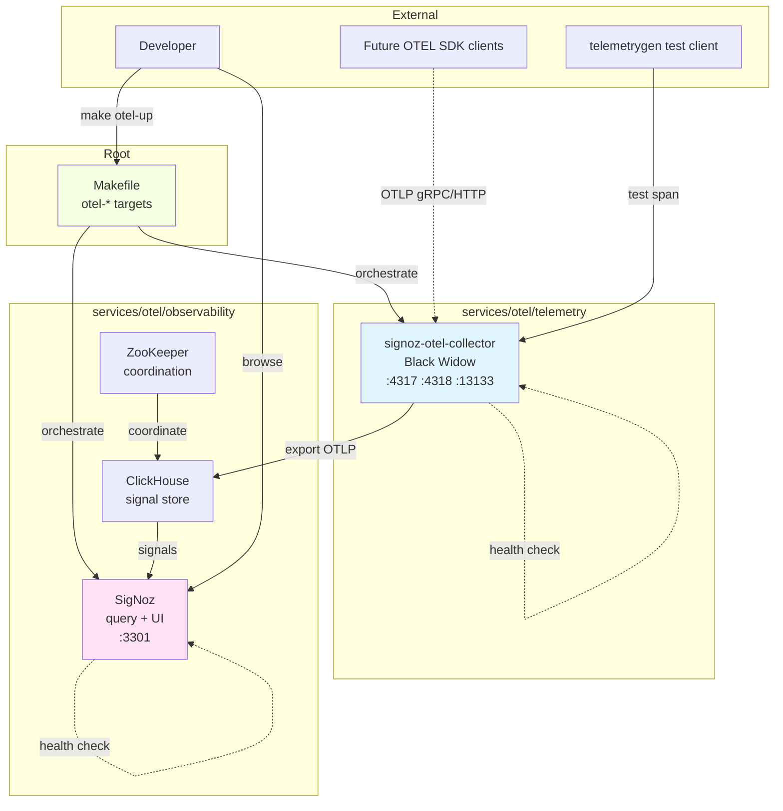
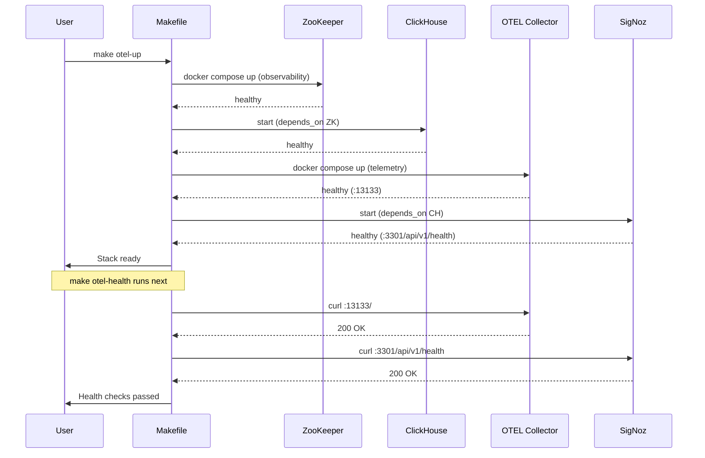
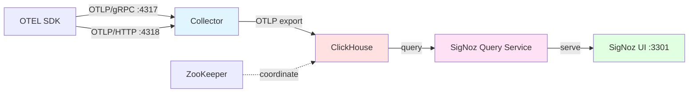
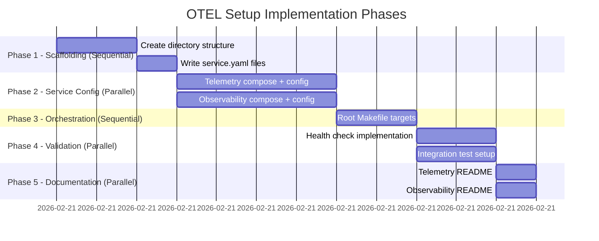

# Implementation Plan: 001-otel-setup — Stand Up SigNoz as the Observability Backend

> **Spec**: 001-otel-setup
> **Date**: 2026-02-21

## Summary

Set up SigNoz as the A.R.C. observability backend with two service directories under `services/otel/`: `telemetry/` (OTEL collector - Black Widow) and `observability/` (SigNoz + ClickHouse + ZooKeeper - Friday). All operations are orchestrated via a new root `Makefile` with `otel-*` targets. No direct `docker compose` usage. SigNoz UI at `localhost:3301`, OTLP endpoints at `:4317` (gRPC) and `:4318` (HTTP). Infrastructure only — SDK instrumentation is future work.

## Target Modules

| Module | Language | Changes |
|--------|----------|---------|
| services/otel/telemetry/ | config (YAML) | New directory — OTEL collector service with `service.yaml`, `docker-compose.yml`, `config/otel-collector-config.yaml` |
| services/otel/observability/ | config (YAML) | New directory — SigNoz + storage stack with `service.yaml`, `docker-compose.yml`, `config/` for ClickHouse/ZK configs |
| root (Makefile) | Makefile | New file — orchestration targets: `otel-up`, `otel-down`, `otel-health`, `otel-logs`, `otel-ps` |

## Technical Context

| Aspect | Value |
|--------|-------|
| Language(s) | YAML (config) + Makefile |
| Framework(s) | Docker Compose, SigNoz, OpenTelemetry Collector |
| Storage | ClickHouse (signals), ZooKeeper (coordination) |
| Testing | Health endpoint verification, telemetrygen integration test |
| Key Dependencies | `signoz/signoz-otel-collector`, `signoz/signoz`, `clickhouse/clickhouse-server`, `zookeeper` |
| Ports | 3301 (SigNoz UI), 4317 (OTLP gRPC), 4318 (OTLP HTTP), 13133 (collector health) |

## Architecture

### Component Interaction



### Startup Sequence



### Data Flow



## Constitution Check

| # | Principle | Status | Evidence |
|---|-----------|--------|----------|
| I | Zero-Dep CLI | N/A | CLI scope only; this is platform infrastructure |
| II | Platform-in-a-Box | **PASS** | Single `make otel-up` starts entire stack; no manual steps; health checks validate readiness |
| III | Modular Services | **PASS** | Each service dir (`telemetry/`, `observability/`) is self-contained with `service.yaml`, `docker-compose.yml`, and `config/`; root Makefile orchestrates without tight coupling |
| IV | Two-Brain | N/A | No Go/Python code; pure infrastructure config |
| V | Polyglot Standards | **PASS** | YAML config follows 12-Factor (env vars for secrets); consistent `service.yaml` metadata |
| VI | Local-First | N/A | CLI scope only |
| VII | Observability | **PASS** | This spec **IS** the observability foundation; health endpoints required (`:13133`, `:3301/api/v1/health`) |
| VIII | Security | **PASS** | Non-root containers enforced; ClickHouse/ZK NOT exposed externally; SigNoz UI bound to `127.0.0.1` only; no secrets in git |
| IX | Declarative | N/A | CLI scope only |
| X | Stateful Ops | N/A | CLI scope only |
| XI | Resilience | N/A | Chaos testing is follow-on work; basic health checks included |
| XII | Interactive | N/A | CLI scope only |

## Project Structure

```
arc-platform/
├── Makefile                                    # NEW — root orchestration with otel-* targets
├── services/
│   ├── profiles.yaml                           # UNCHANGED — future profiles may reference otel
│   └── otel/                                   # NEW — observability parent
│       ├── telemetry/                          # NEW — Black Widow (OTEL collector)
│       │   ├── service.yaml                    # Codename: widow, tech: signoz-otel-collector
│       │   ├── docker-compose.yml              # Single service: signoz-otel-collector
│       │   ├── config/
│       │   │   └── otel-collector-config.yaml  # OTLP receivers, SigNoz exporter, health ext
│       │   └── README.md                       # Ports, health endpoint, config reference
│       └── observability/                      # NEW — Friday (SigNoz + storage)
│           ├── service.yaml                    # Codename: friday, tech: signoz
│           ├── docker-compose.yml              # Services: signoz, clickhouse, zookeeper
│           ├── config/
│           │   ├── clickhouse-config.xml       # ClickHouse settings (4GB RAM minimum)
│           │   └── zookeeper.properties        # ZK coordination config
│           └── README.md                       # Prerequisites (4GB RAM), quickstart, UI URL
└── specs/001-otel-setup/
    ├── spec.md                                 # Input
    ├── plan.md                                 # This file
    └── tasks.md                                # Generated next
```

## Parallel Execution Strategy



**Parallelizable Task Groups**:

* **Group A** (after scaffolding): Telemetry service config (`TASK-2`) + Observability service config (`TASK-3`)
* **Group B** (after Makefile): Health check targets (`TASK-5`) + Integration test script (`TASK-6`)
* **Group C** (after validation): READMEs (`TASK-7`, `TASK-8`)

**Sequential Dependencies**:

1. Scaffolding (`TASK-1`) must complete before config tasks
2. Config tasks must complete before Makefile (`TASK-4`)
3. Makefile must complete before validation tasks

## Reviewer Checklist

**Post-Implementation Verification**:

* \[ ] All tasks in tasks.md marked completed
* \[ ] Directory structure matches plan (services/otel/telemetry/, services/otel/observability/)
* \[ ] `make otel-up` from repo root exits 0 and starts all 4 containers
* \[ ] `make otel-health` exits 0 after stack is running
* \[ ] `curl -sf http://localhost:3301/api/v1/health` returns 200
* \[ ] `curl -sf http://localhost:13133/` returns 200
* \[ ] `nc -z localhost 9000` fails (ClickHouse NOT externally exposed)
* \[ ] `nc -z localhost 2181` fails (ZooKeeper NOT externally exposed)
* \[ ] Test span via telemetrygen appears in SigNoz UI within 30 seconds
* \[ ] All containers run as non-root (verify with `docker compose exec <service> whoami`)
* \[ ] No secrets or credentials committed to git
* \[ ] SigNoz UI bound to 127.0.0.1 (verify in docker-compose.yml)
* \[ ] `make otel-down` cleanly removes all containers
* \[ ] READMEs exist with quickstart instructions
* \[ ] Constitution compliance verified for Principles II, III, V, VII, VIII
* \[ ] No TODO/FIXME comments without tracking issue

## Risks & Mitigations

| Risk | Impact | Mitigation |
|------|--------|------------|
| ClickHouse OOMs on dev machines with < 4GB available | **HIGH** | Document 4GB minimum RAM in observability/README.md; health check will fail fast with clear error in logs |
| Port conflicts (3301, 4317, 4318) on developer machines | **MEDIUM** | Make bind errors explicit; document required ports in README; future: make ports configurable via env vars |
| SigNoz starts before ClickHouse is fully ready | **MEDIUM** | Use `depends_on` with `condition: service_healthy` in docker-compose.yml; ClickHouse health check verifies readiness |
| Collector buffer overflow during ClickHouse startup | **LOW** | Collector queue settings allow buffering ~60s of data; startup time < 30s per NFR-2 |
| No existing Makefile → new patterns to establish | **LOW** | Follow platform-spike conventions: compose variable references, no `cd` commands, explicit target naming |
| Developers bypass Makefile and use raw `docker compose` | **LOW** | Document Makefile as single entrypoint; make targets simpler than raw compose commands |

## Implementation Notes

### Makefile Pattern

Follow platform-spike convention:

* Define compose variables at top: `COMPOSE_OTEL_TELEMETRY := $(COMPOSE) -f services/otel/telemetry/docker-compose.yml`
* Combine for full stack: `COMPOSE_OTEL := $(COMPOSE_OTEL_TELEMETRY) -f services/otel/observability/docker-compose.yml`
* No `cd` commands — all paths relative to repo root
* Explicit target names: `otel-up`, not just `up`

### Health Check Strategy

Two-tier validation:

1. **Container-level**: `healthcheck` blocks in docker-compose.yml prevent premature dependent starts
2. **Makefile-level**: `otel-health` target curls both endpoints and exits non-zero on failure

### Security Defaults

* SigNoz UI: `ports: ["127.0.0.1:3301:3301"]` (NOT `"3301:3301"`)
* ClickHouse: No `ports` key (internal network only)
* ZooKeeper: No `ports` key (internal network only)
* OTEL collector: `ports: ["127.0.0.1:4317:4317", "127.0.0.1:4318:4318"]`

### OTEL Collector Config

Single config file at `services/otel/telemetry/config/otel-collector-config.yaml`:

* **Receivers**: `otlp` (gRPC `:4317`, HTTP `:4318`)
* **Exporters**: `otlp` (ClickHouse endpoint)
* **Extensions**: `health_check` (`:13133`)
* **Service pipelines**: traces → otlp exporter

### Testing Approach

Manual verification for this spec (automated testing is follow-on work):

1. `make otel-up` → verify all containers healthy
2. `make otel-health` → verify health endpoints respond
3. Send test span: `docker run --rm --network host ghcr.io/open-telemetry/opentelemetry-collector-contrib/telemetrygen:latest traces --otlp-insecure --otlp-endpoint localhost:4317`
4. Verify span appears in SigNoz UI → Traces within 30s
5. `make otel-down` → verify clean shutdown

***

**Next Step**: Generate `tasks.md` via `/speckit.tasks`
