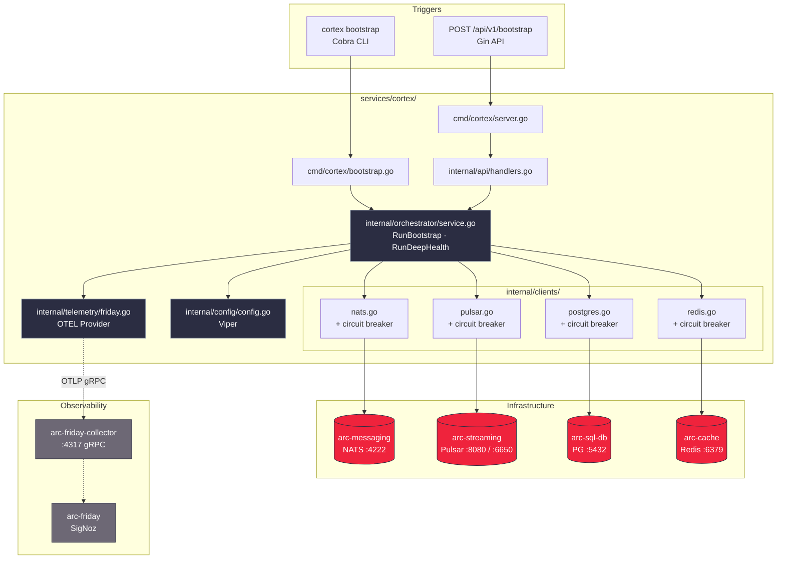
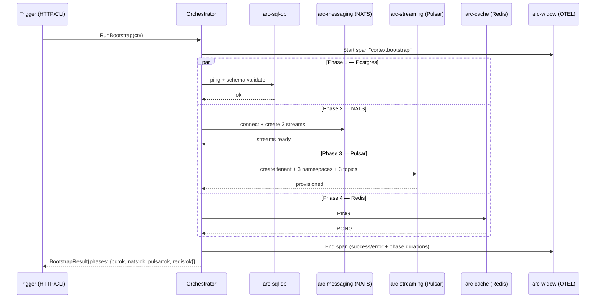
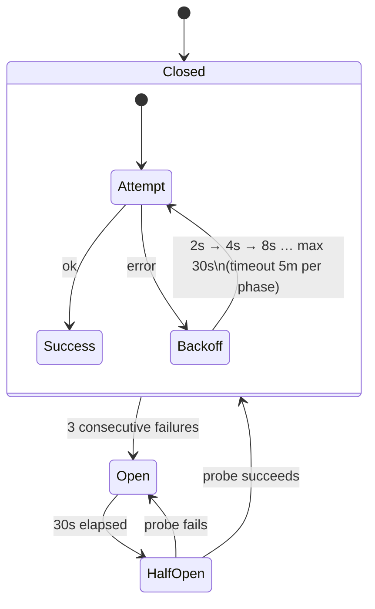
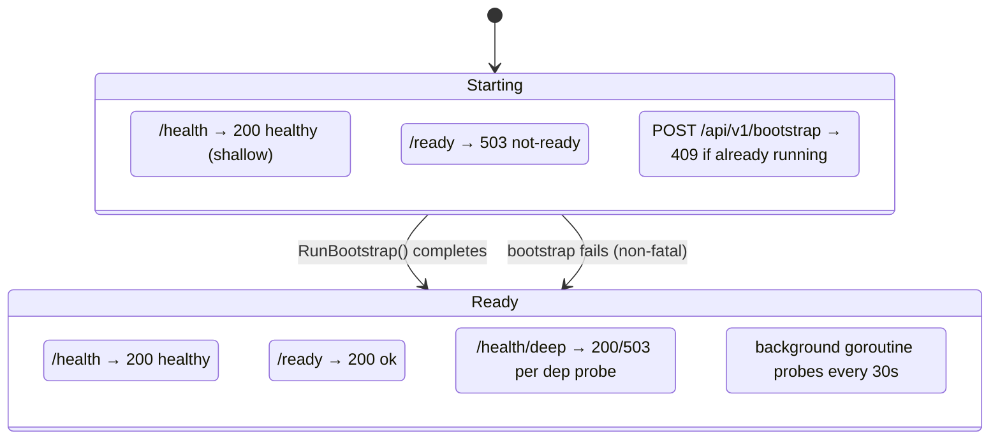
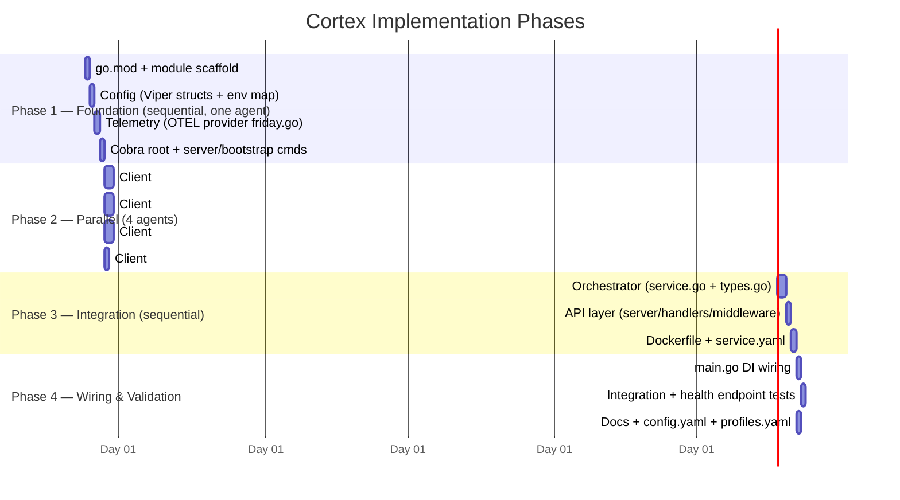

# Implementation Plan: Cortex Bootstrap Service

> **Spec**: 002-cortex-setup
> **Date**: 2026-02-22

## Summary

Cortex is a new Go service (`services/cortex/`) that provisions all A.R.C. platform infrastructure at startup. It exposes a Gin HTTP API (`POST /api/v1/bootstrap`, `/health`, `/health/deep`, `/ready`) and a Cobra CLI (`cortex server` / `cortex bootstrap`). All four bootstrap phases (Postgres schema validation, NATS JetStream stream creation, Pulsar tenant/topic provisioning, Redis ping) run in parallel via `errgroup`, each wrapped with a circuit breaker and exponential-backoff retry. OTEL traces and metrics are exported to `arc-friday-collector` at `arc-widow:4317`.

***

## Target Modules

| Module | Language | Changes |
|--------|----------|---------|
| `services/cortex/` | Go | New service — full implementation |
| `services/profiles.yaml` | YAML | Add `cortex` to `think` and `reason` profiles |
| `.specify/config.yaml` | YAML | Update bootstrap entry: `dir: cortex`, `codename: cortex` |
| `.specify/meta/service-codename-map.md` | Markdown | Add Cortex row |
| `.specify/docs/architecture/cortex.md` | Markdown | Architecture doc linked to implementation |

***

## Technical Context

| Aspect | Value |
|--------|-------|
| Language | Go |
| HTTP framework | Gin (`github.com/gin-gonic/gin`) |
| CLI framework | Cobra (`github.com/spf13/cobra`) |
| Config | Viper (`github.com/spf13/viper`) — precedence: flags → env → YAML → defaults |
| NATS client | `github.com/nats-io/nats.go` + JetStream API |
| Pulsar provisioning | REST admin API via `net/http` to `arc-streaming:8080` (not binary protocol) |
| Postgres client | `github.com/jackc/pgx/v5` pool |
| Redis client | `github.com/go-redis/redis/v9` |
| OTEL | `go.opentelemetry.io/otel` — gRPC export to `arc-widow:4317` |
| Concurrency | `golang.org/x/sync/errgroup` for parallel phases |
| Circuit breaker | `github.com/sony/gobreaker` — 3 failures → open, 30s reset |
| Testing | `go test ./...` with table-driven tests; `testify` for assertions |
| Linting | `golangci-lint run` |

### Dependency Notes

* **Pulsar admin**: Provisioning (tenant, namespace, topic creation) uses the REST admin API at `:8080`, not the binary protocol at `:6650`. The binary service URL is stored in config for future producer/consumer use but unused in this feature.
* **Circuit breaker per client**: Each of the four infra clients gets its own `gobreaker.CircuitBreaker` instance — failure state is isolated so one flapping dependency doesn't open the breaker for others.
* **Bootstrap idempotency**: NATS stream `CreateStream` updates config if the stream already exists (no error). Pulsar topic creation is skipped silently if topic exists — implemented via a 409-check on the admin API response.

***

## Architecture

### Component Overview



### Bootstrap Phase Sequence (Parallel Execution)



### Retry + Circuit Breaker Flow (per client)



### Health Endpoint Behaviour



***

## Constitution Check

| # | Principle | Status | Evidence |
|---|-----------|--------|----------|
| I | Zero-Dep CLI | N/A | Service, not CLI binary |
| II | Platform-in-a-Box | **PASS** | `docker compose up cortex` bootstraps all infra automatically |
| III | Modular Services | **PASS** | Self-contained in `services/cortex/`; `service.yaml` declares all deps |
| IV | Two-Brain | **PASS** | Pure Go — infrastructure orchestration only; no Python |
| V | Polyglot Standards | **PASS** | golangci-lint, `slog`, table-driven tests, 12-factor config via Viper |
| VI | Local-First | N/A | Service, not CLI |
| VII | Observability | **PASS** | OTEL traces + metrics from day one; `/health` + `/health/deep` |
| VIII | Security | **PASS** | Non-root `USER cortex` in Dockerfile; no secrets in logs |
| IX | Declarative | N/A | Not a reconciler |
| X | Stateful Ops | N/A | Not a CLI |
| XI | Resilience | **PASS** | Circuit breakers + exponential backoff on all four infra clients |
| XII | Interactive | N/A | Not a CLI TUI |

***

## Project Structure

```
arc-platform/
├── services/
│   ├── cortex/
│   │   ├── cmd/
│   │   │   └── cortex/
│   │   │       ├── main.go             # Wire AppContext, start actor group
│   │   │       ├── root.go             # Cobra root + global flags (--config, --log-level)
│   │   │       ├── server.go           # `cortex server` — start Gin API on :8081
│   │   │       └── bootstrap.go        # `cortex bootstrap` — one-shot CLI; exit 0/1
│   │   ├── internal/
│   │   │   ├── api/
│   │   │   │   ├── server.go           # Gin router wiring + graceful shutdown
│   │   │   │   ├── handlers.go         # /bootstrap, /health, /health/deep, /ready handlers
│   │   │   │   └── middleware.go       # OTEL trace propagation + panic recovery
│   │   │   ├── orchestrator/
│   │   │   │   ├── service.go          # RunBootstrap(), RunDeepHealth() — errgroup parallel phases
│   │   │   │   └── types.go            # BootstrapResult, PhaseResult, ProbeResult
│   │   │   ├── clients/
│   │   │   │   ├── nats.go             # JetStream stream creation + gobreaker
│   │   │   │   ├── pulsar.go           # Pulsar admin REST + gobreaker
│   │   │   │   ├── postgres.go         # pgx pool ping + schema check + gobreaker
│   │   │   │   └── redis.go            # go-redis PING + gobreaker
│   │   │   ├── config/
│   │   │   │   └── config.go           # Root Viper config; typed structs per section
│   │   │   └── telemetry/
│   │   │       └── friday.go           # OTEL TracerProvider + MeterProvider → arc-widow:4317
│   │   ├── service.yaml                # codename: cortex; deps; health endpoint
│   │   ├── Dockerfile                  # Non-root USER cortex; multi-stage build
│   │   ├── go.mod
│   │   └── go.sum
│   └── profiles.yaml                   # Add cortex to think + reason profiles
├── .specify/
│   ├── config.yaml                     # Update bootstrap → cortex entry
│   ├── meta/
│   │   └── service-codename-map.md     # Add Cortex row
│   └── docs/
│       └── architecture/
│           └── cortex.md               # Architecture doc
```

***

## Parallel Execution Strategy



### Parallelisation Notes

| Group | Tasks | Parallel? | Dependency |
|-------|-------|-----------|------------|
| A | 4 infra clients (nats, pulsar, postgres, redis) | **YES** — independent packages | Phase 1 complete |
| B | Orchestrator + API layer | **NO** — orchestrator uses all 4 clients | Group A complete |
| C | Docs/config updates | **YES** — no code dependency | Phase 3 started |
| D | main.go wiring | **NO** — needs orchestrator + API | Group B complete |

***

## Key Design Decisions

### 1. Phase parallelism via `errgroup`

```go
// internal/orchestrator/service.go
g, ctx := errgroup.WithContext(ctx)
g.Go(func() error { return s.runPostgresPhase(ctx, result) })
g.Go(func() error { return s.runNATSPhase(ctx, result) })
g.Go(func() error { return s.runPulsarPhase(ctx, result) })
g.Go(func() error { return s.runRedisPhase(ctx, result) })
err = g.Wait()
```

Each phase writes to `result` under a `sync.Mutex`. Phase-level error does not cancel other phases — `errgroup` collects all errors.

### 2. Circuit breaker per client

Each client embeds a `gobreaker.CircuitBreaker` configured as:

* `MaxRequests`: 1 (probe in half-open)
* `Interval`: 0 (count window = open duration)
* `Timeout`: 30s (open → half-open)
* `ReadyToTrip`: trips after 3 consecutive failures

### 3. `POST /api/v1/bootstrap` concurrency guard

An `atomic.Bool` (`bootstrapInProgress`) gates concurrent bootstrap requests — returns `409` immediately if a bootstrap is already running.

### 4. Pulsar admin via REST, not binary client

Tenant/namespace/topic creation uses `http.Post` to `PULSAR_ADMIN_URL`. A 409 response on topic creation is treated as success (idempotent). The binary `PULSAR_SERVICE_URL` is stored in config for future use.

### 5. `/ready` lifecycle

`/ready` returns `503` until `bootstrapInProgress` flips false AND `bootstrapCompleted` is true. This enables Traefik to withhold traffic until infra is fully provisioned.

***

## Reviewer Checklist

* \[ ] All tasks in `tasks.md` marked completed
* \[ ] `go test ./...` passes with ≥ 75% coverage on `internal/orchestrator` and `internal/clients`
* \[ ] `go test ./...` passes with ≥ 60% coverage on `internal/api`
* \[ ] `golangci-lint run` produces zero errors
* \[ ] `GET /health` responds in < 50ms (manual curl check)
* \[ ] `docker inspect` confirms non-root user (`cortex`)
* \[ ] Constitution check: all REQUIRED principles verified (II, III, IV, V, VII, VIII, XI)
* \[ ] All four NATS streams created with correct config (subjects, retention, max-age)
* \[ ] All Pulsar resources provisioned (tenant `arc-system`, 3 namespaces, 3 partitioned topics)
* \[ ] `POST /api/v1/bootstrap` returns `409` when called while bootstrap in progress
* \[ ] `cortex bootstrap` CLI exits 0 on success, non-zero on failure
* \[ ] OTEL traces visible in arc-friday under service name `arc-cortex`
* \[ ] `services/profiles.yaml` includes `cortex` in `think` and `reason`
* \[ ] `service.yaml` declares correct `depends_on: [flash, strange, oracle, sonic, widow]`
* \[ ] `.specify/config.yaml` updated from `bootstrap/raymond` → `cortex/cortex`
* \[ ] No secrets, passwords, or credentials appear in logs or error responses

***

## Risks & Mitigations

| Risk | Impact | Mitigation |
|------|--------|------------|
| Pulsar REST admin API has different error shapes across versions | M | Defensive JSON parsing; log raw response on unexpected status |
| `errgroup` phase error masks partial success | M | `BootstrapResult` stores per-phase status independently; errgroup collects all, doesn't cancel on first error |
| OTEL gRPC dial failure blocks startup | H | Use `WithFailFast(false)` + async export; bootstrap proceeds regardless of OTEL availability |
| pgx pool exhausted under concurrent `/health/deep` calls | L | Pool max connections capped; `/health/deep` uses single probe connection with short timeout |
| `service.yaml` `depends_on` not yet enforced by arc CLI | L | Document in README; CLI enforcement is out-of-scope for this feature |
