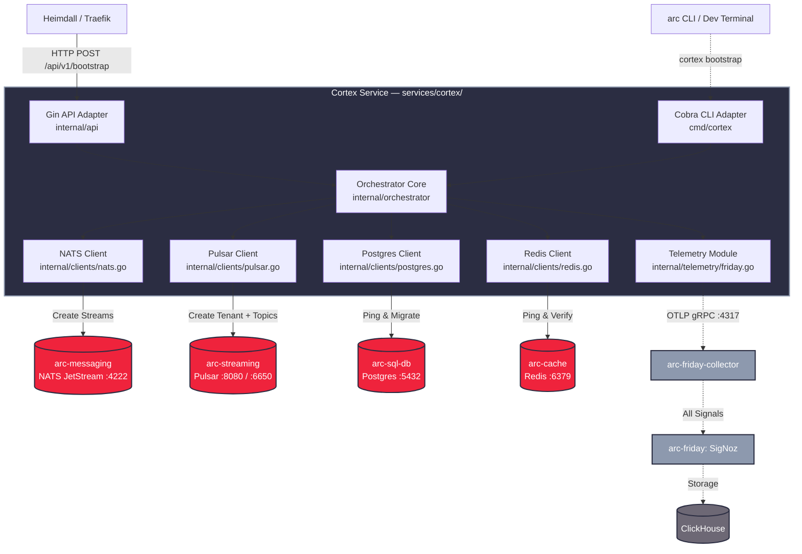
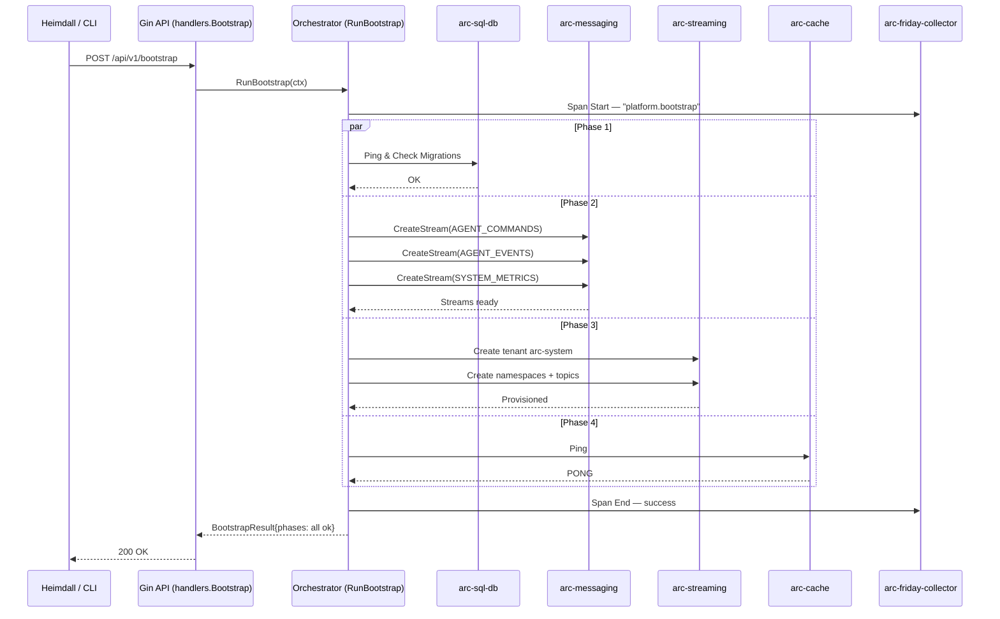

# Feature: Cortex Bootstrap Service

> **Spec**: 002-cortex-setup
> **Author**: arc-team
> **Date**: 2026-02-22
> **Status**: Draft

## Target Modules

| Module | Path | Impact |
|--------|------|--------|
| Services | `services/cortex/` | New service — Cortex bootstrap orchestrator (Go) |
| Docs | `docs/` | Add Cortex to the platform service catalogue |

## Overview

Cortex (`services/cortex/`, codename: `cortex`) is the A.R.C. platform bootstrap service — the spark plug that provisions all infrastructure at startup. The **primary interface is HTTP**: Heimdall (Traefik) routes `POST /api/v1/bootstrap` to Cortex's Gin API, which delegates to the Orchestrator Core. A Cobra CLI command (`cortex bootstrap`) is a secondary trigger for direct operator use. Cortex provisions NATS JetStream streams, Pulsar tenants and topics, validates the Postgres schema, and verifies Redis connectivity. All activity is traced and metered via the Friday OTEL stack.

## Architecture



### Directory Structure

Strict Go project layout — no dumping everything in `main.go`.

```text
services/cortex/
├── cmd/
│   └── cortex/
│       ├── main.go             # Wire dependencies here
│       ├── root.go             # Cobra root command
│       ├── server.go           # `cortex server` — start Gin API
│       └── bootstrap.go        # `cortex bootstrap` — one-shot CLI execution
├── internal/
│   ├── api/                    # HTTP Transport Adapter
│   │   ├── server.go           # Gin router setup
│   │   ├── handlers.go         # HTTP handlers calling orchestrator
│   │   └── middleware.go       # Friday (OTEL) & Recovery middlewares
│   ├── orchestrator/           # Core Domain Logic (The Brain)
│   │   ├── service.go          # RunBootstrap(), RunDeepHealth()
│   │   └── types.go            # BootstrapResult, PhaseResult, ProbeResult
│   ├── clients/                # Infrastructure Adapters
│   │   ├── nats.go             # NATS JetStream setup + circuit breaker
│   │   ├── pulsar.go           # Pulsar tenant/namespace/topic setup + circuit breaker
│   │   ├── postgres.go         # pgx pool + schema validation + circuit breaker
│   │   └── redis.go            # go-redis ping + circuit breaker
│   ├── config/
│   │   └── config.go           # Viper/Infisical bindings
│   └── telemetry/
│       └── friday.go           # OTEL provider — traces + metrics → arc-friday-collector
├── service.yaml                # codename: cortex, depends_on, health endpoint
├── Dockerfile
├── go.mod
└── go.sum
```

### HTTP API

The Gin router is the primary interface. All routes are under the Cortex server (`cortex server`):

| Method | Path | Handler | Auth | Description |
|--------|------|---------|------|-------------|
| `POST` | `/api/v1/bootstrap` | `handlers.Bootstrap` | — | Trigger full platform bootstrap |
| `GET` | `/health` | `handlers.Health` | — | Shallow health — always 200 |
| `GET` | `/health/deep` | `handlers.DeepHealth` | — | Deep probe — calls `RunDeepHealth()` |
| `GET` | `/ready` | `handlers.Ready` | — | Readiness — 503 until bootstrap complete |

**Middleware chain** (applied in order):

1. `middleware.Recovery(logger)` — panic → 500, log stack, continue
2. `middleware.FridayOTEL("arc-cortex")` — inject trace context per request (otelgin)
3. `middleware.RequestLogger(logger)` — structured request/response logging

**Bootstrap request/response:**

```
POST /api/v1/bootstrap
→ 200 {"status":"ok","phases":{"postgres":"ok","nats":"ok","pulsar":"ok","redis":"ok"}}
→ 409 {"status":"in-progress"}           (if already running)
→ 500 {"status":"error","phase":"nats","error":"..."}
```

**Deep health response:**

```
GET /health/deep
→ 200 {"status":"healthy","dependencies":{
    "arc-sql-db": {"ok":true,"latencyMs":2,"error":""},
    "arc-messaging":  {"ok":true,"latencyMs":1,"error":""},
    "arc-streaming":{"ok":true,"latencyMs":5,"error":""},
    "arc-cache":  {"ok":true,"latencyMs":1,"error":""}
  }}
→ 503  (same shape, "ok":false on failing deps)
```

### Bootstrap Phase Sequence



## Libraries

Per the A.R.C. Go Standard (`cortex.md` §4):

| Concern | Library |
|---------|---------|
| CLI | `github.com/spf13/cobra` |
| Configuration | `github.com/spf13/viper` |
| HTTP Router | `github.com/gin-gonic/gin` |
| OTEL middleware | `go.opentelemetry.io/contrib/instrumentation/github.com/gin-gonic/gin/otelgin` |
| Logging | `log/slog` (stdlib) |
| Telemetry | `go.opentelemetry.io/otel` + `otlptracegrpc` + `otlpmetricgrpc` |
| PostgreSQL | `github.com/jackc/pgx/v5` |
| NATS | `github.com/nats-io/nats.go` |
| Pulsar | `github.com/apache/pulsar-client-go/pulsar` |
| Redis | `github.com/redis/go-redis/v9` |
| Secrets | Infisical Go SDK (`github.com/infisical/go-sdk`) — or Viper `.env` injection |
| Feature Flags | `github.com/open-feature/go-sdk` with Unleash provider |
| Circuit Breaker | `github.com/sony/gobreaker` |
| Retry / Backoff | `github.com/cenkalti/backoff/v4` |
| Actor lifecycle | `github.com/oklog/run` |

## User Scenarios & Testing

### P1 — Must Have

**US-1**: As a platform operator, I want `POST /api/v1/bootstrap` via Heimdall to provision all infra and return a phase-by-phase result.

* **Given**: Cortex is running; all four infra services are reachable
* **When**: `POST /api/v1/bootstrap`
* **Then**: `200 {"status":"ok","phases":{"postgres":"ok","nats":"ok","pulsar":"ok","redis":"ok"}}`; NATS streams and Pulsar topics exist
* **Test**: `curl -X POST http://localhost:8081/api/v1/bootstrap`; then `nats stream ls` and `pulsar-admin topics list`

**US-2**: As Heimdall, I want `GET /health` to return 200 immediately at startup so the gateway can route traffic before bootstrap completes.

* **Given**: Cortex container starts with valid config
* **When**: `GET /health` (within 1s of container start)
* **Then**: `200 {"status":"healthy","mode":"shallow"}`
* **Test**: `curl -sf http://localhost:8081/health` immediately after `docker compose up cortex`

**US-3**: As a platform operator, I want `GET /health/deep` to call `RunDeepHealth()` and return per-dependency probe results.

* **Given**: arc-sql-db is down; others healthy
* **When**: `GET /health/deep`
* **Then**: `503 {"status":"unhealthy","dependencies":{"arc-sql-db":{"ok":false,"latencyMs":...,"error":"..."},...}}`
* **Test**: Stop arc-sql-db; call `/health/deep`; assert 503 with oracle unhealthy entry

**US-4**: As the platform runtime, I want `GET /ready` to gate dependent services — 503 while bootstrap runs, 200 after.

* **Given**: Bootstrap is in progress
* **When**: `GET /ready`
* **Then**: `503 {"ready":false}`; after all phases succeed → `200 {"ready":true}`
* **Test**: Poll `/ready` during startup; assert state transitions

**US-5**: As a platform operator, I want NATS streams provisioned with exact config so agents have messaging infrastructure.

* **Given**: `arc-messaging` at `nats://arc-messaging:4222`
* **When**: Bootstrap Phase 2 completes
* **Then**: Three streams with exact subjects and retention (see FR-4)
* **Test**: `nats stream info AGENT_COMMANDS` confirms subjects, retention, max-age

**US-6**: As a platform operator, I want `cortex bootstrap` (CLI) to run the same bootstrap and exit 0.

* **Given**: All infra services are running
* **When**: `docker run arc-cortex bootstrap`
* **Then**: Exit code 0; same provisioning as HTTP trigger; OTEL span emitted
* **Test**: `docker run arc-cortex bootstrap; echo $?`

### P2 — Should Have

**US-7**: As a platform operator, I want bootstrap phases to retry with exponential backoff so transient infra gaps don't fail permanently.

* **Given**: arc-messaging is temporarily unreachable
* **When**: Phase 2 executes
* **Then**: Retries 2s→30s backoff, up to 5 min; succeeds once arc-messaging comes online
* **Test**: Start Cortex before arc-messaging; bring arc-messaging up within 2 min; verify streams created

**US-8**: As a platform SRE, I want client calls protected by circuit breakers so a flapping dep doesn't stall the service.

* **Given**: A dep fails 3 consecutive times
* **When**: 4th attempt occurs
* **Then**: Circuit open; fast-fails with `ErrCircuitOpen`; resets after 30s
* **Test**: Unit test — mock client to fail 3×; assert 4th call returns immediately

**US-9**: As a platform SRE, I want OTEL traces and metrics exported to arc-friday so bootstrap visibility is built-in.

* **Given**: `arc-friday-collector` running on `:4317`
* **When**: Bootstrap runs
* **Then**: Traces in arc-friday under `arc-cortex`; `cortex.bootstrap.phase_duration_seconds` metric per phase
* **Test**: `make otel-up && docker compose up cortex`; check arc-friday UI

**US-10**: As a platform operator, I want secrets (DB password, Redis auth) fetched from Infisical (Nick Fury) so credentials are never baked into config files or env vars.

* **Given**: Nick Fury (Infisical) is running and Cortex has a service token
* **When**: Cortex starts and `config.Load()` runs
* **Then**: Postgres password and Redis password come from Infisical; no plaintext secrets in container env
* **Test**: Set `INFISICAL_TOKEN`; verify Cortex connects to Postgres without `POSTGRES_PASSWORD` env var

### P3 — Nice to Have

**US-11**: As a platform operator, I want feature flags (via Unleash/Mystique) to control which bootstrap phases run so I can toggle phases without redeploying.

* **Given**: Mystique (Unleash) is running; flag `cortex.bootstrap.pulsar.enabled` is `false`
* **When**: Bootstrap runs
* **Then**: Phase 3 (Pulsar) is skipped; other phases run normally
* **Test**: Disable Pulsar flag in Unleash; call `/api/v1/bootstrap`; confirm no Pulsar provisioning and 200 response

**US-12**: As a platform operator, I want dependency health monitored every 30s post-bootstrap so drift is detected automatically.

* **Given**: Cortex is running; arc-cache goes down after bootstrap
* **When**: 30s monitoring cycle runs
* **Then**: Degraded state logged with slog; `/health/deep` reflects it
* **Test**: Kill arc-cache post-bootstrap; wait 30s; check logs and `/health/deep`

## Requirements

### Functional

* \[ ] FR-1: Expose two Cobra commands: `cortex server` (primary — start Gin API) and `cortex bootstrap` (secondary — one-shot CLI)
* \[ ] FR-2: Gin API routes: `POST /api/v1/bootstrap`, `GET /health`, `GET /health/deep`, `GET /ready`
* \[ ] FR-3: Middleware chain on all routes: `Recovery` → `FridayOTEL` (otelgin, service name `arc-cortex`) → `RequestLogger`
* \[ ] FR-4: Bootstrap Phase 1 — Postgres: `Ping` + `ValidateSchema("public")` via pgx pool; host `arc-sql-db:5432`
* \[ ] FR-5: Bootstrap Phase 2 — NATS JetStream on `arc-messaging:4222`:
  * `AGENT_COMMANDS` — subjects `["agent.*.cmd"]`, retention `limits`, max-age `24h`
  * `AGENT_EVENTS` — subjects `["agent.*.event","agent.*.status"]`, retention `interest`, max-age `168h`
  * `SYSTEM_METRICS` — subjects `["metrics.>"]`, retention `limits`, max-age `6h`
* \[ ] FR-6: Bootstrap Phase 3 — Pulsar on `arc-streaming:8080`:
  * Tenant: `arc-system`
  * Namespaces: `events`, `logs`, `audit`
  * Topics: `persistent://arc-system/events/agent-lifecycle` (3 partitions), `persistent://arc-system/logs/application` (4 partitions), `persistent://arc-system/audit/command-log` (1 partition)
* \[ ] FR-7: Bootstrap Phase 4 — Redis `PING` to `arc-cache:6379`
* \[ ] FR-8: All four phases run in parallel (via goroutines); each retries independently — exponential backoff initial `2s`, max interval `30s`, max elapsed `5m`
* \[ ] FR-9: Stream and topic creation is idempotent — safe to call multiple times
* \[ ] FR-10: All infra clients wrapped with circuit breaker: open after 3 failures, reset after 30s; return `ErrCircuitOpen` when open
* \[ ] FR-11: Config loaded via `config.Load()` using Viper — YAML file + env vars (env vars override); secrets fetched from Infisical if `INFISICAL_TOKEN` is set, otherwise falls back to env vars
* \[ ] FR-12: `GET /health/deep` calls `orchestrator.RunDeepHealth(ctx)` — concurrent TCP/HTTP probes per dep; returns `ProbeResult{Name, OK, LatencyMs, Error}` per dep; `503` if any fail
* \[ ] FR-13: `GET /ready` — `503` while bootstrap is in progress; `200` once `RunBootstrap()` returns without error
* \[ ] FR-14: `POST /api/v1/bootstrap` returns `409` if bootstrap is already in progress (atomic state guard)
* \[ ] FR-15: (P3) Feature flag check via `open-feature/go-sdk` (Unleash provider) before each phase; if flag `cortex.bootstrap.<phase>.enabled` is `false`, skip phase and mark as `skipped` in result

### Non-Functional

* \[ ] NFR-1: OTEL traces + metrics → `arc-widow:4317` gRPC; service name `arc-cortex`; namespace `arc`; 100% sampling
* \[ ] NFR-2: Container runs as non-root user (`USER cortex` in Dockerfile)
* \[ ] NFR-3: No secrets in logs, stack traces, or HTTP error bodies; Infisical token never logged
* \[ ] NFR-4: `GET /health` < 50ms; `GET /health/deep` < 5s (concurrent probes, 5s timeout each)
* \[ ] NFR-5: Graceful shutdown ≤ 30s; active bootstrap phase given 30s grace before context cancel
* \[ ] NFR-6: `golangci-lint run` passes with zero errors
* \[ ] NFR-7: `go test ./...` ≥ 75% coverage on `internal/orchestrator` and `internal/clients`; ≥ 60% on `internal/api`

### Key Entities

| Entity | Path | Description |
|--------|------|-------------|
| `Orchestrator` | `internal/orchestrator/service.go` | `RunBootstrap(ctx) BootstrapResult`, `RunDeepHealth(ctx) map[string]ProbeResult` |
| `BootstrapResult` | `internal/orchestrator/types.go` | `{Status, Phases map[string]PhaseResult}` returned to HTTP handler and CLI |
| `PhaseResult` | `internal/orchestrator/types.go` | `{Name, Status, Error}` — one per phase |
| `ProbeResult` | `internal/orchestrator/types.go` | `{Name, OK, LatencyMs, Error}` — one per dep in deep health |
| `Config` | `internal/config/config.go` | Root Viper/Infisical config; `Load(path string) (*Config, error)` |
| `ServerConfig` | `internal/config/config.go` | `SERVER_PORT` (8081), timeouts |
| `TelemetryConfig` | `internal/config/config.go` | `TELEMETRY_OTLP_ENDPOINT`, service name, log level |
| `NATSConfig` / `StreamConfig` | `internal/config/config.go` | NATS URL + stream definitions |
| `PulsarConfig` / `TopicConfig` | `internal/config/config.go` | Pulsar URLs, tenant, namespaces, topics |
| `PostgresConfig` | `internal/config/config.go` | pgx pool — host, port, user, db, ssl, pool size |
| `RedisConfig` | `internal/config/config.go` | go-redis — host, port, db, password (from Infisical) |
| `Metrics` | `internal/telemetry/friday.go` | OTEL metric instruments: phase duration histograms, error counters, HTTP request metrics |

### Key Environment Variables

| Env Var | Default | Description |
|---------|---------|-------------|
| `SERVER_PORT` | `8081` | HTTP listen port |
| `SERVER_SHUTDOWN_TIMEOUT` | `30s` | Graceful shutdown budget |
| `TELEMETRY_OTLP_ENDPOINT` | `arc-widow:4317` | OTEL collector gRPC address |
| `TELEMETRY_OTLP_INSECURE` | `true` | Skip TLS for OTLP (dev) |
| `TELEMETRY_SERVICE_NAME` | `arc-cortex` | OTEL service name |
| `TELEMETRY_LOG_LEVEL` | `info` | `debug\|info\|warn\|error` |
| `BOOTSTRAP_TIMEOUT` | `5m` | Max elapsed time per phase |
| `BOOTSTRAP_RETRY_BACKOFF` | `2s` | Initial backoff interval |
| `NATS_URL` | `nats://arc-messaging:4222` | NATS connection URL |
| `PULSAR_ADMIN_URL` | `http://arc-streaming:8080` | Pulsar admin REST API |
| `PULSAR_SERVICE_URL` | `pulsar://arc-streaming:6650` | Pulsar binary protocol |
| `PULSAR_TENANT` | `arc-system` | Pulsar tenant to provision |
| `POSTGRES_HOST` | `arc-sql-db` | Postgres host |
| `POSTGRES_PORT` | `5432` | Postgres port |
| `POSTGRES_USER` | `arc` | Postgres user |
| `POSTGRES_DB` | `arc_db` | Database name |
| `POSTGRES_SSL_MODE` | `disable` | `disable\|require\|verify-full` |
| `REDIS_HOST` | `arc-cache` | Redis host |
| `REDIS_PORT` | `6379` | Redis port |
| `INFISICAL_TOKEN` | — | If set, secrets fetched from Nick Fury (Infisical) |
| `UNLEASH_URL` | — | If set, feature flags fetched from Mystique (Unleash) |

## Edge Cases

| Scenario | Expected Behavior |
|----------|-------------------|
| Dep unreachable at startup | Phase retries for up to 5 min; `/health` stays 200; `/ready` stays 503 |
| `arc-friday-collector` unreachable | OTEL SDK buffers silently; no impact on bootstrap or HTTP |
| `POST /api/v1/bootstrap` while already running | `409 {"status":"in-progress"}` |
| NATS stream already exists | `CreateStream` idempotent — updates config if changed, no error |
| Pulsar topic already exists | Topic creation skipped; no error |
| Infisical unreachable at start | Fall back to env var secrets; log warning; proceed normally |
| Unleash unreachable | Feature flags default to `true` (all phases enabled); log warning |
| `cortex bootstrap` exits non-zero | Exit code 1 + JSON error to stdout (`{"status":"error","phase":"...","error":"..."}`) |
| Panic in HTTP handler | `Recovery` middleware catches; logs stack; `500`; service continues |
| `SIGTERM` during active phase | Phase gets 30s grace; context cancelled after; server shuts down |
| Postgres password missing (no Infisical) | `config.Load()` validation fails; service exits with descriptive error |
| Circuit breaker open | Client calls return `ErrCircuitOpen` immediately; retries resume when circuit resets (30s) |

## Success Criteria

* \[ ] SC-1: `docker compose up cortex` — `/health` returns 200 within 3s of start
* \[ ] SC-2: `POST /api/v1/bootstrap` with all four infra services running → 200; `nats stream ls` shows 3 streams; Pulsar shows `arc-system` tenant
* \[ ] SC-3: `cortex bootstrap` CLI exits 0 and provisions identical infra as the HTTP trigger
* \[ ] SC-4: `make otel-up && docker compose up cortex` — traces visible in arc-friday under service `arc-cortex`; phase duration metrics exported
* \[ ] SC-5: `go test ./...` passes ≥ 75% coverage on orchestrator and client packages
* \[ ] SC-6: `golangci-lint run` — zero errors
* \[ ] SC-7: `docker inspect arc-cortex` — non-root user confirmed

## Docs & Links Update

* \[ ] Update `.specify/config.yaml` — change `dir: "bootstrap", codename: "raymond"` → `dir: "cortex", codename: "cortex"`
* \[ ] Update `services/profiles.yaml` — include `cortex` in `think` and `reason` profiles
* \[ ] Add `services/cortex/service.yaml` — `codename: cortex`, `depends_on: [flash, strange, oracle, sonic, widow]`, `health: http://localhost:8081/health`
* \[ ] Add `services/cortex/README.md` — quickstart, env var table, example `docker compose` snippet
* \[ ] Update `.specify/meta/service-codename-map.md` — add Cortex entry
* \[ ] Update `.specify/docs/architecture/cortex.md` — link to `services/cortex/` implementation once built

## Constitution Compliance

| Principle | Applies | Compliant | Notes |
|-----------|---------|-----------|-------|
| I. Zero-Dep CLI | \[ ] | \[n/a] | Service, not CLI binary |
| II. Platform-in-a-Box | \[x] | \[x] | `docker compose up` provisions all infra; no manual wiring |
| III. Modular Services | \[x] | \[x] | Self-contained in `services/cortex/`; `service.yaml` declares all deps |
| IV. Two-Brain | \[x] | \[x] | Pure Go — infrastructure domain only |
| V. Polyglot Standards | \[x] | \[x] | golangci-lint, slog, table-driven tests, 12-factor config |
| VI. Local-First | \[ ] | \[n/a] | Service, not CLI |
| VII. Observability | \[x] | \[x] | OTEL traces + metrics from day one; `/health` + `/health/deep`; span per phase |
| VIII. Security | \[x] | \[x] | Non-root container; secrets via Infisical, not env; nothing sensitive in logs |
| IX. Declarative | \[ ] | \[n/a] | Service, not reconciler |
| X. Stateful Ops | \[ ] | \[n/a] | Service, not CLI |
| XI. Resilience | \[x] | \[x] | Circuit breakers + exponential backoff on all four infra clients |
| XII. Interactive | \[ ] | \[n/a] | Service, not CLI TUI |
