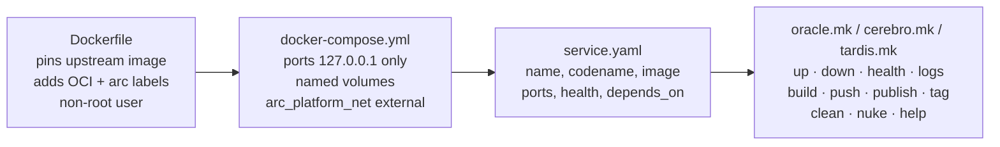
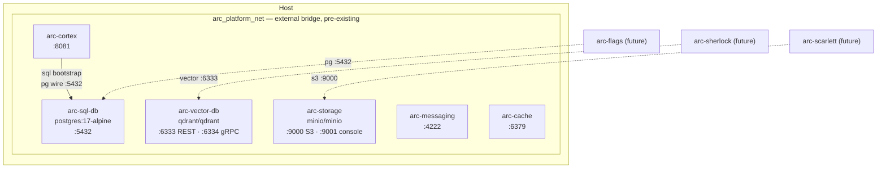
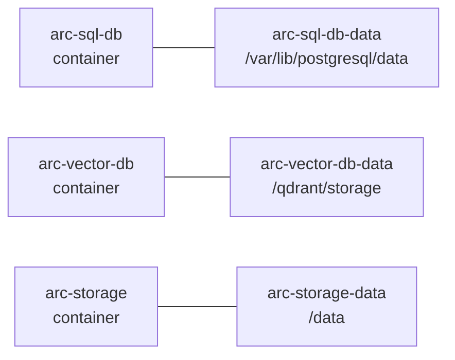

# Implementation Plan: Data Layer Services Setup

> **Spec**: 005-data-layer
> **Date**: 2026-02-28

## Summary

Add three infrastructure services — Postgres 17 (Oracle), Qdrant (Cerebro), MinIO (Tardis) — each following the exact same structural pattern as 003-messaging-setup: thin Dockerfile label wrapper, `service.yaml`, `docker-compose.yml`, dedicated `.mk` include, and CI/release workflows. All three join `arc_platform_net` (existing external bridge). No OTEL collector changes in this spec — Prometheus scraping for Qdrant and MinIO is deferred as tech debt. Profiles updated so `think` includes oracle + cerebro; `reason` adds tardis.

## Target Modules

| Module | Language | Changes |
|--------|----------|---------|
| `services/persistence/` | Config/Dockerfile | New — Postgres 17 (Oracle) |
| `services/vector/` | Config/Dockerfile | New — Qdrant (Cerebro) |
| `services/storage/` | Config/Dockerfile | New — MinIO (Tardis) |
| `services/profiles.yaml` | YAML | Add oracle + cerebro to `think`; tardis to `reason` |
| `.github/workflows/` | YAML | New — data-images.yml + data-release.yml |
| `Makefile` | Make | Include oracle.mk, cerebro.mk, tardis.mk, data.mk |
| `services/data.mk` | Make | New — aggregate up/down/health/logs for all three |

## Technical Context

| Aspect | Value |
|--------|-------|
| Language | Config-only (YAML, Dockerfile) — no application code |
| Base Images | `postgres:17-alpine`, `qdrant/qdrant`, `minio/minio` |
| Testing | `docker compose ps`, `pg_isready`, `curl /readyz`, `curl /minio/health/live` |
| Network | `arc_platform_net` (external bridge, pre-existing) — no new networks |
| Volumes | Named volumes: `arc-sql-db-data`, `arc-vector-db-data`, `arc-storage-data` |
| CI Pattern | Mirror `messaging-images.yml` — amd64-only CI, dorny/paths-filter per service |
| Health Checks | Oracle: `pg_isready`; Cerebro: HTTP `/readyz`; Tardis: HTTP `/minio/health/live` |

## Architecture

### Service file pattern (same for all three)



### Runtime topology



### Volume layout



## Constitution Check

| # | Principle | Status | Evidence |
|---|-----------|--------|----------|
| I | Zero-Dep CLI | N/A | No CLI changes |
| II | Platform-in-a-Box | PASS | `make data-up` boots all three; oracle + cerebro join `think` profile |
| III | Modular Services | PASS | Each in own dir under `services/`; self-contained with own service.yaml |
| IV | Two-Brain | PASS | Config-only upstream images — no language concern |
| V | Polyglot Standards | PASS | Same Dockerfile/compose/healthcheck structure as 003-messaging-setup |
| VI | Local-First | N/A | CLI only |
| VII | Observability | PASS | pg\_isready, Qdrant /readyz, MinIO /health/live; Prometheus scraping deferred (TD-001) |
| VIII | Security | PASS | postgres uid 70, qdrant uid 1000; MinIO uid verified (see Decision 3); 127.0.0.1 ports; no secrets in git |
| IX | Declarative | N/A | CLI only |
| X | Stateful Ops | N/A | CLI only |
| XI | Resilience | PASS | Health checks with appropriate start\_periods; named volumes survive restart |
| XII | Interactive | N/A | CLI only |

## Project Structure

```
arc-platform/
├── services/
│   ├── persistence/                          ← NEW (Oracle / Postgres 17)
│   │   ├── Dockerfile                        # FROM postgres:17-alpine; OCI + arc labels; uid 70 (postgres)
│   │   ├── service.yaml                      # name, codename, image, ports, health
│   │   ├── docker-compose.yml                # arc-sql-db; POSTGRES_* env; named volume; arc_platform_net
│   │   └── oracle.mk                         # oracle-up/down/health/logs/build/push/publish/tag/clean/nuke
│   ├── vector/                               ← NEW (Cerebro / Qdrant)
│   │   ├── Dockerfile                        # FROM qdrant/qdrant; OCI + arc labels; uid 1000
│   │   ├── service.yaml
│   │   ├── docker-compose.yml                # arc-vector-db; :6333/:6334; named volume; arc_platform_net
│   │   └── cerebro.mk
│   ├── storage/                              ← NEW (Tardis / MinIO)
│   │   ├── Dockerfile                        # FROM minio/minio; OCI + arc labels; uid verified
│   │   ├── service.yaml
│   │   ├── docker-compose.yml                # arc-storage; :9000/:9001; MINIO_ROOT_*; named volume; arc_platform_net
│   │   └── tardis.mk
│   ├── profiles.yaml                         # MODIFY — think += oracle, cerebro; reason += tardis
│   └── data.mk                               ← NEW (aggregate)
├── .github/workflows/
│   ├── data-images.yml                       ← NEW
│   └── data-release.yml                      ← NEW
└── Makefile                                  # MODIFY — include oracle.mk, cerebro.mk, tardis.mk, data.mk
```

## Key Implementation Decisions

### 1. Dockerfiles are thin label wrappers (same as 003)

No config baked in. All service configuration is in `docker-compose.yml` via command-line flags or environment variables. The Dockerfile only pins the upstream image and adds labels.

```dockerfile
# services/persistence/Dockerfile
FROM postgres:17-alpine
LABEL org.opencontainers.image.title="ARC Oracle — Persistence"
LABEL org.opencontainers.image.description="Postgres 17 relational database for the A.R.C. Platform"
LABEL org.opencontainers.image.source="https://github.com/arc-framework/arc-platform"
LABEL arc.service.name="arc-sql-db"
LABEL arc.service.codename="oracle"
LABEL arc.service.tech="postgres"
# postgres:17-alpine already runs as postgres user (uid 70) — no USER directive needed
```

```dockerfile
# services/vector/Dockerfile
FROM qdrant/qdrant
LABEL org.opencontainers.image.title="ARC Cerebro — Vector Store"
LABEL arc.service.codename="cerebro"
LABEL arc.service.tech="qdrant"
# qdrant/qdrant runs as uid 1000 — non-root by default
```

```dockerfile
# services/storage/Dockerfile
FROM minio/minio
LABEL org.opencontainers.image.title="ARC Tardis — Object Storage"
LABEL arc.service.codename="tardis"
LABEL arc.service.tech="minio"
# minio/minio: verify uid at build time — document if root deviation applies
```

### 2. arc\_platform\_net as external network (same as 003)

Each `docker-compose.yml` declares the network as external. The network is created once by `make dev` or `make flash-up`. `data.mk`'s `data-up` target ensures it exists with `|| true`.

```yaml
# Bottom of every docker-compose.yml in this spec
networks:
  arc_platform_net:
    external: true
    name: arc_platform_net
```

### 3. MinIO non-root handling

`minio/minio` standard image runs as root by default. Options in order of preference:

* **Option A**: Use `user: "1000:1000"` in docker-compose and ensure `/data` is writable — verify MinIO supports this without a custom Dockerfile
* **Option B**: Add `RUN mkdir -p /data && chown 1000:1000 /data && adduser -u 1000 minio` in Dockerfile and `USER 1000`

If neither works with the upstream image, document the root deviation in docker-compose.yml comments (same as Pulsar in 003).

### 4. Postgres docker-compose pattern

```yaml
services:
  arc-sql-db:
    build: {context: ., dockerfile: Dockerfile}
    image: ghcr.io/arc-framework/arc-sql-db:latest
    container_name: arc-sql-db
    environment:
      POSTGRES_USER: arc
      POSTGRES_PASSWORD: arc
      POSTGRES_DB: arc
    ports:
      - "127.0.0.1:5432:5432"
    volumes:
      - oracle-data:/var/lib/postgresql/data
    healthcheck:
      test: ["CMD-SHELL", "pg_isready -U arc || exit 1"]
      interval: 5s
      timeout: 3s
      retries: 10
      start_period: 10s
    networks:
      - arc_platform_net
    restart: unless-stopped

volumes:
  oracle-data:
    name: arc-sql-db-data

networks:
  arc_platform_net:
    external: true
    name: arc_platform_net
```

### 5. Qdrant docker-compose pattern

```yaml
services:
  arc-vector-db:
    image: ghcr.io/arc-framework/arc-vector-db:latest
    container_name: arc-vector-db
    ports:
      - "127.0.0.1:6333:6333"   # REST + Prometheus metrics
      - "127.0.0.1:6334:6334"   # gRPC
    volumes:
      - cerebro-data:/qdrant/storage
    healthcheck:
      test: ["CMD-SHELL", "wget -qO- http://localhost:6333/readyz || exit 1"]
      interval: 5s
      timeout: 3s
      retries: 5
      start_period: 5s
    networks:
      - arc_platform_net
    restart: unless-stopped
```

### 6. MinIO docker-compose pattern

```yaml
services:
  arc-storage:
    image: ghcr.io/arc-framework/arc-storage:latest
    container_name: arc-storage
    command: server /data --console-address ":9001"
    environment:
      MINIO_ROOT_USER: arc
      MINIO_ROOT_PASSWORD: arc-minio-dev
    ports:
      - "127.0.0.1:9000:9000"   # S3 API
      - "127.0.0.1:9001:9001"   # Web console
    volumes:
      - tardis-data:/data
    healthcheck:
      test: ["CMD-SHELL", "curl -f http://localhost:9000/minio/health/live || exit 1"]
      interval: 10s
      timeout: 5s
      retries: 5
      start_period: 10s
    networks:
      - arc_platform_net
    restart: unless-stopped
```

### 7. data.mk aggregate (mirrors messaging.mk)

```makefile
PHONY: data-help data-up data-down data-health data-logs

## data-up: Start all data services (Oracle + Cerebro + Tardis)
data-up:
	@docker network create arc_platform_net 2>/dev/null || true
	$(MAKE) oracle-up --no-print-directory
	$(MAKE) cerebro-up --no-print-directory
	$(MAKE) tardis-up --no-print-directory

## data-down: Stop all data services
data-down:
	$(MAKE) oracle-down --no-print-directory
	$(MAKE) cerebro-down --no-print-directory
	$(MAKE) tardis-down --no-print-directory

## data-health: Check health of all three data services
data-health:
	@$(MAKE) oracle-health --no-print-directory && \
	 $(MAKE) cerebro-health --no-print-directory && \
	 $(MAKE) tardis-health --no-print-directory
```

### 8. CI workflow — mirrors messaging-images.yml exactly

`data-images.yml` uses `_reusable-build.yml` and `_reusable-security.yml` with path filters:

* `services/persistence/**` → build-oracle
* `services/vector/**` → build-cerebro
* `services/storage/**` → build-tardis

`data-release.yml` tag format: `data/vX.Y.Z` → Docker tag `data-vX.Y.Z`

## Parallel Execution Strategy

```mermaid
gantt
    title 005-data-layer Implementation Phases
    dateFormat X
    axisFormat %s

    section Phase 1 — Foundation
    Update profiles.yaml (oracle+cerebro→think, tardis→reason)  :p1, 0, 1

    section Phase 2 — Services (fully parallel)
    persistence/: Dockerfile + service.yaml + compose            :p2a, after p1, 2
    vector/: Dockerfile + service.yaml + compose                 :p2b, after p1, 2
    storage/: Dockerfile + service.yaml + compose                :p2c, after p1, 2

    section Phase 3 — Make targets (parallel per service)
    oracle.mk                                                     :p3a, after p2a, 1
    cerebro.mk                                                    :p3b, after p2b, 1
    tardis.mk                                                     :p3c, after p2c, 1
    data.mk aggregate + Makefile includes                         :p3d, after p2c, 1

    section Phase 4 — CI/CD (parallel)
    data-images.yml workflow                                      :p4a, after p3d, 2
    data-release.yml workflow                                     :p4b, after p3d, 2

    section Phase 5 — Integration
    make data-up + make data-health                               :p5, after p4b, 1
    Cortex /health/deep shows oracle ok                           :p5b, after p5, 1
```



**Parallelizable task groups:**

* Phase 2: All three service directories are fully independent
* Phase 3: oracle.mk + cerebro.mk + tardis.mk — independent after their Phase 2 deps
* Phase 4: data-images.yml + data-release.yml — independent of each other

## Tech Debt

| ID | Item | Rationale |
|----|------|-----------|
| TD-001 | Qdrant Prometheus scraping via otel collector | Qdrant exposes `/metrics` on :6333. When a concrete dashboard requirement exists, add a `prometheus` scrape job for `arc-vector-db:6333` to the collector config (see 003 pattern). |
| TD-002 | MinIO Prometheus scraping | MinIO exports metrics at `:9000/minio/v2/metrics/cluster`. Same deferral as TD-001. |
| TD-003 | Default bucket creation | MinIO starts empty. Cortex bootstrap (or a future init task) should create standard buckets (`arc-artifacts`, `arc-models`, etc.) via `mc` client. |

## Reviewer Checklist

* \[ ] `make data-up` exits 0; all three containers in `healthy` state (`docker compose ps`)
* \[ ] `make data-health` exits 0
* \[ ] `make data-down` stops all three; no orphaned containers
* \[ ] `make oracle-up && make oracle-health` works independently
* \[ ] `make cerebro-up && make cerebro-health` works independently
* \[ ] `make tardis-up && make tardis-health` works independently
* \[ ] `curl -s http://localhost:8081/health/deep | jq .oracle.status` returns `"ok"` after cortex restart
* \[ ] `curl -s http://localhost:6333/readyz` returns HTTP 200
* \[ ] `curl -s http://localhost:9000/minio/health/live` returns HTTP 200
* \[ ] `docker inspect arc-sql-db | jq '.[0].Config.User'` confirms non-root (empty = postgres default uid 70)
* \[ ] `docker inspect arc-vector-db | jq '.[0].Config.User'` confirms non-root (uid 1000)
* \[ ] MinIO uid documented (non-root or deviation noted in compose comments)
* \[ ] All ports bind `127.0.0.1` — verify with `docker compose ps`
* \[ ] All volumes are named (not bind mounts) — `docker volume ls | grep arc`
* \[ ] `services/profiles.yaml` `think` includes `oracle` + `cerebro`; `reason` includes `tardis`
* \[ ] `Makefile` includes oracle.mk, cerebro.mk, tardis.mk, data.mk
* \[ ] `data-images.yml` runs only on relevant path changes; path filters cover all three service dirs
* \[ ] `data-release.yml` tag format `data/v*` builds multi-platform images (amd64 + arm64)
* \[ ] All Dockerfiles have OCI + `arc.service.*` labels
* \[ ] No credentials or secrets in any compose file (use env vars with dev defaults)
* \[ ] `make oracle-clean` and `make oracle-nuke` prompt for confirmation before destructive action

## Risks & Mitigations

| Risk | Impact | Mitigation |
|------|--------|------------|
| MinIO runs as root in upstream image | M | Verify at implementation time; either `user: "1000:1000"` in compose or document deviation in comments (like Pulsar) |
| `arc_platform_net` not created before `make data-up` | H | `data-up` calls `docker network create arc_platform_net 2>/dev/null \|\| true` first |
| Postgres ignores env vars after data dir is initialized | M | Document in `make oracle-clean` help text; `oracle-nuke` removes the volume |
| Cortex fails to connect to Oracle if password mismatch with Cortex config | M | Cortex default Postgres password in `cortex.mk` env vars must match `POSTGRES_PASSWORD=arc` |
| Port 5432 conflict with a local Postgres installation | L | Document in oracle.mk help; user can override host port via compose override file |
