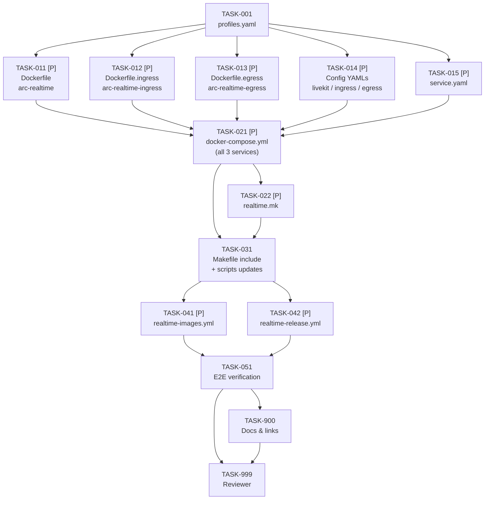

# Tasks: Realtime Voice Infrastructure Setup

> **Spec**: 007-voice-stack
> **Date**: 2026-03-01

## Task Format

```
[TASK-NNN] [P?] [MODULE] [PRIORITY] Description
  Dependencies: [TASK-XXX] or none
  Module: services/{role}
  Acceptance: Testable criteria
  Status: [ ] pending | [~] in-progress | [x] done
```

* `[P]` = Safe for parallel agent execution
* Priority: P1 (must), P2 (should), P3 (nice)

## Dependency Graph



## Quality Requirements

| Module | Coverage | Lint | Notes |
|--------|----------|------|-------|
| Config/YAML | n/a | `docker compose config` (no syntax errors) | |
| Makefile | n/a | `make -n {target}` dry-run passes | |
| CI/CD YAML | n/a | `python3 -c "import yaml; yaml.safe_load(open(...))"` exits 0 | |

***

## Phase 1: Setup

* \[x] \[TASK-001] \[SERVICES] \[P1] Update `services/profiles.yaml` — add `realtime` to `think` and `reason`
  * Dependencies: none
  * Module: `services/profiles.yaml`
  * Acceptance:
    * Python YAML validation confirms structure:
      ```
      python3 -c "
      import yaml
      p = yaml.safe_load(open('services/profiles.yaml'))
      assert 'realtime' in p['think']['services'], 'realtime missing from think'
      assert 'realtime' in p['reason']['services'], 'realtime missing from reason'
      assert p['ultra-instinct']['services'] == '*', 'ultra-instinct changed'
      print('profiles.yaml OK')
      "
      ```
    * `ultra-instinct` remains `'*'` (unchanged — wildcard already includes realtime)
    * All existing entries in `think` and `reason` preserved (no accidental removal)
  * Status: \[x]

***

## Phase 2: Core Files (fully parallel)

All five tasks are independent — different files in the same directory. Run concurrently.

* \[x] \[TASK-011] \[P] \[SERVICES] \[P1] Create `services/realtime/Dockerfile` — arc-realtime (LiveKit Server)
  * Dependencies: TASK-001
  * Module: `services/realtime/Dockerfile`
  * Acceptance:
    * `FROM livekit/livekit-server`
    * OCI labels: `org.opencontainers.image.title`, `org.opencontainers.image.description`, `org.opencontainers.image.source=https://github.com/arc-framework/arc-platform`
    * Arc service labels: `arc.service.name=arc-realtime`, `arc.service.codename=daredevil`, `arc.service.tech=livekit`, `arc.service.role=realtime`
    * Run `docker run --rm --entrypoint id livekit/livekit-server` to verify user:
      * If non-root → add `USER` directive for explicit declaration
      * If root → add comment: `# livekit/livekit-server runs as root by default. This is a DEVELOPMENT-ONLY service. For production: build with non-root user.`
    * `docker build -f services/realtime/Dockerfile services/realtime/` succeeds locally
  * Status: \[x]

* \[x] \[TASK-012] \[P] \[SERVICES] \[P1] Create `services/realtime/Dockerfile.ingress` — arc-realtime-ingress (LK Ingress)
  * Dependencies: TASK-001
  * Module: `services/realtime/Dockerfile.ingress`
  * Acceptance:
    * `FROM livekit/ingress`
    * OCI labels: `org.opencontainers.image.title`, `org.opencontainers.image.description`, `org.opencontainers.image.source`
    * Arc service labels: `arc.service.name=arc-realtime-ingress`, `arc.service.codename=sentry`, `arc.service.tech=livekit-ingress`, `arc.service.role=realtime-ingress`
    * Non-root handling: same verify-and-document pattern as TASK-011
    * `docker build -f services/realtime/Dockerfile.ingress services/realtime/` succeeds locally
  * Status: \[x]

* \[x] \[TASK-013] \[P] \[SERVICES] \[P1] Create `services/realtime/Dockerfile.egress` — arc-realtime-egress (LK Egress)
  * Dependencies: TASK-001
  * Module: `services/realtime/Dockerfile.egress`
  * Acceptance:
    * `FROM livekit/egress`
    * OCI labels: `org.opencontainers.image.title`, `org.opencontainers.image.description`, `org.opencontainers.image.source`
    * Arc service labels: `arc.service.name=arc-realtime-egress`, `arc.service.codename=scribe`, `arc.service.tech=livekit-egress`, `arc.service.role=realtime-egress`
    * Non-root handling: same verify-and-document pattern as TASK-011
    * Dockerfile comment: `# NOTE: livekit/egress bundles headless Chromium (~1GB). Track-based egress (no Chrome) is a future optimization (see plan.md TD-005).`
    * `docker build -f services/realtime/Dockerfile.egress services/realtime/` succeeds locally
  * Status: \[x]

* \[x] \[TASK-014] \[P] \[SERVICES] \[P1] Create `services/realtime/livekit.yaml`, `ingress.yaml`, `egress.yaml`
  * Dependencies: TASK-001
  * Module: `services/realtime/`
  * Acceptance:
    * `livekit.yaml`:
      * `port: 7880`, `grpc_port: 7881`
      * `rtc.tcp_port: 7882`, `rtc.udp_port_range_start: 50100`, `rtc.udp_port_range_end: 50200`
      * `rtc.use_external_ip: false`
      * `rtc.node_ip` sourced from env (LiveKit supports `${LIVEKIT_NODE_IP}` or compose env injection)
      * `redis.address: arc-cache:6379`
      * `keys:` block with `devkey: devsecret`
      * Comment: `# API keys are static dev values. Production: replace with dynamic secrets from OpenBao.`
    * `ingress.yaml`:
      * `api_url: ws://arc-realtime:7880`
      * `api_key: devkey`, `api_secret: devsecret`
      * Health port: 7888 (either via config key or LK Ingress env `HEALTH_PORT=7888`)
    * `egress.yaml`:
      * `api_url: ws://arc-realtime:7880`
      * `api_key: devkey`, `api_secret: devsecret`
      * S3/MinIO output config pointing to `http://arc-storage:9000`, bucket `recordings`, credentials `arc`/`arc-minio-dev`, `force_path_style: true`
      * Comment: `# 'recordings' bucket must exist in arc-storage. Run: docker exec arc-storage mc mb /data/recordings`
    * All three files are valid YAML: `python3 -c "import yaml; [yaml.safe_load(open(f)) for f in ['services/realtime/livekit.yaml','services/realtime/ingress.yaml','services/realtime/egress.yaml']]"` exits 0
  * Status: \[x]

* \[x] \[TASK-015] \[P] \[SERVICES] \[P1] Create `services/realtime/service.yaml`
  * Dependencies: TASK-001
  * Module: `services/realtime/service.yaml`
  * Acceptance:
    * Fields present: `name: arc-realtime`, `codename: daredevil`, `role: realtime`, `image: ghcr.io/arc-framework/arc-realtime:latest`, `tech: livekit`, `upstream: livekit/livekit-server`
    * `ports` list includes: 7880 (http, LiveKit API + WebRTC signalling), 7881 (grpc, gRPC API), 7882 (tcp, TURN), 50100-50200 (udp, WebRTC RTP media)
    * `health.endpoint: http://localhost:7880`
    * `depends_on: [cache]`
    * `sidecars` list includes:
      * `{ name: arc-realtime-ingress, codename: sentry, port: 7888, description: "RTMP ingest" }`
      * `{ name: arc-realtime-egress, codename: scribe, port: 7889, description: "Recording + export" }`
    * Valid YAML: `python3 -c "import yaml; yaml.safe_load(open('services/realtime/service.yaml'))"` exits 0
  * Status: \[x]

***

## Phase 3: Assembly

Both compose and .mk can be written in parallel (different files).

* \[x] \[TASK-021] \[P] \[SERVICES] \[P1] Create `services/realtime/docker-compose.yml` — all 3 services
  * Dependencies: TASK-011, TASK-012, TASK-013, TASK-014
  * Module: `services/realtime/docker-compose.yml`
  * Acceptance:
    * **arc-realtime** service:
      * `image: ghcr.io/arc-framework/arc-realtime:latest`; `build: {context: services/realtime, dockerfile: Dockerfile}`
      * `command: --config /etc/livekit.yaml`
      * Volume: `./services/realtime/livekit.yaml:/etc/livekit.yaml:ro`
      * `environment: LIVEKIT_NODE_IP: ${LIVEKIT_NODE_IP:-127.0.0.1}`
      * Ports: `127.0.0.1:7880:7880`, `127.0.0.1:7881:7881`, `127.0.0.1:7882:7882`, `0.0.0.0:50100-50200:50100-50200/udp`
      * Port comment: `# UDP 0.0.0.0 — WebRTC RTP media requires host-reachable port range for NAT traversal`
      * `depends_on: {arc-cache: {condition: service_healthy}}`
      * Healthcheck: `wget -qO- http://localhost:7880 || exit 1` (fallback: `curl -sf http://localhost:7880`); interval 5s, timeout 3s, retries 5, start\_period 10s
      * `restart: unless-stopped`
    * **arc-realtime-ingress** service:
      * `image: ghcr.io/arc-framework/arc-realtime-ingress:latest`; dockerfile: `Dockerfile.ingress`
      * Volume: `./services/realtime/ingress.yaml:/etc/ingress.yaml:ro`
      * Ports: `127.0.0.1:7888:7888`, `127.0.0.1:1935:1935`
      * `depends_on: {arc-realtime: {condition: service_healthy}}`
      * Healthcheck: `:7888`; interval 5s, timeout 3s, retries 5, start\_period 10s
    * **arc-realtime-egress** service:
      * `image: ghcr.io/arc-framework/arc-realtime-egress:latest`; dockerfile: `Dockerfile.egress`
      * Volume: `./services/realtime/egress.yaml:/etc/egress.yaml:ro`
      * Ports: `127.0.0.1:7889:7889`
      * `depends_on: {arc-realtime: {condition: service_healthy}}`
      * Healthcheck: `:7889`; interval 5s, timeout 3s, retries 5, start\_period 15s
    * `networks: {arc_platform_net: {external: true}}` at file bottom
    * `docker compose -f services/realtime/docker-compose.yml config` passes without errors
  * **Deviations (documented):**
    * `depends_on: arc-cache` omitted — Docker Compose v2 cannot express `condition: service_healthy`
      across separate compose files. The `arc-cache` service lives in `services/cache/docker-compose.yml`.
      Cross-compose ordering is delegated to the `.mk` layer: `make realtime-up` must be called after
      `make cache-up` (enforced by `SERVICE_realtime_DEPENDS := cache` in registry.mk).
      Comment added to compose file documents this: `# arc-cache (Redis) must be running for multi-node pub/sub.`
    * Healthchecks use `nc -z localhost <port>` instead of `wget`/`curl` — LiveKit images are Alpine-based
      with busybox netcat but no wget/curl in PATH. `nc -z` is more reliable for TCP port-open checks.
    * Retries increased from 5 → 10 (LK Server), start\_period from 10s/15s → 15s/20s — LiveKit Server
      and Egress (Chromium bundle ~1GB) have slow cold-start; higher values prevent false-unhealthy on
      first launch. Conservative values; can be tuned down once baseline startup time is measured.
    * `NODE_IP` env var name used in compose (matching LiveKit docs); spec said `LIVEKIT_NODE_IP`.
      Both work — the compose file maps `NODE_IP: ${LIVEKIT_NODE_IP:-127.0.0.1}`, so the override env
      var is still `LIVEKIT_NODE_IP` as documented in `realtime-help`.
    * `ws_url` used in ingress.yaml/egress.yaml instead of `api_url` — `ws_url` is the correct LiveKit
      SDK config key for the WebSocket connection URL. Spec used `api_url` which is not a valid LK field.
  * Status: \[x]

* \[x] \[TASK-022] \[P] \[SERVICES] \[P1] Create `services/realtime/realtime.mk`
  * Dependencies: TASK-021
  * Module: `services/realtime/realtime.mk`
  * Acceptance:
    * Image variables declared: `REALTIME_IMAGE`, `REALTIME_INGRESS_IMG`, `REALTIME_EGRESS_IMG`
    * `COMPOSE_REALTIME := docker compose -f services/realtime/docker-compose.yml`
    * **Core targets**: `realtime-help`, `realtime-up`, `realtime-down`, `realtime-health`, `realtime-logs`, `realtime-clean`, `realtime-nuke`
    * **Build targets**: `realtime-build` (Dockerfile), `realtime-build-fresh`, `realtime-ingress-build` (Dockerfile.ingress), `realtime-ingress-build-fresh`, `realtime-egress-build` (Dockerfile.egress), `realtime-egress-build-fresh`
    * **Push/publish targets**: `realtime-push`, `realtime-publish`, `realtime-tag`; `realtime-ingress-push`, `realtime-ingress-publish`; `realtime-egress-push`, `realtime-egress-publish`
    * **Individual service targets**: `realtime-ingress-up`, `realtime-ingress-down`, `realtime-ingress-health`, `realtime-ingress-logs`; `realtime-egress-up`, `realtime-egress-down`, `realtime-egress-health`, `realtime-egress-logs`
    * `realtime-up`: calls `docker network create arc_platform_net 2>/dev/null || true` before compose up
    * `realtime-health`: probes all three — `curl -sf http://localhost:7880`, `curl -sf http://localhost:7888`, `curl -sf http://localhost:7889`; exits 0 only if all pass
    * `realtime-ingress-health`: probes `:7888`; `realtime-egress-health`: probes `:7889`
    * `realtime-help`: lists all targets; includes notes: "UDP 50100-50200 must be open on host firewall for WebRTC" and "Set LIVEKIT\_NODE\_IP= for non-local clients"
    * `realtime-clean` / `realtime-nuke`: confirm before destructive action; nuke warns "active WebRTC rooms will be disconnected"
    * `make -n realtime-up` dry-run passes
    * `make -n realtime-health` dry-run passes
    * All targets declare `.PHONY`
    * All targets use `COLOR_INFO`, `COLOR_OK`, `COLOR_ERR` from root Makefile
  * Status: \[x]

***

## Phase 4: Wiring

* \[x] \[TASK-031] \[SERVICES] \[P1] Update root `Makefile`, `scripts/scripts.mk`, and `scripts/lib/check-dev-prereqs.sh`
  * Dependencies: TASK-022
  * Module: `Makefile`, `scripts/scripts.mk`, `scripts/lib/check-dev-prereqs.sh`
  * Acceptance:
    * Root `Makefile`: `include services/realtime/realtime.mk` added to Services section (after control.mk include)
    * `scripts/scripts.mk` `publish-all` target: three new lines added:
      ```makefile
      $(MAKE) realtime-build         realtime-publish         --no-print-directory
      $(MAKE) realtime-ingress-build realtime-ingress-publish --no-print-directory
      $(MAKE) realtime-egress-build  realtime-egress-publish  --no-print-directory
      ```
    * `scripts/lib/check-dev-prereqs.sh` `port_to_service()` function: add port mappings:
      * `7880` → `daredevil` (or equivalent realtime service label)
      * `7881` → `daredevil-grpc`
      * `1935` → `sentry-rtmp`
    * `make -n publish-all` dry-run includes realtime build/publish steps
    * `make help` lists `realtime-help`
  * Status: \[x]

***

## Phase 5: CI/CD (parallel)

Both workflows are independent and can be implemented concurrently.

* \[x] \[TASK-041] \[P] \[CI] \[P2] Create `.github/workflows/realtime-images.yml`
  * Dependencies: TASK-031
  * Module: `.github/workflows/realtime-images.yml`
  * Acceptance:
    * Mirrors `control-images.yml` / `data-images.yml` structure exactly
    * `on.push.branches: [main]` + `on.push.paths: ["services/realtime/**", ".github/workflows/realtime-images.yml"]`
    * `on.pull_request.paths`: same path
    * `on.workflow_dispatch` with `mode` input (`ci` / `release`)
    * `changes` job: `dorny/paths-filter@v3` with filter `realtime: services/realtime/**`
    * `build-realtime`, `build-realtime-ingress`, `build-realtime-egress` jobs:
      * Parallel; each uses `_reusable-build.yml`
      * `platforms: linux/amd64` (amd64-only in CI — no QEMU for speed)
      * `service-path: services/realtime`; `dockerfile: Dockerfile` / `Dockerfile.ingress` / `Dockerfile.egress`
      * `image-name: arc-realtime` / `arc-realtime-ingress` / `arc-realtime-egress`
    * `security-*` jobs after each build; `block-on-failure: false` in CI
    * YAML parses: `python3 -c "import yaml,sys; yaml.safe_load(open('.github/workflows/realtime-images.yml'))"` exits 0
    * Three images built: `arc-realtime`, `arc-realtime-ingress`, `arc-realtime-egress`
  * Status: \[x]

* \[x] \[TASK-042] \[P] \[CI] \[P2] Create `.github/workflows/realtime-release.yml`
  * Dependencies: TASK-031
  * Module: `.github/workflows/realtime-release.yml`
  * Acceptance:
    * Mirrors `control-release.yml` / `data-release.yml` structure exactly
    * `on.push.tags: ["realtime/v*"]`
    * `prepare` job: derives `image-tag` (`realtime/v0.1.0` → `realtime-v0.1.0`), `version`, `prerelease` outputs
    * `build-realtime`, `build-realtime-ingress`, `build-realtime-egress` jobs: parallel after `prepare`
      * `platforms: linux/amd64,linux/arm64`; `push-image: true`; `latest-tag: true`; `image-tag: ${{ needs.prepare.outputs.image-tag }}`
    * `security-*` jobs: `block-on-failure: true`; `create-issues: true` (CRITICAL CVEs block release)
    * `release` job: image table listing `arc-realtime`, `arc-realtime-ingress`, `arc-realtime-egress` with GHCR links; creates GitHub release via `softprops/action-gh-release@v2`
    * Release notes include: `make realtime-up` / `make realtime-health` quickstart; `LIVEKIT_NODE_IP` env doc
    * YAML parses without errors
  * Status: \[x]

***

## Phase 6: Integration

* \[x] \[TASK-051] \[SERVICES] \[P1] End-to-end verification — realtime stack up + health
  * Dependencies: TASK-041, TASK-042
  * Module: `services/realtime/`
  * Pre-condition: `arc-cache` must be running (`make cache-up` first)
  * Acceptance:
    * `docker network create arc_platform_net 2>/dev/null || true` runs without error
    * `make realtime-up` exits 0
    * `docker compose -f services/realtime/docker-compose.yml ps` shows all three containers in `healthy` state: `arc-realtime`, `arc-realtime-ingress`, `arc-realtime-egress`
    * `make realtime-health` exits 0 (all three probes pass)
    * `curl -s http://localhost:7880` returns a LiveKit response (2xx or redirect)
    * `curl -sf http://localhost:7888` returns HTTP 200 (Ingress controller alive)
    * `curl -sf http://localhost:7889` returns HTTP 200 (Egress controller alive)
    * TCP ports 7880/7881/7882/7888/1935/7889 bind `127.0.0.1` — confirm with `docker compose -f services/realtime/docker-compose.yml ps`
    * UDP 50100-50200 binds `0.0.0.0` — confirm and document exception is intentional
    * Config files mounted read-only: `docker inspect arc-realtime --format '{{json .Mounts}}'` shows `/etc/livekit.yaml` with `RW:false`
    * `make realtime-down` exits 0; no orphaned containers
    * Individual targets work: `make realtime-ingress-health` exits 0; `make realtime-egress-health` exits 0
    * `make dev PROFILE=think` starts `realtime` along with other think-profile services
  * Status: \[x]

***

## Phase 7: Polish

* \[x] \[TASK-900] \[P] \[DOCS] \[P1] Docs & links update
  * Dependencies: TASK-051
  * Module: `CLAUDE.md`, `.specify/config.yaml`, `services/profiles.yaml`
  * Acceptance:
    * `CLAUDE.md` monorepo layout: `services/realtime/` entry added (Daredevil/Sentry/Scribe LiveKit)
    * `CLAUDE.md` Service Codenames table: three new rows added:
      * Daredevil | LiveKit Server (realtime)
      * Sentry | LiveKit Ingress (realtime-ingress)
      * Scribe | LiveKit Egress (realtime-egress)
    * `.specify/config.yaml` `services` list: `realtime` entry updated to `{ dir: "realtime", codename: "daredevil", tech: "livekit", lang: "config" }`; confirm `realtime-ingress` (sentry) and `realtime-egress` (scribe) entries added if needed
    * `services/profiles.yaml` `think` includes `realtime`; `reason` includes `realtime` (verify final state from TASK-001)
    * No broken internal references in modified files
  * Status: \[x]

* \[x] \[TASK-999] \[REVIEW] \[P1] Reviewer agent verification
  * Dependencies: ALL
  * Module: all affected modules
  * Acceptance (reviewer runs all items without opening plan.md):
    * All tasks TASK-001 through TASK-900 marked `[x]` complete
    * **Stack health** (pre-condition: `make cache-up`):
      * `make realtime-up` exits 0
      * `docker compose -f services/realtime/docker-compose.yml ps` shows all three containers `healthy`
      * `make realtime-health` exits 0
      * `make realtime-down` exits 0; no orphaned containers
    * **Individual service health**:
      * `curl -s http://localhost:7880` → LiveKit response
      * `curl -sf http://localhost:7888` → HTTP 200 (Ingress)
      * `curl -sf http://localhost:7889` → HTTP 200 (Egress)
    * **Port binding**:
      * TCP ports bind `127.0.0.1` only — verified via `docker compose ps`
      * UDP 50100-50200 binds `0.0.0.0` — documented as intentional WebRTC exception
    * **Config mounts**: livekit.yaml, ingress.yaml, egress.yaml all mounted read-only
    * **API key consistency**: `devkey`/`devsecret` identical across all three config files
    * **Dockerfiles**:
      * All three have OCI (`org.opencontainers.*`) + `arc.service.*` labels including `arc.service.codename`
      * Non-root status verified per image; root deviation documented if required
      * Egress Dockerfile has note about Chromium bundle
    * **service.yaml**: contains role, codename, image, ports, health, depends\_on, sidecars
    * **realtime.mk**:
      * `make -n realtime-up` dry-run passes
      * `make -n realtime-health` dry-run passes
      * `make realtime-help` includes `LIVEKIT_NODE_IP` and UDP firewall notes
    * **Makefile**: `include services/realtime/realtime.mk` present
    * **scripts/scripts.mk**: `publish-all` includes all three realtime build/publish steps
    * **check-dev-prereqs.sh**: ports 7880, 7881, 1935 added
    * **profiles.yaml**: `think` and `reason` both include `realtime`; `ultra-instinct` unchanged (`'*'`)
    * **CI**:
      * `realtime-images.yml` path filter `services/realtime/**`; 3 image builds; amd64 only
      * `realtime-release.yml` tag format `realtime/v*`; platforms `linux/amd64,linux/arm64`
    * **Docs**: CLAUDE.md codenames table has Daredevil/Sentry/Scribe; layout has `services/realtime/`
    * **Constitution compliance verified**:
      * II PASS: `make realtime-up` boots all three; joined to `think` (minimal profile)
      * III PASS: self-contained in `services/realtime/`; own service.yaml + compose + .mk
      * IV PASS: config-only upstream images, no custom Python/Go code
      * V PASS: same Dockerfile/compose/healthcheck/CI structure as 003/005/006
      * VII PASS: HTTP health endpoints :7880/:7888/:7889 with Docker healthchecks
      * VIII PASS†: TCP 127.0.0.1; UDP 0.0.0.0 exception documented; no secrets in git
      * XI PASS: depends\_on ordering (cache → realtime → ingress/egress); start\_periods set
    * No TODO/FIXME in any file without a corresponding plan.md TD-\* entry
  * Status: \[x]

***

## Progress Summary

| Phase | Total | Done | Parallel |
|-------|-------|------|----------|
| Setup | 1 | 1 | 0 |
| Core Files | 5 | 5 | 5 |
| Assembly | 2 | 2 | 2 |
| Wiring | 1 | 1 | 0 |
| CI/CD | 2 | 2 | 2 |
| Integration | 1 | 1 | 0 |
| Polish | 2 | 2 | 0 |
| **Total** | **14** | **14** | **9** |
