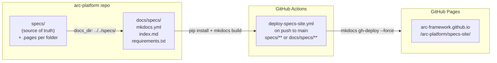

# Feature: Specs Documentation Site

> **Spec**: 008-specs-site
> **Author**: arc-framework
> **Date**: 2026-03-01
> **Status**: Draft

## Target Modules

| Module | Path | Impact |
|--------|------|--------|
| Docs | `docs/specs/` | New — MkDocs Material config, landing page, `requirements.txt` |
| CI/CD | `.github/workflows/` | New — `deploy-specs-site.yml` for GitHub Pages deployment |
| Specs | `specs/` | Additive-only — `.pages` files per folder for nav titles; no existing files modified |
| Root | `.gitignore` | Update — add `site_build/` |
| Root | `CLAUDE.md` | Update — add local preview command |

No CLI, SDK, or service changes in this spec.

## Overview

Publish the `specs/` folder as a searchable, mermaid-rendered static site using MkDocs Material,
deployed to GitHub Pages via CI. The site reads spec, plan, and task markdown directly from
`specs/` via `docs_dir` — zero content duplication. Navigation is driven by
`mkdocs-awesome-pages-plugin` with per-folder `.pages` files; adding a new spec folder only
requires dropping in a `.pages` file.

## Architecture



### Directory Layout

```
docs/
└── specs/                       # MkDocs site config (new)
    ├── mkdocs.yml               # docs_dir: ../../specs/; awesome-pages plugin
    ├── index.md                 # Landing page — project overview + spec index
    └── requirements.txt         # Pinned: mkdocs-material>=9.5, awesome-pages plugin

specs/                           # Content source (minimal additions only)
├── .pages                       # Root nav order (index.md first)
├── 001-otel-setup/
│   └── .pages                   # Section title: "001 — OTEL Setup"; file title map
├── 002-cortex-setup/
│   └── .pages
├── 003-messaging-setup/
│   └── .pages
├── 004-dev-setup/
│   └── .pages
├── 005-data-layer/
│   └── .pages
├── 006-platform-control/
│   └── .pages
└── 007-voice-stack/
    └── .pages

site_build/                      # Build output (gitignored)
```

### Navigation Strategy — `mkdocs-awesome-pages-plugin`

Each spec folder gets a `.pages` file that defines section title and file order:

```yaml
# specs/003-messaging-setup/.pages
title: "003 — Messaging Setup"
nav:
  - spec.md: Specification
  - plan.md: Implementation Plan
  - tasks.md: Task Breakdown
  - analysis-report.md: Analysis Report
```

Root `.pages` controls top-level ordering:

```yaml
# specs/.pages
nav:
  - index.md
  - 001-otel-setup
  - 002-cortex-setup
  - 003-messaging-setup
  - 004-dev-setup
  - 005-data-layer
  - 006-platform-control
  - 007-voice-stack
```

**Why `awesome-pages` over alternatives:**

| Option | Verdict |
|--------|---------|
| Hardcode `nav:` in `mkdocs.yml` | Brittle — breaks every time a spec is added |
| Script-generated `nav:` in CI | Fragile — YAML generation is error-prone |
| `mkdocs-awesome-pages-plugin` | Standard pattern; `.pages` files are declarative and additive |
| Restructure `docs/` to avoid `docs_dir` | Adds duplication; contradicts zero-copy goal |

### `.work-docs/` Exclusion

`.work-docs/` directories are excluded from source control via `.gitignore`:

```
specs/**/.work-docs/
```

MkDocs only builds files on disk from `docs_dir`. Since `.work-docs/` is never committed, no
build-time filter is needed. The `.pages` nav files also omit `.work-docs/` entries as a second
exclusion layer.

`pr-description.md` and `analysis-report.md` are **intentionally included** — they are useful
contributor references.

## User Scenarios & Testing

### P1 — Must Have

**US-1**: As a contributor, I want to browse all feature specs in a searchable website so that I
can find architecture decisions without digging through raw markdown on GitHub.

* **Given**: The site is deployed at `arc-framework.github.io/arc-platform/specs-site/`
* **When**: I visit the URL and search for "NATS"
* **Then**: Search results show entries from `003-messaging-setup/spec.md` with highlighted matches
* **Test**: Navigate to deployed site; search "NATS"; verify results include 003 spec link

**US-2**: As a contributor, I want mermaid architecture diagrams to render visually so that I can
understand service topology at a glance.

* **Given**: A spec contains a ` ```mermaid ` fenced block
* **When**: The page loads in a browser
* **Then**: The diagram renders as an SVG — not raw text
* **Test**: Open `001-otel-setup/spec.md` on the site; verify the OTEL architecture graph renders

**US-3**: As a contributor, I want the site to auto-deploy when specs are merged to main so that
the site is always current without manual steps.

* **Given**: A PR touching `specs/**` or `docs/specs/**` is merged to main
* **When**: The GitHub Action triggers
* **Then**: Site rebuilds and the change is live within 2 minutes
* **Test**: Merge a one-line spec change; watch CI; verify updated content on site

**US-4**: As a contributor, I want to preview the site locally so that I can verify mermaid and
nav before pushing.

* **Given**: Python 3.10+ is installed; `pip install -r docs/specs/requirements.txt` has been run
* **When**: `mkdocs serve -f docs/specs/mkdocs.yml` is executed from repo root
* **Then**: Dev server starts at `localhost:8000` with live reload; mermaid diagrams render
* **Test**: Run command; open browser; verify diagrams and nav structure

### P2 — Should Have

**US-5**: As a contributor, I want dark mode so that I can read specs comfortably in any
environment.

* **Given**: The site is loaded in a browser
* **When**: I click the theme toggle in the header
* **Then**: Theme switches between light and dark; preference persists on reload
* **Test**: Toggle; reload; verify preference preserved (`localStorage` key `__palette`)

**US-6**: As a contributor, I want an "Edit on GitHub" link on every page so that I can jump
directly to the source file to propose changes.

* **Given**: Any spec page is open
* **When**: I click "Edit this page"
* **Then**: GitHub opens the source `.md` file in `specs/` in the editor
* **Test**: Click edit link on `002-cortex-setup/spec.md` page; verify URL points to correct file

## Requirements

### Functional

* \[ ] FR-1: Create `docs/specs/mkdocs.yml` — `docs_dir: ../../specs/`, Material theme,
  `awesome-pages` plugin, mermaid via `pymdownx.superfences`, `search` plugin, `edit_uri` pointing
  to `specs/` on GitHub
* \[ ] FR-2: Create `docs/specs/index.md` — landing page with project overview, spec index table
  (feature number, name, status, link), and local dev instructions
* \[ ] FR-3: Create `docs/specs/requirements.txt` — pinned `mkdocs-material>=9.5`,
  `mkdocs-awesome-pages-plugin>=2.9`, `pymdown-extensions>=10.0`; document Python 3.10+ requirement
* \[ ] FR-4: Add `.pages` files to each existing spec folder (`001`–`007`) with section title and
  file-to-title mapping; add root `specs/.pages` controlling top-level nav order
* \[ ] FR-5: Enable mermaid rendering via `pymdownx.superfences` custom fence — mermaid.js loaded
  from CDN via `extra_javascript`
* \[ ] FR-6: Enable instant search with built-in `search` plugin; `lang: en`
* \[ ] FR-7: Enable dark/light mode toggle via Material `palette` — two schemes (`default` →
  `slate`)
* \[ ] FR-8: Configure `edit_uri` to
  `https://github.com/arc-framework/arc-platform/edit/main/specs/` so edit links point at source
  files in `specs/`
* \[ ] FR-9: Create `.github/workflows/deploy-specs-site.yml` — triggers on push to `main` when
  `specs/**` or `docs/specs/**` change; uses `actions/setup-python@v5` with Python 3.12; installs
  `docs/specs/requirements.txt`; runs `mkdocs gh-deploy --force --config-file docs/specs/mkdocs.yml`
* \[ ] FR-10: Set `site_url: https://arc-framework.github.io/arc-platform/specs-site/` and
  `repo_url: https://github.com/arc-framework/arc-platform` in `mkdocs.yml` —
  **prerequisite**: GitHub Pages must be enabled with source = "Deploy from a branch" → `gh-pages`
* \[ ] FR-11: Update `.gitignore` — add `site_build/`
* \[ ] FR-12: Update `CLAUDE.md` Commands section — add
  `mkdocs serve -f docs/specs/mkdocs.yml  # preview specs site locally`

### Non-Functional

* \[ ] NFR-1: `mkdocs build` must complete in under 30 seconds for the current 7 specs
* \[ ] NFR-2: CI workflow (install + build + deploy) must complete in under 2 minutes
* \[ ] NFR-3: All existing mermaid diagrams in `specs/` must render without modifying any source
  `.md` file
* \[ ] NFR-4: Site must be readable on mobile (320px viewport minimum); mermaid diagrams scrollable
  on narrow screens — Material theme handles this by default
* \[ ] NFR-5: No secrets or tokens required — CI uses automatic `GITHUB_TOKEN` with
  `contents: write` permission

### Key Entities

| Entity | Module | Description |
|--------|--------|-------------|
| `mkdocs.yml` | `docs/specs/` | MkDocs Material config — theme, plugins, mermaid, nav strategy |
| `index.md` | `docs/specs/` | Site landing page — project overview and spec directory table |
| `requirements.txt` | `docs/specs/` | Pinned Python deps |
| `.pages` (per folder) | `specs/NNN-*/` | Section title + file-to-nav-title mapping |
| `specs/.pages` | `specs/` | Root nav order |
| `deploy-specs-site.yml` | `.github/workflows/` | CI — build and deploy to GitHub Pages on main push |

## MkDocs Configuration Reference

Full `docs/specs/mkdocs.yml`:

```yaml
site_name: "A.R.C. Platform — Specs"
site_url: "https://arc-framework.github.io/arc-platform/specs-site/"
repo_url: "https://github.com/arc-framework/arc-platform"
repo_name: "arc-framework/arc-platform"
edit_uri: "edit/main/specs/"

docs_dir: "../../specs/"
site_dir: "../../site_build/"

theme:
  name: material
  palette:
    - scheme: default
      primary: indigo
      accent: indigo
      toggle:
        icon: material/brightness-7
        name: Switch to dark mode
    - scheme: slate
      primary: indigo
      accent: indigo
      toggle:
        icon: material/brightness-4
        name: Switch to light mode
  features:
    - navigation.instant
    - navigation.sections
    - search.highlight
    - search.suggest
    - content.action.edit

markdown_extensions:
  - pymdownx.superfences:
      custom_fences:
        - name: mermaid
          class: mermaid
          format: !!python/name:pymdownx.superfences.fence_code_format
  - pymdownx.highlight:
      anchor_linenums: true
  - pymdownx.tabbed:
      alternate_style: true
  - tables
  - admonition
  - toc:
      permalink: true

plugins:
  - search:
      lang: en
  - awesome-pages

extra_javascript:
  - https://unpkg.com/mermaid@10/dist/mermaid.min.js
```

## CI Workflow Reference

`.github/workflows/deploy-specs-site.yml`:

```yaml
name: Deploy Specs Site
on:
  push:
    branches: [main]
    paths:
      - "specs/**"
      - "docs/specs/**"

jobs:
  deploy:
    runs-on: ubuntu-latest
    permissions:
      contents: write
    steps:
      - uses: actions/checkout@v4
      - uses: actions/setup-python@v5
        with:
          python-version: "3.12"
      - run: pip install -r docs/specs/requirements.txt
      - run: mkdocs gh-deploy --force --config-file docs/specs/mkdocs.yml
```

> **Prerequisite**: GitHub Pages must be enabled before first deploy:
> Repo Settings → Pages → Source = **"Deploy from a branch"** → branch = `gh-pages`.
> `mkdocs gh-deploy` pushes the built site to the `gh-pages` branch automatically.

## Edge Cases

| Scenario | Expected Behavior |
|----------|-------------------|
| Spec folder has no `.pages` file | `awesome-pages` falls back to alphabetical; section title is raw folder name — not ideal but not a build failure |
| New spec added without `.pages` file | Site builds; spec appears with raw folder name; add `.pages` in same PR as spec |
| Mermaid diagram has syntax error | Mermaid.js renders an inline error; page still loads; other diagrams unaffected |
| `docs_dir: ../../specs/` path wrong | `mkdocs build` fails immediately with clear error; CI fails; no partial deploy |
| `.work-docs/` accidentally committed | Would appear in site nav; prevented by `.gitignore`; remove and re-push if it happens |
| Cross-spec internal links | MkDocs rewrites relative links; verify with `mkdocs build --strict` |
| Concurrent CI runs | `mkdocs gh-deploy --force` is atomic; last deploy wins; no corruption |
| `site_build/` accidentally committed | Prevented by `.gitignore` entry added in FR-11 |
| GitHub Pages not enabled | CI runs but deploy fails with 404; prerequisite in FR-10 must be verified first |

## Success Criteria

* \[ ] SC-1: `mkdocs build -f docs/specs/mkdocs.yml` exits 0 from repo root; produces `site_build/`
* \[ ] SC-2: All 7 existing specs appear in site navigation with human-readable titles (e.g., "001 — OTEL Setup", not "001-otel-setup")
* \[ ] SC-3: Mermaid diagrams in `001-otel-setup/spec.md` and `003-messaging-setup/spec.md` render as SVGs (verified in browser)
* \[ ] SC-4: Searching "NATS" returns results from `003-messaging-setup/spec.md` as top result
* \[ ] SC-5: Dark mode toggle works; preference persists on page reload
* \[ ] SC-6: "Edit this page" link opens the correct source file on GitHub
* \[ ] SC-7: Push to `specs/` on main → CI completes and site is updated within 2 minutes
* \[ ] SC-8: `mkdocs serve` starts without errors; mermaid renders in browser
* \[ ] SC-9: `mkdocs build --strict` exits 0 (no broken links, no warnings-as-errors)

## Docs & Links Update

* \[ ] Update `CLAUDE.md` Commands section — add: `mkdocs serve -f docs/specs/mkdocs.yml`
* \[ ] Add `site_build/` to `.gitignore`
* \[ ] Verify GitHub Pages is enabled in repo settings before first CI deploy
* \[ ] Add note to SpecKit workflow doc: "When creating a new spec folder, add a `.pages` file with the section title"

## Constitution Compliance

| Principle | Applies | Compliant | Notes |
|-----------|---------|-----------|-------|
| I. Zero-Dep CLI | \[ ] | n/a | No CLI changes |
| II. Platform-in-a-Box | \[ ] | n/a | Documentation only |
| III. Modular Services | \[ ] | n/a | No service changes |
| IV. Two-Brain | \[ ] | n/a | Config and markdown only — no custom code |
| V. Polyglot Standards | \[x] | \[x] | Python tooling (MkDocs) consistent with SDK/services; commenting conventions followed |
| VI. Local-First | \[x] | \[x] | `mkdocs serve` works fully offline after `pip install`; no external services for local preview |
| VII. Observability | \[ ] | n/a | Documentation only |
| VIII. Security | \[x] | \[x] | No secrets; CI uses automatic `GITHUB_TOKEN`; no sensitive data in built site |
| IX. Declarative | \[ ] | n/a | No CLI changes |
| X. Stateful Ops | \[ ] | n/a | No CLI changes |
| XI. Resilience | \[ ] | n/a | Static site — inherently resilient; GitHub Pages 99.9% SLA |
| XII. Interactive | \[ ] | n/a | No CLI changes |
