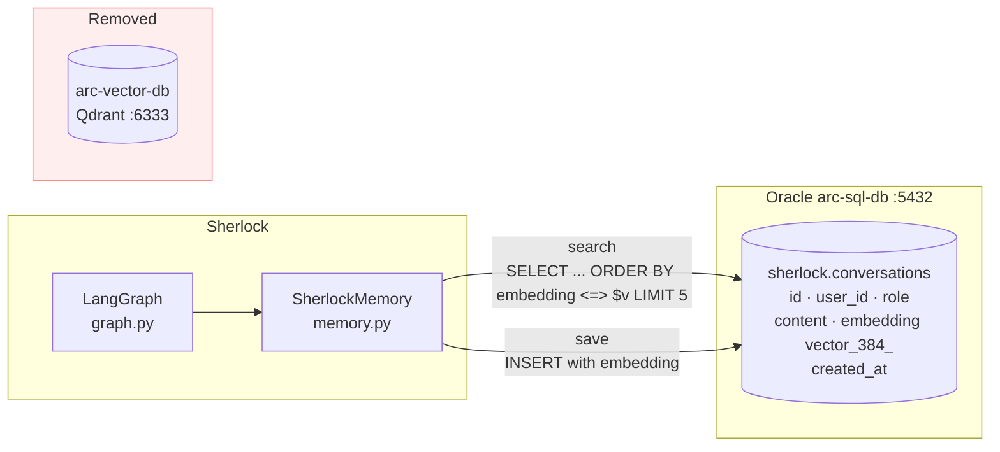
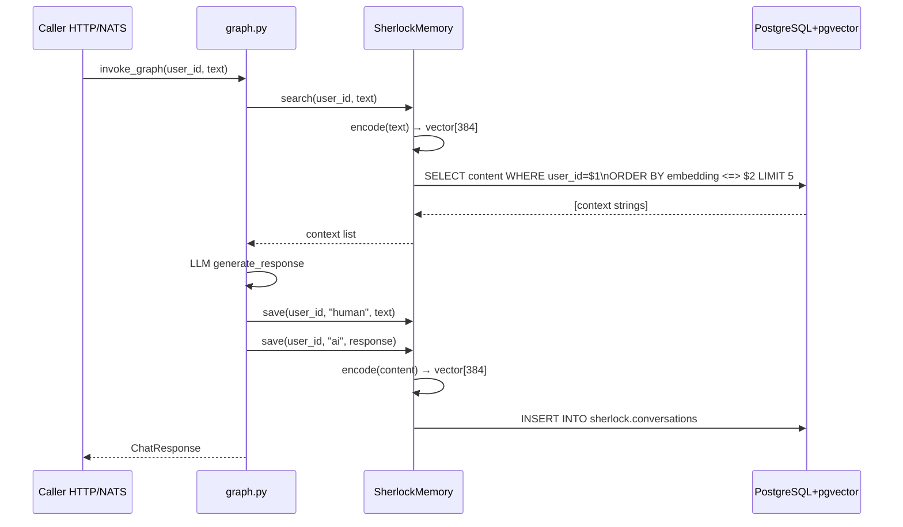
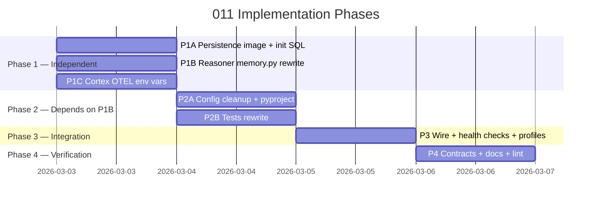

# Implementation Plan: pgvector Migration + Observability Hardening

> **Spec**: 011-vector-setup
> **Date**: 2026-03-02

## Summary

Replace Qdrant (Cerebro) with pgvector by upgrading Oracle's base image to `pgvector/pgvector:17-alpine`, rewriting `SherlockMemory` to store and query 384-dim embeddings via SQL cosine distance, and wiring full SigNoz OTEL configuration into both Sherlock and Cortex docker-compose files. The connection string is unchanged — pgvector is a PostgreSQL extension, not a new service.

## Target Modules

| Module | Language | Changes |
|--------|----------|---------|
| `services/persistence/` | SQL / Dockerfile | Image upgrade + `CREATE EXTENSION vector` init |
| `services/reasoner/` | Python | `memory.py` rewrite, config cleanup, health check, OTEL vars, tests |
| `services/cortex/` | Go / Compose | OTEL env vars only — no Go source changes |
| `services/profiles.yaml` | YAML | Remove `vector-db` from `think` profile |

## Technical Context

| Aspect | Value |
|--------|-------|
| Language(s) | Python 3.13 (reasoner), SQL (persistence) |
| Framework(s) | FastAPI, LangGraph, SQLAlchemy 2.0 async |
| Storage | PostgreSQL 17 + pgvector (HNSW index, cosine distance) |
| New dependency | `pgvector>=0.3.0` |
| Removed dependency | `qdrant-client>=1.9` |
| Embeddings | `sentence-transformers/all-MiniLM-L6-v2` — 384 dims, unchanged |
| Testing | pytest, SQLAlchemy async session mocks |
| OTEL | OTLP gRPC → `arc-friday-collector:4317` |

## Architecture





## Constitution Check

| # | Principle | Status | Evidence |
|---|-----------|--------|----------|
| I | Zero-Dep CLI | N/A | No CLI changes |
| II | Platform-in-a-Box | PASS | Removing Cerebro simplifies `think` profile; single `docker compose up` still works |
| III | Modular Services | PASS | persistence and reasoner each self-contained; profiles.yaml updated |
| IV | Two-Brain | PASS | All changes are Python (intelligence) + SQL (infra config) — no Go logic added to Python |
| V | Polyglot Standards | PASS | Python: ruff+mypy, pytest, structured logging; OTEL env vars follow 12-Factor |
| VI | Local-First | N/A | No CLI changes |
| VII | Observability | PASS | Full OTEL vars wired; SigNoz sees all 3 signals for Sherlock; Cortex gets env vars |
| VIII | Security | PASS | Non-root containers unchanged; no secrets in config; pgvector adds no new attack surface |
| IX | Declarative | N/A | No CLI changes |
| X | Stateful Ops | N/A | No CLI changes |
| XI | Resilience | PASS | Single-store eliminates dual-write failure mode; health check covers pgvector connectivity |
| XII | Interactive | N/A | No CLI changes |

## Project Structure

```
services/
├── persistence/
│   ├── Dockerfile                          # MODIFY — pgvector/pgvector:17-alpine
│   ├── service.yaml                        # MODIFY — upstream field
│   └── initdb/
│       └── 003_enable_pgvector.sql         # NEW — CREATE EXTENSION IF NOT EXISTS vector
│
├── reasoner/
│   ├── src/sherlock/
│   │   ├── memory.py                       # REWRITE — pgvector replaces Qdrant
│   │   ├── config.py                       # MODIFY — remove qdrant_* settings
│   │   └── main.py                         # MODIFY — remove qdrant health key
│   ├── tests/
│   │   └── test_memory.py                  # REWRITE — SQLAlchemy mocks replace Qdrant
│   ├── contracts/
│   │   └── openapi.yaml                    # MODIFY — /health/deep removes qdrant
│   ├── docker-compose.yml                  # MODIFY — OTEL vars + healthcheck + remove QDRANT_*
│   ├── service.yaml                        # MODIFY — depends_on, description, healthcheck
│   └── pyproject.toml                      # MODIFY — swap qdrant-client for pgvector
│
├── cortex/
│   └── docker-compose.yml                  # MODIFY — add full OTEL env vars
│
└── profiles.yaml                           # MODIFY — remove vector-db from think
```

## Key Implementation Decisions

### asyncpg + pgvector type registration

asyncpg requires the vector codec registered per connection. Use SQLAlchemy's `connect` event:

```python
from pgvector.asyncpg import register_vector
from sqlalchemy import event

# Inside SherlockMemory.__init__, after engine creation:
@event.listens_for(self._engine.sync_engine, "connect")
def _on_connect(dbapi_conn, _):
    dbapi_conn.run_async(register_vector)
```

This is the only non-obvious wiring required. Without it asyncpg raises `UnsupportedTypeError` on vector columns.

### HNSW vs IVFFlat

Using HNSW (`USING hnsw (embedding vector_cosine_ops)`):

* No training phase required — works with 0 rows, unlike IVFFlat
* Approximate nearest neighbour in O(log n)
* \~95% recall at our scale (thousands of vectors per user)

### Memory Protocol (patterns.md §Repository)

Extract `MemoryBackend` Protocol per patterns.md requirement:

```python
class MemoryBackend(Protocol):
    async def search(self, user_id: str, query: str) -> list[str]: ...
    async def save(self, user_id: str, role: str, content: str) -> None: ...
    async def health_check(self) -> dict[str, bool]: ...
```

`SherlockMemory` implements this protocol. Type-safe; future backends (Redis, Weaviate) drop in without touching the graph.

### OTEL env vars — Cortex

Cortex Go service uses the standard OTEL Go SDK which auto-reads all `OTEL_*` env vars. Adding them to `docker-compose.yml` is sufficient — no Go source change:

```yaml
environment:
  OTEL_SERVICE_NAME: "arc-cortex"
  OTEL_SERVICE_VERSION: "0.1.0"
  OTEL_DEPLOYMENT_ENVIRONMENT: "development"
  OTEL_RESOURCE_ATTRIBUTES: "service.namespace=arc-platform,service.instance.id=arc-cortex-1"
  OTEL_EXPORTER_OTLP_ENDPOINT: "http://arc-friday-collector:4317"
  OTEL_EXPORTER_OTLP_PROTOCOL: "grpc"
  OTEL_TRACES_SAMPLER: "always_on"
  OTEL_PROPAGATORS: "tracecontext,baggage"
  OTEL_LOG_LEVEL: "warn"
```

> **Note**: Use `127.0.0.1:4317` for local binary runs (not `localhost` — IPv6 resolution issue on macOS with Docker Desktop). Docker Compose uses service DNS so `arc-friday-collector:4317` is correct inside containers.

## Parallel Execution Strategy



**Phase 1 tasks are fully parallel** — persistence, reasoner memory, and cortex OTEL are independent.
**Phase 2** requires Phase 1B complete (memory.py drives config + test shape).
**Phase 3** requires P2A done (all code changes in to verify health checks).

## Reviewer Checklist

* \[ ] `make reasoner-test` — all 40 tests pass, no Qdrant imports remain
* \[ ] `make reasoner-lint` — ruff + mypy clean
* \[ ] `docker build -f services/persistence/Dockerfile services/persistence/` — builds cleanly
* \[ ] `curl localhost:8083/health/deep` — response has no `qdrant` key
* \[ ] `make dev` starts without `arc-vector-db` container
* \[ ] `make dev-health` — all services healthy
* \[ ] SigNoz UI at `:3301` — Sherlock and Cortex appear with service name, version, environment
* \[ ] `pgvector` in `pyproject.toml`, `qdrant-client` absent
* \[ ] `vector-db` absent from `think` profile in `profiles.yaml`
* \[ ] All `SHERLOCK_QDRANT_*` env vars removed from `docker-compose.yml`
* \[ ] `MemoryBackend` Protocol defined; `SherlockMemory` implements it
* \[ ] `contracts/openapi.yaml` `/health/deep` schema has no `qdrant` property
* \[ ] Constitution compliance — all 4 applicable principles PASS

## Risks & Mitigations

| Risk | Impact | Mitigation |
|------|--------|------------|
| asyncpg vector type not registered | H | `register_vector` event hook in `__init__` — tested in `test_memory.py` |
| HNSW index creation fails on empty table | L | `CREATE INDEX IF NOT EXISTS` is idempotent; HNSW works on 0 rows |
| Existing Qdrant data not migrated | M | No migration needed — dev env only; fresh `make dev` starts clean |
| `pgvector/pgvector:17-alpine` image not in GHCR cache | M | Build step pulls from Docker Hub on first run; CI can pre-pull |
| Sentence-transformer model download on cold start | L | `start_period: 60s` in healthcheck gives model time to load |
