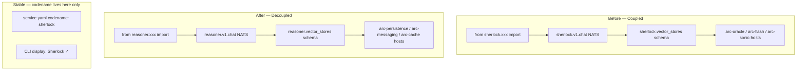

# Feature: decouple-service-codenames

> **Spec**: 014-decouple-service-codenames
> **Date**: 2026-03-05
> **Status**: Draft

## Target Modules

| Module | Path | Impact |
|--------|------|--------|
| Services — reasoner | `services/reasoner/` | High — Python package rename + NATS subjects + Pulsar topics + DB schema + stale vector-db refs |
| Services — cortex | `services/cortex/` | Medium — Go config hostname defaults |
| Services — persistence | `services/persistence/` | Medium — container rename `arc-sql-db` → `arc-persistence` |
| Services — vector | `services/vector/` | High — remove dead Qdrant service entirely (replaced by pgvector) |
| Services — flags | `services/flags/` | Low — DATABASE\_URL hostname update |
| Services — otel | `services/otel/` | Low — OTEL collector endpoint hostname update |
| Services — data.mk | `services/data.mk` | Low — remove vector-db targets, update sql-db refs |
| Contracts | `services/reasoner/contracts/asyncapi.yaml` | Medium — subject definitions updated |
| SDK | `sdk/python/` | Low — verify no import of `sherlock` package |
| Docs | `docs/` | Low — verify no hardcoded codenames in code samples |

## Overview

Codenames (Sherlock, Flash, Sonic, Oracle, etc.) are a team fun-factor — they must never be coupled into source code, wire protocols, or config defaults. Currently they leak into four coupling tiers: Python module paths, NATS/Pulsar wire subjects, Postgres schema names, and Go config hostname defaults. This spec defines a clean boundary: codenames stay in `service.yaml` metadata and CLI display; everywhere else uses the functional service role name.

This spec also removes the dead Qdrant service (`services/vector/` — codename Cerebro) which was replaced by pgvector inside the existing Postgres service. The reasoner already uses pgvector exclusively; Qdrant has zero code consumers. Removing it eliminates dead infrastructure and confusion. Simultaneously, the Postgres container is renamed from the artifact name `arc-sql-db` to the functional name `arc-persistence` for consistency.

## Architecture

## User Scenarios & Testing

### P1 — Must Have

**US-1**: As a platform developer, I want all internal Python imports to use `reasoner` as the package name so that the codebase has no coupling to the codename.

* **Given**: The reasoner service is running
* **When**: I inspect any `import` or `from ... import` in `services/reasoner/src/`
* **Then**: No statement references `sherlock` as a module path
* **Test**: `grep -r "from sherlock" services/reasoner/src/` returns zero results

**US-2**: As an agent or SDK consumer, I want NATS subjects to use the functional role name so that my subscription does not break when codenames change.

* **Given**: A NATS-connected client subscribing to `reasoner.v1.chat`
* **When**: I publish a `ChatCompletionRequest` to `reasoner.v1.chat`
* **Then**: Reasoner processes the request and responds to the reply inbox
* **Test**: Integration test publishes to `reasoner.v1.chat`, asserts response within 5s

**US-3**: As a platform operator, I want Cortex to use functional hostnames in its defaults so that config works without overrides after docker-compose container renames.

* **Given**: Default Cortex config (no env overrides)
* **When**: Cortex performs health probes for Postgres, NATS, and Redis
* **Then**: Probes use `arc-persistence`, `arc-messaging`, `arc-cache` as hostnames
* **Test**: `arc run --profile think` passes all health checks with zero env overrides

**US-4**: As a platform developer, I want the Postgres schema to use `reasoner` instead of `sherlock` so that DB introspection matches the service role.

* **Given**: Fresh DB migration
* **When**: I inspect `\dn` in PostgreSQL
* **Then**: Schema is named `reasoner`, not `sherlock`
* **Test**: Migration test creates schema, verifies `reasoner.vector_stores` exists

### P2 — Should Have

**US-5**: As a consumer of the existing `sherlock.*` NATS subjects, I want a migration window so that I can update my subscribers without downtime.

* **Given**: Old client subscribing to `sherlock.v1.chat`
* **When**: Reasoner has both old and new subjects active (migration release)
* **Then**: Old subjects still work, response includes deprecation header or log warning
* **Test**: Publish to `sherlock.v1.chat` → receives valid response + deprecation log emitted

**US-6**: As a platform developer, I want OTEL metric and tracer names to use `arc-reasoner` so that dashboards reflect the service role.

* **Given**: Reasoner emitting OTEL metrics
* **When**: I query SigNoz for service `arc-reasoner`
* **Then**: All metrics and traces appear under `arc-reasoner`
* **Test**: Check `service_name` label in metric output

### P3 — Nice to Have

**US-7**: As a developer reading the codebase, I want `pyproject.toml` package metadata to reflect `arc-reasoner` so that package introspection is consistent.

* **Given**: Reasoner package installed in dev container
* **When**: `pip show arc-reasoner`
* **Then**: Package name is `arc-reasoner`, not `arc-sherlock`
* **Test**: `pip show` output check in CI

## Requirements

### Functional

* \[ ] FR-1: Rename Python package directory `services/reasoner/src/sherlock/` → `services/reasoner/src/reasoner/`
* \[ ] FR-2: Update all internal imports from `from sherlock.xxx` → `from reasoner.xxx` (all files in the package)
* \[ ] FR-3: Update `services/reasoner/src/sherlock/config.py` NATS subjects: `sherlock.*` → `reasoner.*`
* \[ ] FR-4: Update `services/reasoner/src/sherlock/config.py` Pulsar topics: `sherlock-*` → `reasoner-*`
* \[ ] FR-5: Update `services/reasoner/contracts/asyncapi.yaml` channel and operation names to use `reasoner.*`
* \[ ] FR-6: Write SQL migration: rename Postgres schema `sherlock` → `reasoner` (affecting `vector_stores` table)
* \[ ] FR-7: Update Cortex Go config defaults: `arc-oracle` → `arc-persistence`, `nats://arc-flash:4222` → `nats://arc-messaging:4222`, `arc-sonic` → `arc-cache`
* \[ ] FR-8: Update Cortex probe names in Go clients to match new hostnames
* \[ ] FR-9: Update OTEL service name and meter name from `arc-sherlock` → `arc-reasoner`
* \[ ] FR-10: Update `pyproject.toml` package name from `arc-sherlock` → `arc-reasoner`
* \[ ] FR-12: Update `Dockerfile` entrypoints/CMD that reference the `sherlock` module name
* \[ ] FR-13: Rename container `arc-sql-db` → `arc-persistence` in all docker-compose files, service.yaml, config files, and make targets that reference it by DNS hostname
* \[ ] FR-14: Remove `services/vector/` (Qdrant/Cerebro) entirely — directory, docker-compose, service.yaml, make targets, and all references from other services — confirmed zero code consumers

### Non-Functional

* \[ ] NFR-1: All existing tests pass after rename (ruff, mypy, pytest, golangci-lint)
* \[ ] NFR-2: No codename string shall appear in any `import`, subject definition, schema name, hostname default, or metric label after this change
* \[ ] NFR-3: DB migration is idempotent — safe to re-run on already-migrated schema
* \[ ] NFR-4: `arc run --profile think` health checks pass without any env variable overrides
* \[ ] NFR-5: No running container, volume, DNS hostname, or profile alias uses `arc-sql-db`, `sql-db`, or `arc-vector-db` after this change
* \[ ] NFR-6: Removing `services/vector/` does not break any profile — confirmed vector was not included in any profile

### Key Entities

| Entity | Module | Description |
|--------|--------|-------------|
| `reasoner` Python package | `services/reasoner/src/reasoner/` | Renamed package; all internal logic unchanged |
| NATS subjects `reasoner.*` | wire protocol | New functional subject namespace |
| `reasoner.vector_stores` schema | Postgres | Renamed from `sherlock.vector_stores` |
| Cortex hostname defaults | `services/cortex/internal/config/` | Updated to functional container DNS names |
| `arc-reasoner` OTEL identity | observability | Service name used in metrics/traces |
| `arc-persistence` container | `services/persistence/` | Renamed from `arc-sql-db`; all consumer configs updated |
| ~~`services/vector/`~~ | removed | Dead Qdrant service deleted; pgvector in Postgres is the vector backend |

## Edge Cases

| Scenario | Expected Behavior |
|----------|-------------------|
| DB migration run on schema that is already `reasoner` | Migration detects existing schema, exits cleanly (idempotent) |
| Cortex starts with `POSTGRES_HOST=arc-oracle` env override | Old env override still works — env overrides config defaults |
| Partially renamed package (some imports old, some new) | CI ruff/mypy catches unresolved imports; blocks merge |
| `pyproject.toml` rename breaks pinned SDK dependency | SDK must bump package ref; noted as explicit dependency in plan |
| Pulsar disabled but topic names in config are old | Config rename is safe — disabled handler never publishes |
| `services/vector/` removal breaks a profile | Qdrant is confirmed absent from all profiles (`think`, `reason`, `ultra-instinct`) — verified in `profiles.yaml` |
| `arc-sql-db` rename breaks a service not in scope | `data.mk`, `flags`, `otel` are all in scope; `profiles.yaml` uses role alias `sql-db` which maps to the service — must verify alias is updated too |

## Success Criteria

* \[ ] SC-1: `grep -r "from sherlock" services/reasoner/src/` returns zero results
* \[ ] SC-2: `grep -r "sherlock\." services/reasoner/src/reasoner/config.py` returns zero results (NATS subjects / Pulsar topics)
* \[ ] SC-3: `\dn` in Postgres shows `reasoner` schema, not `sherlock`
* \[ ] SC-4: `arc run --profile think` health check passes with zero env overrides on a clean deploy
* \[ ] SC-5: Integration test: publish to `reasoner.v1.chat` → receives valid ChatCompletionResponse
* \[ ] SC-6: `grep "sql-db" services/profiles.yaml` returns zero results
* \[ ] SC-7: `ruff check services/reasoner/src/` passes with zero errors
* \[ ] SC-8: `mypy services/reasoner/src/` passes with zero errors
* \[ ] SC-9: `golangci-lint run services/cortex/` passes with zero errors
* \[ ] SC-10: SigNoz shows service name `arc-reasoner` in trace list (not `arc-sherlock`)
* \[ ] SC-11: `grep -r "arc-sql-db" services/` returns zero results (excluding git history)
* \[ ] SC-12: `services/vector/` directory does not exist
* \[ ] SC-13: `arc run --profile think` starts successfully with `arc-persistence` as the Postgres container

## Docs & Links Update

* \[ ] Update `CLAUDE.md` service codename table entry for reasoner: confirm `dir: reasoner` (already correct), no source path references
* \[ ] Update `docs/` any code samples or config snippets using `sherlock.*` subjects or `from sherlock` imports
* \[ ] Update `.specify/config.yaml` if any `test_command` or `lint_command` references old package path
* \[ ] Update `CODENAME-DECOUPLING.md` (root) status to "implemented" after merge
* \[ ] Verify `services/reasoner/contracts/asyncapi.yaml` links referenced in docs are still valid after subject rename
* \[ ] Update `CLAUDE.md` service codename table — remove Cerebro/Qdrant row, update persistence row to reflect `arc-persistence`
* \[ ] Update `NERVOUS-SYSTEM.md` (root) — remove stale Cerebro/Qdrant references
* \[ ] Update `services/data.mk` — remove `vector-db-*` targets, rename `sql-db-*` targets to `persistence-*`

## Constitution Compliance

| Principle | Applies | Compliant | Notes |
|-----------|---------|-----------|-------|
| I. Zero-Dep CLI | \[ ] | — | Not applicable — no CLI changes |
| II. Platform-in-a-Box | \[x] | \[x] | `arc run --profile think` must still work with zero config after hostname default fixes |
| III. Modular Services | \[x] | \[x] | Each service remains self-contained; rename is internal |
| IV. Two-Brain Separation | \[x] | \[x] | Python package rename stays in Python brain; Go config fixes stay in Go brain |
| V. Polyglot Standards | \[x] | \[x] | ruff + mypy (Python), golangci-lint (Go) must pass post-rename |
| VI. Local-First | \[ ] | — | Not applicable |
| VII. Observability | \[x] | \[x] | OTEL service name updated to `arc-reasoner`; no metric gaps introduced |
| VIII. Security | \[x] | \[x] | No secrets involved; non-root containers unchanged |
| IX. Declarative | \[ ] | — | Not applicable |
| X. Stateful Ops | \[ ] | — | Not applicable |
| XI. Resilience | \[x] | \[x] | Container rename and profile alias update are atomic across all consumers; no partial state possible |
| XII. Interactive | \[ ] | — | Not applicable |
