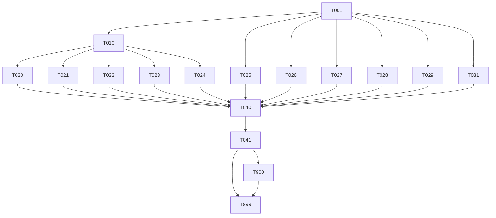

# Tasks: decouple-service-codenames

> **Spec**: 014-decouple-service-codenames
> **Date**: 2026-03-05

## Dependency Graph

## Quality Requirements

| Module              | Coverage                | Lint                            |
| ------------------- | ----------------------- | ------------------------------- |
| `services/reasoner` | 60% core / 40% infra    | `ruff check src/` + `mypy src/` |
| `services/cortex`   | 75% critical / 60% core | `golangci-lint run ./...`       |

***

## Phase 1: Setup

* \[x] \[TASK-001] \[REASONER+CORTEX] \[P1] Audit container DNS names — verify `service.yaml` files use functional names that match the new Cortex hostname defaults
  * Dependencies: none
  * Module: `services/reasoner/service.yaml`, `services/messaging/service.yaml`, `services/cache/service.yaml`, `services/persistence/service.yaml`
  * Acceptance: Confirm container hostnames are `arc-persistence`, `arc-messaging`, `arc-cache` (or document any divergence before changing defaults); grep `arc-oracle`, `arc-flash`, `arc-sonic` in all `service.yaml` files returns zero or known-safe results

***

## Phase 2: Foundational

* \[ ] \[TASK-010] \[REASONER] \[P1] Rename Python package directory `src/sherlock/` → `src/reasoner/` via `git mv`
  * Dependencies: TASK-001
  * Module: `services/reasoner/src/`
  * Acceptance: `ls services/reasoner/src/` shows `reasoner/` and no `sherlock/`; `git status` shows rename tracked; `src/reasoner/__init__.py` exists

***

## Phase 3: Implementation

### Parallel Batch A — Python internals (all depend on TASK-010, all independent of each other)

* \[x] \[TASK-020] \[P] \[REASONER] \[P1] US-1: Update all Python imports in renamed package — `from sherlock.xxx` → `from reasoner.xxx`
  * Dependencies: TASK-010
  * Module: `services/reasoner/src/reasoner/` (all `.py` files including `rag/` sub-package)
  * Acceptance: `grep -r "from sherlock" services/reasoner/src/` returns zero results; `grep -r "import sherlock" services/reasoner/src/` returns zero results

* \[x] \[TASK-021] \[P] \[REASONER] \[P1] US-2: Update `config.py` NATS subjects, Pulsar topics, queue group names, and MinIO bucket name
  * Dependencies: TASK-010
  * Module: `services/reasoner/src/reasoner/config.py`
  * Acceptance: All 9 string fields updated per plan table (service\*name, nats\_subject, nats\_queue\_group, pulsar request/result topics, pulsar subscription, nats\_v1\_chat\_subject, nats\_v1\_result\_subject, minio\_bucket); `grep -n "sherlock" services/reasoner/src/reasoner/config.py` returns zero results in field default values (env var aliases `SHERLOCK*\*` remain unchanged)

* \[x] \[TASK-022] \[P] \[REASONER] \[P1] US-6: Update OTEL meter name, metric names, and structlog logger names in `observability.py`
  * Dependencies: TASK-010
  * Module: `services/reasoner/src/reasoner/observability.py`
  * Acceptance: `get_meter("arc-reasoner")` used; all 9 metric names use `reasoner.` prefix; all `structlog.get_logger("sherlock.*")` calls updated to `reasoner.*`; `grep "arc-sherlock\|sherlock\." services/reasoner/src/reasoner/observability.py` returns zero results

* \[x] \[TASK-023] \[P] \[REASONER] \[P2] US-7: Update `pyproject.toml` — package name and mypy module override refs
  * Dependencies: TASK-010
  * Module: `services/reasoner/pyproject.toml`
  * Acceptance: `name = "arc-reasoner"`; all `[[tool.mypy.overrides]]` module refs updated from `sherlock.*` to `reasoner.*`; `grep "sherlock" services/reasoner/pyproject.toml` returns zero results

* \[x] \[TASK-024] \[P] \[REASONER] \[P1] Update `Dockerfile` CMD module path and build-time directory scaffold
  * Dependencies: TASK-010
  * Module: `services/reasoner/Dockerfile`
  * Acceptance: `CMD ["uvicorn", "reasoner.main:app", ...]`; `RUN mkdir -p src/reasoner && touch src/reasoner/__init__.py`; Linux OS user `sherlock` kept as-is (not a wire protocol or import — P3 scope); `grep "sherlock.main\|src/sherlock" services/reasoner/Dockerfile` returns zero results

### Parallel Batch B — Go Cortex (independent of Python rename — can start at T=0)

* \[x] \[TASK-025] \[P] \[CORTEX] \[P1] US-3: Update Cortex `config.go` hostname defaults to functional names
  * Dependencies: TASK-001
  * Module: `services/cortex/internal/config/config.go`
  * Acceptance: `arc-oracle` → `arc-persistence` (line 108); `nats://arc-flash:4222` → `nats://arc-messaging:4222` (line 116); `arc-sonic` → `arc-cache` (line 122); `grep "arc-oracle\|arc-flash\|arc-sonic" services/cortex/internal/config/config.go` returns zero results

* \[x] \[TASK-026] \[P] \[CORTEX] \[P1] Update Cortex probe name constants in client files + test assertions
  * Dependencies: TASK-001
  * Module: `services/cortex/internal/clients/{nats,postgres,redis}.go`, `services/cortex/internal/clients/*_test.go`
  * Acceptance: `natsProbeNameConst = "arc-messaging"`; `probeName = "arc-persistence"`; `redisProbeName = "arc-cache"`; test assertions in `nats_test.go:73,77` and `postgres_test.go:116` updated to match; `golangci-lint run ./...` passes

### Parallel Batch C — AsyncAPI contracts (independent)

* \[x] \[TASK-027] \[P] \[REASONER] \[P1] Update `asyncapi.yaml` channel IDs, operation IDs, addresses, and component refs to use `reasoner.*`
  * Dependencies: TASK-001
  * Module: `services/reasoner/contracts/asyncapi.yaml`
  * Acceptance: All channel IDs (`sherlockRequest` → `reasonerRequest`, etc.) renamed; all `address:` fields use `reasoner.*` subjects and `reasoner-*` Pulsar topics; server component tags renamed to `reasoner-core`, `reasoner-v1`; all `sherlock_workers` queue group refs updated; add `x-deprecated-addresses` block listing old subjects for the migration window; `grep -c "sherlock" services/reasoner/contracts/asyncapi.yaml` returns zero count

### Parallel Batch D — SQL migration (independent)

* \[x] \[TASK-028] \[P] \[REASONER] \[P1] US-4: Write idempotent SQL migration to rename Postgres schema `sherlock` → `reasoner`
  * Dependencies: TASK-001
  * Module: `migrations/002_rename_schema_sherlock_to_reasoner.sql` (create new file)
  * Acceptance: Migration uses `DO $$ BEGIN IF EXISTS` guard; handles three cases: sherlock exists (rename), reasoner exists (no-op + NOTICE), neither exists (create reasoner + NOTICE); re-running on already-migrated DB exits cleanly; migration file is valid PostgreSQL syntax

### Parallel Batch F — Container rename arc-sql-db → arc-persistence (independent)

* \[x] \[TASK-029] \[P] \[PERSISTENCE+MULTI] \[P1] FR-13: Rename container `arc-sql-db` → `arc-persistence` across all services and update profile role alias
  * Dependencies: TASK-001
  * Module: `services/persistence/service.yaml`, `services/persistence/docker-compose.yml`, `services/profiles.yaml` (role alias `sql-db` → `persistence` in all 3 profiles), `services/flags/docker-compose.yml`, `services/otel/telemetry/config/otel-collector-config.yaml`, `services/cortex/service.yaml`, `services/cortex/docker-compose.yml`, `services/reasoner/service.yaml`, `services/reasoner/docker-compose.yml`, `services/reasoner/src/sherlock/config.py` (postgres URL default), `services/data.mk`
  * Acceptance: `grep -r "arc-sql-db" services/` returns zero results; `grep "sql-db" services/profiles.yaml` returns zero results; persistence container starts as `arc-persistence`; volume renamed to `arc-persistence-data`; all profiles (`think`, `observe`, `reason`) reference `persistence` not `sql-db`; all DATABASE\_URL and connection strings use `arc-persistence` hostname; `data.mk` `sql-db-*` targets renamed to `persistence-*`

### Parallel Batch G — Remove dead Qdrant service (independent)

* \[x] \[TASK-031] \[P] \[VECTOR] \[P1] FR-14: Delete `services/vector/` (dead Qdrant/Cerebro service) and clean all references
  * Dependencies: TASK-001
  * Module: `services/vector/` (delete), `services/data.mk` (remove `vector-db-*` targets + log tail line), `services/reasoner/docker-compose.yml` (remove `arc-vector-db` network comment)
  * Acceptance: `services/vector/` directory does not exist (SC-12); `grep -r "arc-vector-db" services/` returns zero results; `grep -r "vector-db" services/data.mk` returns zero results; no profile references the deleted service (confirmed — vector was absent from all profiles)

***

## Phase 4: Integration

* \[x] \[TASK-040] \[REASONER+CORTEX] \[P1] Run full lint and type-check sweep on all changed modules
  * Dependencies: TASK-020, TASK-021, TASK-022, TASK-023, TASK-024, TASK-025, TASK-026, TASK-027, TASK-028, TASK-029, TASK-031
  * Module: `services/reasoner/src/`, `services/cortex/`
  * Acceptance: `ruff check services/reasoner/src/` → zero errors; `mypy services/reasoner/src/` → zero errors; `golangci-lint run ./...` in `services/cortex/` → zero errors; `go test ./...` in `services/cortex/` → all pass

* \[x] \[TASK-041] \[REASONER+CORTEX] \[P1] Validate all spec success criteria — grep checks + unit tests
  * Dependencies: TASK-040
  * Module: `services/reasoner/src/`, `services/cortex/`, `services/`
  * Acceptance (all SC gates):
    * SC-1: `grep -r "from sherlock" services/reasoner/src/` → zero
    * SC-2: `grep "sherlock\." services/reasoner/src/reasoner/config.py` → zero default values
    * SC-7: `ruff check` → zero errors
    * SC-8: `mypy` → zero errors
    * SC-9: `golangci-lint` → zero errors
    * SC-11: `grep -r "arc-sql-db" services/` → zero results
    * SC-12: `services/vector/` directory does not exist
    * `pytest services/reasoner/tests/` passes

***

## Phase 5: Polish

* \[x] \[TASK-900] \[P] \[DOCS] \[P1] Docs & links update — asyncapi refs, CLAUDE.md, CODENAME-DECOUPLING.md, NERVOUS-SYSTEM.md
  * Dependencies: TASK-041
  * Module: `docs/`, `CLAUDE.md`, `CODENAME-DECOUPLING.md` (root), `NERVOUS-SYSTEM.md` (root), `.specify/config.yaml`
  * Acceptance: Any `docs/` code samples using `sherlock.*` subjects or `from sherlock` imports updated; `CLAUDE.md` service table updated — remove Cerebro/Qdrant row, update persistence hostname to `arc-persistence`; `.specify/config.yaml` reasoner lint/test commands verified correct post-rename; `NERVOUS-SYSTEM.md` stale Cerebro/Qdrant references removed; `CODENAME-DECOUPLING.md` status updated to "implemented" after merge; no broken links in `contracts/asyncapi.yaml`

* \[ ] \[TASK-999] \[REVIEW] \[P1] Reviewer agent verification — full quality gate sweep
  * Dependencies: TASK-040, TASK-041, TASK-900
  * Module: all affected modules
  * Acceptance: All reviewer checklist items from `plan.md` verified; zero remaining `sherlock` in imports/subjects/metrics (SC-1, SC-2); SQL migration is idempotent; Dockerfile CMD is updated; pyproject.toml name is `arc-reasoner`; `arc run --profile think` health checks pass (SC-4, SC-13); `grep "sql-db" services/profiles.yaml` returns zero (SC-6); `services/vector/` does not exist (SC-12); constitution principles II, III, IV, V, VII, VIII, XI all verified compliant

***

## Progress Summary

| Phase                    | Total  | Done  | Parallel |
| ------------------------ | ------ | ----- | -------- |
| Setup                    | 1      | 1     | 0        |
| Foundational             | 1      | 0     | 0        |
| Implementation           | 11     | 0     | 9        |
| Container rename (F)     | 1      | 0     | 1        |
| Dead service removal (G) | 1      | 0     | 1        |
| Integration              | 2      | 0     | 0        |
| Polish                   | 2      | 0     | 1        |
| **Total**                | **19** | **0** | **12**   |
