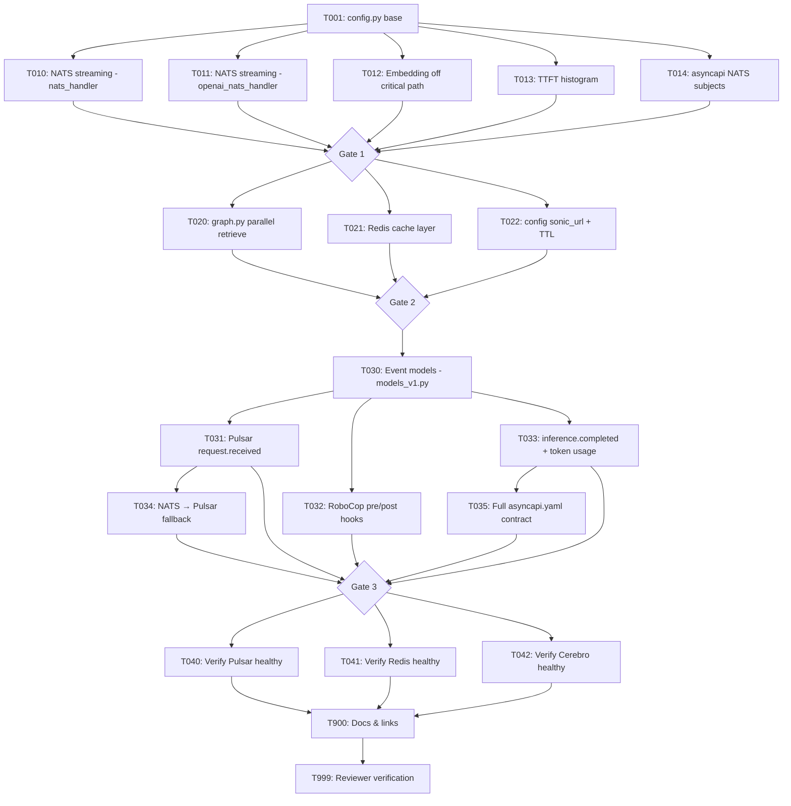

# Tasks: Nervous System

> **Spec**: 015-nervous-system
> **Date**: 2026-03-05
> **HLD**: `docs/ard/NERVOUS-SYSTEM-HLD.md`

## Dependency Graph



## Quality Requirements

| Module | Coverage | Lint | Notes |
|--------|----------|------|-------|
| Python (reasoner) | 80% on modified files | ruff + mypy (strict) | NFR-6, NFR-7 |

***

## Phase 1: Setup

* \[ ] \[TASK-001] \[REASONER] \[P1] Add NATS subject constants and feature flags to config.py
  * Dependencies: none
  * Module: `services/reasoner/src/reasoner/config.py`
  * Acceptance: All constants/env vars defined: `NATS_SUBJECT_REQUEST`, `NATS_SUBJECT_STREAM`, `NATS_SUBJECT_RESULT`, `NATS_SUBJECT_ERROR`, `NATS_SUBJECT_INGEST_REQUEST`, `NATS_SUBJECT_INGEST_PROGRESS`; feature flags `SHERLOCK_PULSAR_ENABLED` (default false) and `SHERLOCK_GUARD_ENABLED` (default false); `ruff + mypy` clean
  * Status: \[x] done

***

## Phase 2: Foundational — Phase 1 Fast Nerves

All TASK-01x tasks are parallel-safe (different files, no shared state).

### Parallel Batch A (Phase 1)

* \[ ] \[TASK-010] \[P] \[REASONER] \[P1] Wire stream\_graph() into nats\_handler.py — replace invoke\_graph
  * Dependencies: TASK-001
  * Module: `services/reasoner/src/reasoner/nats_handler.py`
  * Acceptance: `invoke_graph()` not called from handler; token chunks published to `arc.reasoner.stream.{request_id}`; completion signal to `arc.reasoner.result`; `test_nats_handler.py` streaming path tests pass
  * Status: \[x] done

* \[ ] \[TASK-011] \[P] \[REASONER] \[P1] Wire stream\_graph() into openai\_nats\_handler.py — replace invoke\_graph
  * Dependencies: TASK-001
  * Module: `services/reasoner/src/reasoner/openai_nats_handler.py`
  * Acceptance: Same as TASK-010 for OpenAI handler path; `test_openai_nats_handler.py` streaming path tests pass
  * Status: \[x] done

* \[ ] \[TASK-012] \[P] \[REASONER] \[P1] Wrap SentenceTransformer.encode() in run\_in\_executor (memory.py)
  * Dependencies: none
  * Module: `services/reasoner/src/reasoner/memory.py`
  * Acceptance: `encode()` runs in `ThreadPoolExecutor(max_workers=2)` via `loop.run_in_executor()`; event loop not blocked; concurrent requests test passes
  * Status: \[x] done

* \[ ] \[TASK-013] \[P] \[REASONER] \[P1] Add ttft\_seconds histogram to observability.py
  * Dependencies: none
  * Module: `services/reasoner/src/reasoner/observability.py`
  * Acceptance: `ttft_seconds` OTEL histogram registered; records time from request receive to first token emitted (not full response); `test_observability.py::test_ttft_histogram_registered` passes
  * Status: \[x] done

* \[ ] \[TASK-014] \[P] \[CONTRACTS] \[P1] Define NATS subjects in asyncapi.yaml (Phase 1 schema)
  * Dependencies: TASK-001
  * Module: `services/reasoner/contracts/asyncapi.yaml`
  * Acceptance: `arc.reasoner.request`, `arc.reasoner.stream.{request_id}`, `arc.reasoner.result`, `arc.reasoner.error`, `arc.ingest.request`, `arc.ingest.progress.{ingest_id}` defined with message schemas; valid YAML
  * Status: \[x] done

### Stabilization Gate 1

* \[ ] \[TASK-019] \[REASONER] \[P1] Gate 1: lint + test + commit (Phase 1)
  * Dependencies: TASK-010, TASK-011, TASK-012, TASK-013, TASK-014
  * Module: `services/reasoner/`
  * Acceptance:
    ```bash
    cd services/reasoner && ruff check src/ && mypy src/
    pytest tests/test_nats_handler.py tests/test_openai_nats_handler.py tests/test_observability.py -v
    pytest tests/test_observability.py::test_ttft_histogram_registered -v
    ```
    All pass. Commit: `feat(reasoner): Phase 1 — NATS token streaming + embedding off critical path`
  * Status: \[x] done

***

## Phase 3: Implementation — Phase 2 Muscle Memory

All TASK-02x tasks are parallel-safe (different files).

### Parallel Batch B (Phase 2)

* \[ ] \[TASK-020] \[P] \[REASONER] \[P1] Restructure graph.py for parallel retrieve + LLM start
  * Dependencies: TASK-019
  * Module: `services/reasoner/src/reasoner/graph.py`
  * Acceptance: `asyncio.gather()` runs embed + vector search concurrently with LLM warm-up; retrieved context injected via LangGraph state mid-stream; `test_graph.py` parallel retrieve test passes
  * Status: \[x] done

* \[ ] \[TASK-021] \[P] \[REASONER] \[P1] Add Redis cache layer to memory.py
  * Dependencies: TASK-019
  * Module: `services/reasoner/src/reasoner/memory.py`
  * Acceptance: Cache key `arc:ctx:{user_id}:{sha256(embedding)}` used; cache checked before Cerebro/pgvector; cache populated on miss; TTL configurable; Redis unavailable → fail-open with warning log; `test_memory.py::test_cache_hit_skips_vector_search` and `test_cache_invalidated_on_new_message` pass
  * Status: \[x] done

* \[ ] \[TASK-022] \[P] \[REASONER] \[P1] Add sonic\_url and context\_cache\_ttl to config.py
  * Dependencies: TASK-019
  * Module: `services/reasoner/src/reasoner/config.py`
  * Acceptance: `sonic_url` (Redis URL), `context_cache_ttl` (default 300s) settings present; configurable via env vars; `ruff + mypy` clean
  * Status: \[x] done

### Stabilization Gate 2

* \[ ] \[TASK-029] \[REASONER] \[P1] Gate 2: lint + test + commit (Phase 2)
  * Dependencies: TASK-020, TASK-021, TASK-022
  * Module: `services/reasoner/`
  * Acceptance:
    ```bash
    cd services/reasoner && ruff check src/ && mypy src/
    pytest tests/test_nats_handler.py tests/test_openai_nats_handler.py tests/test_memory.py tests/test_observability.py -v
    pytest tests/test_memory.py::test_cache_hit_skips_vector_search -v
    pytest tests/test_memory.py::test_cache_invalidated_on_new_message -v
    ```
    All pass. Commit: `feat(reasoner): Phase 2 — parallel retrieval + arc-db-cache (Sonic / Redis) context cache`
  * Status: \[x] done

***

## Phase 3: Implementation — Phase 3 Spinal Cord

TASK-030 (event models) must complete before T031/T032/T033 can start. T031 must complete before T034.

### Sequential: Event Models First

* \[ ] \[TASK-030] \[REASONER] \[P1] Define Pydantic event models in models\_v1.py
  * Dependencies: TASK-029
  * Module: `services/reasoner/src/reasoner/models_v1.py`
  * Acceptance: `RequestReceivedEvent`, `InferenceCompletedEvent`, `TokenUsage` Pydantic models defined; all fields match HLD JSON schemas; `mypy` clean; models importable from other handlers
  * Status: \[x] done

### Parallel Batch C (Phase 3 — unblocked by T030)

* \[ ] \[TASK-031] \[P] \[REASONER] \[P1] Publish arc.reasoner.request.received on every request arrival (pulsar\_handler.py)
  * Dependencies: TASK-030
  * Module: `services/reasoner/src/reasoner/pulsar_handler.py`
  * Acceptance: `arc.reasoner.request.received` published before any processing (including pre-check); fire-and-forget async; adds <5ms to request latency; `test_pulsar_handler.py::test_request_received_published_on_arrival` passes
  * Status: \[x] done

* \[ ] \[TASK-032] \[P] \[REASONER] \[P1] Add RoboCop pre-check and post-check hooks to nats\_handler.py
  * Dependencies: TASK-030
  * Module: `services/reasoner/src/reasoner/nats_handler.py`
  * Acceptance: Pre-check runs sync (~15ms) before `stream_graph()`; post-check runs sync after stream completes, before completion signal; `SHERLOCK_GUARD_ENABLED=false` default disables hooks (fail-open); `arc.reasoner.guard.rejected` and `arc.reasoner.guard.intercepted` published on failures; `test_nats_handler.py::test_guard_pre_check_rejects_injection` and `test_guard_post_check_intercepts_unsafe_output` pass
  * Status: \[x] done

* \[ ] \[TASK-033] \[P] \[REASONER] \[P1] Publish arc.reasoner.inference.completed with token usage (pulsar\_handler.py)
  * Dependencies: TASK-030
  * Module: `services/reasoner/src/reasoner/pulsar_handler.py`, `services/reasoner/src/reasoner/graph.py`
  * Acceptance: `InferenceCompletedEvent` published after every completed inference; `usage.{input_tokens, output_tokens, total_tokens}` non-zero; `ttft_ms`, `model`, `user_id`, `guard_status`, `cache_hit` all present; `test_pulsar_handler.py::test_inference_completed_has_token_usage` passes
  * Status: \[x] done

### Sequential: Depends on T031

* \[ ] \[TASK-034] \[REASONER] \[P2] Implement NATS → Pulsar fallback on 500ms reply timeout with DLQ (FR-12, FR-14)
  * Dependencies: TASK-031
  * Module: `services/reasoner/src/reasoner/nats_handler.py`, `services/reasoner/src/reasoner/pulsar_handler.py`
  * Acceptance: NATS timeout (500ms) detected; request queued to `arc.reasoner.requests.durable`; result delivered via correlation ID when processed; retry policy: max 3 attempts with exponential backoff (100ms → 1s → 10s); after 3 failures, publish to `arc.reasoner.requests.failed` DLQ; NATS path TTFT unaffected; tests: `test_nats_handler.py::test_fallback_queues_to_pulsar_on_timeout`, `test_nats_handler.py::test_retry_exhaustion_routes_to_dlq`
  * Status: \[x] done

### Sequential: Depends on T033

* \[ ] \[TASK-035] \[P] \[CONTRACTS] \[P1] Complete asyncapi.yaml with all Phase 3 Pulsar topics and schemas
  * Dependencies: TASK-033
  * Module: `services/reasoner/contracts/asyncapi.yaml`
  * Acceptance: **Scope: reasoner.* topics only*\* (ingest.*, kb.*, agent.*, tools.*, gym.*, critic.* deferred to future specs); all reasoner topics present: `arc.reasoner.request.received`, `arc.reasoner.inference.completed`, `arc.reasoner.inference.failed`, `arc.reasoner.guard.rejected`, `arc.reasoner.guard.intercepted`, `arc.reasoner.requests.durable`, `arc.reasoner.requests.failed` (DLQ); `arc.billing.usage`; JSON schemas match Pydantic models in `models_v1.py`; `python -c "import yaml; yaml.safe_load(open('contracts/asyncapi.yaml'))"` passes
  * Status: \[x] done

### Stabilization Gate 3

* \[ ] \[TASK-039] \[REASONER] \[P1] Gate 3: lint + full test suite + commit (Phase 3)
  * Dependencies: TASK-031, TASK-032, TASK-033, TASK-034, TASK-035
  * Module: `services/reasoner/`
  * Acceptance:
    ```bash
    cd services/reasoner && ruff check src/ && mypy src/
    pytest tests/ -v --tb=short
    pytest tests/test_pulsar_handler.py::test_request_received_published_on_arrival -v
    pytest tests/test_pulsar_handler.py::test_inference_completed_has_token_usage -v
    pytest tests/test_nats_handler.py::test_guard_pre_check_rejects_injection -v
    pytest tests/test_nats_handler.py::test_guard_post_check_intercepts_unsafe_output -v
    python -c "import yaml; yaml.safe_load(open('contracts/asyncapi.yaml'))"
    ```
    All pass. Commit: `feat(reasoner): Phase 3 — Pulsar event backbone, RoboCop guards, billing events`
  * Status: \[x] done

***

## Phase 4: Integration

* \[ ] \[TASK-040] \[REASONER] \[P1] Verify arc-stream (Dr. Strange / Pulsar) healthy in reason profile
  * Dependencies: TASK-039
  * Module: `services/streaming/service.yaml`
  * Acceptance: `make dev PROFILE=reason && make dev-health` shows Pulsar healthy; `SHERLOCK_PULSAR_ENABLED=true` integration smoke test publishes at least one `request.received` event visible in Pulsar topics
  * Status: \[x] done

* \[ ] \[TASK-041] \[REASONER] \[P1] Verify arc-db-cache (Sonic / Redis) healthy in think/reason profiles
  * Dependencies: TASK-039
  * Module: `services/cache/service.yaml`
  * Acceptance: `make dev-health` shows Redis healthy; cache hit/miss behavior confirmed via `make dev` + manual query repeat
  * Status: \[x] done

* \[ ] \[TASK-042] \[REASONER] \[P1] Verify arc-db-vector (Cerebro / Qdrant) exists and is healthy in reason profile (RISK-5)
  * Dependencies: TASK-039
  * Module: `services/vector/` or equivalent; `services/profiles.yaml`
  * Acceptance: Cerebro service directory exists in `services/`; `reason` profile in `profiles.yaml` includes Cerebro; `make dev PROFILE=reason && make dev-health` confirms Qdrant health endpoint responds; if Cerebro is not yet built, raise explicit blocker issue and update plan.md Phase 2 risks before T020 implementation begins
  * Status: \[x] done

***

## Phase 5: Polish

* \[ ] \[TASK-900] \[P] \[DOCS] \[P1] Docs & links update
  * Dependencies: TASK-039
  * Module: `docs/ard/NERVOUS-SYSTEM.md`, `docs/ard/NERVOUS-SYSTEM-HLD.md`, `specs/015-nervous-system/spec.md`
  * Acceptance: `NERVOUS-SYSTEM.md` phases marked complete; `NERVOUS-SYSTEM-HLD.md` updated if implementation diverged; all spec requirement checkboxes updated; CLAUDE.md updated if new Pulsar topics change platform behavior
  * Status: \[x] done

* \[ ] \[TASK-999] \[REVIEW] \[P1] Reviewer agent verification
  * Dependencies: ALL
  * Module: all affected modules
  * Acceptance:
    * All Gate 1/2/3 checklists in plan.md satisfied
    * `invoke_graph()` not called from any NATS handler
    * `arc.reasoner.request.received` published for 100% of requests (SC-2)
    * `arc.reasoner.inference.completed` carries non-zero `usage.total_tokens` (SC-3)
    * RoboCop pre-check rejects known injection without LLM call (SC-4)
    * Sonic cache hit on second identical query; no Cerebro call in trace (SC-5)
    * `pytest services/reasoner/tests/ -v` — all green (SC-7)
    * `ruff check src/ && mypy src/` — zero errors (NFR-6)
    * Coverage ≥ 80% on all modified files (NFR-7)
    * asyncapi.yaml valid and covers all `arc.*` topics (FR-13)
  * Status: \[x] done

***

## Progress Summary

| Phase | Total | Done | Parallel |
|-------|-------|------|----------|
| Setup | 1 | 1 | 0 |
| Foundational (Phase 1) | 5 + 1 gate | 6 | 4 |
| Implementation (Phase 2) | 3 + 1 gate | 4 | 3 |
| Implementation (Phase 3) | 6 + 1 gate | 7 | 3 |
| Integration | 3 | 3 | 3 |
| Polish | 2 | 2 | 1 |
| **Total** | **23** | **23** | **13** |
