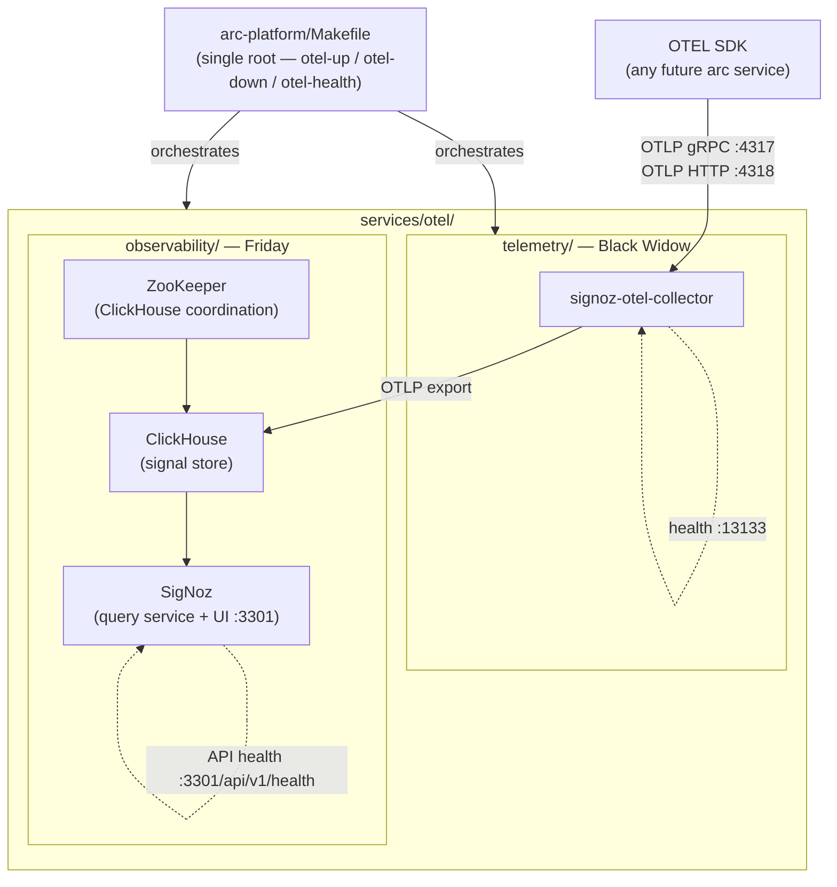

# Feature: 001-otel-setup — Stand Up SigNoz as the Observability Backend

> **Spec**: 001-otel-setup
> **Date**: 2026-02-21
> **Status**: Draft

## Target Modules

| Module | Path | Impact |
|--------|------|--------|
| Services | `services/otel/observability/` | New directory — SigNoz UI, ClickHouse, ZooKeeper |
| Services | `services/otel/telemetry/` | New directory — OTEL collector (Black Widow) |
| Root | `Makefile` | Extend with `otel-*` targets — single orchestration entrypoint |

No CLI, SDK, or docs changes in this spec.

## Overview

Add SigNoz as the A.R.C. observability backend. Two service directories live under `services/otel/` — `telemetry/` (OTEL collector) and `observability/` (SigNoz + storage). Each owns its own `docker-compose.yml`; all operations are invoked from the **single root `Makefile`** via `otel-*` targets (e.g. `make otel-up`). Raw `docker compose` is never the intended interface. Once running, the SigNoz UI is reachable at `localhost:3301` and the collector accepts OTLP signals on ports 4317/4318. This spec covers infrastructure setup only; SDK instrumentation is a future spec.

## Architecture



## Makefile Design

**Single root `Makefile`** at `arc-platform/Makefile`. Pattern mirrors platform-spike: compose variables point at per-service compose files; no `cd` required.

```makefile
# Compose variable references (root Makefile additions)
COMPOSE                  := docker compose
COMPOSE_OTEL_TELEMETRY   := $(COMPOSE) -f services/otel/telemetry/docker-compose.yml
COMPOSE_OTEL_OBSERVABILITY := $(COMPOSE) -f services/otel/observability/docker-compose.yml
COMPOSE_OTEL             := $(COMPOSE_OTEL_TELEMETRY) \
                            -f services/otel/observability/docker-compose.yml

# Target reference
make otel-up               # full otel stack (telemetry + observability)
make otel-up-observability # SigNoz + ClickHouse + ZooKeeper only
make otel-up-telemetry     # collector only
make otel-down             # tear down full stack
make otel-health           # probe both health endpoints; exit non-zero on failure
make otel-logs             # stream logs from all otel containers
make otel-ps               # show container status
```

## User Scenarios & Testing

### P1 — Must Have

**US-1**: As a developer, I want to start the full SigNoz stack with a single make command so that the UI is reachable without manual steps.
- **Given**: `make otel-up` is run from the repo root (`arc-platform/`)
- **When**: All containers report healthy (ClickHouse, ZooKeeper, signoz-otel-collector, SigNoz)
- **Then**: `http://localhost:3301` returns the SigNoz UI within 60 seconds
- **Test**: `curl -sf http://localhost:3301/api/v1/health` returns HTTP 200; `make otel-health` exits 0

**US-2**: As a developer, I want the OTEL collector to accept a test span so that I can verify the full pipeline before instrumenting any arc service.
- **Given**: `make otel-up` has been run and `make otel-health` exits 0
- **When**: A test span is sent to `localhost:4317` via `telemetrygen`
- **Then**: The span appears in SigNoz → Traces within 30 seconds
- **Test**: `docker run --rm --network host ghcr.io/open-telemetry/opentelemetry-collector-contrib/telemetrygen:latest traces --otlp-insecure --otlp-endpoint localhost:4317` then verify in SigNoz UI

## Requirements

### Functional

- [ ] FR-1: `services/otel/observability/` directory exists with `service.yaml`, `docker-compose.yml`, and `config/`
- [ ] FR-2: `services/otel/telemetry/` directory exists with `service.yaml`, `docker-compose.yml`, and `config/otel-collector-config.yaml`
- [ ] FR-3: Root `Makefile` (`arc-platform/Makefile`) is extended with `otel-up`, `otel-up-observability`, `otel-up-telemetry`, `otel-down`, `otel-health`, `otel-logs`, `otel-ps` targets
- [ ] FR-4: `make otel-up` from repo root starts all four containers (SigNoz, ClickHouse, ZooKeeper, signoz-otel-collector)
- [ ] FR-5: `make otel-health` probes both health endpoints and exits non-zero if either fails
- [ ] FR-6: SigNoz UI is reachable at `http://localhost:3301` after `make otel-up` completes healthy
- [ ] FR-7: OTEL collector accepts OTLP gRPC on `:4317` and OTLP HTTP on `:4318`
- [ ] FR-8: `otel-collector-config.yaml` is the single place to configure receivers and exporters — no per-service collector configs
- [ ] FR-9: Health check for `observability/` passes only when the SigNoz API (`/api/v1/health`) responds, not just when containers are running
- [ ] FR-10: ClickHouse and ZooKeeper are NOT exposed externally (internal Docker network only)
- [ ] FR-11: SigNoz UI is bound to `127.0.0.1` only (not `0.0.0.0`)
- [ ] FR-12: `make otel-down` cleanly stops and removes all otel stack containers

### Non-Functional

- [ ] NFR-1: **ClickHouse minimum RAM: 4GB** — document as prerequisite in `services/otel/observability/README.md`
- [ ] NFR-2: SigNoz UI must be reachable within 60 seconds of all containers starting
- [ ] NFR-3: Collector health endpoint (`http://localhost:13133/`) must return 200 when running
- [ ] NFR-4: All containers run as non-root (Principle VIII)
- [ ] NFR-5: No secrets committed to git; any credentials use env files listed in `.gitignore`

### Key Entities

| Entity | Module | Description |
|--------|--------|-------------|
| `Makefile` (extended) | `arc-platform/` | Root orchestration — `otel-*` targets added; single entrypoint for all services |
| `service.yaml` (friday) | `services/otel/observability/` | Codename, tech, health endpoint, compose services list |
| `service.yaml` (widow) | `services/otel/telemetry/` | Codename, tech, ports, health endpoint, upstream image |
| `docker-compose.yml` | `services/otel/observability/` | SigNoz + ClickHouse + ZooKeeper stack |
| `docker-compose.yml` | `services/otel/telemetry/` | signoz-otel-collector container |
| `otel-collector-config.yaml` | `services/otel/telemetry/config/` | OTLP receivers, SigNoz exporter, health extension |

### service.yaml Shapes

**services/otel/telemetry/service.yaml** (Black Widow):
```yaml
codename: widow
tech: signoz-otel-collector
upstream: signoz/signoz-otel-collector
ports:
  - 4317   # OTLP gRPC
  - 4318   # OTLP HTTP
health: http://localhost:13133/
```

**services/otel/observability/service.yaml** (Friday):
```yaml
codename: friday
tech: signoz
depends_on:
  - telemetry
health: http://localhost:3301/api/v1/health
compose_services:
  - signoz
  - clickhouse
  - zookeeper
```

## Edge Cases

| Scenario | Expected Behavior |
|----------|-------------------|
| ClickHouse OOM (< 4GB RAM) | Container exits; `make otel-health` fails; error visible in `make otel-logs` |
| SigNoz starts before ClickHouse is ready | `depends_on` with `condition: service_healthy` in compose prevents premature start |
| Collector starts before SigNoz/ClickHouse is ready | Collector retries export; spans buffered up to queue limit; no data loss for short startup gaps |
| Port 3301 already in use | `make otel-up` fails at bind; error message identifies conflicting port |
| Port 4317/4318 already in use | `make otel-up` fails at bind; error message identifies conflicting port |
| `make otel-up-observability` run without telemetry | SigNoz starts and is accessible; no collector means no ingestion (expected, documented) |

## Success Criteria

- [ ] SC-1: `make otel-up` from repo root exits 0 and all four containers reach healthy state
- [ ] SC-2: `make otel-health` exits 0 after `make otel-up`; exits non-zero if any endpoint is unreachable
- [ ] SC-3: `curl -sf http://localhost:3301/api/v1/health` returns HTTP 200
- [ ] SC-4: `curl -sf http://localhost:13133/` returns HTTP 200 (collector health)
- [ ] SC-5: A test span sent to `:4317` appears in SigNoz → Traces within 30 seconds
- [ ] SC-6: ClickHouse port is NOT accessible from the host (`nc -z localhost 9000` fails)
- [ ] SC-7: ZooKeeper port is NOT accessible from the host (`nc -z localhost 2181` fails)

## Docs & Links Update

- [ ] Create `services/otel/observability/README.md` — prerequisites (4GB RAM), `make up` quickstart, health check URL, UI URL
- [ ] Create `services/otel/telemetry/README.md` — collector config reference: open receivers (OTLP gRPC/HTTP), export target, health endpoint

## Constitution Compliance

| Principle | Applies | Compliant | Notes |
|-----------|---------|-----------|-------|
| I. Zero-Dependency CLI | N/A | — | CLI scope only |
| II. Platform-in-a-Box | ✓ | ✓ | `make otel-up` works with zero manual config; root Makefile is the declared interface |
| III. Modular Services | ✓ | ✓ | Each subdirectory is self-contained with own `service.yaml`; root Makefile references compose files directly |
| IV. Two-Brain Separation | N/A | — | Infrastructure config only; no Go/Python mixing |
| V. Polyglot Standards | N/A | — | OTEL SDK instrumentation is the next spec |
| VI. Local-First | N/A | — | CLI scope only |
| VII. Observability by Default | ✓ | ✓ | This spec IS the observability foundation |
| VIII. Security by Default | ✓ | ✓ | Non-root containers; ClickHouse/ZK not externally exposed; UI bound to 127.0.0.1 |
| IX. Declarative Reconciliation | N/A | — | CLI scope only |
| X. Stateful Operations | N/A | — | CLI scope only |
| XI. Resilience Testing | N/A | — | Chaos engineering is a follow-on concern |
| XII. Interactive Experience | N/A | — | CLI scope only |
