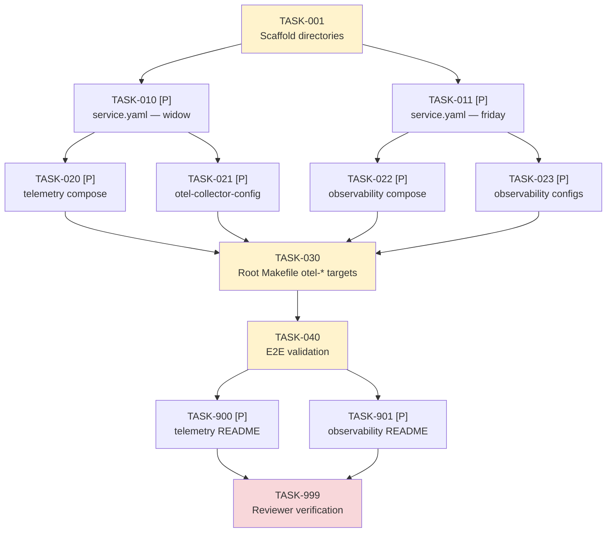

# Tasks: 001-otel-setup — Stand Up SigNoz as the Observability Backend

> **Spec**: 001-otel-setup
> **Date**: 2026-02-21

## Dependency Graph



**Critical path**: T001 → T010/T011 → T020-T023 → T030 → T040 → T999

---

## Phase 1: Setup

- [x] **[TASK-001]** [SERVICES] [P1] Scaffold the `services/otel/` directory tree
  - Dependencies: none
  - Module: `services/otel/`
  - Acceptance:
    - `services/otel/telemetry/` exists with empty `service.yaml`, `docker-compose.yml`, `config/` dir
    - `services/otel/observability/` exists with empty `service.yaml`, `docker-compose.yml`, `config/` dir
    - `services/otel/telemetry/config/otel-collector-config.yaml` placeholder exists
    - `services/otel/observability/config/` contains placeholder files for clickhouse-config.xml and zookeeper.properties

---

## Phase 2: Foundational

*Both tasks are parallel-safe — no shared files.*

- [x] **[TASK-010]** [P] [SERVICES] [P1] Write `service.yaml` for telemetry (Black Widow / widow)
  - Dependencies: TASK-001
  - Module: `services/otel/telemetry/service.yaml`
  - Acceptance:
    ```yaml
    codename: widow
    tech: signoz-otel-collector
    upstream: signoz/signoz-otel-collector
    ports:
      - 4317   # OTLP gRPC
      - 4318   # OTLP HTTP
    health: http://localhost:13133/
    ```
  - File validates as valid YAML

- [x] **[TASK-011]** [P] [SERVICES] [P1] Write `service.yaml` for observability (Friday / friday)
  - Dependencies: TASK-001
  - Module: `services/otel/observability/service.yaml`
  - Acceptance:
    ```yaml
    codename: friday
    tech: signoz
    depends_on:
      - telemetry
    health: http://localhost:3301/api/v1/health
    compose_services:
      - signoz
      - clickhouse
      - zookeeper
    ```
  - File validates as valid YAML

---

## Phase 3: Implementation

### Parallel Batch A — Service Configs
*All four tasks are parallel-safe after Phase 2.*

- [x] **[TASK-020]** [P] [SERVICES] [P1] Write `services/otel/telemetry/docker-compose.yml`
  - Dependencies: TASK-010
  - Module: `services/otel/telemetry/docker-compose.yml`
  - Acceptance:
    - Defines service `signoz-otel-collector` using `signoz/signoz-otel-collector` image
    - Collector ports bound to `127.0.0.1`: `127.0.0.1:4317:4317`, `127.0.0.1:4318:4318`
    - Health check: `curl -sf http://localhost:13133/` with `interval: 10s`, `retries: 5`, `start_period: 30s`
    - Mounts `./config/otel-collector-config.yaml` into container
    - Container runs as non-root user
    - Connected to shared Docker network (e.g. `arc_otel_net`)

- [x] **[TASK-021]** [P] [SERVICES] [P1] Write `services/otel/telemetry/config/otel-collector-config.yaml`
  - Dependencies: TASK-010
  - Module: `services/otel/telemetry/config/otel-collector-config.yaml`
  - Acceptance:
    - `receivers.otlp` configured with gRPC on `:4317` and HTTP on `:4318`
    - `exporters.otlp` (or `clickhousetraces`) points at ClickHouse endpoint on the shared Docker network
    - `extensions.health_check` bound to `:13133`
    - `service.pipelines.traces` wires receivers → exporters
    - `service.extensions` lists `health_check`
    - Config is valid YAML; collector starts without errors

- [x] **[TASK-022]** [P] [SERVICES] [P1] Write `services/otel/observability/docker-compose.yml`
  - Dependencies: TASK-011
  - Module: `services/otel/observability/docker-compose.yml`
  - Acceptance:
    - Three services defined: `zookeeper`, `clickhouse`, `signoz`
    - `clickhouse` depends on `zookeeper` with `condition: service_healthy`
    - `signoz` depends on `clickhouse` with `condition: service_healthy`
    - **Security**: ClickHouse has NO `ports` key (internal network only)
    - **Security**: ZooKeeper has NO `ports` key (internal network only)
    - **Security**: SigNoz UI bound to `127.0.0.1:3301:3301` (not `0.0.0.0`)
    - SigNoz health check: `curl -sf http://localhost:3301/api/v1/health` with `interval: 15s`, `retries: 8`, `start_period: 60s`
    - ClickHouse health check probes readiness (e.g. `clickhouse-client --query "SELECT 1"`)
    - All containers run as non-root user
    - Mounts `./config/clickhouse-config.xml` and `./config/zookeeper.properties`
    - Connected to same shared Docker network as telemetry

- [x] **[TASK-023]** [P] [SERVICES] [P1] Write observability config files (ClickHouse + ZooKeeper)
  - Dependencies: TASK-011
  - Module: `services/otel/observability/config/`
  - Acceptance:
    - `clickhouse-config.xml`: sets max memory to 4GB; disables anonymous usage stats; includes comment documenting 4GB minimum requirement
    - `zookeeper.properties`: basic ZK coordination config (dataDir, clientPort, tickTime)
    - Both files are valid format and cause their respective containers to start without errors

### Parallel Batch B — Orchestration
*Single blocking task — waits for all Batch A.*

- [x] **[TASK-030]** [MAKEFILE] [P1] Write root `Makefile` with `otel-*` targets
  - Dependencies: TASK-020, TASK-021, TASK-022, TASK-023
  - Module: `arc-platform/Makefile` (new file)
  - Acceptance — variables:
    ```makefile
    COMPOSE                    := docker compose
    COMPOSE_OTEL_TELEMETRY     := $(COMPOSE) -f services/otel/telemetry/docker-compose.yml
    COMPOSE_OTEL_OBSERVABILITY := $(COMPOSE) -f services/otel/observability/docker-compose.yml
    COMPOSE_OTEL               := $(COMPOSE_OTEL_TELEMETRY) \
                                  -f services/otel/observability/docker-compose.yml
    ```
  - Acceptance — targets exist and work:
    - `otel-up`: starts full stack via `$(COMPOSE_OTEL) up -d`
    - `otel-up-observability`: starts `$(COMPOSE_OTEL_OBSERVABILITY) up -d`
    - `otel-up-telemetry`: starts `$(COMPOSE_OTEL_TELEMETRY) up -d`
    - `otel-down`: `$(COMPOSE_OTEL) down`
    - `otel-health`: curls `:13133/` and `:3301/api/v1/health`; exits non-zero if either fails; prints ✓/✗ per endpoint
    - `otel-logs`: `$(COMPOSE_OTEL) logs -f`
    - `otel-ps`: `$(COMPOSE_OTEL) ps`
  - All targets declared `.PHONY`
  - No `cd` commands; all paths relative to repo root

---

## Phase 4: Integration

- [ ] **[TASK-040]** [SERVICES] [P1] End-to-end validation — run the full stack and verify all success criteria
  - Dependencies: TASK-030
  - Module: `arc-platform/` (root; validation only, no file changes)
  - Acceptance — all of the following pass:
    1. `make otel-up` exits 0; all four containers reach `healthy` state (verify via `make otel-ps`)
    2. `make otel-health` exits 0
    3. `curl -sf http://localhost:3301/api/v1/health` returns HTTP 200
    4. `curl -sf http://localhost:13133/` returns HTTP 200
    5. `nc -z localhost 9000` fails (ClickHouse NOT exposed)
    6. `nc -z localhost 2181` fails (ZooKeeper NOT exposed)
    7. Test span via telemetrygen appears in SigNoz UI → Traces within 30s:
       ```
       docker run --rm --network host \
         ghcr.io/open-telemetry/opentelemetry-collector-contrib/telemetrygen:latest \
         traces --otlp-insecure --otlp-endpoint localhost:4317
       ```
    8. `docker compose exec <service> whoami` returns non-root for all containers
    9. `make otel-down` exits 0 and removes all containers

---

## Phase 5: Polish

*Both README tasks are parallel-safe.*

- [x] **[TASK-900]** [P] [DOCS] [P1] Write `services/otel/telemetry/README.md`
  - Dependencies: TASK-040
  - Module: `services/otel/telemetry/README.md`
  - Acceptance:
    - Quickstart: `make otel-up-telemetry` command
    - Open ports documented: 4317 (OTLP gRPC), 4318 (OTLP HTTP), 13133 (health)
    - Health check URL: `http://localhost:13133/`
    - Collector config reference: where to find it, what receivers are open, what the export target is
    - No dead links

- [x] **[TASK-901]** [P] [DOCS] [P1] Write `services/otel/observability/README.md`
  - Dependencies: TASK-040
  - Module: `services/otel/observability/README.md`
  - Acceptance:
    - **Prerequisites section** — documents: Docker Desktop with ≥ 4GB RAM allocated to ClickHouse
    - Quickstart: `make otel-up` from repo root
    - UI URL: `http://localhost:3301`
    - Health check URL: `http://localhost:3301/api/v1/health`
    - Note: ClickHouse and ZooKeeper are internal-only (not accessible from host)
    - No dead links

- [ ] **[TASK-999]** [REVIEW] [P1] Reviewer agent verification
  - Dependencies: TASK-900, TASK-901 (all tasks)
  - Module: all affected modules
  - Acceptance — reviewer agent confirms all of the following:
    - All tasks in this file marked `[x]` complete
    - Directory structure matches plan: `services/otel/telemetry/`, `services/otel/observability/`
    - `make otel-up` starts all 4 containers and reaches healthy state
    - `make otel-health` exits 0
    - All success criteria SC-1 through SC-7 from spec.md verified
    - All containers confirmed non-root
    - SigNoz UI bound to `127.0.0.1` (confirmed in docker-compose.yml)
    - ClickHouse and ZooKeeper have no `ports` key in their compose config
    - No secrets or credentials in any committed file
    - Both READMEs exist with required sections
    - Constitution Principles II, III, VII, VIII — all PASS
    - No TODO/FIXME without a tracking issue

---

## Phase 6: Image Strategy & Naming

*Codifies the arc-friday-* naming convention and Approach C image strategy from platform-spike.*

- [x] **[TASK-050]** [SERVICES] [P1] Fix broken hostname references baked into collector image configs
  - Dependencies: none (prerequisite for otel-build to produce working images)
  - Module: `services/otel/telemetry/config/`, `services/otel/observability/config/`
  - Acceptance:
    - `otel-collector-config.yaml`: `clickhouse:9000` → `arc-friday-clickhouse:9000`
    - `otel-collector-opamp-config.yaml`: `signoz:4320` → `arc-friday:4320`
    - `clickhouse-cluster.xml`: `<host>clickhouse</host>` → `<host>arc-friday-clickhouse</host>`; `<host>zookeeper</host>` → `<host>arc-friday-zookeeper</host>`
    - `make otel-build` produces images; `make otel-up` shows all 6 containers reach healthy/exited-0 state

- [x] **[TASK-051]** [SERVICES] [P1] Rename all containers and images to `arc-friday-*` in docker-compose.yml and Makefile
  - Dependencies: TASK-050
  - Module: `services/otel/docker-compose.yml`, `Makefile`
  - Acceptance:
    - `docker ps` shows: `arc-friday`, `arc-friday-collector`, `arc-friday-clickhouse`, `arc-friday-zookeeper`, `arc-friday-migrator-sync` (exited 0), `arc-friday-migrator-async` (exited 0)
    - Images: `ghcr.io/arc-framework/arc-friday:latest`, `ghcr.io/arc-framework/arc-friday-collector:latest`, etc.
    - All DSNs use `tcp://arc-friday-clickhouse:9000`
    - Volumes named `arc-friday-clickhouse`, `arc-friday-zookeeper`, `arc-friday-sqlite`

- [x] **[TASK-052]** [CI] [P1] Update `.github/workflows/otel-images.yml` matrix to use new image names
  - Dependencies: TASK-051
  - Module: `.github/workflows/otel-images.yml`
  - Acceptance:
    - Matrix contains: `arc-friday`, `arc-friday-collector`, `arc-friday-clickhouse`, `arc-friday-zookeeper`
    - Each entry has correct `context` and `dockerfile` path
    - Workflow produces images at `ghcr.io/arc-framework/arc-friday-*`

- [x] **[TASK-053]** [CI] [P] Create `.github/config/publish-observability.json`
  - Dependencies: TASK-051
  - Module: `.github/config/publish-observability.json`
  - Acceptance:
    - JSON has `images` array with 4 entries: `arc-friday`, `arc-friday-collector`, `arc-friday-clickhouse`, `arc-friday-zookeeper`
    - Each entry has `source`, `target`, `description`, `platforms`, `required` fields
    - `settings.rate_limit_delay_seconds` is set
    - Consumed by `_reusable-publish-group.yml` without errors

- [x] **[TASK-054]** [CI] [P] Port reusable CI workflows from platform-spike
  - Dependencies: none (parallel-safe)
  - Module: `.github/workflows/`
  - Acceptance:
    - `_reusable-build.yml`: reusable Docker build with GHA caching, SBOM generation, size + duration tracking
    - `_reusable-security.yml`: reusable Trivy scan (fs + image), SARIF upload, non-blocking by default
    - `_reusable-publish-group.yml`: reusable vendor re-tag, reads JSON config, sequential publish with rate limit delay
    - All three pass YAML linting (`yamllint` or GitHub Actions validation)

- [x] **[TASK-055]** [DOCS] [P] Update `spec.md` with FR-13..16 and Image Strategy section
  - Dependencies: TASK-051
  - Module: `specs/001-otel-setup/spec.md`
  - Acceptance:
    - FR-13 through FR-16 added to Requirements section
    - Image Strategy section added before Edge Cases
    - Table of 4 images with source, Dockerfile, and baked-in config
    - No dead file references

---

## Progress Summary

| Phase | Total | Done | Parallel |
|-------|-------|------|----------|
| Setup | 1 | 1 | 0 |
| Foundational | 2 | 2 | 2 |
| Implementation | 5 | 5 | 4 |
| Integration | 1 | 0 | 0 |
| Polish | 3 | 2 | 2 |
| Image Strategy | 6 | 6 | 3 |
| **Total** | **18** | **16** | **11** |
