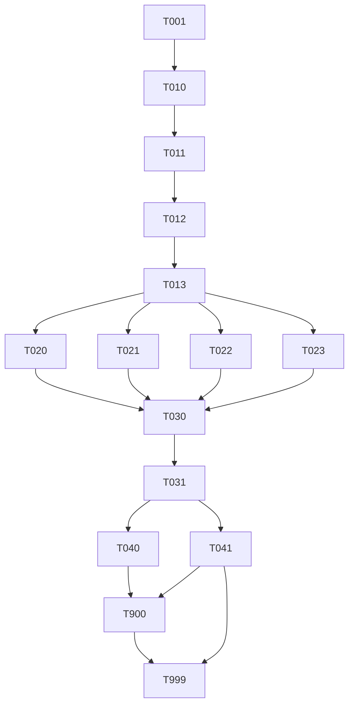

# Tasks: Cortex Bootstrap Service

> **Spec**: 002-cortex-setup
> **Date**: 2026-02-22

## Task Format

```
[TASK-NNN] [P?] [MODULE] [PRIORITY] Description
  Dependencies: [TASK-XXX] or none
  Module: services/cortex/...
  Acceptance: Testable criteria
  Status: [ ] pending | [~] in-progress | [x] done
```

- `[P]` = Safe for parallel agent execution
- Priority: P1 (must), P2 (should), P3 (nice)

## Dependency Graph



## Quality Requirements

| Module | Coverage | Lint | Notes |
|--------|----------|------|-------|
| `internal/orchestrator` | 75% | golangci-lint | Critical — P1 |
| `internal/clients` | 75% | golangci-lint | Critical — P1 |
| `internal/api` | 60% | golangci-lint | Core — P1 |
| `internal/config` | 60% | golangci-lint | Core — P2 |
| `internal/telemetry` | 40% | golangci-lint | Infra — P2 |

---

## Phase 1: Setup

<!-- Module scaffold and Go module init — must be sequential, done by one agent -->

- [ ] [TASK-001] [SERVICES] [P1] Scaffold `services/cortex/` directory structure and `go.mod`
  - Dependencies: none
  - Module: `services/cortex/`
  - Acceptance: All directories from spec exist; `go mod init arc-framework/cortex` succeeds; `go build ./...` compiles with no errors on an empty `main.go`

- [ ] [TASK-010] [SERVICES] [P1] Implement `internal/config/config.go` — Viper config with typed structs
  - Dependencies: TASK-001
  - Module: `services/cortex/internal/config/config.go`
  - Acceptance: `Config` struct covers all four infra clients + OTEL + server; env var mapping matches `CORTEX_*` prefix; `LoadConfig()` returns typed struct; unit tests for defaults and env override pass

- [ ] [TASK-011] [SERVICES] [P1] Implement `internal/telemetry/friday.go` — OTEL TracerProvider + MeterProvider
  - Dependencies: TASK-010
  - Module: `services/cortex/internal/telemetry/friday.go`
  - Acceptance: `InitProvider(ctx, cfg)` exports traces and metrics via OTLP gRPC to `arc-widow:4317`; shutdown is graceful; OTEL dial failure is non-fatal (`WithFailFast(false)`); unit test verifies provider initialises without panic when collector is unreachable

- [ ] [TASK-012] [SERVICES] [P1] Implement Cobra CLI entry point — `cmd/cortex/` (root, server, bootstrap commands)
  - Dependencies: TASK-010
  - Module: `services/cortex/cmd/cortex/`
  - Acceptance: `cortex server` starts Gin on `:8081`; `cortex bootstrap` executes one-shot bootstrap and exits 0/non-zero; `--config`, `--log-level` global flags wired; `main.go` wires DI with functional options; compiles cleanly

- [ ] [TASK-013] [SERVICES] [P1] Define orchestrator types — `internal/orchestrator/types.go`
  - Dependencies: TASK-001
  - Module: `services/cortex/internal/orchestrator/types.go`
  - Acceptance: `BootstrapResult`, `PhaseResult`, `ProbeResult` structs defined; JSON tags present; `sync.Mutex` embedded in `BootstrapResult` for concurrent phase writes; zero-value is safe to use

---

## Phase 2: Foundational — Infra Clients (Parallel Batch)

<!-- All four clients are independent packages — run simultaneously with 4 agents -->

### Parallel Batch A — 4 agents, no inter-dependency

- [ ] [TASK-020] [P] [SERVICES] [P1] Implement `internal/clients/postgres.go` — pgx pool + schema validation + circuit breaker
  - Dependencies: TASK-013
  - Module: `services/cortex/internal/clients/postgres.go`
  - Acceptance: `NewPostgresClient(cfg, cb)` opens pgx pool; `Probe(ctx)` pings and validates schema version table exists; `gobreaker` trips after 3 failures, resets after 30s; table-driven tests with mocked pgx cover success, failure, and open-breaker cases; `golangci-lint` passes

- [ ] [TASK-021] [P] [SERVICES] [P1] Implement `internal/clients/nats.go` — JetStream stream creation + circuit breaker
  - Dependencies: TASK-013
  - Module: `services/cortex/internal/clients/nats.go`
  - Acceptance: `NewNATSClient(cfg, cb)` connects via NATS; `ProvisionStreams(ctx)` creates 3 streams (`arc-events`, `arc-commands`, `arc-results`) with correct subjects, retention, and max-age; existing stream is updated not errored; `gobreaker` circuit breaker applied; unit tests pass; `golangci-lint` passes

- [ ] [TASK-022] [P] [SERVICES] [P1] Implement `internal/clients/pulsar.go` — Pulsar admin REST + circuit breaker
  - Dependencies: TASK-013
  - Module: `services/cortex/internal/clients/pulsar.go`
  - Acceptance: `NewPulsarClient(cfg, cb)` uses `net/http` to Pulsar admin REST at `:8080`; provisions tenant `arc-system`, 3 namespaces, 3 partitioned topics; 409 on topic creation treated as success (idempotent); `gobreaker` applied; unit tests mock HTTP responses; `golangci-lint` passes

- [ ] [TASK-023] [P] [SERVICES] [P1] Implement `internal/clients/redis.go` — go-redis PING + circuit breaker
  - Dependencies: TASK-013
  - Module: `services/cortex/internal/clients/redis.go`
  - Acceptance: `NewRedisClient(cfg, cb)` creates go-redis client; `Probe(ctx)` sends `PING` and validates `PONG`; `gobreaker` applied; unit tests cover success and circuit-open cases; `golangci-lint` passes

---

## Phase 3: Implementation

<!-- Orchestrator and API depend on all clients — sequential within this phase -->

- [ ] [TASK-030] [SERVICES] [P1] Implement `internal/orchestrator/service.go` — `RunBootstrap()` + `RunDeepHealth()`
  - Dependencies: TASK-020, TASK-021, TASK-022, TASK-023
  - Module: `services/cortex/internal/orchestrator/service.go`
  - Acceptance: `RunBootstrap(ctx)` runs all 4 phases via `errgroup` in parallel; each phase writes to `BootstrapResult` under mutex; phase error does not cancel others; `atomic.Bool` gates concurrent bootstrap requests (returns sentinel error when in-progress); OTEL span wraps full execution; table-driven tests achieve ≥ 75% coverage; `golangci-lint` passes

- [ ] [TASK-031] [SERVICES] [P1] Implement `internal/api/` — Gin router, handlers, and OTEL middleware
  - Dependencies: TASK-030
  - Module: `services/cortex/internal/api/`
  - Acceptance: `POST /api/v1/bootstrap` returns 202 on start, 409 if in-progress; `GET /health` always 200; `GET /health/deep` probes all 4 clients; `GET /ready` returns 503 until bootstrap completes, then 200; OTEL trace propagation middleware applied; panic recovery middleware present; ≥ 60% test coverage on handlers; `golangci-lint` passes

---

## Phase 4: Integration

<!-- Wire everything together and validate end-to-end -->

- [ ] [TASK-040] [SERVICES] [P1] Wire `main.go` DI + integration test for bootstrap flow
  - Dependencies: TASK-031
  - Module: `services/cortex/cmd/cortex/main.go`
  - Acceptance: `main.go` constructs all dependencies via functional options and wires them into the Cobra command tree; `go build ./...` produces a valid binary; integration test spins up Gin with mock clients and verifies full `POST /api/v1/bootstrap → 202 → GET /ready → 200` flow; `golangci-lint` passes

- [ ] [TASK-041] [P] [SERVICES] [P1] Add `service.yaml` and `Dockerfile` for Cortex
  - Dependencies: TASK-031
  - Module: `services/cortex/`
  - Acceptance: `service.yaml` declares `codename: cortex`, `depends_on: [flash, strange, oracle, sonic, widow]`, health endpoint `/health`; Dockerfile uses multi-stage build, non-root `USER cortex`, and exposes `:8081`; `docker build` succeeds; `docker inspect` confirms non-root user

---

## Phase 5: Polish

<!-- Docs, config updates, cross-links — can overlap with Phase 4 -->

- [ ] [TASK-900] [P] [DOCS] [P1] Update platform references — profiles.yaml, config.yaml, codename map, architecture doc
  - Dependencies: TASK-040, TASK-041
  - Module: `services/profiles.yaml`, `.specify/config.yaml`, `.specify/meta/service-codename-map.md`, `.specify/docs/architecture/cortex.md`
  - Acceptance: `cortex` added to `think` and `reason` profiles in `profiles.yaml`; `.specify/config.yaml` updated from `bootstrap/raymond` → `cortex/cortex`; `service-codename-map.md` has Cortex row; `cortex.md` architecture doc links back to `spec.md` and `plan.md`; all internal links resolve

- [ ] [TASK-999] [REVIEW] [P1] Reviewer agent verification — all tasks complete, tests pass, constitution compliant
  - Dependencies: ALL
  - Module: all affected modules
  - Acceptance: All tasks marked `[x]`; `go test ./...` passes with ≥ 75% on orchestrator+clients, ≥ 60% on api; `golangci-lint run` zero errors; `GET /health` responds < 50ms; `docker inspect` confirms non-root user; OTEL service name is `arc-cortex`; `POST /api/v1/bootstrap` returns 409 when in-progress; `cortex bootstrap` exits 0 on success; constitution principles II, III, IV, V, VII, VIII, XI all verified

---

## Progress Summary

| Phase | Total | Done | Parallel |
|-------|-------|------|----------|
| Setup | 5 | 0 | 0 |
| Foundational (Clients) | 4 | 0 | 4 |
| Implementation | 2 | 0 | 0 |
| Integration | 2 | 0 | 1 |
| Polish | 2 | 0 | 1 |
| **Total** | **15** | **0** | **6** |
