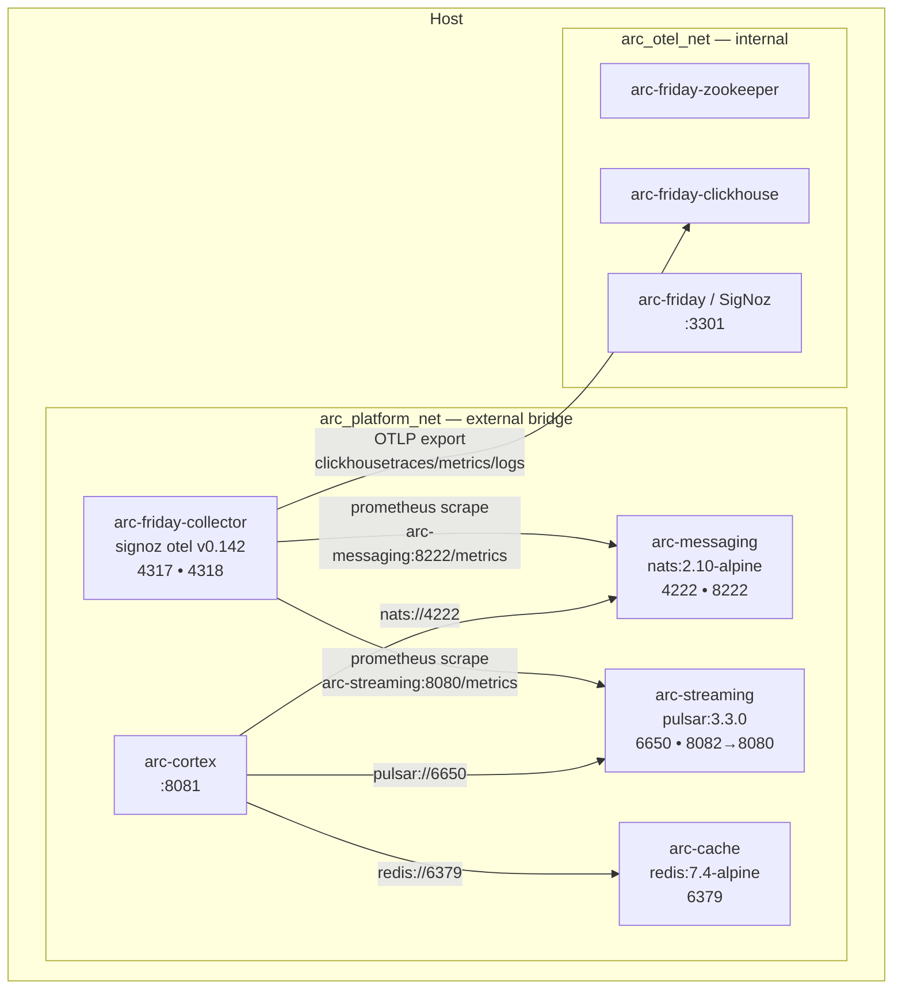
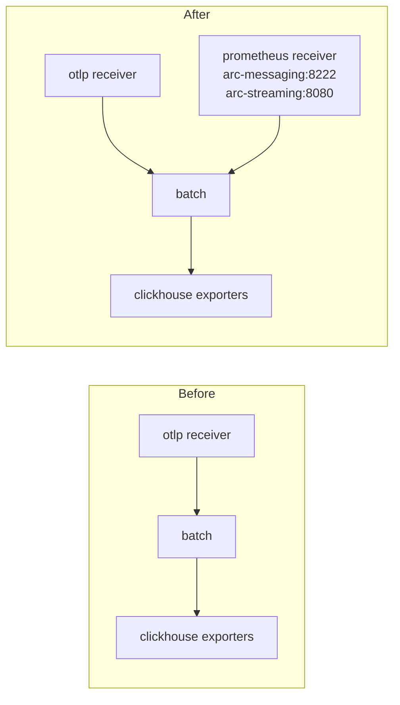
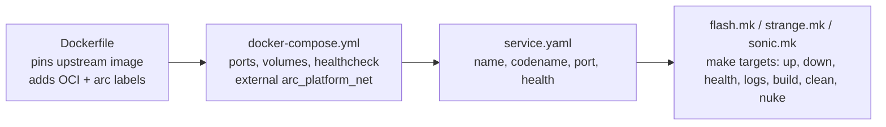

# Implementation Plan: Messaging & Cache Services Setup

> **Spec**: 003-messaging-setup
> **Date**: 2026-02-23

## Summary

Add three infrastructure services — NATS (Flash), Pulsar (Strange), Redis (Sonic) — each following the exact same structural pattern as the OTEL stack: thin version-pinned Dockerfile, `service.yaml`, `docker-compose.yml`, dedicated `.mk` include, and CI/release workflows. Network topology is simplified to two networks: `arc_platform_net` (shared, external) and `arc_otel_net` (internal to otel storage). The otel collector gains a Prometheus receiver and joins `arc_platform_net` so it can scrape NATS and Pulsar metrics. Profiles are updated so the `think` profile bootstraps messaging alongside cortex.

## Target Modules

| Module | Language | Changes |
|--------|----------|---------|
| `services/messaging/` | Config/Dockerfile | New — NATS (Flash) |
| `services/streaming/` | Config/Dockerfile | New — Pulsar (Strange) |
| `services/cache/` | Config/Dockerfile | New — Redis (Sonic) |
| `services/otel/telemetry/` | YAML | Update collector config — add prometheus receiver + arc_platform_net |
| `services/otel/docker-compose.yml` | YAML | Add arc_platform_net to collector service |
| `services/profiles.yaml` | YAML | Add flash, strange, sonic to `think` profile |
| `.github/workflows/` | YAML | New — messaging-images.yml + messaging-release.yml |
| `Makefile` | Make | Include flash.mk, strange.mk, sonic.mk |

## Technical Context

| Aspect | Value |
|--------|-------|
| Language | Config-only (YAML, Dockerfile) — no application code |
| Base Images | `nats:alpine`, `apachepulsar/pulsar:latest`, `redis:alpine` — floating tags, consistent with platform-spike |
| Testing | `docker compose ps`, `curl`, `redis-cli ping`, `nats stream ls` |
| OTEL Collector | `signoz/signoz-otel-collector:v0.142.0` — add `prometheus` receiver |
| Network | `arc_platform_net` (external bridge) + `arc_otel_net` (internal) |
| Volumes | Named Docker volumes: `arc-messaging-jetstream`, `arc-streaming-data`, `arc-cache-data` |
| CI Pattern | Mirror `cortex-images.yml` — amd64-only CI, dorny/paths-filter per service |

## Architecture

### Network topology



### Collector config delta



### Service file pattern (same for all three)



## Constitution Check

| # | Principle | Status | Evidence |
|---|-----------|--------|----------|
| I | Zero-Dep CLI | N/A | No CLI changes |
| II | Platform-in-a-Box | PASS | `make messaging-up` starts all three; `think` profile includes them |
| III | Modular Services | PASS | Each in own dir under `services/`; self-contained; added to profile |
| IV | Two-Brain | PASS | Config-only — no language concern |
| V | Polyglot Standards | PASS | Same Dockerfile/compose/healthcheck structure as otel |
| VI | Local-First | N/A | CLI only |
| VII | Observability | PASS | NATS + Pulsar scraped by collector → SigNoz; Redis deferred (TD-001) |
| VIII | Security | PASS | NATS+Redis run non-root; ports bind `127.0.0.1`; no secrets in compose |
| IX | Declarative | N/A | CLI only |
| X | Stateful Ops | N/A | CLI only |
| XI | Resilience | PASS | Health checks with correct start_periods; named volumes survive restarts |
| XII | Interactive | N/A | CLI only |

> **Known deviation — Pulsar non-root (NFR-1)**: The `apachepulsar/pulsar:3.3.0` image requires root for `/pulsar` directory initialization. Documented in service.yaml and docker-compose.yml comments. No upstream non-root alternative available.

## Project Structure

```
arc-platform/
├── services/
│   ├── messaging/                        ← NEW (Flash / NATS)
│   │   ├── Dockerfile                    # FROM nats:2.10-alpine; adds labels; non-root (nats uid 1000)
│   │   ├── service.yaml                  # name, codename, port, health
│   │   ├── docker-compose.yml            # arc-messaging container; arc_platform_net external
│   │   └── flash.mk                      # flash-up/down/health/logs/build/clean/nuke
│   ├── streaming/                        ← NEW (Strange / Pulsar)
│   │   ├── Dockerfile                    # FROM apachepulsar/pulsar:3.3.0; adds labels
│   │   ├── service.yaml
│   │   ├── docker-compose.yml            # arc-streaming; PULSAR_MEM; arc_platform_net external
│   │   └── strange.mk
│   ├── cache/                            ← NEW (Sonic / Redis)
│   │   ├── Dockerfile                    # FROM redis:7.4-alpine; adds labels; non-root
│   │   ├── service.yaml
│   │   ├── docker-compose.yml            # arc-cache; AOF; arc_platform_net external
│   │   └── sonic.mk
│   ├── otel/
│   │   ├── docker-compose.yml            # MODIFY — collector gains arc_platform_net
│   │   └── telemetry/
│   │       └── config/
│   │           └── otel-collector-config.yaml  # MODIFY — add prometheus receiver
│   └── profiles.yaml                     # MODIFY — think profile += flash, strange, sonic
├── .github/workflows/
│   ├── messaging-images.yml              ← NEW
│   └── messaging-release.yml            ← NEW
└── Makefile                              # MODIFY — include 3 new .mk files + messaging-* aggregates
```

## Key Implementation Decisions

### 1. Dockerfiles are thin label wrappers

No config baked in — NATS/Redis/Pulsar are configured entirely via command-line flags in `docker-compose.yml`. The Dockerfile exists only to:
- Pin the upstream version (single source of truth for the image tag)
- Add OCI labels (`org.opencontainers.image.*`) and `arc.service.*` labels
- Set non-root user for NATS and Redis

```dockerfile
# flash/Dockerfile example
FROM nats:2.10-alpine
LABEL org.opencontainers.image.title="ARC Flash — Messaging"
LABEL arc.service.codename="flash"
LABEL arc.service.tech="nats"
USER 1000  # nats user already exists in upstream image
```

### 2. arc_platform_net as external network

Each `docker-compose.yml` declares the network as external so services from different compose files can resolve each other by hostname:

```yaml
networks:
  arc_platform_net:
    external: true
    name: arc_platform_net
```

The network is created once: `docker network create arc_platform_net`.
Makefile aggregate `messaging-up` ensures the network exists before starting containers.

### 3. Collector prometheus receiver — scrape over arc_platform_net

The collector's `otel-collector-config.yaml` gains a `prometheus` receiver. The collector's `docker-compose.yml` entry gains `arc_platform_net` as a second network (it already has `arc_otel_net`).

```yaml
# otel-collector-config.yaml additions
receivers:
  prometheus:
    config:
      scrape_configs:
        - job_name: arc-messaging
          scrape_interval: 15s
          static_configs:
            - targets: ['arc-messaging:8222']
        - job_name: arc-streaming
          scrape_interval: 30s
          static_configs:
            - targets: ['arc-streaming:8080']

service:
  pipelines:
    metrics:
      receivers: [otlp, prometheus]   # was: [otlp]
      processors: [batch]
      exporters: [signozclickhousemetrics]
```

### 4. Makefile aggregate targets

A top-level `messaging.mk` (included in `Makefile`) provides the three-service orchestration. The per-service `.mk` files stay in their own directories.

```makefile
# messaging.mk — aggregate: start all three
messaging-up:
    @docker network create arc_platform_net 2>/dev/null || true
    $(MAKE) flash-up --no-print-directory
    $(MAKE) strange-up --no-print-directory
    $(MAKE) sonic-up --no-print-directory
```

### 5. CI workflow pattern (mirrors cortex-images.yml)

Single `messaging-images.yml` with per-service path filters and parallel build jobs — amd64 only:

```
changes ──┬──> test-flash (if flash changed)   ──> build-flash
          ├──> test-strange (if strange changed) ──> build-strange  ──> security
          └──> test-sonic (if sonic changed)    ──> build-sonic
```

No Go/Python code → no test/lint jobs. Build jobs fire on Dockerfile or compose changes only.

## Parallel Execution Strategy

```mermaid
gantt
    title Implementation Phases
    dateFormat X
    axisFormat %s

    section Phase 1 — Foundation (sequential)
    Create arc_platform_net network infra          :p1a, 0, 1
    Update profiles.yaml think profile             :p1b, after p1a, 1

    section Phase 2 — Services (fully parallel)
    Flash: Dockerfile + service.yaml + compose     :p2a, after p1b, 2
    Strange: Dockerfile + service.yaml + compose   :p2b, after p1b, 2
    Sonic: Dockerfile + service.yaml + compose     :p2c, after p1b, 2

    section Phase 3 — Make targets (parallel per service)
    flash.mk                                       :p3a, after p2a, 1
    strange.mk                                     :p3b, after p2b, 1
    sonic.mk                                       :p3c, after p2c, 1
    messaging.mk aggregates + Makefile includes    :p3d, after p2c, 1

    section Phase 4 — OTEL integration (sequential, needs Phase 2)
    otel-collector-config.yaml — prometheus recv   :p4a, after p2a, 1
    otel docker-compose.yml — add arc_platform_net :p4b, after p4a, 1
    Rebuild + test collector image                 :p4c, after p4b, 1

    section Phase 5 — CI/CD (parallel)
    messaging-images.yml workflow                  :p5a, after p3d, 2
    messaging-release.yml workflow                 :p5b, after p3d, 2

    section Phase 6 — Integration test
    make messaging-up + health checks              :p6, after p5b, 1
```



**Parallelizable task groups:**
- Phase 2: Flash + Strange + Sonic service directories — fully independent
- Phase 3: flash.mk + strange.mk + sonic.mk — independent after their Phase 2 deps
- Phase 5: messaging-images.yml + messaging-release.yml — independent of each other

## Reviewer Checklist

- [ ] `make messaging-up` exits 0; all three containers in `healthy` state
- [ ] `make messaging-health` exits 0
- [ ] `make messaging-down` stops all three; no orphaned containers
- [ ] `make flash-up && make flash-health` works independently
- [ ] `make strange-up && make strange-health` works independently
- [ ] `make sonic-up && make sonic-health` works independently
- [ ] `docker network inspect arc_platform_net` shows arc-messaging, arc-streaming, arc-cache, arc-friday-collector connected
- [ ] `docker inspect arc-messaging | jq '.[0].Config.User'` returns non-root
- [ ] `docker inspect arc-cache | jq '.[0].Config.User'` returns non-root
- [ ] Pulsar non-root deviation is documented in `services/streaming/docker-compose.yml`
- [ ] All ports bind `127.0.0.1` — verify with `docker compose ps`
- [ ] All volumes are named (not bind mounts) — verify with `docker volume ls | grep arc`
- [ ] `otel-collector-config.yaml` has `prometheus` receiver; metrics pipeline includes it
- [ ] `services/otel/docker-compose.yml` collector service has `arc_platform_net` network
- [ ] `services/profiles.yaml` `think` profile includes flash, strange, sonic
- [ ] `Makefile` includes flash.mk, strange.mk, sonic.mk, messaging.mk
- [ ] `messaging-images.yml` runs only on relevant path changes; completes under 3 min
- [ ] `messaging-release.yml` tag format `messaging/v*` builds multi-platform images
- [ ] All Dockerfiles have OCI + `arc.service.*` labels
- [ ] No secrets or credentials in any compose file

## Risks & Mitigations

| Risk | Impact | Mitigation |
|------|--------|------------|
| Pulsar standalone cold start > 60s on slow machines | M | `start_period: 90s` with 15 retries; `strange-health` probes with explicit timeout message |
| `arc_platform_net` not created before compose up | H | `messaging-up` calls `docker network create arc_platform_net 2>/dev/null \|\| true` first |
| Collector prometheus receiver syntax differs between SigNoz collector versions | M | Test with `docker compose config` after edit; collector version is pinned at v0.142.0 |
| Port 8082 (Pulsar admin) conflict with other local services | L | Document in service.yaml; `strange-health` gives a clear error if bind fails |
| NATS JetStream stream auto-creation | L | NATS JetStream does not auto-create named streams — a post-start `nats stream add` step is needed if FR-4 is in scope; otherwise defer US-9 to a future task |
