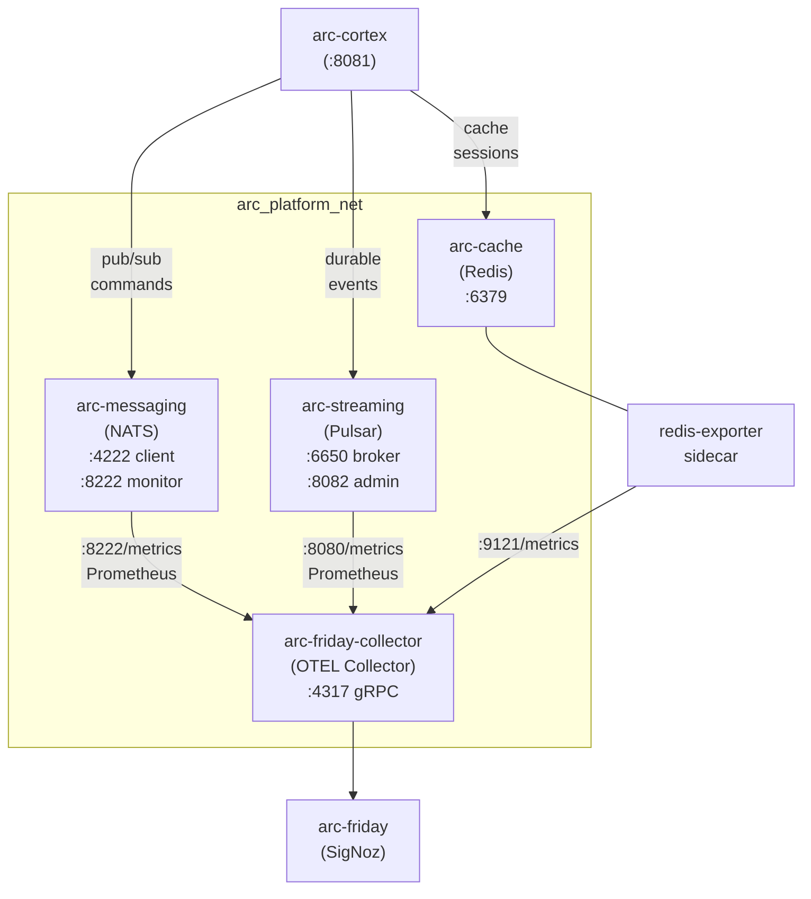
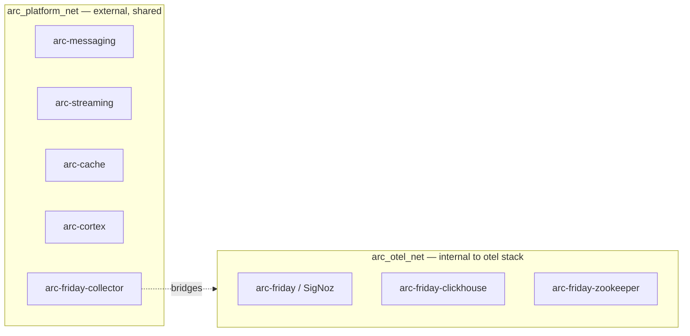

# Feature: Messaging & Cache Services Setup

> **Spec**: 003-messaging-setup
> **Author**: arc-framework
> **Date**: 2026-02-23
> **Status**: Draft

## Target Modules

| Module | Path | Impact |
|--------|------|--------|
| Services | `services/messaging/` | New — NATS (Flash), port 4222 |
| Services | `services/streaming/` | New — Pulsar (Strange), port 6650 |
| Services | `services/cache/` | New — Redis (Sonic), port 6379 |
| Services | `services/otel/` | Update — collector scrapes new services |
| Services | `services/profiles.yaml` | Update — add messaging to `think` profile |
| CI/CD | `.github/workflows/` | New — messaging-images.yml + messaging-release.yml |
| Makefile | `Makefile`, `*.mk` | New — flash.mk, strange.mk, sonic.mk |

## Overview

Provision NATS (Flash), Apache Pulsar (Strange), and Redis (Sonic) as production-grade platform services in the arc-platform monorepo. These services form the messaging and caching backbone that Cortex and all future AI agents depend on. Each service follows the same pattern as the OTEL stack: thin Dockerfile, `service.yaml`, `docker-compose.yml`, dedicated Makefile include, and CI/release workflows. The OTEL collector is updated to scrape Prometheus metrics from all three services, making them visible in arc-friday (SigNoz).

## Architecture



### Service Roles

| Codename | Service | Role | When to Use |
|----------|---------|------|-------------|
| Flash | NATS + JetStream | Ephemeral pub/sub, request/reply, commands | Sub-ms agent coordination |
| Strange | Apache Pulsar | Durable event streams, replay, multi-tenant | Event sourcing, audit logs |
| Sonic | Redis | Cache, session store, rate limiting | Fast k/v access, TTL-based state |

### Directory Layout

```
services/
├── messaging/        ← Flash (NATS)
│   ├── Dockerfile
│   ├── service.yaml
│   ├── docker-compose.yml
│   └── flash.mk
├── streaming/        ← Strange (Pulsar)
│   ├── Dockerfile
│   ├── service.yaml
│   ├── docker-compose.yml
│   └── strange.mk
└── cache/            ← Sonic (Redis)
    ├── Dockerfile
    ├── service.yaml
    ├── docker-compose.yml
    └── sonic.mk
```

## User Scenarios & Testing

### P1 — Must Have

**US-1**: As a platform developer, I want to run NATS, Pulsar, and Redis with a single make command so that my local dev environment is ready for agent workloads.
- **Given**: Docker is running, `make messaging-up` is executed
- **When**: All three services start
- **Then**: NATS is reachable on `:4222`, Pulsar on `:6650`, Redis on `:6379`; all health checks pass
- **Test**: `make flash-health && make strange-health && make sonic-health`

**US-2**: As a platform developer, I want arc-cortex to successfully bootstrap against live NATS, Pulsar, and Redis so that the full `think` profile works end-to-end.
- **Given**: Messaging services are running
- **When**: `make cortex-run-dev` is executed
- **Then**: Cortex starts without "connection refused" errors; `/health/deep` reports all dependencies healthy
- **Test**: `curl http://localhost:8081/health/deep`

**US-3**: As a platform operator, I want all three services visible in arc-friday (SigNoz) so that I can monitor messaging health from a single dashboard.
- **Given**: OTEL stack and messaging services are running
- **When**: Metrics are scraped by the updated collector
- **Then**: NATS, Pulsar, and Redis metrics appear in SigNoz under the respective service names
- **Test**: Navigate to arc-friday metrics explorer; filter by `service.name = arc-messaging`, `arc-streaming`, `arc-cache`

**US-4**: As a CI consumer, I want Docker images for all three services built and pushed on main branch merges so that the team always has fresh images.
- **Given**: A commit is merged to main touching `services/messaging/**`, `services/streaming/**`, or `services/cache/**`
- **When**: `messaging-images.yml` workflow runs
- **Then**: Images `ghcr.io/arc-framework/arc-messaging`, `arc-streaming`, `arc-cache` are updated with the new `sha-*` tag
- **Test**: Inspect GHCR after CI completes

### P2 — Should Have

**US-5**: As a platform developer, I want each messaging service to have its own `service.yaml` so that cortex and the arc CLI can discover and orchestrate them declaratively.
- **Test**: `cat services/messaging/service.yaml` contains name, port, health, depends_on

**US-6**: As a release engineer, I want to publish versioned images for all three services via a single `messaging/vX.Y.Z` git tag so that releases are atomic.
- **Test**: Push tag `messaging/v0.1.0`; `messaging-release.yml` builds + pushes all three images with `messaging-v0.1.0` tag

**US-7**: As a platform developer, I want `make messaging-up` to start all three services at once, and `make messaging-down` to stop them, mirroring the `otel-up` / `otel-down` UX.
- **Test**: Both commands work; subsequent `make messaging-up` is idempotent

### P3 — Nice to Have

**US-8**: As a platform developer, I want `make messaging-logs` to tail logs from all three containers simultaneously so I can debug messaging issues without opening multiple terminals.
- **Test**: `make messaging-logs` fans out to NATS, Pulsar, and Redis log streams

**US-9**: As a developer, I want NATS JetStream streams pre-created on startup (AGENT_COMMANDS, AGENT_EVENTS, SYSTEM_METRICS) so that agents can publish without manual setup.
- **Test**: After `make flash-up`, `nats stream ls` shows the three streams

## Requirements

### Functional

- [ ] FR-1: Create `services/messaging/` with a NATS Dockerfile using `nats:alpine`, `service.yaml`, `docker-compose.yml`, and `flash.mk`
- [ ] FR-2: Create `services/streaming/` with a Pulsar Dockerfile using `apachepulsar/pulsar:latest`, `service.yaml`, `docker-compose.yml`, and `strange.mk`
- [ ] FR-3: Create `services/cache/` with a Redis Dockerfile using `redis:alpine`, `service.yaml`, `docker-compose.yml`, and `sonic.mk`
- [ ] FR-4: NATS must run with JetStream enabled; three default streams created (AGENT_COMMANDS, AGENT_EVENTS, SYSTEM_METRICS)
- [ ] FR-5: Pulsar must run in standalone mode; admin API available on `:8082` (host-mapped from internal `:8080`)
- [ ] FR-6: Redis must run with AOF persistence (`appendonly yes`, `appendfsync everysec`), `maxmemory 512mb`, `maxmemory-policy noeviction`
- [ ] FR-7: Update `arc-friday-collector` config to scrape Prometheus metrics from NATS (`:8222/metrics`) and Pulsar (`:8080/metrics`); Redis metrics deferred — see Tech Debt
- [ ] FR-8: Update `services/profiles.yaml` — add messaging services to `think` profile (cortex needs them at bootstrap)
- [ ] FR-9: Create `messaging-images.yml` CI workflow — change detection per service, parallel build for all three, `linux/amd64` in CI
- [ ] FR-10: Create `messaging-release.yml` release workflow — tag format `messaging/vX.Y.Z`, builds all three multi-platform (`linux/amd64,linux/arm64`), creates GitHub release
- [ ] FR-11: Add convenience aggregates: `make messaging-up` / `make messaging-down` / `make messaging-health` / `make messaging-logs`
- [ ] FR-12: Include `flash.mk`, `strange.mk`, `sonic.mk` in root Makefile

### Non-Functional

- [ ] NFR-1: NATS and Redis containers must run as non-root (UID 1000); Pulsar may run as its default UID (upstream constraint, documented)
- [ ] NFR-2: All services must expose health endpoints consumable by Docker health checks
- [ ] NFR-3: Data volumes must use named Docker volumes (not bind mounts) to match the otel pattern and keep host filesystem clean
- [ ] NFR-4: NATS monitoring port (8222) and Pulsar admin port (8082) must bind to `127.0.0.1` only (no `0.0.0.0` exposure)
- [ ] NFR-5: Docker images must include standard OCI and `arc.service.*` labels
- [ ] NFR-6: CI build must complete in under 3 minutes (amd64 only; no QEMU)

### Key Entities

| Entity | Module | Description |
|--------|--------|-------------|
| `arc-messaging` | `services/messaging/` | NATS 2.10 + JetStream; ephemeral pub/sub broker |
| `arc-streaming` | `services/streaming/` | Pulsar 3.3 standalone; durable event store |
| `arc-cache` | `services/cache/` | Redis 7.4; cache + session store |
| `flash.mk` | `services/messaging/` | Make targets: flash-up, flash-down, flash-health, flash-logs, flash-build |
| `strange.mk` | `services/streaming/` | Make targets: strange-up, strange-down, strange-health, strange-logs, strange-build |
| `sonic.mk` | `services/cache/` | Make targets: sonic-up, sonic-down, sonic-health, sonic-logs, sonic-build |

## Port Reference

| Service | Container Port | Host Binding | Purpose |
|---------|---------------|--------------|---------|
| NATS | 4222 | `127.0.0.1:4222` | Client connections |
| NATS | 8222 | `127.0.0.1:8222` | HTTP monitoring + Prometheus |
| NATS | 6222 | not exposed | Cluster routing (single-node) |
| Pulsar | 6650 | `127.0.0.1:6650` | Binary protocol (broker) |
| Pulsar | 8080 | `127.0.0.1:8082` | HTTP admin API (mapped to 8082) |
| Redis | 6379 | `127.0.0.1:6379` | Redis protocol |
| redis-exporter | 9121 | internal only | Prometheus metrics for Redis |

## OTEL Collector Update

The `arc-friday-collector` config (baked into `services/otel/telemetry/`) needs a new `prometheus` receiver block and updated `service.pipelines.metrics`:

```yaml
receivers:
  # ... existing receivers ...
  prometheus:
    config:
      scrape_configs:
        - job_name: arc-messaging
          static_configs:
            - targets: ['arc-messaging:8222']
        - job_name: arc-streaming
          static_configs:
            - targets: ['arc-streaming:8080']
        # arc-cache (Redis) — deferred, see Tech Debt TD-001
```

The collector must join `arc_platform_net` (see Network Strategy) to resolve `arc-messaging` and `arc-streaming` by hostname.

## Network Strategy

Two networks, not three. One shared platform network for all externally-visible services; one isolated internal network for the otel storage backend.



**Rules:**
- `arc_platform_net` is declared `external: true` in each compose file — created once (`docker network create arc_platform_net`)
- `arc_otel_net` stays internal to the otel stack; only the collector joins both
- Messaging services join only `arc_platform_net`
- The collector scrapes NATS/Pulsar metrics by container hostname over `arc_platform_net`
- `arc_otel_net` is **removed** from this feature — the old single-network `arc_otel_net` in the otel compose becomes the internal net; the collector gains `arc_platform_net`

## Tech Debt

| ID | Item | Rationale |
|----|------|-----------|
| TD-001 | Redis Prometheus metrics via `redis_exporter` sidecar | `redis_exporter` adds a sidecar container per redis instance. Deferred until we have a concrete dashboard requirement. When ready: add `oliver006/redis_exporter:latest` alongside `arc-cache` in `services/cache/docker-compose.yml`, scrape `:9121/metrics` from the collector. |

## Edge Cases

| Scenario | Expected Behavior |
|----------|-------------------|
| Pulsar cold start > 60s | Health check allows 60s start_period; compose waits before marking dependent services healthy |
| NATS data volume missing | JetStream creates `/data/jetstream` automatically; no manual init needed |
| Redis OOM with noeviction | Redis returns `OOM command not allowed` error to client; does not evict keys; operator must increase `maxmemory` |
| Collector cannot reach NATS `:8222` | Scrape fails silently; traces/logs still flow; no cascading failure |
| Pulsar admin port (8082) conflict | If `:8082` is already bound on host, docker compose fails at port bind; operator must free the port |
| `make messaging-up` before otel-up | Services start but OTEL metrics are lost until collector is running; not a blocking failure |
| `messaging-release.yml` — CRITICAL CVE | Security gate blocks release; creates GitHub issue per finding |

## Success Criteria

- [ ] SC-1: `make messaging-up && make messaging-health` exits 0 with all three services healthy
- [ ] SC-2: `make cortex-run-dev` succeeds with messaging services running; `/health/deep` reports healthy
- [ ] SC-3: NATS, Pulsar, Redis metrics visible in arc-friday within 60s of `make otel-up && make messaging-up`
- [ ] SC-4: `messaging-images.yml` CI completes in under 3 minutes for an amd64-only change
- [ ] SC-5: `git tag messaging/v0.1.0 && git push --tags` triggers `messaging-release.yml` and publishes all three multi-platform images
- [ ] SC-6: All Dockerfiles pass `trivy image` scan with zero CRITICAL CVEs
- [ ] SC-7: `services/profiles.yaml` `think` profile includes flash, strange, sonic
- [ ] SC-8: `docker inspect arc-messaging` shows it runs as non-root UID

## Docs & Links Update

- [ ] Update `services/profiles.yaml` — add flash, strange, sonic to `think` profile
- [ ] Update `CLAUDE.md` service codename table if changed
- [ ] Verify `services/cortex/service.yaml` `depends_on` codenames match the new service.yaml `name` fields

## Constitution Compliance

| Principle | Applies | Compliant | Notes |
|-----------|---------|-----------|-------|
| I. Zero-Dep CLI | [ ] | n/a | Services only — no CLI changes |
| II. Platform-in-a-Box | [x] | [x] | `make messaging-up` boots all three; joins `think` profile |
| III. Modular Services | [x] | [x] | Each service self-contained in own directory; flat under `services/` |
| IV. Two-Brain | [x] | [x] | Config-only services — no language concern |
| V. Polyglot Standards | [x] | [x] | Dockerfiles, compose, health checks follow otel pattern |
| VI. Local-First | [ ] | n/a | CLI-only principle |
| VII. Observability | [x] | [x] | All three services scraped by collector → visible in arc-friday |
| VIII. Security | [x] | [x] | Non-root containers (NATS, Redis); host-only port binding; no secrets in git |
| IX. Declarative | [ ] | n/a | CLI-only principle |
| X. Stateful Ops | [ ] | n/a | CLI-only principle |
| XI. Resilience | [x] | [x] | Health checks with appropriate start_periods; data volumes survive restart |
| XII. Interactive | [ ] | n/a | CLI-only principle |
