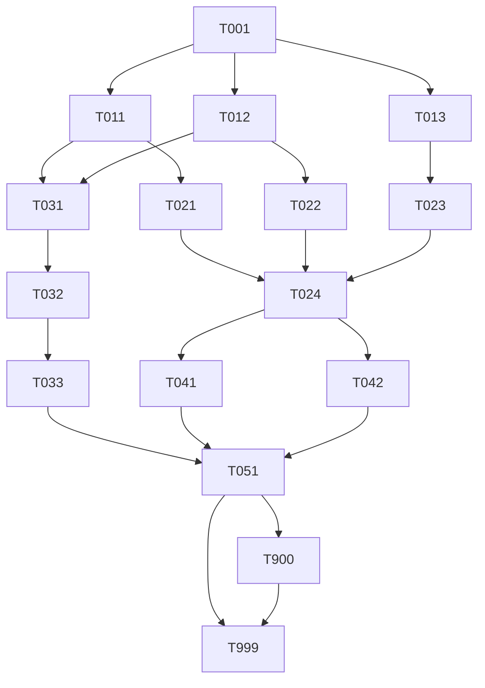

# Tasks: Messaging & Cache Services Setup

> **Spec**: 003-messaging-setup
> **Date**: 2026-02-23

## Task Format

```
[TASK-NNN] [P?] [MODULE] [PRIORITY] Description
  Dependencies: [TASK-XXX] or none
  Module: services/{role}
  Acceptance: Testable criteria
  Status: [ ] pending | [~] in-progress | [x] done
```

- `[P]` = Safe for parallel agent execution
- Priority: P1 (must), P2 (should), P3 (nice)

## Dependency Graph



## Quality Requirements

| Module | Coverage | Lint | Notes |
|--------|----------|------|-------|
| Services (config) | n/a | `docker compose config` validates | No Go/Python code |
| Dockerfiles | n/a | `docker build` succeeds | Security: trivy scan |
| Workflows | n/a | `actionlint` or manual review | |

---

## Phase 1: Setup

### TASK-001 — Update profiles.yaml

- [ ] [TASK-001] [SERVICES] [P1] Add flash, strange, sonic to `think` profile in profiles.yaml
  - Dependencies: none
  - Module: `services/profiles.yaml`
  - Acceptance:
    - `think` profile lists `flash`, `strange`, `sonic` alongside `cortex`
    - `reason` profile unchanged (it extends think implicitly via the CLI)
    - `cat services/profiles.yaml` shows all three codenames under think
  - Status: [ ] pending

---

## Phase 2: Service Directories (fully parallel)

> All three tasks are independent. Dispatch as parallel agents.

### TASK-011 [P] — Flash (NATS) service files

- [ ] [TASK-011] [P] [SERVICES] [P1] Create `services/messaging/` — NATS Dockerfile, service.yaml, docker-compose.yml
  - Dependencies: TASK-001
  - Module: `services/messaging/`
  - Files to create:
    - `services/messaging/Dockerfile`
    - `services/messaging/service.yaml`
    - `services/messaging/docker-compose.yml`
  - Acceptance:
    - `docker build -t arc-flash:test services/messaging/` exits 0
    - `docker inspect arc-flash:test` — User field is non-root (nats user, uid 1000)
    - `docker inspect arc-flash:test` — Labels include `arc.service.codename=flash`, `arc.service.tech=nats`
    - `docker compose -f services/messaging/docker-compose.yml config` exits 0
    - `service.yaml` contains: `name: arc-flash`, `codename: flash`, `port: 4222`, `health: http://localhost:8222/healthz`
    - Container `arc-flash` in compose binds ports to `127.0.0.1` only
    - Named volume `arc-flash-jetstream` declared (not bind mount)
    - Network declared as `arc_platform_net` with `external: true`
  - Status: [ ] pending

### TASK-012 [P] — Strange (Pulsar) service files

- [ ] [TASK-012] [P] [SERVICES] [P1] Create `services/streaming/` — Pulsar Dockerfile, service.yaml, docker-compose.yml
  - Dependencies: TASK-001
  - Module: `services/streaming/`
  - Files to create:
    - `services/streaming/Dockerfile`
    - `services/streaming/service.yaml`
    - `services/streaming/docker-compose.yml`
  - Acceptance:
    - `docker build -t arc-strange:test services/streaming/` exits 0
    - `docker inspect arc-strange:test` — Labels include `arc.service.codename=strange`, `arc.service.tech=pulsar`
    - `docker compose -f services/streaming/docker-compose.yml config` exits 0
    - `service.yaml` contains: `name: arc-strange`, `codename: strange`, `port: 6650`, health endpoint
    - Compose: `PULSAR_MEM: "-Xms512m -Xmx1024m -XX:MaxDirectMemorySize=512m"` and `--no-functions-worker`
    - Compose: port `6650` binds `127.0.0.1:6650`, admin `8080` maps to `127.0.0.1:8082`
    - Named volume `arc-strange-data` declared
    - Health check uses `curl -f http://localhost:8080/admin/v2/brokers/health` with `start_period: 90s`
    - Pulsar non-root deviation documented in compose comment (upstream constraint)
    - Network `arc_platform_net` with `external: true`
  - Status: [ ] pending

### TASK-013 [P] — Sonic (Redis) service files

- [ ] [TASK-013] [P] [SERVICES] [P1] Create `services/cache/` — Redis Dockerfile, service.yaml, docker-compose.yml
  - Dependencies: TASK-001
  - Module: `services/cache/`
  - Files to create:
    - `services/cache/Dockerfile`
    - `services/cache/service.yaml`
    - `services/cache/docker-compose.yml`
  - Acceptance:
    - `docker build -t arc-sonic:test services/cache/` exits 0
    - `docker inspect arc-sonic:test` — User field is non-root
    - `docker inspect arc-sonic:test` — Labels include `arc.service.codename=sonic`, `arc.service.tech=redis`
    - `docker compose -f services/cache/docker-compose.yml config` exits 0
    - `service.yaml` contains: `name: arc-sonic`, `codename: sonic`, `port: 6379`, health endpoint
    - Compose command includes: `--appendonly yes`, `--appendfsync everysec`, `--maxmemory 512mb`, `--maxmemory-policy noeviction`
    - Port `6379` binds `127.0.0.1:6379`
    - Named volume `arc-sonic-data` declared
    - Health check: `redis-cli ping` with `interval: 5s`, `start_period: 5s`
    - Network `arc_platform_net` with `external: true`
  - Status: [ ] pending

---

## Phase 3: Make Targets (parallel per service, then aggregate)

> TASK-021, 022, 023 are independent. Dispatch in parallel. TASK-024 waits for all three.

### TASK-021 [P] — flash.mk

- [ ] [TASK-021] [P] [SERVICES] [P1] Create `services/messaging/flash.mk` with all make targets
  - Dependencies: TASK-011
  - Module: `services/messaging/flash.mk`
  - Acceptance:
    - `make flash-build` — builds `arc-flash:latest` image
    - `make flash-up` — starts `arc-flash` container; exits 0
    - `make flash-health` — probes `http://localhost:8222/healthz`; exits 0 when healthy, non-zero when down
    - `make flash-logs` — tails arc-flash container logs
    - `make flash-down` — stops and removes arc-flash container
    - `make flash-clean` — stops container + removes named volume (with confirmation prompt)
    - All targets listed in `.PHONY`
    - Target comments follow `## flash-<target>: description` pattern (used by `make flash-help`)
    - `make flash-help` prints all flash targets
  - Status: [ ] pending

### TASK-022 [P] — strange.mk

- [ ] [TASK-022] [P] [SERVICES] [P1] Create `services/streaming/strange.mk` with all make targets
  - Dependencies: TASK-012
  - Module: `services/streaming/strange.mk`
  - Acceptance:
    - `make strange-build` — builds `arc-strange:latest` image
    - `make strange-up` — starts `arc-strange`; waits for health (Pulsar takes up to 90s on cold start); prints progress dots
    - `make strange-health` — probes `http://localhost:8082/admin/v2/brokers/health`; exits 0 when healthy
    - `make strange-logs` — tails arc-strange container logs
    - `make strange-down` — stops container
    - `make strange-clean` — stops container + removes named volume (with confirmation)
    - `make strange-help` prints all strange targets
    - All targets in `.PHONY`
  - Status: [ ] pending

### TASK-023 [P] — sonic.mk

- [ ] [TASK-023] [P] [SERVICES] [P1] Create `services/cache/sonic.mk` with all make targets
  - Dependencies: TASK-013
  - Module: `services/cache/sonic.mk`
  - Acceptance:
    - `make sonic-build` — builds `arc-sonic:latest` image
    - `make sonic-up` — starts `arc-sonic`; exits 0
    - `make sonic-health` — runs `docker exec arc-sonic redis-cli ping`; exits 0 when healthy
    - `make sonic-logs` — tails arc-sonic container logs
    - `make sonic-down` — stops container
    - `make sonic-clean` — stops + removes volume (with confirmation)
    - `make sonic-help` prints all sonic targets
    - All targets in `.PHONY`
  - Status: [ ] pending

### TASK-024 — messaging.mk aggregates + Makefile wiring

- [ ] [TASK-024] [SERVICES] [P1] Create `services/messaging.mk` aggregates and wire all .mk files into root Makefile
  - Dependencies: TASK-021, TASK-022, TASK-023
  - Module: `services/messaging.mk`, `Makefile`
  - Files to create/modify:
    - Create: `services/messaging.mk`
    - Modify: `Makefile`
  - Acceptance:
    - `services/messaging.mk` contains:
      - `messaging-up`: creates `arc_platform_net` if missing (`docker network create arc_platform_net 2>/dev/null || true`), then calls `flash-up`, `strange-up`, `sonic-up`
      - `messaging-down`: calls `flash-down`, `strange-down`, `sonic-down`
      - `messaging-health`: calls `flash-health`, `strange-health`, `sonic-health`; exits non-zero if any fails
      - `messaging-logs`: fans out `docker logs -f` for all three containers simultaneously
      - `messaging-help`: prints all messaging targets
    - `Makefile` includes:
      - `include services/messaging/flash.mk`
      - `include services/streaming/strange.mk`
      - `include services/cache/sonic.mk`
      - `include services/messaging.mk`
    - `make help` shows `messaging-help` entry
    - `make messaging-help` works from repo root
  - Status: [ ] pending

---

## Phase 4: OTEL Integration (sequential)

### TASK-031 — Update otel-collector-config.yaml

- [ ] [TASK-031] [SERVICES] [P1] Add prometheus receiver to `services/otel/telemetry/config/otel-collector-config.yaml`
  - Dependencies: TASK-011, TASK-012
  - Module: `services/otel/telemetry/config/otel-collector-config.yaml`
  - Acceptance:
    - `receivers` section contains a `prometheus` block with two scrape jobs:
      - `job_name: arc-flash` targeting `arc-flash:8222`
      - `job_name: arc-strange` targeting `arc-strange:8080`
      - Both with `scrape_interval: 15s`
    - `service.pipelines.metrics.receivers` updated from `[otlp]` to `[otlp, prometheus]`
    - File is valid YAML: `python3 -c "import yaml; yaml.safe_load(open('services/otel/telemetry/config/otel-collector-config.yaml'))"` exits 0
    - No other pipelines changed (traces and logs pipelines untouched)
  - Status: [ ] pending

### TASK-032 — Add arc_platform_net to otel collector compose

- [ ] [TASK-032] [SERVICES] [P1] Add `arc_platform_net` to `arc-friday-collector` in `services/otel/docker-compose.yml`
  - Dependencies: TASK-031
  - Module: `services/otel/docker-compose.yml`
  - Acceptance:
    - `arc-friday-collector` service has both `arc_otel_net` and `arc_platform_net` in its `networks` list
    - `arc_platform_net` declared at the bottom of the file as `external: true`
    - `arc_otel_net` definition unchanged (still internal, not external)
    - `docker compose -f services/otel/docker-compose.yml config` exits 0
    - No other services in the otel compose gain `arc_platform_net` (only the collector bridges both)
  - Status: [ ] pending

### TASK-033 — Rebuild and verify otel collector image

- [ ] [TASK-033] [SERVICES] [P1] Rebuild `arc-friday-collector` image to bake in updated config; verify it starts
  - Dependencies: TASK-032
  - Module: `services/otel/`
  - Acceptance:
    - `make otel-build` (or `docker compose -f services/otel/docker-compose.yml build arc-friday-collector`) exits 0
    - `docker run --rm ghcr.io/arc-framework/arc-friday-collector:latest --config=/etc/otelcol/config.yaml validate` exits 0 (or equivalent config validation)
    - If otel stack is running locally: `make otel-down && make otel-up` brings collector back healthy with new config
    - `docker inspect ghcr.io/arc-framework/arc-friday-collector:latest` shows updated image (new layer for config)
  - Status: [ ] pending

---

## Phase 5: CI/CD Workflows (parallel)

### TASK-041 [P] — messaging-images.yml

- [ ] [TASK-041] [P] [CI] [P1] Create `.github/workflows/messaging-images.yml` — CI pipeline for all three services
  - Dependencies: TASK-024
  - Module: `.github/workflows/messaging-images.yml`
  - Acceptance:
    - Triggers on `push` to `main`/`dev` with path filters per service (`services/messaging/**`, `services/streaming/**`, `services/cache/**`)
    - Triggers on `pull_request` to `main` (build only, no push)
    - Triggers on `workflow_dispatch` with `mode: ci | release`
    - `changes` job uses `dorny/paths-filter@v3` — outputs `flash`, `strange`, `sonic`, `push-image`
    - Three parallel build jobs (`build-flash`, `build-strange`, `build-sonic`), each gated on its respective change output
    - All three jobs use `_reusable-build.yml` with `platforms: linux/amd64` (no QEMU)
    - `push-image: true` only on `main` push or `mode=release`
    - `security` job runs after all three builds; `block-on-failure: false` in CI
    - File is valid YAML; mirrors `cortex-images.yml` structure
  - Status: [ ] pending

### TASK-042 [P] — messaging-release.yml

- [ ] [TASK-042] [P] [CI] [P1] Create `.github/workflows/messaging-release.yml` — release pipeline on `messaging/v*` tags
  - Dependencies: TASK-024
  - Module: `.github/workflows/messaging-release.yml`
  - Acceptance:
    - Triggers on `push` with tag pattern `messaging/v*`
    - `prepare` job derives `image-tag` (`messaging/v0.1.0` → `messaging-v0.1.0`), `version`, `prerelease` flag
    - Three build jobs (`build-flash`, `build-strange`, `build-sonic`) run in parallel after `prepare`
    - All three use `_reusable-build.yml` with `platforms: linux/amd64,linux/arm64`, `push-image: true`, `latest-tag: true`
    - `security` job runs after all three builds; `block-on-failure: true`, `create-issues: true`
    - `release` job creates GitHub release with image reference table (mirrors `cortex-release.yml` release notes format)
    - `permissions: contents: write, packages: write, security-events: write, issues: write`
    - File is valid YAML
  - Status: [ ] pending

---

## Phase 6: Integration

### TASK-051 — End-to-end health verification

- [ ] [TASK-051] [SERVICES] [P1] Verify full stack: messaging-up, health checks, otel metrics flow
  - Dependencies: TASK-033, TASK-041, TASK-042
  - Module: `services/` (runtime verification, no file changes)
  - Acceptance:
    - `docker network create arc_platform_net 2>/dev/null || true` — network exists
    - `make messaging-up` exits 0; all three containers in `healthy` state (`docker compose ps` or `docker inspect`)
    - `make messaging-health` exits 0
    - `make flash-health` exits 0 independently
    - `make strange-health` exits 0 independently (allow up to 90s on cold start)
    - `make sonic-health` exits 0 independently
    - `make messaging-down` stops all three; no orphaned containers (`docker ps -a | grep arc-flash` etc.)
    - `make messaging-up` is idempotent (run twice, no error on second run)
    - If otel stack running: `curl -s http://localhost:8222/metrics` returns NATS Prometheus data; collector scrape visible in SigNoz
  - Status: [ ] pending

---

## Phase 7: Polish

### TASK-900 — Docs & links update

- [ ] [TASK-900] [P] [DOCS] [P1] Docs & links update
  - Dependencies: TASK-051
  - Module: `services/profiles.yaml`, `services/cortex/service.yaml`, `CLAUDE.md`
  - Acceptance:
    - `services/cortex/service.yaml` `depends_on` codenames (`flash`, `strange`, `sonic`) match the `name` fields in each new `service.yaml`
    - `CLAUDE.md` service codename table reflects: messaging=flash/nats, streaming=strange/pulsar, cache=sonic/redis
    - No broken cross-references introduced
  - Status: [ ] pending

### TASK-999 — Reviewer agent verification

- [ ] [TASK-999] [REVIEW] [P1] Reviewer agent verifies all tasks complete, quality gates met
  - Dependencies: ALL
  - Module: all affected modules
  - Acceptance:
    - All TASK-001 through TASK-900 marked `[x]` done
    - `make messaging-up && make messaging-health` exits 0
    - All Dockerfiles build without error
    - `docker compose config` exits 0 for all three new compose files and the updated otel compose
    - `messaging-images.yml` and `messaging-release.yml` are valid YAML
    - No secrets or credentials in any committed file
    - Pulsar non-root deviation is documented inline (not a silent violation)
    - Constitution compliance: II, III, VII, VIII, XI all passing per plan.md checklist
  - Status: [ ] pending

---

## Progress Summary

| Phase | Total | Done | Parallel |
|-------|-------|------|----------|
| Setup | 1 | 0 | 0 |
| Service Directories | 3 | 0 | 3 |
| Make Targets | 4 | 0 | 3 |
| OTEL Integration | 3 | 0 | 0 |
| CI/CD Workflows | 2 | 0 | 2 |
| Integration | 1 | 0 | 0 |
| Polish | 2 | 0 | 1 |
| **Total** | **16** | **0** | **9** |
