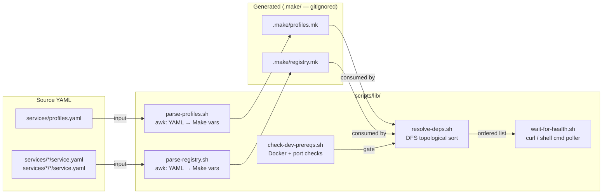
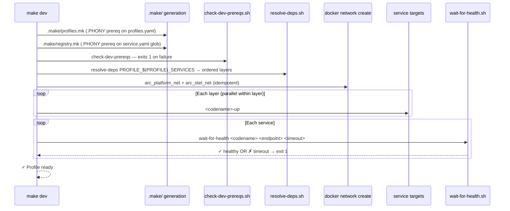

# Implementation Plan: Dev Setup Orchestration

> **Spec**: 004-dev-setup
> **Date**: 2026-02-28

## Summary

Add a `make dev` entrypoint that starts the full `think` profile in dependency order by generating `.make/profiles.mk` and `.make/registry.mk` from YAML source files, then resolving startup layers via topological sort before gating each layer on health checks. The implementation is pure Makefile + POSIX shell — no new runtimes, no new tool dependencies.

## Target Modules

| Module | Language | Changes |
|--------|----------|---------|
| `scripts/lib/` | bash (POSIX) | 5 new orchestration scripts |
| `services/otel/` | YAML | 2 new `service.yaml` metadata files |
| `services/cortex/` | YAML + Make | `service.yaml` patch + `cortex.mk` alias targets |
| `services/otel/` | Make | `otel.mk` alias targets |
| `services/` | YAML | `profiles.yaml` patch |
| Root | Make | `Makefile` — generated includes + `dev-*` targets |
| Root | gitignore | `.gitignore` patch |

## Technical Context

| Aspect | Value |
|--------|-------|
| Language(s) | bash (POSIX-compatible), GNU Make |
| Framework(s) | Make — `-include`, prerequisite rules, `.PHONY` |
| Storage | `.make/` generated files (gitignored) |
| Testing | Manual `make dev && make dev-health`; unit tests via `bats` if available; otherwise `bash -n` syntax check |
| Key Dependencies | `awk`, `curl`, `docker`, `docker compose` v2 — all pre-existing |

## Architecture

### Script Layer



### Make Execution Flow



## Technical Decisions

### 1. YAML Parsing — `awk` only

No `yq`, no Python, no `jq`. The YAML in `service.yaml` files is simple enough that `awk` handles it:
- Scalar fields: `awk '/^codename:/ { print $2 }'`
- List fields (`depends_on`): capture lines between `depends_on:` and next dedented key
- `profiles.yaml` profile sections: capture `services:` list per profile block

**Risk**: Multi-level indentation in `ultra-instinct`'s `services: '*'` — handle as a special case in `parse-profiles.sh`.

### 2. Generated Files — `-include` pattern

```makefile
# Silently skip if .make/ doesn't exist yet — generation targets create it
-include .make/profiles.mk
-include .make/registry.mk

.make/profiles.mk: services/profiles.yaml | .make
	scripts/lib/parse-profiles.sh > $@

.make/registry.mk: $(shell find services -name service.yaml) | .make
	scripts/lib/parse-registry.sh > $@

.make:
	mkdir -p $@
```

The `$(shell find ...)` in the prerequisite list means Make re-evaluates staleness on every `make` invocation — no manual `make regen` step needed.

### 3. Health Endpoint Type Discrimination

`wait-for-health.sh` inspects the endpoint argument:

```
http:// or https://  →  curl -sf <endpoint> > /dev/null
otherwise            →  eval <endpoint>   (e.g. redis-cli ping)
```

**sonic edge case**: `service.yaml` has `health: redis-cli ping` which requires `redis-cli` on host. The implementation will prefer `docker exec arc-cache redis-cli ping` as the runtime endpoint passed to `wait-for-health.sh`, overriding the YAML value in the generated registry. Alternatively, update sonic's `service.yaml` health field to `docker exec arc-cache redis-cli ping` — **preferred** to keep single source of truth.

> **Decision**: Update `services/cache/service.yaml` health to `docker exec arc-cache redis-cli ping` as part of this feature (add as FR-16 in tasks).

### 4. Topological Sort — DFS in shell

`resolve-deps.sh` implements Kahn's algorithm (simpler than recursive DFS in POSIX shell):
1. Build adjacency list from `SERVICE_<n>_DEPENDS` registry variables
2. Compute in-degree for each service in the profile
3. Emit zero-in-degree services as Layer 0; reduce in-degrees; repeat
4. If any service remains unprocessed → cycle detected → exit 1
5. If any depends_on name not in `ALL_SERVICES` → unregistered → exit 1

Output format: space-separated service names per line, one line per layer.

### 5. Network Creation — idempotent

```makefile
dev-networks:
	@docker network create arc_platform_net 2>/dev/null || true
	@docker network create arc_otel_net 2>/dev/null || true
```

### 6. Alias Target Pattern

Aliases use Make prerequisite chaining (not shell `$(MAKE)` recursion) to avoid subprocess overhead:

```makefile
.PHONY: cortex-up cortex-down
cortex-up: cortex-docker-up   # Make runs cortex-docker-up recipe
cortex-down: cortex-docker-down
```

For `friday-collector-up` (delegates to `otel-up-telemetry`):
```makefile
.PHONY: friday-collector-up friday-collector-down friday-collector-health
friday-collector-up: otel-up-telemetry
friday-collector-down:
	$(COMPOSE_OTEL) stop arc-friday-collector
friday-collector-health:
	@curl -sf http://localhost:13133/ > /dev/null \
	  && printf "$(COLOR_OK)✓$(COLOR_OFF) friday-collector healthy\n" \
	  || { printf "$(COLOR_ERR)✗ friday-collector unreachable$(COLOR_OFF)\n"; exit 1; }
```

## Constitution Check

| # | Principle | Status | Evidence |
|---|-----------|--------|----------|
| I | Zero-Dep CLI | N/A | No CLI changes |
| II | Platform-in-a-Box | **PASS** | `make dev` = single command → working platform |
| III | Modular Services | **PASS** | Framework reads per-service `service.yaml`; adding a service is self-contained |
| IV | Two-Brain | N/A | Shell only — no Go/Python introduced |
| V | Polyglot Standards | **PASS** | Scripts source `common.sh`; follow `→ ✓ ✗` conventions |
| VI | Local-First | N/A | CLI principle only |
| VII | Observability | **PASS** | `friday-collector` in `think` profile ensures OTEL collection by default |
| VIII | Security | **PASS** | No secrets in scripts; port pre-checks prevent conflicts |
| IX | Declarative | **PASS** | `profiles.yaml` + `service.yaml` = source of truth; Make reconciles |
| X | Stateful Ops | N/A | CLI principle only |
| XI | Resilience | **PASS** | Health gating between layers; fail-fast on unregistered/circular deps |
| XII | Interactive | N/A | CLI principle only |

## Project Structure

```
arc-platform/
├── .make/                                  # Generated — gitignored
│   ├── profiles.mk                         # PROFILE_THINK_SERVICES := ...
│   └── registry.mk                         # SERVICE_flash_HEALTH := ...
├── scripts/lib/
│   ├── common.sh                           # Existing — sourced by all scripts
│   ├── parse-profiles.sh                   # NEW: profiles.yaml → profiles.mk
│   ├── parse-registry.sh                   # NEW: service.yaml glob → registry.mk
│   ├── resolve-deps.sh                     # NEW: topological sort (Kahn's algo)
│   ├── wait-for-health.sh                  # NEW: HTTP + command health poller
│   └── check-dev-prereqs.sh               # NEW: Docker + port prereq checks
├── services/
│   ├── profiles.yaml                       # PATCH: add friday-collector to think
│   ├── cache/service.yaml                  # PATCH: health → docker exec arc-cache
│   ├── cortex/
│   │   ├── service.yaml                    # PATCH: remove oracle from depends_on
│   │   └── cortex.mk                       # PATCH: add cortex-up/down aliases
│   └── otel/
│       ├── otel.mk                         # PATCH: add friday-collector-* aliases
│       ├── service.yaml                    # NEW: full OTEL stack metadata
│       └── telemetry/
│           └── service.yaml               # NEW: collector-only metadata
├── Makefile                                # PATCH: -include, .make/ rules, dev-* targets
└── .gitignore                              # PATCH: add .make/
```

## Parallel Execution Strategy

The implementation has two natural phases. Within Phase 1, all groups run fully in parallel.

```mermaid
gantt
    title 004-dev-setup Implementation Phases
    dateFormat  HH:mm
    axisFormat  %H:%M

    section Phase 1 — Parallel
    Group A: YAML patches       :a1, 00:00, 20m
    Group B: parse-*.sh scripts :b1, 00:00, 30m
    Group C: resolve + wait + prereqs :c1, 00:00, 45m
    Group D: .mk alias targets  :d1, 00:00, 15m

    section Phase 2 — Sequential
    Makefile update (FR-8)      :e1, after b1 c1, 30m

    section Phase 3 — Verify
    Integration test + review   :f1, after e1, 20m
```



### Group A — YAML Patches (no dependencies)
- FR-9: `services/profiles.yaml` — add `friday-collector` to `think`
- FR-12: `services/cortex/service.yaml` — remove `oracle` from `depends_on`
- FR-13: `.gitignore` — add `.make/`
- FR-6: `services/otel/service.yaml` — new file
- FR-7: `services/otel/telemetry/service.yaml` — new file
- FR-16 (new): `services/cache/service.yaml` — update health endpoint

### Group B — Parsing Scripts (no dependencies)
- FR-1: `scripts/lib/parse-profiles.sh`
- FR-2: `scripts/lib/parse-registry.sh`

### Group C — Orchestration Scripts (no dependencies)
- FR-3: `scripts/lib/resolve-deps.sh`
- FR-4: `scripts/lib/wait-for-health.sh`
- FR-5: `scripts/lib/check-dev-prereqs.sh`

### Group D — .mk Alias Targets (no dependencies)
- FR-10: `services/otel/otel.mk` — `friday-collector-*` aliases
- FR-11: `services/cortex/cortex.mk` — `cortex-up/down` aliases

### Phase 2 — Makefile (after Phase 1 complete)
- FR-8: Root `Makefile` — `-include` directives, `.make/` generation rules, `dev-*` targets

## Script Interface Contracts

These contracts are the boundary between Phase 1 and Phase 2.

```bash
# parse-profiles.sh — reads services/profiles.yaml, writes to stdout
# Output: Make variable assignments
#   PROFILE_THINK_SERVICES := flash sonic strange friday-collector cortex
#   PROFILE_REASON_SERVICES := flash sonic strange friday-collector cortex otel
#   ALL_PROFILES := think reason ultra-instinct
scripts/lib/parse-profiles.sh

# parse-registry.sh — scans service.yaml files, writes to stdout
# Output:
#   ALL_SERVICES := flash sonic strange friday-collector cortex otel
#   SERVICE_flash_HEALTH := http://localhost:8222/healthz
#   SERVICE_flash_DEPENDS :=
#   SERVICE_flash_TIMEOUT := 60
#   SERVICE_cortex_DEPENDS := flash sonic strange friday-collector
scripts/lib/parse-registry.sh

# resolve-deps.sh — reads .make/registry.mk vars, takes service list, outputs layers
# Usage: resolve-deps.sh <svc1> <svc2> ...
# Output: one line per layer, services space-separated
#   flash sonic strange friday-collector
#   cortex
# Exit 1 on unregistered dep or cycle
scripts/lib/resolve-deps.sh flash sonic strange friday-collector cortex

# wait-for-health.sh — polls until healthy or timeout
# Usage: wait-for-health.sh <codename> <endpoint> [timeout_seconds]
# HTTP endpoint: curl -sf <endpoint>
# Command endpoint: eval <endpoint>
scripts/lib/wait-for-health.sh flash "http://localhost:8222/healthz" 60
scripts/lib/wait-for-health.sh sonic "docker exec arc-cache redis-cli ping" 30

# check-dev-prereqs.sh — validates environment
# Checks: docker daemon, docker compose v2, ports 4222 6379 6650 8082 13133 8081
# Output: colored checklist; exit 1 if any fail
scripts/lib/check-dev-prereqs.sh
```

## Makefile Target Specification

```makefile
PROFILE ?= think

# dev-* targets
dev:          dev-prereqs dev-networks .make/profiles.mk .make/registry.mk dev-up dev-wait
dev-up:       # start all profile services by layer (from resolve-deps output)
dev-down:     # stop all profile services (reverse layer order)
dev-health:   # call <codename>-health for each profile service
dev-logs:     # docker compose logs -f for all profile services
dev-status:   # formatted table: container name, status, health
dev-clean:    dev-down  # remove containers + volumes for profile services
dev-prereqs:  # scripts/lib/check-dev-prereqs.sh
dev-networks: # docker network create arc_platform_net arc_otel_net (idempotent)
dev-regen:    # force-rebuild .make/ files
```

## Reviewer Checklist

- [ ] `make dev` exits 0 for `think` profile (SC-1)
- [ ] `make dev-health` exits 0 and shows 5 ✓ services (SC-2)
- [ ] `make dev-down` leaves no `arc-*` containers running (SC-3)
- [ ] `make dev PROFILE=reason` starts SigNoz at `:3301` (SC-4)
- [ ] Unregistered `depends_on` causes `make dev` to exit 1 with correct message (SC-5)
- [ ] All existing targets (`flash-up`, `otel-up`, `cortex-docker-up`) still work (SC-6)
- [ ] `.make/profiles.mk` timestamp updates when `profiles.yaml` is touched (SC-7)
- [ ] `.make/registry.mk` timestamp updates when any `service.yaml` is touched (SC-8)
- [ ] `make dev-prereqs` exits 1 with `✗ Docker daemon not running` when Docker stopped (SC-9)
- [ ] All 5 scripts pass `bash -n` (syntax check)
- [ ] All 5 scripts are executable (`chmod +x`)
- [ ] `.make/` is present in `.gitignore`
- [ ] `services/cortex/service.yaml` no longer lists `oracle` in `depends_on`
- [ ] `services/profiles.yaml` `think` profile includes `friday-collector`

## Risks & Mitigations

| Risk | Impact | Mitigation |
|------|--------|------------|
| `awk` YAML parsing brittle for edge-case formatting | M | Validate against all existing `service.yaml` files; document expected format |
| Pulsar cold-start exceeds 120s timeout on slow machines | M | Default `strange` timeout 120s; document `STRANGE_TIMEOUT=180` override |
| `$(shell find ...)` in Makefile runs on every `make` invocation | L | Acceptable for dev workflow; document that CI should use `make dev-regen` explicitly |
| `ultra-instinct` `services: '*'` expansion hits unregistered services | M | `parse-profiles.sh` expands `*` only after `ALL_SERVICES` is built; validates each |
| `friday-collector-down` stops only collector but OTEL comment confuses users | L | Document clearly in `otel.mk` comment and `make friday-collector-help` output |
| cortex-docker-up builds the image (slow) before starting | M | `cortex-up` alias chains to `cortex-docker-up` which calls `cortex-build`; acceptable for now |
