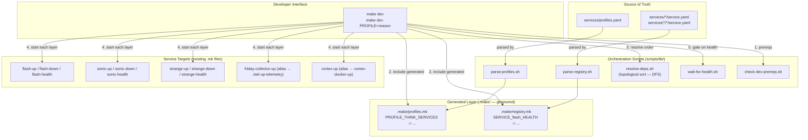
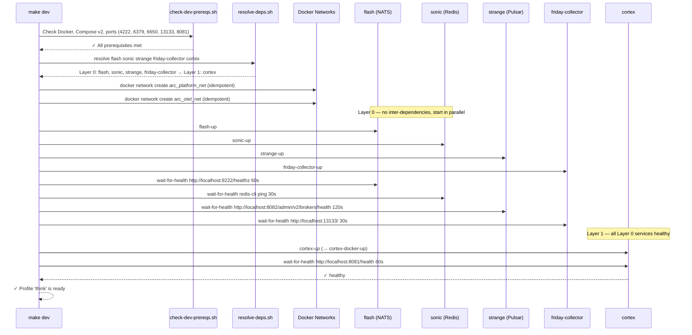

# Feature: Dev Setup Orchestration

> **Spec**: 004-dev-setup
> **Author**: arc-framework
> **Date**: 2026-02-28
> **Status**: Draft

## Target Modules

| Module | Path | Impact |
|--------|------|--------|
| Services | `Makefile` | Update — add `.make/` generation rules, `dev-*` orchestration targets |
| Services | `services/profiles.yaml` | Update — add `friday-collector` to `think` profile |
| Services | `services/otel/otel.mk` | Update — add `friday-collector-up/down/health` alias targets |
| Services | `services/cortex/cortex.mk` | Update — add `cortex-up/down` alias targets |
| Services | `services/cortex/service.yaml` | Update — remove `oracle` from `depends_on` (unregistered) |
| Services | `services/otel/service.yaml` | New — metadata for full OTEL stack |
| Services | `services/otel/telemetry/service.yaml` | New — metadata for collector-only |
| Scripts | `scripts/lib/` | New — 5 POSIX shell scripts for parsing, dep resolution, health, prereqs |
| Config | `.gitignore` | Update — add `.make/` |

## Overview

Build a Makefile-based orchestration framework so that `make dev` starts the entire platform in proper dependency order. Adding a new service requires only a `service.yaml`, `.mk` file, `Dockerfile`, and `docker-compose.yml` — the framework reads `profiles.yaml` and `service.yaml` files, resolves startup order via topological sort, gates each layer on health checks, and fails fast on missing or circular dependencies.

## Architecture

## Startup Sequence (think profile)

## Service Type Contract

Every service must provide:

| Artifact | Purpose | Required |
|----------|---------|---------|
| `service.yaml` | Codename, health endpoint, `depends_on` | Yes |
| `<codename>.mk` | Targets: `<name>-up`, `<name>-down`, `<name>-health` | Yes |
| `Dockerfile` | Container image definition | Yes |
| `docker-compose.yml` | Container orchestration | Yes |
| Go extras | `<name>-test`, `<name>-lint`, `<name>-bin`, `<name>-run` | Go services only |
| Python extras | `<name>-test`, `<name>-lint`, `<name>-venv`, `<name>-run` | Python services only |

## User Scenarios & Testing

### P1 — Must Have

**US-1**: As a platform developer, I want to run `make dev` and have the entire `think` profile start in dependency order so that my local environment is ready without memorizing startup commands.

- **Given**: Docker is running, no arc-* containers are active
- **When**: `make dev` is executed from repo root
- **Then**: flash, sonic, strange, friday-collector start in parallel (Layer 0); cortex starts after all Layer 0 services are healthy
- **Test**: `make dev && make dev-health` exits 0

**US-2**: As a platform developer, I want to run `make dev PROFILE=reason` to start the full observability stack so that I can debug with SigNoz dashboards.

- **Given**: Docker is running
- **When**: `make dev PROFILE=reason` is executed
- **Then**: All `think` services plus the full OTEL stack (SigNoz + ClickHouse + ZooKeeper + collector) start; SigNoz available at http://localhost:3301
- **Test**: `make dev PROFILE=reason && make dev-health` exits 0; `curl -sf http://localhost:3301/api/v1/health` exits 0

**US-3**: As a platform developer, I want `make dev` to fail immediately with a clear message if a dependency is unregistered so that I know exactly what to add.

- **Given**: A `service.yaml` lists a `depends_on` entry that has no corresponding `service.yaml`
- **When**: `make dev` is executed
- **Then**: Prints `✗ Service 'cortex' depends on 'oracle' which is not registered.` and exits 1
- **Test**: Add `fake-service` to cortex's `depends_on`, run `make dev`, verify exit 1 with correct message; then revert

**US-4**: As a platform developer, I want `make dev-down` to stop all services in my active profile so that I can free resources cleanly.

- **Given**: Services are running from `make dev`
- **When**: `make dev-down` is executed
- **Then**: All profile services stop; no arc-* containers remain
- **Test**: `make dev && make dev-down && docker ps --filter name=arc- --format '{{.Names}}'` returns empty

**US-5**: As a platform developer, I want `make dev-prereqs` to verify Docker and port availability before starting so that I get a clear error instead of a cryptic failure mid-startup.

- **Given**: Developer machine with Docker stopped
- **When**: `make dev-prereqs` is executed
- **Then**: Prints colored checklist with ✓/✗ per check; exits 1 if any check fails
- **Test**: Stop Docker, run `make dev-prereqs`, verify `✗ Docker daemon not running` in output and exit 1

### P2 — Should Have

**US-6**: As a platform developer, I want `make dev-health` to report per-service health so I can diagnose issues at a glance.

- **Test**: `make dev-health` prints `✓ flash`, `✓ sonic`, etc. for all running profile services; exits 1 if any fail

**US-7**: As a platform developer, I want `make dev-logs` to tail logs from all profile services simultaneously so I can debug cross-service issues in one terminal.

- **Test**: `make dev-logs` shows interleaved, service-prefixed log output from all running containers

**US-8**: As a platform developer, I want `.make/` generated files to auto-regenerate when `profiles.yaml` or any `service.yaml` changes so I never use stale metadata.

- **Test**: `touch services/profiles.yaml && make dev` — verify `.make/profiles.mk` timestamp is newer than before

### P3 — Nice to Have

**US-9**: As a platform developer, I want `make dev-status` to show a formatted table of running services and their health status.

- **Test**: `make dev-status` shows a table with service name, container status, and ✓/✗ health symbol

## Requirements

### Functional

- [ ] FR-1: Create `scripts/lib/parse-profiles.sh` — converts `services/profiles.yaml` to Make variable assignments using `awk` (no external deps); expands `services: '*'` to `ALL_SERVICES`
- [ ] FR-2: Create `scripts/lib/parse-registry.sh` — scans `services/*/service.yaml` and `services/*/*/service.yaml`; emits `SERVICE_<codename>_HEALTH`, `SERVICE_<codename>_DEPENDS`, `SERVICE_<codename>_DIR` Make variables
- [ ] FR-3: Create `scripts/lib/resolve-deps.sh` — DFS topological sort on the service dependency graph; exits 1 with actionable message on unregistered or circular dependency
- [ ] FR-4: Create `scripts/lib/wait-for-health.sh` — polls a health endpoint with configurable timeout (default 120s); supports HTTP (`curl -sf`) and command (`docker exec`) endpoint types
- [ ] FR-5: Create `scripts/lib/check-dev-prereqs.sh` — validates: Docker daemon running, `docker compose` v2 available, required ports free; prints ✓/✗ checklist; exits 1 on any failure
- [ ] FR-6: Create `services/otel/service.yaml` — full OTEL stack metadata: `codename: otel`, `health: http://localhost:3301/api/v1/health`, `depends_on: []`
- [ ] FR-7: Create `services/otel/telemetry/service.yaml` — collector-only metadata: `codename: friday-collector`, `health: http://localhost:13133/`, `depends_on: []`
- [ ] FR-8: Update `Makefile` — add `-include .make/profiles.mk`, `-include .make/registry.mk`, generation rules with `profiles.yaml`/`service.yaml` as prerequisites, and targets: `dev`, `dev-up`, `dev-down`, `dev-health`, `dev-logs`, `dev-status`, `dev-clean`, `dev-prereqs`
- [ ] FR-9: Update `services/profiles.yaml` — add `friday-collector` to the `think` profile service list
- [ ] FR-10: Update `services/otel/otel.mk` — add `friday-collector-up` (→ `otel-up-telemetry`), `friday-collector-down`, `friday-collector-health` alias targets to `.PHONY`
- [ ] FR-11: Update `services/cortex/cortex.mk` — add `cortex-up` (→ `cortex-docker-up`), `cortex-down` (→ `cortex-docker-down`) alias targets to `.PHONY`
- [ ] FR-12: Update `services/cortex/service.yaml` — remove `oracle` from `depends_on`; add inline comment `# TODO: re-add oracle when persistence service lands`
- [ ] FR-13: Update `.gitignore` — add `.make/` entry
- [ ] FR-14: `make dev` must create `arc_platform_net` and `arc_otel_net` Docker networks idempotently before starting any service containers
- [ ] FR-15: All 5 shell scripts must source `scripts/lib/common.sh` and use its `log_info`, `log_success`, `log_error`, `die` helpers; no bashisms beyond what `common.sh` already uses

### Non-Functional

- [ ] NFR-1: No new external tool dependencies — scripts use only `awk`, `curl`, `docker` (already required by existing Makefiles)
- [ ] NFR-2: `.make/` files must auto-regenerate when source YAML files change (Make prerequisite rules, not timestamp-based polling)
- [ ] NFR-3: `make dev` for the `think` profile must complete in under 3 minutes on a warm Docker cache (Pulsar cold-start ~90s is the expected bottleneck)
- [ ] NFR-4: All scripts must match existing `scripts/lib/` conventions: ANSI colors via `common.sh` vars, `→` for steps, `✓` for success, `✗` for errors
- [ ] NFR-5: Existing per-service targets (`flash-up`, `otel-up`, `cortex-docker-up`, etc.) must continue to work unchanged — aliases are additive only

### Key Entities

| Entity | Path | Description |
|--------|------|-------------|
| `.make/profiles.mk` | Generated | `PROFILE_THINK_SERVICES`, `ALL_PROFILES`, `PROFILE_<X>_SERVICES` Make variables |
| `.make/registry.mk` | Generated | Per-service `SERVICE_<codename>_HEALTH`, `_DEPENDS`, `_DIR` Make variables |
| `service.yaml` | `services/*/` | Service metadata: `codename`, `health`, `depends_on` list |
| `profiles.yaml` | `services/` | Profile → service list mapping; source of truth for composition |
| `parse-profiles.sh` | `scripts/lib/` | YAML → Make converter for profiles |
| `parse-registry.sh` | `scripts/lib/` | YAML → Make converter for service registry |
| `resolve-deps.sh` | `scripts/lib/` | Topological sort for startup layer ordering |
| `wait-for-health.sh` | `scripts/lib/` | Universal health-check poller with timeout |
| `check-dev-prereqs.sh` | `scripts/lib/` | Environment validation before startup |

## Edge Cases

| Scenario | Expected Behavior |
|----------|-------------------|
| Dependency not registered (e.g., `oracle` in `cortex/service.yaml`) | `resolve-deps.sh` exits 1: `✗ Service 'cortex' depends on 'oracle' which is not registered.` |
| Circular dependency (A → B → A) | `resolve-deps.sh` exits 1: `✗ Circular dependency detected: A → B → A` |
| Service health check times out | `wait-for-health.sh` exits 1: `✗ flash did not become healthy after 60s` |
| Docker not running | `check-dev-prereqs.sh` exits 1: `✗ Docker daemon not running` |
| Port already in use (e.g., 4222) | `check-dev-prereqs.sh` exits 1: `✗ Port 4222 already in use (required by flash)` |
| `ultra-instinct` profile with `services: '*'` | `parse-profiles.sh` expands `*` to the full `ALL_SERVICES` list from `registry.mk` |
| No `service.yaml` files found | `parse-registry.sh` emits `ALL_SERVICES :=`; `make dev` warns `No services registered` |
| `.make/` directory doesn't exist | Make auto-creates via `mkdir -p .make` in generation rules |
| Unknown profile name | `make dev PROFILE=foo` exits 1: `✗ Unknown profile 'foo'. Available: think, reason, ultra-instinct` |
| `make dev` run twice (services already running) | `docker compose up -d` is idempotent — no error, services remain running |
| `friday-collector-down` while full OTEL is running | Stops only `arc-friday-collector` container; SigNoz stack remains up |

## Success Criteria

- [ ] SC-1: `make dev` starts all 5 `think`-profile services in dependency order and exits 0
- [ ] SC-2: `make dev-health` reports all 5 services healthy after `make dev`
- [ ] SC-3: `make dev-down` stops all profile services; `docker ps --filter name=arc-` returns empty
- [ ] SC-4: `make dev PROFILE=reason` starts the full OTEL stack plus `think` services; SigNoz accessible at http://localhost:3301
- [ ] SC-5: Introducing an unregistered `depends_on` entry causes `make dev` to exit 1 with an actionable error message
- [ ] SC-6: All existing per-service targets (`flash-up`, `otel-up`, `cortex-docker-up`, etc.) still work independently
- [ ] SC-7: `.make/profiles.mk` regenerates automatically when `services/profiles.yaml` is modified
- [ ] SC-8: `.make/registry.mk` regenerates automatically when any `services/*/service.yaml` is modified
- [ ] SC-9: `make dev-prereqs` detects stopped Docker daemon and exits 1 with a clear message

## Docs & Links Update

- [ ] Update `CLAUDE.md` — replace `make up PROFILE=think` example in Commands section with `make dev` and `make dev PROFILE=reason`
- [ ] Update `services/profiles.yaml` — profile descriptions to reflect `friday-collector` inclusion in `think`
- [ ] Verify `services/cortex/service.yaml` `depends_on` no longer lists `oracle` after FR-12

## Constitution Compliance

| Principle | Applies | Compliant | Notes |
|-----------|---------|-----------|-------|
| I. Zero-Dep CLI | [ ] | n/a | No CLI changes — pure Makefile/shell orchestration |
| II. Platform-in-a-Box | [x] | [x] | `make dev` = working platform from a single command |
| III. Modular Services | [x] | [x] | Framework reads per-service `service.yaml`; add service = add its directory |
| IV. Two-Brain | [ ] | n/a | Shell scripts only — no Go/Python concerns introduced |
| V. Polyglot Standards | [x] | [x] | Scripts source `common.sh`; follow existing `scripts/lib/` conventions |
| VI. Local-First | [ ] | n/a | CLI-only principle |
| VII. Observability | [x] | [x] | `friday-collector` in `think` profile ensures traces/metrics collected by default |
| VIII. Security | [x] | [x] | No secrets in scripts; port pre-checks prevent accidental exposure conflicts |
| IX. Declarative | [x] | [x] | `profiles.yaml` + `service.yaml` = declarative source of truth; Make reconciles |
| X. Stateful Ops | [ ] | n/a | CLI-only principle |
| XI. Resilience | [x] | [x] | Health-check gating between layers; fail-fast on unregistered or circular deps |
| XII. Interactive | [ ] | n/a | CLI-only principle |
