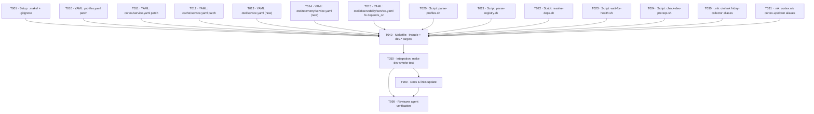

# Tasks: Dev Setup Orchestration

> **Spec**: 004-dev-setup
> **Date**: 2026-02-28

## Dependency Graph

## Quality Requirements

| Module | Coverage | Lint | Notes |
|--------|----------|------|-------|
| scripts/lib/ | bash -n syntax check | shellcheck (if available) | All 5 scripts must be executable |
| services/ | n/a | YAML valid (awk-parseable) | Matches expected service.yaml schema |
| Makefile | n/a | make -n dry-run | All dev-* targets declared .PHONY |

---

## Phase 1: Setup

- [x] [TASK-001] [P] [ROOT] [P1] Create `.make/` directory placeholder + add to `.gitignore`
  - Dependencies: none
  - Module: `.gitignore`, `Makefile` (`.make` dir rule only)
  - Acceptance: `.make/` appears in `.gitignore`; `mkdir -p .make` rule exists in Makefile

---

## Phase 2: Foundational

*No blocking type/interface definitions needed — this feature is scripts + YAML + Make. All Phase 2 items run in parallel.*

### Parallel Batch A — YAML Patches

- [x] [TASK-010] [P] [SERVICES] [P1] Add `friday-collector` to `think` profile in `services/profiles.yaml`
  - Dependencies: none
  - Module: `services/profiles.yaml`
  - Acceptance: `think` profile services list includes `friday-collector`; `parse-profiles.sh` emits `friday-collector` in `PROFILE_THINK_SERVICES`

- [x] [TASK-011] [P] [SERVICES] [P1] Remove `oracle` from `services/cortex/service.yaml` `depends_on`
  - Dependencies: none
  - Module: `services/cortex/service.yaml`
  - Acceptance: `oracle` no longer listed in `depends_on`; remaining deps: `flash`, `strange`, `sonic`, `friday-collector`

- [x] [TASK-012] [P] [SERVICES] [P1] Update `services/cache/service.yaml` health to `docker exec arc-cache redis-cli ping`
  - Dependencies: none
  - Module: `services/cache/service.yaml`
  - Acceptance: `health` field reads `docker exec arc-cache redis-cli ping`; `wait-for-health.sh` can use this without host redis-cli

- [x] [TASK-015] [P] [SERVICES] [P1] Fix `services/otel/observability/service.yaml` — correct broken `depends_on` codename
  - Dependencies: none
  - Module: `services/otel/observability/service.yaml`
  - Acceptance: `depends_on` changed from `[telemetry]` to `[friday-collector]`; codename `friday-collector` matches the actual entry in `services/otel/telemetry/service.yaml`; `resolve-deps.sh` can resolve `friday` → `friday-collector` without "unregistered dependency" error

- [x] [TASK-013] [P] [SERVICES] [P2] Create `services/otel/service.yaml` — full OTEL stack metadata
  - Dependencies: none
  - Module: `services/otel/service.yaml`
  - Acceptance: File exists with `codename: otel`, ports 3301/8080/9000, health endpoint for full SigNoz stack

- [x] [TASK-014] [P] [SERVICES] [P2] Ensure `services/otel/telemetry/service.yaml` has correct metadata (add `name`, `timeout` fields if missing)
  - Dependencies: none
  - Module: `services/otel/telemetry/service.yaml`
  - Acceptance: File has `codename: friday-collector`, `health: http://localhost:13133/`, `timeout: 60`; valid for `parse-registry.sh`

### Parallel Batch B — Parsing Scripts

- [x] [TASK-020] [P] [SCRIPTS] [P1] Write `scripts/lib/parse-profiles.sh` — `services/profiles.yaml` → `.make/profiles.mk`
  - Dependencies: none
  - Module: `scripts/lib/parse-profiles.sh`
  - Acceptance: `bash -n scripts/lib/parse-profiles.sh` passes; script is executable; output contains `PROFILE_THINK_SERVICES := flash sonic strange friday-collector cortex` and `ALL_PROFILES := think reason ultra-instinct`; `ultra-instinct` `services: '*'` expands to all registered services

- [x] [TASK-021] [P] [SCRIPTS] [P1] Write `scripts/lib/parse-registry.sh` — `service.yaml` glob → `.make/registry.mk`
  - Dependencies: none
  - Module: `scripts/lib/parse-registry.sh`
  - Acceptance: `bash -n` passes; executable; output contains `ALL_SERVICES`, `SERVICE_<n>_HEALTH`, `SERVICE_<n>_DEPENDS`, `SERVICE_<n>_TIMEOUT` for all `service.yaml` files found under `services/`

### Parallel Batch C — Orchestration Scripts

- [x] [TASK-022] [P] [SCRIPTS] [P1] Write `scripts/lib/resolve-deps.sh` — Kahn's topological sort
  - Dependencies: none
  - Module: `scripts/lib/resolve-deps.sh`
  - Acceptance: `bash -n` passes; executable; given `flash sonic strange friday-collector cortex` outputs two layers (`flash sonic strange friday-collector` then `cortex`); exits 1 with message on unregistered dep; exits 1 with message on cycle

- [x] [TASK-023] [P] [SCRIPTS] [P1] Write `scripts/lib/wait-for-health.sh` — HTTP + command health poller
  - Dependencies: none
  - Module: `scripts/lib/wait-for-health.sh`
  - Acceptance: `bash -n` passes; executable; HTTP endpoints polled via `curl -sf`; command endpoints via `eval`; times out after `[timeout]` seconds and exits 1 with service name in message; prints `✓ <codename> healthy` on success

- [x] [TASK-024] [P] [SCRIPTS] [P1] Write `scripts/lib/check-dev-prereqs.sh` — Docker + port prereq checks
  - Dependencies: none
  - Module: `scripts/lib/check-dev-prereqs.sh`
  - Acceptance: `bash -n` passes; executable; checks Docker daemon running, `docker compose` v2 available, ports 4222 6379 6650 8082 13133 8081 free; prints colored checklist; exits 1 with `✗ <check> failed` for first failure; exits 0 when all pass

### Parallel Batch D — .mk Alias Targets

- [x] [TASK-030] [P] [SERVICES] [P1] Add `friday-collector-up/down/health` alias targets to `services/otel/otel.mk`
  - Dependencies: none
  - Module: `services/otel/otel.mk`
  - Acceptance: `friday-collector-up` chains to `otel-up-telemetry`; `friday-collector-down` stops only `arc-friday-collector` container; `friday-collector-health` curls `http://localhost:13133/` and prints `✓`/`✗`; all three declared `.PHONY`

- [x] [TASK-031] [P] [SERVICES] [P1] Add `cortex-up/down` alias targets to `services/cortex/cortex.mk`
  - Dependencies: none
  - Module: `services/cortex/cortex.mk`
  - Acceptance: `cortex-up` chains to `cortex-docker-up` as Make prerequisite (not shell); `cortex-down` chains to `cortex-docker-down`; both declared `.PHONY`

---

## Phase 3: Implementation

- [x] [TASK-040] [MAKEFILE] [P1] Update root `Makefile` — `-include`, `.make/` generation rules, `dev-*` targets
  - Dependencies: TASK-001, TASK-010, TASK-011, TASK-012, TASK-013, TASK-014, TASK-020, TASK-021, TASK-022, TASK-023, TASK-024, TASK-030, TASK-031
  - Module: `Makefile`
  - Acceptance:
    - `-include .make/profiles.mk` and `-include .make/registry.mk` present
    - `.make/profiles.mk` rule: prerequisite on `services/profiles.yaml`, recipe calls `scripts/lib/parse-profiles.sh > $@`
    - `.make/registry.mk` rule: prerequisite on `$(shell find services -name service.yaml)`, recipe calls `scripts/lib/parse-registry.sh > $@`
    - `.make` directory rule present
    - `dev` target chain: `dev-prereqs dev-networks .make/profiles.mk .make/registry.mk dev-up dev-wait`
    - `dev-up`: iterates layers from `resolve-deps.sh`, starts each service in layer via `<codename>-up`
    - `dev-wait`: calls `wait-for-health.sh` for each service in profile
    - `dev-down`, `dev-health`, `dev-logs`, `dev-status`, `dev-clean`, `dev-prereqs`, `dev-networks`, `dev-regen` all implemented and declared `.PHONY`
    - `PROFILE ?= think` default set
    - All existing targets (`flash-up`, `otel-up`, `cortex-docker-up`) still work — `make -n flash-up` succeeds

---

## Phase 4: Integration

- [x] [TASK-050] [INTEGRATION] [P1] Smoke test: `make dev` on `think` profile
  - Dependencies: TASK-040
  - Module: All (`Makefile`, `scripts/lib/`, `services/`)
  - Acceptance (Reviewer Checklist SC-1 through SC-9):
    - SC-1: `make dev` exits 0 for `think` profile
    - SC-2: `make dev-health` exits 0, shows 5 `✓` services
    - SC-3: `make dev-down` leaves no `arc-*` containers running
    - SC-4: `make dev PROFILE=reason` starts SigNoz at `:3301`
    - SC-5: Injecting unregistered `depends_on` causes `make dev` to exit 1 with correct message
    - SC-6: `make flash-up`, `make otel-up`, `make cortex-docker-up` still work independently
    - SC-7: Touching `profiles.yaml` causes `.make/profiles.mk` to rebuild on next `make dev`
    - SC-8: Touching any `service.yaml` causes `.make/registry.mk` to rebuild on next `make dev`
    - SC-9: With Docker stopped, `make dev-prereqs` exits 1 with `✗ Docker daemon not running`

---

## Phase 5: Polish

- [x] [TASK-900] [P] [DOCS] [P1] Docs & links update
  - Dependencies: TASK-050
  - Module: `specs/004-dev-setup/`, `README.md` (if dev workflow section exists)
  - Acceptance: Any internal spec cross-links valid; if root `README.md` has a "Getting Started" or "Development" section, `make dev` usage is documented there

- [x] [TASK-999] [REVIEW] [P1] Reviewer agent verification
  - Dependencies: ALL
  - Module: All affected modules
  - Acceptance: All tasks complete and marked `[x]`; all 5 scripts pass `bash -n`; all 5 scripts are executable; `.make/` in `.gitignore`; `make dev` exits 0; `make dev-health` shows 5 ✓; constitution compliance confirmed (Principles II, III, V, VII, VIII, IX); no regressions on existing Make targets

---

## Progress Summary

| Phase | Total | Done | Parallel |
|-------|-------|------|----------|
| Setup | 1 | 1 | 1 |
| Foundational | 11 | 11 | 11 |
| Implementation | 1 | 1 | 0 |
| Integration | 1 | 1 | 0 |
| Polish | 2 | 2 | 1 |
| **Total** | **16** | **16** | **13** |
