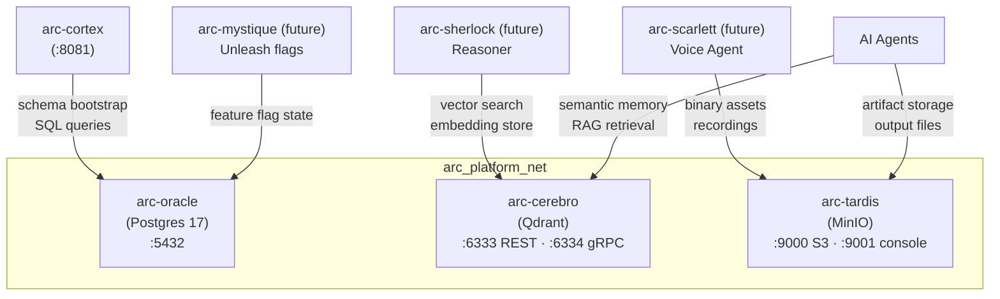
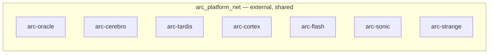

# Feature: Data Layer Services Setup

> **Spec**: 005-data-layer
> **Author**: arc-framework
> **Date**: 2026-02-28
> **Status**: Draft

## Target Modules

| Module | Path | Impact |
|--------|------|--------|
| Services | `services/persistence/` | New — Postgres 17 (Oracle), port 5432 |
| Services | `services/vector/` | New — Qdrant (Cerebro), ports 6333/6334 |
| Services | `services/storage/` | New — MinIO (Tardis), ports 9000/9001 |
| Services | `services/profiles.yaml` | Update — oracle + cerebro → `think`; tardis → `reason` |
| CI/CD | `.github/workflows/` | New — data-images.yml + data-release.yml |
| Makefile | `Makefile`, `*.mk` | New — oracle.mk, cerebro.mk, tardis.mk, data.mk |

## Overview

Provision Postgres 17 (Oracle), Qdrant (Cerebro), and MinIO (Tardis) as production-grade platform services in the arc-platform monorepo. These three services form the persistent data backbone — relational state, vector embeddings, and object storage — that Cortex bootstraps against, AI agents use for memory and retrieval, and future services depend on. Each follows the canonical pattern from 003-messaging-setup: thin Dockerfile label wrapper, `service.yaml`, `docker-compose.yml`, dedicated `.mk` include, and CI/release workflows.

## Architecture



### Service Roles

| Codename | Service | Role | When to Use |
|----------|---------|------|-------------|
| Oracle | Postgres 17 | Relational state, schemas, FK constraints | Structured data, audit logs, Unleash state |
| Cerebro | Qdrant | Vector embeddings, semantic search | RAG pipelines, agent memory, similarity queries |
| Tardis | MinIO (S3) | Object storage, binary assets | Files, recordings, model weights, large blobs |

### Directory Layout

```
services/
├── persistence/        ← Oracle (Postgres 17)
│   ├── Dockerfile
│   ├── service.yaml
│   ├── docker-compose.yml
│   └── oracle.mk
├── vector/             ← Cerebro (Qdrant)
│   ├── Dockerfile
│   ├── service.yaml
│   ├── docker-compose.yml
│   └── cerebro.mk
└── storage/            ← Tardis (MinIO)
    ├── Dockerfile
    ├── service.yaml
    ├── docker-compose.yml
    └── tardis.mk
```

## User Scenarios & Testing

### P1 — Must Have

**US-1**: As a platform developer, I want to start all three data services with a single make command so that my local dev environment has persistence ready immediately.
- **Given**: Docker is running and `arc_platform_net` exists
- **When**: `make data-up` is executed
- **Then**: Oracle, Cerebro, and Tardis start; all Docker health checks pass
- **Test**: `make data-health` exits 0

**US-2**: As a platform developer, I want Cortex to report `oracle: ok` in `/health/deep` so that I know the data layer is wired correctly.
- **Given**: `make data-up` has succeeded and `arc-cortex` is running
- **When**: `curl http://localhost:8081/health/deep` is called
- **Then**: Response shows `"oracle": {"status": "ok"}` (not "connection refused")
- **Test**: `curl -s http://localhost:8081/health/deep | jq .oracle.status`

**US-3**: As a CI consumer, I want Docker images for all three services built and pushed on main branch merges so the team always has fresh images.
- **Given**: A commit merges to main touching `services/persistence/**`, `services/vector/**`, or `services/storage/**`
- **When**: `data-images.yml` workflow runs
- **Then**: Images `ghcr.io/arc-framework/arc-oracle`, `arc-cerebro`, `arc-tardis` are updated
- **Test**: Inspect GHCR after CI completes; verify `sha-*` tag present

### P2 — Should Have

**US-4**: As a platform developer, I want each data service to have `service.yaml` so the arc CLI and Cortex can discover them declaratively.
- **Test**: `cat services/persistence/service.yaml` contains name, ports, health, depends_on

**US-5**: As a release engineer, I want to publish versioned images for all three services via a single `data/vX.Y.Z` git tag so that data layer releases are atomic.
- **Test**: Push tag `data/v0.1.0`; `data-release.yml` builds + pushes all three images with `data-v0.1.0` tag

**US-6**: As a platform developer, I want `make data-up` / `make data-down` / `make data-health` to aggregate all three services, mirroring the `messaging-*` UX.
- **Test**: Both commands work end-to-end; subsequent `make data-up` is idempotent

### P3 — Nice to Have

**US-7**: As a developer, I want `make data-logs` to tail logs from all three containers simultaneously so I can debug data layer issues without multiple terminals.
- **Test**: `make data-logs` fans out to Oracle, Cerebro, and Tardis log streams with service prefixes

**US-8**: As a developer, I want the MinIO console accessible at `http://localhost:9001` so I can browse buckets and inspect objects during development.
- **Test**: Navigate to `http://localhost:9001`; log in with `arc` / `arc-minio-dev`

## Requirements

### Functional

- [ ] FR-1: Create `services/persistence/` with a Postgres 17 Dockerfile using `postgres:17-alpine`, `service.yaml`, `docker-compose.yml`, and `oracle.mk`
- [ ] FR-2: Create `services/vector/` with a Qdrant Dockerfile using `qdrant/qdrant`, `service.yaml`, `docker-compose.yml`, and `cerebro.mk`
- [ ] FR-3: Create `services/storage/` with a MinIO Dockerfile using `minio/minio`, `service.yaml`, `docker-compose.yml`, and `tardis.mk`
- [ ] FR-4: Oracle must initialize with default DB `arc`, user `arc`, password `arc`; data persisted to named volume `arc-oracle-data`
- [ ] FR-5: Cerebro (Qdrant) must persist vector data to named volume `arc-cerebro-data`; both REST (:6333) and gRPC (:6334) exposed on localhost
- [ ] FR-6: Tardis (MinIO) must expose S3 API (:9000) and console (:9001); data persisted to named volume `arc-tardis-data`; root credentials via `MINIO_ROOT_USER` / `MINIO_ROOT_PASSWORD` env
- [ ] FR-7: Update `services/profiles.yaml` — add `oracle` + `cerebro` to `think` profile; `tardis` to `reason` profile
- [ ] FR-8: Create `data-images.yml` CI workflow — path-filtered per service directory, builds all three, `linux/amd64` in CI
- [ ] FR-9: Create `data-release.yml` release workflow — tag format `data/vX.Y.Z`, builds all three multi-platform (`linux/amd64,linux/arm64`), creates GitHub release
- [ ] FR-10: Create `services/data.mk` aggregate with `data-up`, `data-down`, `data-health`, `data-logs` targets
- [ ] FR-11: Include `oracle.mk`, `cerebro.mk`, `tardis.mk`, `data.mk` in root Makefile

### Non-Functional

- [ ] NFR-1: Oracle runs as `postgres` user (uid 70 in alpine); Cerebro runs as non-root (qdrant uid 1000); MinIO runs as non-root (verify against upstream `minio/minio` image)
- [ ] NFR-2: All services expose health endpoints consumable by Docker health checks with appropriate `start_period` (Oracle: 10s, Cerebro: 5s, MinIO: 5s)
- [ ] NFR-3: Data volumes must use named Docker volumes — no bind mounts
- [ ] NFR-4: All ports bind to `127.0.0.1` only — no `0.0.0.0` exposure
- [ ] NFR-5: Docker images include standard OCI (`org.opencontainers.*`) and `arc.service.*` labels
- [ ] NFR-6: CI build completes in under 3 minutes (amd64 only; no QEMU)

### Key Entities

| Entity | Module | Description |
|--------|--------|-------------|
| `arc-oracle` | `services/persistence/` | Postgres 17; relational state store for Cortex, Unleash, and future services |
| `arc-cerebro` | `services/vector/` | Qdrant; vector DB for agent embeddings and semantic search |
| `arc-tardis` | `services/storage/` | MinIO; S3-compatible object storage for binary assets and agent outputs |
| `oracle.mk` | `services/persistence/` | Make targets: oracle-up/down/health/logs/build/push/publish/tag/clean/nuke |
| `cerebro.mk` | `services/vector/` | Make targets: cerebro-up/down/health/logs/build/push/publish/tag/clean/nuke |
| `tardis.mk` | `services/storage/` | Make targets: tardis-up/down/health/logs/build/push/publish/tag/clean/nuke |

## Port Reference

| Service | Container Port | Host Binding | Purpose |
|---------|---------------|--------------|---------|
| Oracle | 5432 | `127.0.0.1:5432` | Postgres wire protocol |
| Cerebro | 6333 | `127.0.0.1:6333` | Qdrant REST API + Prometheus metrics |
| Cerebro | 6334 | `127.0.0.1:6334` | Qdrant gRPC API |
| Tardis | 9000 | `127.0.0.1:9000` | MinIO S3 API |
| Tardis | 9001 | `127.0.0.1:9001` | MinIO web console |

## Network Strategy

All three services join `arc_platform_net` only — the shared bridge already used by Flash, Strange, Sonic, and Cortex. No new networks are created by this feature.



**Rules:**
- `arc_platform_net` declared `external: true` in each compose file — created by `make dev` or `make flash-up`
- Data services join `arc_platform_net` only (no `arc_otel_net`)
- Container hostnames (`arc-oracle`, `arc-cerebro`, `arc-tardis`) are DNS-resolvable by all services on the network

## Edge Cases

| Scenario | Expected Behavior |
|----------|-------------------|
| Oracle first run — empty data directory | Postgres auto-initializes using `POSTGRES_USER`, `POSTGRES_PASSWORD`, `POSTGRES_DB` env vars; no manual init needed |
| Cortex connects to Oracle before ready | Cortex retries with exponential backoff; `/health/deep` reflects `oracle: unreachable` until Oracle health check passes |
| MinIO starts with no buckets | MinIO starts empty; buckets must be created by Cortex bootstrap or operator via console / `mc` client |
| Cerebro disk full | Qdrant returns 507 Insufficient Storage; operator must resize the named volume |
| `make data-up` before `arc_platform_net` exists | Docker compose fails at network lookup; run `make dev` or `docker network create arc_platform_net` first |
| Oracle password changed post-init | Postgres ignores `POSTGRES_PASSWORD` after data dir is initialized; operator must `make oracle-nuke` to reset |
| Tardis credentials mismatch (env vs stored config) | MinIO refuses to start; `make tardis-nuke` resets the volume and stored config |

## Success Criteria

- [ ] SC-1: `make data-up && make data-health` exits 0 with all three services healthy
- [ ] SC-2: `curl -s http://localhost:8081/health/deep | jq .oracle.status` returns `"ok"` after `make cortex-docker-up`
- [ ] SC-3: `curl -s http://localhost:6333/readyz` returns HTTP 200 (Qdrant ready)
- [ ] SC-4: MinIO console accessible at `http://localhost:9001` with `arc` / `arc-minio-dev` credentials
- [ ] SC-5: `data-images.yml` CI completes in under 3 minutes for an amd64-only change
- [ ] SC-6: `git tag data/v0.1.0 && git push --tags` triggers `data-release.yml`; all three multi-platform images published to GHCR
- [ ] SC-7: All Dockerfiles pass `trivy image` scan with zero CRITICAL CVEs
- [ ] SC-8: `services/profiles.yaml` `think` profile includes `oracle` and `cerebro`; `reason` profile includes `tardis`

## Docs & Links Update

- [ ] Update `services/profiles.yaml` — add oracle + cerebro to `think`; tardis to `reason`
- [ ] Verify `services/cortex/service.yaml` `depends_on` includes `oracle` codename
- [ ] Update `CLAUDE.md` monorepo layout section to reference `persistence/`, `vector/`, `storage/` directories

## Constitution Compliance

| Principle | Applies | Compliant | Notes |
|-----------|---------|-----------|-------|
| I. Zero-Dep CLI | [ ] | n/a | Services only — no CLI changes |
| II. Platform-in-a-Box | [x] | [x] | `make data-up` boots all three; oracle + cerebro join `think` profile |
| III. Modular Services | [x] | [x] | Each service self-contained in own directory; flat under `services/` |
| IV. Two-Brain | [x] | [x] | Config-only upstream images — no language concern |
| V. Polyglot Standards | [x] | [x] | Dockerfiles, compose, health checks follow established 003 pattern |
| VI. Local-First | [ ] | n/a | CLI-only principle |
| VII. Observability | [x] | [x] | Qdrant exposes Prometheus on :6333; MinIO health on :9000; Oracle via pg_isready |
| VIII. Security | [x] | [x] | Non-root containers; 127.0.0.1-only port binding; credentials via env, not git |
| IX. Declarative | [ ] | n/a | CLI-only principle |
| X. Stateful Ops | [ ] | n/a | CLI-only principle |
| XI. Resilience | [x] | [x] | Health checks with start_periods; named volumes survive container restart |
| XII. Interactive | [ ] | n/a | CLI-only principle |
