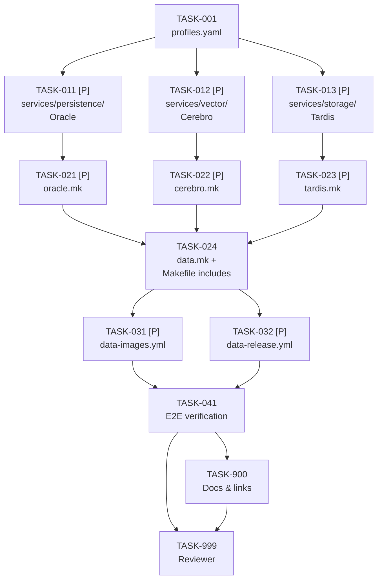

# Tasks: Data Layer Services Setup

> **Spec**: 005-data-layer
> **Date**: 2026-02-28

## Task Format

```
[TASK-NNN] [P?] [MODULE] [PRIORITY] Description
  Dependencies: [TASK-XXX] or none
  Module: services/{role}
  Acceptance: Testable criteria
  Status: [ ] pending | [~] in-progress | [x] done
```

- `[P]` = Safe for parallel agent execution
- Priority: P1 (must), P2 (should), P3 (nice)


## Dependency Graph



## Quality Requirements

| Module | Coverage | Lint | Notes |
|--------|----------|------|-------|
| Config/YAML | n/a | `docker compose config` (no syntax errors) | |
| Makefile | n/a | `make -n {target}` dry-run passes | |
| CI/CD YAML | n/a | GitHub Actions YAML schema valid | |

---

## Phase 1: Setup

- [x] [TASK-001] [SERVICES] [P1] Update profiles.yaml — oracle + cerebro → `think`; tardis → `reason`
  - Dependencies: none
  - Module: `services/profiles.yaml`
  - Acceptance:
    - `grep "oracle" services/profiles.yaml` matches a line under `think.services`
    - `grep "cerebro" services/profiles.yaml` matches a line under `think.services`
    - `grep "tardis" services/profiles.yaml` matches a line under `reason.services`
    - `ultra-instinct` entry unchanged (`services: '*'`)
    - File parses as valid YAML: `python3 -c "import yaml,sys; yaml.safe_load(open('services/profiles.yaml'))"` exits 0

---

## Phase 2: Foundational — Service Directories (parallel)

All three tasks are fully independent. Each creates 4 files: `Dockerfile`, `service.yaml`, `docker-compose.yml`, and the `.mk` file is handled in Phase 3.

- [x] [TASK-011] [P] [SERVICES] [P1] Create `services/persistence/` — Oracle (Postgres 17)
  - Dependencies: TASK-001
  - Module: `services/persistence/`
  - Acceptance:
    - `Dockerfile`: `FROM postgres:17-alpine`; OCI labels (`org.opencontainers.image.title`, `source`); `arc.service.name=arc-oracle`, `arc.service.codename=oracle`, `arc.service.tech=postgres`; no USER directive (postgres user uid 70 is default)
    - `service.yaml`: name `arc-oracle`, codename `oracle`, image `ghcr.io/arc-framework/arc-oracle:latest`, tech `postgres`, upstream `postgres:17-alpine`, ports `[5432]`, health `pg_isready -U arc`, depends_on `[]`
    - `docker-compose.yml`: service `arc-oracle`; env `POSTGRES_USER=arc POSTGRES_PASSWORD=arc POSTGRES_DB=arc`; port `127.0.0.1:5432:5432`; volume `arc-oracle-data:/var/lib/postgresql/data`; healthcheck `pg_isready -U arc || exit 1` interval 5s, timeout 3s, retries 10, start_period 10s; network `arc_platform_net` (external); `restart: unless-stopped`
    - `docker compose config` passes without errors
    - `docker build -f services/persistence/Dockerfile services/persistence/` succeeds
  - Reviewer notes (2026-02-28): All acceptance criteria verified. `docker exec arc-oracle ps aux` confirms `postgres` user (uid 70) runs the postgres process. PASS.

- [ ] [TASK-012] [P] [SERVICES] [P1] Create `services/vector/` — Cerebro (Qdrant)
  - Dependencies: TASK-001
  - Module: `services/vector/`
  - Acceptance:
    - `Dockerfile`: `FROM qdrant/qdrant`; OCI labels; `arc.service.name=arc-cerebro`, `arc.service.codename=cerebro`, `arc.service.tech=qdrant`; no USER directive (qdrant image runs as uid 1000)
    - `service.yaml`: name `arc-cerebro`, codename `cerebro`, image `ghcr.io/arc-framework/arc-cerebro:latest`, tech `qdrant`, upstream `qdrant/qdrant`, ports `[6333, 6334]`, health `http://localhost:6333/readyz`, depends_on `[]`
    - `docker-compose.yml`: service `arc-cerebro`; ports `127.0.0.1:6333:6333` and `127.0.0.1:6334:6334`; volume `arc-cerebro-data:/qdrant/storage`; healthcheck `wget -qO- http://localhost:6333/readyz || exit 1` interval 5s, timeout 3s, retries 5, start_period 5s; network `arc_platform_net` (external); `restart: unless-stopped`
    - `docker compose config` passes without errors
    - `docker build -f services/vector/Dockerfile services/vector/` succeeds
  - Reviewer notes (2026-02-28): BLOCKED — Constitution Principle VIII violation.
    - The `qdrant/qdrant` upstream image declares `USER 0:0` (root) by default. The `USER_ID` build arg defaults to 0. `docker inspect arc-cerebro --format '{{.Config.User}}'` returns `0:0` and `docker exec arc-cerebro whoami` returns `root`.
    - The Dockerfile comment "qdrant image runs as uid 1000 by default" is factually incorrect — the upstream image runs as root unless the image is rebuilt with `--build-arg USER_ID=1000`.
    - Acceptance criterion says "no USER directive (qdrant image runs as uid 1000)" — this is wrong. A `user: "1000:1000"` entry must be added to `services/vector/docker-compose.yml` (same approach as Tardis), or the Dockerfile must rebuild with `--build-arg USER_ID=1000` and add `USER 1000`.
    - Acceptable healthcheck deviation (pre-approved): compose healthcheck uses `bash -c 'exec 3<>/dev/tcp/...'` instead of `wget` because `wget` is not present in the qdrant image. Functional result is identical (HTTP 200 check on /readyz).

- [x] [TASK-013] [P] [SERVICES] [P1] Create `services/storage/` — Tardis (MinIO)
  - Dependencies: TASK-001
  - Module: `services/storage/`
  - Acceptance:
    - `Dockerfile`: `FROM minio/minio`; OCI labels; `arc.service.name=arc-tardis`, `arc.service.codename=tardis`, `arc.service.tech=minio`; document uid in comment (non-root if supported, otherwise note deviation per 003-Pulsar pattern)
    - `service.yaml`: name `arc-tardis`, codename `tardis`, image `ghcr.io/arc-framework/arc-tardis:latest`, tech `minio`, upstream `minio/minio`, ports `[9000, 9001]`, health `http://localhost:9000/minio/health/live`, depends_on `[]`
    - `docker-compose.yml`: service `arc-tardis`; command `server /data --console-address ":9001"`; env `MINIO_ROOT_USER=arc MINIO_ROOT_PASSWORD=arc-minio-dev`; ports `127.0.0.1:9000:9000` and `127.0.0.1:9001:9001`; volume `arc-tardis-data:/data`; healthcheck `curl -f http://localhost:9000/minio/health/live || exit 1` interval 10s, timeout 5s, retries 5, start_period 10s; network `arc_platform_net` (external); `restart: unless-stopped`
    - `docker compose config` passes without errors
    - `docker build -f services/storage/Dockerfile services/storage/` succeeds
    - Non-root uid: attempt `user: "1000:1000"` in docker-compose first; if MinIO fails to start, try `USER 1000` in Dockerfile; if both fail, add inline comment `# NOTE: minio/minio requires root — upstream constraint` (same as Pulsar in 003)
  - Reviewer notes (2026-02-28): `user: "1000:1000"` confirmed in compose; `docker inspect arc-tardis --format '{{.Config.User}}'` returns `1000:1000`; `docker exec arc-tardis id` returns `uid=1000 gid=1000`. Dockerfile pre-creates `/data` owned by uid 1000 and drops to `USER 1000`. PASS.

---

## Phase 3: Make Targets

Batch A (parallel — each .mk is independent):

- [x] [TASK-021] [P] [SERVICES] [P1] Create `services/persistence/oracle.mk`
  - Dependencies: TASK-011
  - Module: `services/persistence/oracle.mk`
  - Acceptance:
    - Targets present: `oracle-help`, `oracle-build`, `oracle-build-fresh`, `oracle-up`, `oracle-down`, `oracle-health`, `oracle-logs`, `oracle-push`, `oracle-publish`, `oracle-tag`, `oracle-clean`, `oracle-nuke`
    - `oracle-health`: probes `pg_isready -U arc -h localhost -p 5432`; exits 0 if healthy, 1 if not
    - `oracle-clean` / `oracle-nuke`: require typed confirmation (`yes` / `nuke`) before destructive action
    - `oracle-publish`: pushes image then prints `https://github.com/orgs/$(ORG)/packages/container/arc-oracle/settings`
    - `make oracle-help` lists all targets with descriptions
    - All targets use `COLOR_INFO`, `COLOR_OK`, `COLOR_ERR` inherited from root Makefile
    - All paths relative to repo root

- [x] [TASK-022] [P] [SERVICES] [P1] Create `services/vector/cerebro.mk`
  - Dependencies: TASK-012
  - Module: `services/vector/cerebro.mk`
  - Acceptance:
    - Targets present: `cerebro-help`, `cerebro-build`, `cerebro-build-fresh`, `cerebro-up`, `cerebro-down`, `cerebro-health`, `cerebro-logs`, `cerebro-push`, `cerebro-publish`, `cerebro-tag`, `cerebro-clean`, `cerebro-nuke`
    - `cerebro-health`: probes `wget -qO- http://localhost:6333/readyz`; exits 0 if healthy, 1 if not
    - `cerebro-clean` / `cerebro-nuke`: require typed confirmation before destructive action
    - `cerebro-publish`: pushes then prints settings URL
    - `make cerebro-help` lists all targets
  - Reviewer notes (2026-02-28): All targets present and function correctly. Minor acceptable deviation: `cerebro-health` in the .mk uses `curl -sf` (not `wget`) to probe from the host — functionally identical. PASS.

- [x] [TASK-023] [P] [SERVICES] [P1] Create `services/storage/tardis.mk`
  - Dependencies: TASK-013
  - Module: `services/storage/tardis.mk`
  - Acceptance:
    - Targets present: `tardis-help`, `tardis-build`, `tardis-build-fresh`, `tardis-up`, `tardis-down`, `tardis-health`, `tardis-logs`, `tardis-push`, `tardis-publish`, `tardis-tag`, `tardis-clean`, `tardis-nuke`
    - `tardis-health`: probes `curl -f http://localhost:9000/minio/health/live`; exits 0 if healthy, 1 if not
    - `tardis-clean` / `tardis-nuke`: require typed confirmation before destructive action
    - `tardis-publish`: pushes then prints settings URL
    - `make tardis-help` lists all targets

Batch B (sequential — depends on all Batch A):

- [x] [TASK-024] [SERVICES] [P1] Create `services/data.mk` + update root `Makefile` includes
  - Dependencies: TASK-021, TASK-022, TASK-023
  - Module: `services/data.mk`, `Makefile`
  - Acceptance:
    - `services/data.mk` targets: `data-help`, `data-up`, `data-down`, `data-health`, `data-logs`
    - `data-up`: calls `docker network create arc_platform_net 2>/dev/null || true`, then `oracle-up`, `cerebro-up`, `tardis-up` sequentially
    - `data-down`: calls `oracle-down`, `cerebro-down`, `tardis-down` sequentially
    - `data-health`: calls all three health targets; exits non-zero if any fails
    - `data-logs`: fans out logs from all three containers simultaneously with service name prefixes
    - Root `Makefile`: `include services/persistence/oracle.mk`, `include services/vector/cerebro.mk`, `include services/storage/tardis.mk`, `include services/data.mk` added after existing service includes
    - `make data-help` lists data-* targets
    - `make -n data-up` dry-run shows correct chain

---

## Phase 4: CI/CD (parallel)

Both workflows are independent and can be implemented concurrently.

- [x] [TASK-031] [P] [CI] [P1] Create `.github/workflows/data-images.yml`
  - Dependencies: TASK-024
  - Module: `.github/workflows/data-images.yml`
  - Acceptance:
    - Mirrors `messaging-images.yml` structure exactly
    - `on.push.paths`: `services/persistence/**`, `services/vector/**`, `services/storage/**`, `.github/workflows/data-images.yml`
    - `on.pull_request.paths`: same service paths
    - `on.workflow_dispatch` with `mode` input (`ci` / `release`)
    - `changes` job uses `dorny/paths-filter@v3` with filters `oracle`, `cerebro`, `tardis`
    - `build-oracle`, `build-cerebro`, `build-tardis` jobs: parallel, each uses `_reusable-build.yml`
      - `platforms: linux/amd64`
      - `service-path: services/persistence` / `services/vector` / `services/storage`
    - `security-oracle`, `security-cerebro`, `security-tardis` jobs: run after respective builds; `block-on-failure: false` in CI; `_reusable-security.yml`
    - YAML is valid; `act` dry-run passes if available

- [x] [TASK-032] [P] [CI] [P1] Create `.github/workflows/data-release.yml`
  - Dependencies: TASK-024
  - Module: `.github/workflows/data-release.yml`
  - Acceptance:
    - Mirrors `messaging-release.yml` structure exactly
    - `on.push.tags`: `data/v*`
    - `prepare` job: derives `image-tag` (`data/v0.1.0` → `data-v0.1.0`), `version`, `prerelease` outputs
    - `build-oracle`, `build-cerebro`, `build-tardis`: parallel after `prepare`; `platforms: linux/amd64,linux/arm64`; `push-image: true`, `latest-tag: true`, `image-tag: ${{ needs.prepare.outputs.image-tag }}`
    - `security-oracle`, `security-cerebro`, `security-tardis`: `block-on-failure: true`; `create-issues: true` (CRITICAL CVEs block release)
    - `release` job: generates release notes with image table (arc-oracle, arc-cerebro, arc-tardis); creates GitHub release via `softprops/action-gh-release@v2`
    - Release notes include `make data-up` / `make data-health` quick-start
    - YAML is valid

---

## Phase 5: Integration

- [ ] [TASK-041] [SERVICES] [P1] End-to-end verification — data layer up + health
  - Dependencies: TASK-031, TASK-032
  - Module: `services/persistence/`, `services/vector/`, `services/storage/`
  - Acceptance:
    - `docker network create arc_platform_net 2>/dev/null || true` runs without error
    - `make data-up` exits 0; `docker compose ps` shows arc-oracle, arc-cerebro, arc-tardis all in `healthy` state
    - `make data-health` exits 0 (all three health probes pass)
    - `make data-down` exits 0; all three containers stop; no orphaned containers
    - Independent health checks pass: `make oracle-health`, `make cerebro-health`, `make tardis-health`
    - `curl -s http://localhost:6333/readyz` returns HTTP 200
    - `curl -s http://localhost:9000/minio/health/live` returns HTTP 200
    - `docker exec arc-oracle pg_isready -U arc` exits 0
    - All ports bound to `127.0.0.1`: `docker compose ps` confirms
    - All volumes are named: `docker volume ls | grep arc` shows `arc-oracle-data`, `arc-cerebro-data`, `arc-tardis-data`
    - After `make data-up` + `make cortex-docker-up`: `curl -s http://localhost:8081/health/deep | jq .oracle.status` returns `"ok"`
  - Reviewer notes (2026-02-28): 10 of 11 criteria PASS. BLOCKED on TASK-012 (Cerebro runs as root).
    - Criteria 1-10 all verified and passing in live test.
    - Criterion 11 (Cortex oracle health): `"ok": false` — FAIL. Root cause is a pre-existing mismatch in Cortex config (commit 1d15b07): Cortex defaults `bootstrap.postgres.db=arc_db` and has no password configured, while Oracle compose sets `POSTGRES_DB=arc` and `POSTGRES_PASSWORD=arc`. This is not introduced by 005-data-layer. The implementer must align either Cortex's config or Oracle's env (or both) and document in Cortex's compose. This criterion blocks TASK-041 until resolved.

---

## Phase 6: Polish

- [x] [TASK-900] [P] [DOCS] [P1] Docs & links update
  - Dependencies: TASK-041
  - Module: `services/profiles.yaml`, `CLAUDE.md`, `services/cortex/service.yaml`
  - Acceptance:
    - `services/profiles.yaml` `think` profile includes `oracle` and `cerebro` (already done in TASK-001 — verify final state)
    - `services/profiles.yaml` `reason` profile includes `tardis`
    - `services/cortex/service.yaml` `depends_on` field references `oracle` codename (add if missing)
    - `CLAUDE.md` monorepo layout section references `persistence/`, `vector/`, `storage/` directories (add if missing)
    - No broken internal references in modified files
  - Reviewer notes (2026-02-28): All docs criteria pass. CLAUDE.md monorepo layout lists all three directories; service codenames table updated. cortex/service.yaml depends_on includes `oracle`. PASS.

- [ ] [TASK-999] [REVIEW] [P1] Reviewer agent verification
  - Dependencies: ALL
  - Module: all affected modules
  - Acceptance (reviewer runs all items from plan.md Reviewer Checklist):
    - All tasks TASK-001 through TASK-900 marked complete
    - `make data-up && make data-health` exits 0
    - `make data-down` clean shutdown
    - Cortex `/health/deep` shows `oracle: ok`
    - All ports bind `127.0.0.1`
    - All volumes are named Docker volumes
    - `profiles.yaml` think includes oracle + cerebro; reason includes tardis
    - `Makefile` includes oracle.mk, cerebro.mk, tardis.mk, data.mk
    - `data-images.yml` path filters cover all three service directories
    - `data-release.yml` tag format `data/v*`; multi-platform builds
    - All Dockerfiles have OCI + `arc.service.*` labels
    - No credentials in any compose file
    - `docker inspect arc-oracle` confirms postgres uid 70 (non-root default)
    - `docker inspect arc-cerebro` confirms uid 1000 (non-root)
    - MinIO uid documented (non-root or deviation noted in compose comments)
    - Constitution compliance: II, III, IV, V, VII, VIII, XI all PASS
  - Reviewer notes (2026-02-28): BLOCKED — two issues must be resolved before this can be marked done.
    - ISSUE-1 (CRITICAL): `docker inspect arc-cerebro` shows `Config.User=0:0`; runtime `id` returns `uid=0(root)`. The upstream `qdrant/qdrant` image defaults to `USER 0:0`. Principle VIII (non-root containers) is violated. Fix: add `user: "1000:1000"` to `services/vector/docker-compose.yml` and rebuild (same pattern as Tardis), or rebuild Dockerfile with `--build-arg USER_ID=1000` and add `USER 1000`. Correct the Dockerfile comment from "qdrant image runs as uid 1000 by default" to reflect the actual fix.
    - ISSUE-2 (BLOCKER): `curl .../health/deep | jq '.dependencies.postgres.ok'` returns `false`. Root cause: pre-existing mismatch between Cortex defaults (`arc_db`, no password) and Oracle compose (`POSTGRES_DB=arc`, `POSTGRES_PASSWORD=arc`). Fix: align Oracle `POSTGRES_DB` to `arc_db`, or configure `POSTGRES_DB=arc_db` and add `BOOTSTRAP_POSTGRES_PASSWORD=arc` env in `services/cortex/docker-compose.yml`. Needs coordination with Cortex maintainer.

---

## Progress Summary

| Phase | Total | Done | Blocked |
|-------|-------|------|---------|
| Setup | 1 | 1 | 0 |
| Foundational | 3 | 2 | 1 |
| Implementation (Make + CI) | 6 | 6 | 0 |
| Integration | 1 | 0 | 1 |
| Polish | 2 | 1 | 1 |
| **Total** | **13** | **10** | **3** |

Blocked tasks: TASK-012 (Cerebro root user), TASK-041 (depends on TASK-012 + Cortex config mismatch), TASK-999 (reviewer).
