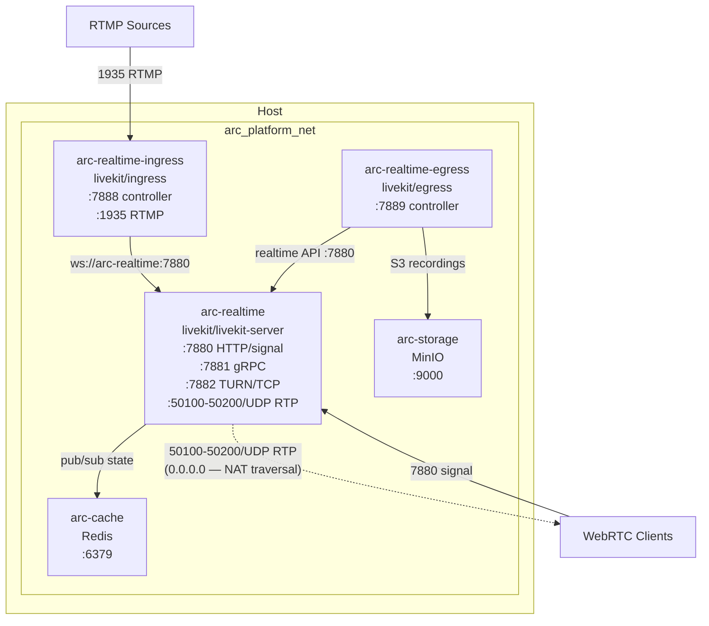
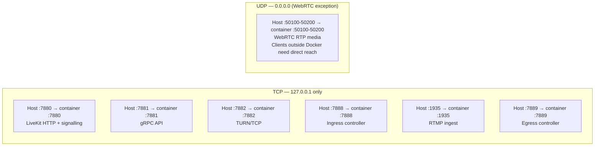
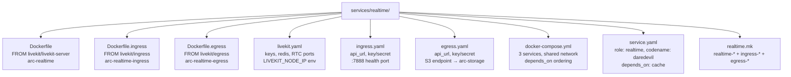

# Implementation Plan: Realtime Voice Infrastructure Setup

> **Spec**: 007-voice-stack
> **Date**: 2026-03-01

## Summary

Add three co-located realtime services — LiveKit Server (Daredevil), LiveKit Ingress (Sentry), LiveKit Egress (Scribe) — all in `services/realtime/` following the thin-wrapper pattern from 003/005/006: Dockerfiles with OCI labels, shared `docker-compose.yml`, `service.yaml`, `realtime.mk` aggregate, CI/release workflows. All three join `arc_platform_net`; `realtime` added to `think`, `reason` profiles. Sentry and Scribe depend on Daredevil and are always started as a unit via the shared compose. Static dev API keys (`devkey`/`devsecret`) are used in config files; vault integration is deferred.

## Target Modules

| Module | Language | Changes |
|--------|----------|---------|
| `services/realtime/` | Config/Dockerfile | New — 3 Dockerfiles, shared compose, 3 config YAMLs, service.yaml, realtime.mk |
| `services/profiles.yaml` | YAML | Add `realtime` to `think` and `reason` profiles |
| `.github/workflows/` | YAML | New — realtime-images.yml + realtime-release.yml |
| `Makefile` | Make | Include `services/realtime/realtime.mk` |
| `scripts/scripts.mk` | Make | Add realtime build/publish targets to `publish-all` |
| `scripts/lib/check-dev-prereqs.sh` | Bash | Add ports 7880, 7881, 1935 to prerequisite checks |

## Technical Context

| Aspect | Value |
|--------|-------|
| Language | Config-only (YAML, Dockerfile, Makefile) — no application code |
| Base Images | `livekit/livekit-server`, `livekit/ingress`, `livekit/egress` |
| Testing | HTTP GET :7880 (Daredevil), :7888 (Sentry), :7889 (Scribe) |
| Network | `arc_platform_net` (external bridge, pre-existing) |
| Volumes | None — stateless in dev; Egress writes recordings to arc-storage over S3 |
| CI Pattern | Mirror `control-images.yml` — amd64-only CI, dorny/paths-filter; single path `services/realtime/**` |
| Root handling | Verify per image; document deviation in Dockerfile if root required |
| Key config | Static `devkey`/`devsecret` in YAML config files mounted read-only |

## Architecture

### Service topology



### Port binding strategy



### File pattern (co-located variant)



## Key Implementation Decisions

### 1. Daredevil — LiveKit Server config

```yaml
# services/realtime/livekit.yaml
port: 7880
grpc_port: 7881
rtc:
  tcp_port: 7882
  udp_port_range_start: 50100
  udp_port_range_end: 50200
  use_external_ip: false
  node_ip: ${LIVEKIT_NODE_IP:-127.0.0.1}
redis:
  address: arc-cache:6379
keys:
  devkey: devsecret
```

```yaml
# services/realtime/docker-compose.yml (arc-realtime service)
arc-realtime:
  image: ghcr.io/arc-framework/arc-realtime:latest
  build:
    context: services/realtime
    dockerfile: Dockerfile
  command: --config /etc/livekit.yaml
  volumes:
    - ./services/realtime/livekit.yaml:/etc/livekit.yaml:ro
  ports:
    - "127.0.0.1:7880:7880"
    - "127.0.0.1:7881:7881"
    - "127.0.0.1:7882:7882"
    - "0.0.0.0:50100-50200:50100-50200/udp"  # WebRTC RTP — NAT traversal requires 0.0.0.0
  environment:
    LIVEKIT_NODE_IP: ${LIVEKIT_NODE_IP:-127.0.0.1}
  depends_on:
    arc-cache:
      condition: service_healthy
  healthcheck:
    test: ["CMD-SHELL", "wget -qO- http://localhost:7880 || exit 1"]
    interval: 5s
    timeout: 3s
    retries: 5
    start_period: 10s
  networks:
    - arc_platform_net
```

**Note**: `--config /etc/livekit.yaml` passes the full config as a file; environment variable `LIVEKIT_NODE_IP` is interpolated at compose startup for the node IP. If `wget` is absent, fall back to `curl -sf`.

### 2. Sentry — Ingress config

```yaml
# services/realtime/ingress.yaml
api_url: ws://arc-realtime:7880
api_key: devkey
api_secret: devsecret
health_port: 7888
```

```yaml
# arc-realtime-ingress in docker-compose.yml
arc-realtime-ingress:
  image: ghcr.io/arc-framework/arc-realtime-ingress:latest
  build:
    context: services/realtime
    dockerfile: Dockerfile.ingress
  volumes:
    - ./services/realtime/ingress.yaml:/etc/ingress.yaml:ro
  ports:
    - "127.0.0.1:7888:7888"
    - "127.0.0.1:1935:1935"
  depends_on:
    arc-realtime:
      condition: service_healthy
  healthcheck:
    test: ["CMD-SHELL", "wget -qO- http://localhost:7888 || exit 1"]
    interval: 5s
    timeout: 3s
    retries: 5
    start_period: 10s
  networks:
    - arc_platform_net
```

### 3. Scribe — Egress config

```yaml
# services/realtime/egress.yaml
api_url: ws://arc-realtime:7880
api_key: devkey
api_secret: devsecret
# S3-compatible output (arc-storage / MinIO)
s3:
  endpoint: http://arc-storage:9000
  bucket: recordings
  access_key: arc
  secret: arc-minio-dev
  force_path_style: true
health_port: 7889
```

```yaml
# arc-realtime-egress in docker-compose.yml
arc-realtime-egress:
  image: ghcr.io/arc-framework/arc-realtime-egress:latest
  build:
    context: services/realtime
    dockerfile: Dockerfile.egress
  volumes:
    - ./services/realtime/egress.yaml:/etc/egress.yaml:ro
  ports:
    - "127.0.0.1:7889:7889"
  depends_on:
    arc-realtime:
      condition: service_healthy
  healthcheck:
    test: ["CMD-SHELL", "wget -qO- http://localhost:7889 || exit 1"]
    interval: 5s
    timeout: 3s
    retries: 5
    start_period: 10s
  networks:
    - arc_platform_net
```

**Note**: Scribe doesn't hard-depend on `arc-storage` in compose (storage optional for dev; egress falls back gracefully for recording requests). This matches the spec edge case: egress starts, recording requests fail until storage is healthy.

### 4. Non-root handling

LiveKit images (server, ingress, egress) are Go binaries. Check each image's effective user:

```bash
docker run --rm --entrypoint id livekit/livekit-server
docker run --rm --entrypoint id livekit/ingress
docker run --rm --entrypoint id livekit/egress
```

- If non-root already → add `USER` line in Dockerfile for clarity; no extra steps
- If root → document deviation in Dockerfile comment (same pattern as Nick Fury): _"livekit/livekit-server runs as root by default. This is a DEVELOPMENT-ONLY service. For production, build with non-root user."_

### 5. realtime.mk — multi-image .mk design

Three Dockerfiles in one directory means the `.mk` handles three build targets:

```makefile
COMPOSE_REALTIME     := docker compose -f services/realtime/docker-compose.yml
REALTIME_IMAGE       := $(REGISTRY)/$(ORG)/arc-realtime
REALTIME_INGRESS_IMG := $(REGISTRY)/$(ORG)/arc-realtime-ingress
REALTIME_EGRESS_IMG  := $(REGISTRY)/$(ORG)/arc-realtime-egress

realtime-up:   $(COMPOSE_REALTIME) up -d arc-realtime arc-realtime-ingress arc-realtime-egress
realtime-down: $(COMPOSE_REALTIME) down

realtime-health: check arc-realtime :7880 + arc-realtime-ingress :7888 + arc-realtime-egress :7889

realtime-build:         # builds arc-realtime (Dockerfile)
realtime-ingress-build: # builds arc-realtime-ingress (Dockerfile.ingress)
realtime-egress-build:  # builds arc-realtime-egress (Dockerfile.egress)

realtime-publish:         realtime-build + realtime-push
realtime-ingress-publish: realtime-ingress-build + realtime-ingress-push
realtime-egress-publish:  realtime-egress-build + realtime-egress-push
```

Individual `realtime-ingress-up` and `realtime-egress-up` start only those services (useful for dev restart without cycling all three).

### 6. CI/CD — single path filter, three build jobs

`realtime-images.yml` — one path trigger (`services/realtime/**`), three parallel build steps:

```yaml
on:
  push:
    branches: [main]
    paths: ["services/realtime/**"]

jobs:
  build-realtime:       # builds arc-realtime
  build-realtime-ingress: # builds arc-realtime-ingress
  build-realtime-egress:  # builds arc-realtime-egress
```

`realtime-release.yml` — tag format `realtime/vX.Y.Z` → Docker tag `realtime-vX.Y.Z`; multi-platform amd64 + arm64.

### 7. profiles.yaml update

```yaml
think:
  services:
    - messaging
    - cache
    - streaming
    - friday-collector
    - cortex
    - sql-db
    - vector-db
    - gateway
    - realtime    # ← ADD: voice/WebRTC infrastructure

reason:
  services:
    - cortex
    - messaging
    - streaming
    - cache
    - otel
    - storage
    - vault
    - flags
    - realtime    # ← ADD: voice/WebRTC infrastructure

# ultra-instinct: '*' — already includes all services; no change needed
```

### 8. service.yaml — primary service only

`service.yaml` represents the primary service (Daredevil). Sentry and Scribe are referenced in `docker-compose.yml` depends_on but not in a separate `service.yaml`:

```yaml
name: arc-realtime
codename: daredevil
role: realtime
image: ghcr.io/arc-framework/arc-realtime:latest
tech: livekit
upstream: livekit/livekit-server
ports:
  - { port: 7880, protocol: http, description: "LiveKit API + WebRTC signalling" }
  - { port: 7881, protocol: grpc, description: "gRPC API" }
  - { port: 7882, protocol: tcp, description: "TURN/TCP" }
  - { port: "50100-50200", protocol: udp, description: "WebRTC RTP media" }
health:
  endpoint: http://localhost:7880
  interval: 5s
depends_on:
  - cache  # Redis — multi-node pub/sub state
sidecars:
  - { name: arc-realtime-ingress, codename: sentry, port: 7888, description: "RTMP ingest" }
  - { name: arc-realtime-egress, codename: scribe, port: 7889, description: "Recording + export" }
```

## Constitution Check

| # | Principle | Status | Evidence |
|---|-----------|--------|----------|
| I | Zero-Dep CLI | N/A | No CLI changes |
| II | Platform-in-a-Box | PASS | `make realtime-up` boots all three; joined to `think` (minimal) profile |
| III | Modular Services | PASS | Self-contained in `services/realtime/`; own service.yaml, compose, .mk |
| IV | Two-Brain | PASS | Config-only upstream images — no Python or Go custom code |
| V | Polyglot Standards | PASS | Same Dockerfile/compose/healthcheck/CI structure as 003/005/006 |
| VI | Local-First | N/A | CLI only |
| VII | Observability | PASS | HTTP health endpoints :7880/:7888/:7889; Docker healthchecks |
| VIII | Security | PASS† | TCP 127.0.0.1; UDP 0.0.0.0 exception documented; no secrets in git; non-root verified per image |
| IX | Declarative | N/A | CLI only |
| X | Stateful Ops | N/A | CLI only |
| XI | Resilience | PASS | `depends_on` ordering: cache → realtime → ingress/egress; start_periods for healthchecks |
| XII | Interactive | N/A | CLI only |

†**Security note**: UDP `0.0.0.0:50100-50200` is a documented, intentional exception required for WebRTC NAT traversal. All other ports bind `127.0.0.1`.

## Project Structure

```
arc-platform/
├── services/
│   ├── realtime/                               ← NEW (entire directory)
│   │   ├── Dockerfile                          # FROM livekit/livekit-server; OCI + arc labels; non-root verify
│   │   ├── Dockerfile.ingress                  # FROM livekit/ingress; OCI + arc labels
│   │   ├── Dockerfile.egress                   # FROM livekit/egress; OCI + arc labels
│   │   ├── livekit.yaml                        # LiveKit server config; devkey/devsecret; Redis; RTC ports
│   │   ├── ingress.yaml                        # Ingress config; api_url ws://arc-realtime:7880; health :7888
│   │   ├── egress.yaml                         # Egress config; api_url; S3 → arc-storage; health :7889
│   │   ├── docker-compose.yml                  # All 3 services; arc_platform_net external; depends_on
│   │   ├── service.yaml                        # role: realtime, codename: daredevil, depends_on: cache, sidecars
│   │   └── realtime.mk                         # realtime-* + realtime-ingress-* + realtime-egress-* targets
│   └── profiles.yaml                           # MODIFY — think += realtime; reason += realtime
├── .github/workflows/
│   ├── realtime-images.yml                     ← NEW
│   └── realtime-release.yml                    ← NEW
├── Makefile                                    # MODIFY — include services/realtime/realtime.mk
└── scripts/
    ├── scripts.mk                              # MODIFY — add realtime/ingress/egress to publish-all
    └── lib/
        └── check-dev-prereqs.sh                # MODIFY — add ports 7880, 7881, 1935
```

## Parallel Execution Strategy

```mermaid
gantt
    title 007-voice-stack Implementation Phases
    dateFormat X
    axisFormat %s

    section Phase 1 — Foundation
    Update profiles.yaml (realtime → think + reason)    :p1, 0, 1

    section Phase 2 — Dockerfiles + Config (parallel)
    Dockerfile (arc-realtime)                           :p2a, after p1, 2
    Dockerfile.ingress (arc-realtime-ingress)           :p2b, after p1, 2
    Dockerfile.egress (arc-realtime-egress)             :p2c, after p1, 2
    livekit.yaml + ingress.yaml + egress.yaml           :p2d, after p1, 2

    section Phase 3 — Compose + service.yaml
    docker-compose.yml (all 3 services)                 :p3, after p2a, 1
    service.yaml                                        :p3b, after p2a, 1

    section Phase 4 — Make + CI (parallel)
    realtime.mk (all targets)                           :p4a, after p3, 1
    realtime-images.yml                                 :p4b, after p3, 2
    realtime-release.yml                                :p4c, after p3, 2

    section Phase 5 — Integration
    Makefile include + scripts updates                  :p5a, after p4a, 1
    make realtime-up + make realtime-health             :p5b, after p5a, 1
    Docs & links update                                 :p5c, after p5b, 1
```



**Parallelizable groups:**
- Phase 2: All three Dockerfiles and all three config YAML files are fully independent
- Phase 4: `realtime-images.yml` + `realtime-release.yml` are independent of each other
- Phase 3: `docker-compose.yml` + `service.yaml` can be written concurrently (different files)

## Tech Debt

| ID | Item | Rationale |
|----|------|-----------|
| TD-001 | Vault integration for LiveKit API keys | Static `devkey`/`devsecret` in config files. Production requires dynamic secrets from OpenBao. Deferred to security hardening spec. |
| TD-002 | LIVEKIT_NODE_IP for remote clients | Default `127.0.0.1` only works locally. Remote/cloud deploy requires setting `LIVEKIT_NODE_IP` to machine's public IP. Document in help target. |
| TD-003 | TURN/STUN for firewall traversal | `node_ip: 127.0.0.1` works on LAN. True TURN server for clients behind strict NAT requires a turnserver sidecar (e.g. coturn). Deferred. |
| TD-004 | MinIO bucket init for recordings | Scribe writes to `recordings` bucket in arc-storage. Bucket must exist. A future init script or MinIO lifecycle policy should pre-create it. |
| TD-005 | LiveKit egress requires `chrome` | LK Egress uses a headless Chromium for composite room recording. The `livekit/egress` image bundles it but is ~1GB. Future: switch to track-based egress (no Chrome) if size is a concern. |

## Reviewer Checklist

- [ ] `make realtime-up` exits 0; all three containers in `healthy` state
- [ ] `make realtime-health` exits 0
- [ ] `make realtime-down` stops all three; no orphaned containers
- [ ] `make realtime-up` starts `arc-cache` first if not already running (depends_on)
- [ ] `curl -s http://localhost:7880` returns response from LiveKit Server
- [ ] `curl -s http://localhost:7888` returns 200 from Ingress controller
- [ ] `curl -s http://localhost:7889` returns 200 from Egress controller
- [ ] TCP ports 7880/7881/7882/7888/1935/7889 bind `127.0.0.1` only — verify with `docker compose ps`
- [ ] UDP `50100-50200` binds `0.0.0.0` — verify and confirm documented
- [ ] `livekit.yaml` mounted read-only at `/etc/livekit.yaml` in arc-realtime container
- [ ] `ingress.yaml` and `egress.yaml` mounted read-only in their respective containers
- [ ] API key consistency: `devkey`/`devsecret` used identically in livekit.yaml, ingress.yaml, egress.yaml
- [ ] `LIVEKIT_NODE_IP` documented in `realtime-help` output; defaults to `127.0.0.1`
- [ ] Non-root status verified for each image; deviation documented if root required
- [ ] All three Dockerfiles have OCI + `arc.service.*` labels including `arc.service.codename`
- [ ] `services/realtime/service.yaml` contains role, codename, image, ports, health, depends_on, sidecars
- [ ] `services/profiles.yaml` `think` includes `realtime`; `reason` includes `realtime`
- [ ] Root Makefile includes `services/realtime/realtime.mk`
- [ ] `publish-all` in scripts/scripts.mk includes all three realtime build/publish steps
- [ ] `check-dev-prereqs.sh` checks ports 7880, 7881, 1935
- [ ] `realtime-images.yml` path filter `services/realtime/**`; builds all three images
- [ ] `realtime-release.yml` tag format `realtime/v*`; multi-platform amd64 + arm64
- [ ] `CLAUDE.md` Service Codenames table updated — Daredevil (LiveKit), Sentry (LK Ingress), Scribe (LK Egress)
- [ ] `.specify/config.yaml` `realtime` entry updated with correct codename/role

## Risks & Mitigations

| Risk | Impact | Mitigation |
|------|--------|------------|
| LiveKit images run as root | M | Document deviation in Dockerfile + help text; same approach as Nick Fury in 006 |
| `wget` absent in livekit images | M | Fall back to `curl -sf http://localhost:PORT` in healthcheck — Go images often include curl |
| UDP 50100-50200 blocked by macOS firewall | H | Document in `realtime-help`; user must allow UDP range for WebRTC to function |
| Port 1935 (RTMP) in use by OBS or similar | M | Document in edge cases; user checks `make dev-status` and stops conflicting process |
| Egress `recordings` bucket missing in MinIO | M | Document in TD-004; manual `mc mb` command in `realtime-help` until init script exists |
| LK Egress Chrome binary makes image ~1GB | L | Accepted for dev; noted in TD-005; not a blocker |
| `arc_platform_net` not pre-created | H | `realtime-up` calls `docker network create arc_platform_net 2>/dev/null \|\| true` before compose up |
| `LIVEKIT_NODE_IP` env expansion in livekit.yaml | M | LiveKit supports env var expansion in YAML config — verify `${LIVEKIT_NODE_IP:-127.0.0.1}` syntax is supported; fallback to compose `environment:` injection if not |
