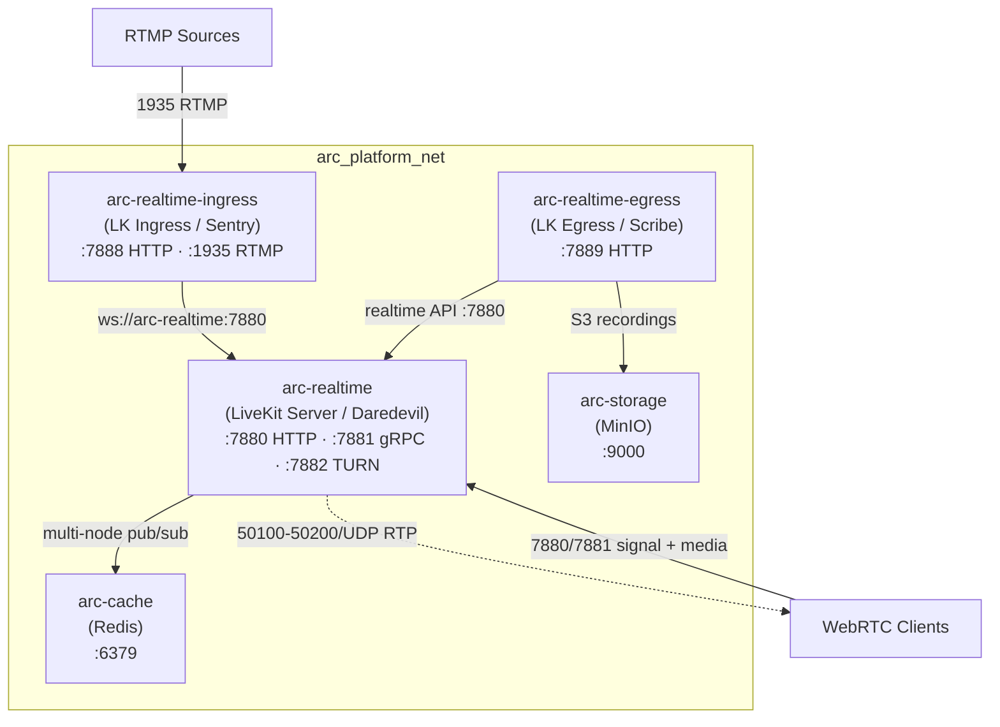
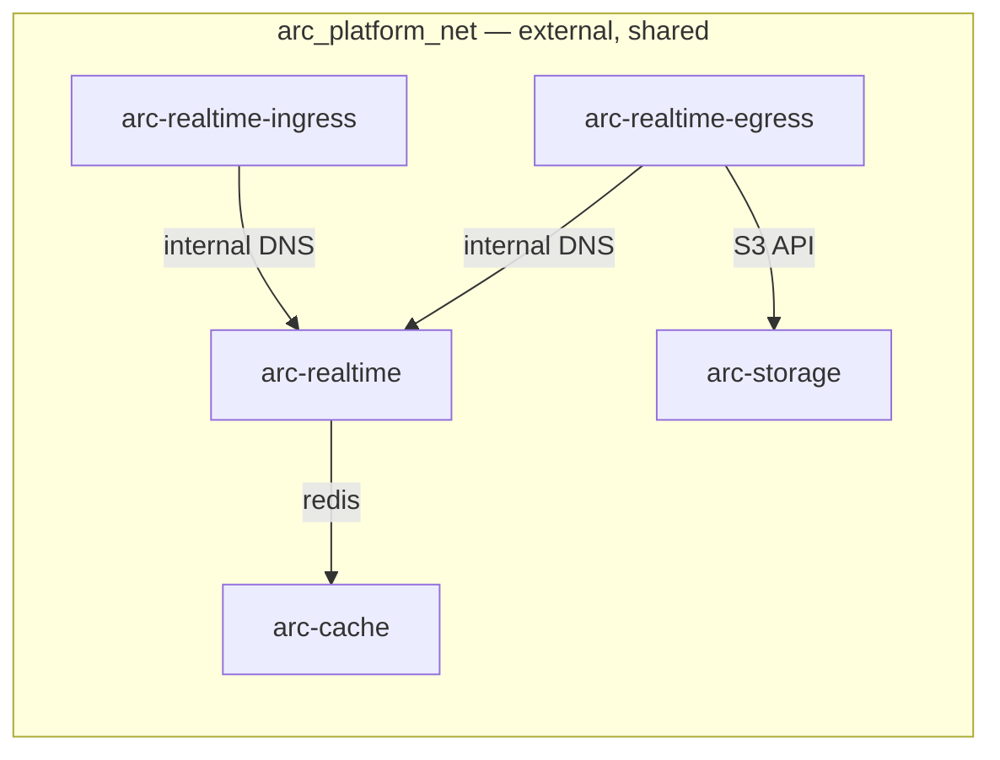

# Feature: Realtime Voice Infrastructure Setup

> **Spec**: 007-voice-stack
> **Author**: arc-framework
> **Date**: 2026-03-01
> **Status**: Draft

## Target Modules

| Module | Path | Impact |
|--------|------|--------|
| Services | `services/realtime/` | New — LiveKit Server (Daredevil), LK Ingress (Sentry), LK Egress (Scribe) |
| Services | `services/profiles.yaml` | Update — add `realtime` to all three profiles |
| CI/CD | `.github/workflows/` | New — realtime-images.yml + realtime-release.yml |
| Makefile | `Makefile`, `services/realtime/realtime.mk` | New — individual + aggregate realtime targets |

## Overview

Provision LiveKit Server (Daredevil), LiveKit Ingress (Sentry), and LiveKit Egress (Scribe) as the platform realtime voice/media infrastructure. All three are thin-wrapper Dockerfiles over official LiveKit images, co-located in `services/realtime/` with a shared `docker-compose.yml`. Daredevil provides WebRTC media rooms; Sentry pulls external media (RTMP/WHIP) into rooms; Scribe records and exports room content. Follows the established thin-wrapper pattern from 003-messaging-setup, 005-data-layer, and 006-platform-control.

## Architecture



### Service Roles

| Codename | Role | Image | Ports | Depends on |
|----------|------|-------|-------|------------|
| Daredevil | `realtime` | `livekit/livekit-server` | 7880/7881/7882/50100-50200udp | cache |
| Sentry | `realtime-ingress` | `livekit/ingress` | 7888/1935 | realtime |
| Scribe | `realtime-egress` | `livekit/egress` | 7889 | realtime, storage |

### Directory Layout

```
services/realtime/
├── Dockerfile              # arc-realtime (FROM livekit/livekit-server)
├── Dockerfile.ingress      # arc-realtime-ingress (FROM livekit/ingress)
├── Dockerfile.egress       # arc-realtime-egress (FROM livekit/egress)
├── service.yaml            # role: realtime, codename: daredevil
├── docker-compose.yml      # All 3 services; shared arc_platform_net
├── livekit.yaml            # LiveKit server config (mounted at /etc/livekit.yaml)
├── ingress.yaml            # Ingress config (LIVEKIT_URL: ws://arc-realtime:7880)
├── egress.yaml             # Egress config (LIVEKIT_URL, API credentials, storage endpoint)
└── realtime.mk             # Targets: realtime-* / realtime-ingress-* / realtime-egress-*
```

### Co-location Rationale

Sentry and Scribe are tightly coupled to Daredevil — they can never run without it. Placing all three in one directory with a shared compose file:
- Prevents accidental partial-stack deploys
- Shares config files (`livekit.yaml` is mounted by ingress too for API keys)
- Single Make include vs three fragments
- `profiles.yaml` registers just `realtime`; `make realtime-up` brings up all three

## User Scenarios & Testing

### P1 — Must Have

**US-1**: As a platform developer, I want all three realtime services to start with `make realtime-up` so the voice stack is ready as a unit.
- **Given**: Docker is running, `arc_platform_net` exists, and `arc-cache` is healthy
- **When**: `make realtime-up`
- **Then**: arc-realtime, arc-realtime-ingress, arc-realtime-egress all start and Docker health checks pass
- **Test**: `make realtime-health` exits 0

**US-2**: As a platform developer, I want the LiveKit API accessible at `:7880` so WebRTC clients can connect.
- **Given**: `make realtime-up` succeeded
- **When**: `curl -s http://localhost:7880`
- **Then**: HTTP 200 or redirect (LiveKit API responds)
- **Test**: `make realtime-health` exits 0

**US-3**: As a platform developer, I want Sentry's RTMP port `:1935` and controller `:7888` available so ingest streams work.
- **Given**: Daredevil is healthy; Sentry is running
- **When**: `curl -s http://localhost:7888`
- **Then**: Sentry controller responds with 200
- **Test**: `make realtime-ingress-health` exits 0

**US-4**: As a platform developer, I want Scribe's controller at `:7889` available so recording requests work.
- **Given**: Daredevil is healthy; Scribe is running
- **When**: `curl -s http://localhost:7889`
- **Then**: Scribe controller responds with 200
- **Test**: `make realtime-egress-health` exits 0

**US-5**: As a developer running `make dev`, I want realtime to start after cache in the dependency-ordered boot so the stack is coherent.
- **Given**: `make dev` is executed (think profile)
- **When**: Dependency layers are resolved
- **Then**: `cache` layer starts before `realtime` layer; all health checks pass
- **Test**: `make dev && make dev-health` exits 0

### P2 — Should Have

**US-6**: As a CI consumer, I want all three images built and pushed on main merges.
- **Given**: A commit touches `services/realtime/**`
- **When**: `realtime-images.yml` workflow runs
- **Then**: `arc-realtime`, `arc-realtime-ingress`, `arc-realtime-egress` updated on GHCR with `sha-*` tag
- **Test**: GHCR packages show `sha-*` tag after CI

**US-7**: As a release engineer, I want versioned images via `realtime/vX.Y.Z` tag.
- **Test**: `git tag realtime/v0.1.0 && git push --tags` triggers `realtime-release.yml`; multi-platform images on GHCR

**US-8**: As a platform developer, I want `service.yaml` for declarative CLI discovery.
- **Test**: `services/realtime/service.yaml` contains role, codename, image, ports, health, depends_on

### P3 — Nice to Have

**US-9**: As a developer, I want `make realtime-logs` to tail all three services with service-prefixed output.
- **Test**: Log lines from each service are distinguishable by container name

## Requirements

### Functional

- [ ] FR-1: Create `services/realtime/Dockerfile` (arc-realtime), `Dockerfile.ingress` (arc-realtime-ingress), `Dockerfile.egress` (arc-realtime-egress) — thin wrappers with OCI + arc.service.* labels
- [ ] FR-2: Create `services/realtime/docker-compose.yml` — defines all 3 services on `arc_platform_net`; mounts config files; `arc-realtime-ingress` and `arc-realtime-egress` depend on `arc-realtime`
- [ ] FR-3: Create `services/realtime/livekit.yaml` — LiveKit server config; `keys: devkey: devsecret`; Redis URL `redis://arc-cache:6379`; node IP from `LIVEKIT_NODE_IP` env (default `127.0.0.1`)
- [ ] FR-4: Create `services/realtime/ingress.yaml` — Ingress config; `api_url: ws://arc-realtime:7880`; API key/secret match livekit.yaml dev values
- [ ] FR-5: Create `services/realtime/egress.yaml` — Egress config; `api_url: ws://arc-realtime:7880`; API key/secret match livekit.yaml dev values; S3 output to `arc-storage:9000`
- [ ] FR-6: Create `services/realtime/service.yaml` — `role: realtime`, `codename: daredevil`, `image: ghcr.io/arc-framework/arc-realtime:latest`, health endpoint `:7880`, `depends_on: [cache]`
- [ ] FR-7: Create `services/realtime/realtime.mk` — targets: `realtime-up/down/health/logs/build/push/publish/tag/clean/nuke`, `realtime-ingress-up/down/health/logs`, `realtime-egress-up/down/health/logs`
- [ ] FR-8: Update `services/profiles.yaml` — add `realtime` to `think`, `reason`, and `ultra-instinct`
- [ ] FR-9: Create `.github/workflows/realtime-images.yml` — path-filtered to `services/realtime/**`, builds all 3 images separately, `linux/amd64` only in CI
- [ ] FR-10: Create `.github/workflows/realtime-release.yml` — tag format `realtime/vX.Y.Z`, multi-platform (`linux/amd64,linux/arm64`), creates GitHub release
- [ ] FR-11: Include `services/realtime/realtime.mk` in root Makefile; add realtime build/publish targets to `publish-all`

### Non-Functional

- [ ] NFR-1: All TCP ports bind to `127.0.0.1` only; WebRTC RTP UDP range `50100-50200` binds to `0.0.0.0` (required for WebRTC NAT traversal)
- [ ] NFR-2: LiveKit API key/secret for dev is static (`devkey`/`devsecret`) defined directly in config files and compose; vault integration is a tracked future enhancement (see Docs section)
- [ ] NFR-3: Non-root containers — verify upstream image user; add `USER` + `RUN chown` in Dockerfile if default is root
- [ ] NFR-4: All three Dockerfiles include OCI (`org.opencontainers.*`) and `arc.service.*` labels including `arc.service.codename`
- [ ] NFR-5: `arc-realtime` compose service mounts `livekit.yaml` as read-only at `/etc/livekit.yaml`
- [ ] NFR-6: `LIVEKIT_NODE_IP` must be documented in `realtime-help` output; defaults to `127.0.0.1` for local dev
- [ ] NFR-7: CI build of 3 images must complete in under 5 minutes (amd64 only, no QEMU)

### Key Entities

| Entity | Module | Description |
|--------|--------|-------------|
| `arc-realtime` | `services/realtime/` | LiveKit Server; WebRTC rooms; Redis-backed multi-node state |
| `arc-realtime-ingress` | `services/realtime/` | LiveKit Ingress; RTMP→WebRTC ingest pipeline |
| `arc-realtime-egress` | `services/realtime/` | LiveKit Egress; recording + export to arc-storage (MinIO) |
| `livekit.yaml` | `services/realtime/` | LiveKit server config; API keys, ICE config, Redis URL |
| `ingress.yaml` | `services/realtime/` | LK Ingress config; LiveKit API URL + credentials |
| `egress.yaml` | `services/realtime/` | LK Egress config; LiveKit API URL + credentials + storage |
| `realtime.mk` | `services/realtime/` | Make targets for all 3 realtime services |

## Port Reference

| Service | Container Port | Host Binding | Protocol | Purpose |
|---------|----------------|--------------|----------|---------|
| arc-realtime | 7880 | `127.0.0.1:7880` | HTTP | LiveKit API + WebRTC signalling |
| arc-realtime | 7881 | `127.0.0.1:7881` | gRPC | gRPC API |
| arc-realtime | 7882 | `127.0.0.1:7882` | TCP | TURN |
| arc-realtime | 50100-50200 | `0.0.0.0:50100-50200` | UDP | WebRTC RTP media (NAT traversal required) |
| arc-realtime-ingress | 7888 | `127.0.0.1:7888` | HTTP | Ingress controller API |
| arc-realtime-ingress | 1935 | `127.0.0.1:1935` | TCP | RTMP ingest |
| arc-realtime-egress | 7889 | `127.0.0.1:7889` | HTTP | Egress controller API |

## Network Strategy

All three services join `arc_platform_net` only. The UDP range `50100-50200` must bind `0.0.0.0` — WebRTC clients outside the Docker network need direct reachability to this range for RTP media.



## Edge Cases

| Scenario | Expected Behavior |
|----------|-------------------|
| `make realtime-up` before cache ready | LiveKit starts in single-node mode; logs Redis warning; multi-node state unavailable but rooms function |
| `make realtime-ingress-up` before Daredevil healthy | Sentry retries; health check fails until Daredevil responds on :7880 |
| `make realtime-egress-up` before storage ready | Scribe starts; recording requests return error until arc-storage is healthy |
| UDP 50100-50200 blocked by host firewall | WebRTC ICE fails; clients connect but no media — must open UDP range on dev machine |
| `LIVEKIT_NODE_IP` not set | Defaults to `127.0.0.1`; works for local dev; fails for remote clients (set to machine IP) |
| API key mismatch between server and ingress/egress | Sentry/Scribe return 401; all three must use `devkey`/`devsecret` from same source |
| `make realtime-clean` with active WebRTC rooms | Rooms destroyed immediately; all connected clients disconnected — expected, documented |
| Port 1935 (RTMP) in use by OBS or other media tool | Sentry startup fails; check `make dev-status` and stop conflicting process |

## Success Criteria

- [ ] SC-1: `make realtime-up && make realtime-health` exits 0; all three containers healthy
- [ ] SC-2: `curl -s http://localhost:7880` returns a LiveKit response (2xx or 3xx)
- [ ] SC-3: `curl -s http://localhost:7888` returns 200 (Sentry controller)
- [ ] SC-4: `curl -s http://localhost:7889` returns 200 (Scribe controller)
- [ ] SC-5: `make dev` (think profile) includes `realtime`; `make dev-health` exits 0
- [ ] SC-6: `realtime-images.yml` CI completes in under 5 minutes (3 images, amd64 only)
- [ ] SC-7: `git tag realtime/v0.1.0` triggers `realtime-release.yml`; multi-platform images on GHCR
- [ ] SC-8: All three Dockerfiles pass `trivy image` scan with zero CRITICAL CVEs

## Docs & Links Update

- [ ] Update `services/profiles.yaml` — add `realtime` to `think`, `reason`, `ultra-instinct`
- [ ] Update `CLAUDE.md` monorepo layout to reference `services/realtime/` and note Daredevil/Sentry/Scribe
- [ ] Update `CLAUDE.md` Service Codenames table — add Daredevil (LiveKit), Sentry (LK Ingress), Scribe (LK Egress)
- [ ] Update `.specify/config.yaml` — update `realtime` entry (`role: realtime, codename: daredevil`); add `realtime-ingress` (Sentry) and `realtime-egress` (Scribe) entries
- [ ] Update `scripts/lib/check-dev-prereqs.sh` — add ports 7880/7881/1935 to required port checks
- [ ] Track vault integration for LiveKit API keys as a follow-on task (production hardening)
- [ ] Verify `services/realtime/service.yaml` `depends_on` lists `cache`

## Constitution Compliance

| Principle | Applies | Compliant | Notes |
|-----------|---------|-----------|-------|
| I. Zero-Dep CLI | [ ] | n/a | Services only — no CLI changes |
| II. Platform-in-a-Box | [x] | [x] | `make realtime-up` boots all three; joined to all profiles including `think` |
| III. Modular Services | [x] | [x] | Self-contained in `services/realtime/`; three images, one service.yaml, one compose |
| IV. Two-Brain | [x] | [x] | Config-only upstream images — no Python or Go custom code |
| V. Polyglot Standards | [x] | [x] | Follows 003/005/006 thin-wrapper pattern exactly |
| VI. Local-First | [ ] | n/a | CLI-only principle |
| VII. Observability | [x] | [x] | LiveKit exposes HTTP health on :7880; ingress :7888; egress :7889; all have Docker health checks |
| VIII. Security | [x] | [x] | Non-root containers; TCP ports on 127.0.0.1; no secrets in git; UDP RTP exception documented |
| IX. Declarative | [ ] | n/a | CLI-only principle |
| X. Stateful Ops | [ ] | n/a | CLI-only principle |
| XI. Resilience | [x] | [x] | Docker healthchecks with start_periods; depends_on ordering in compose |
| XII. Interactive | [ ] | n/a | CLI-only principle |

---

## Open Questions (Resolved)

| Question | Decision |
|----------|----------|
| Directory | `services/realtime/` (matches config.yaml `dir: realtime`) |
| Image names | `arc-realtime`, `arc-realtime-ingress`, `arc-realtime-egress` |
| API keys dev strategy | Static `devkey`/`devsecret` in config files; vault integration is future production work |
| Profiles | All three — `think`, `reason`, `ultra-instinct` |
| Co-location | Single directory, shared compose, one profiles.yaml entry (`realtime`) |
