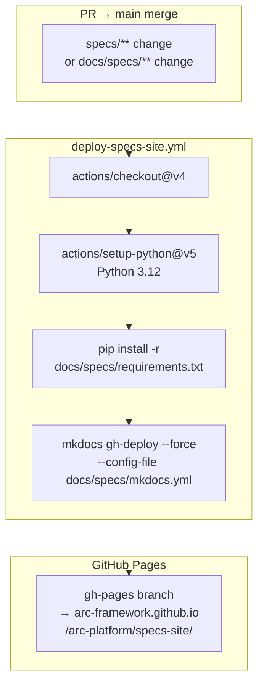
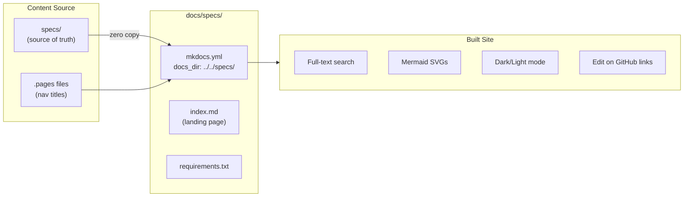

# Implementation Plan: Specs Documentation Site

> **Spec**: 008-specs-site
> **Date**: 2026-03-01

## Summary

Publish `specs/` as a searchable, mermaid-rendered static site using MkDocs Material, deployed to
GitHub Pages via CI on every push to `main`. Navigation is driven by
`mkdocs-awesome-pages-plugin` — each spec folder gets a `.pages` file with its human-readable
section title; adding a new spec requires no changes to `mkdocs.yml`.

## Target Modules

| Module | Language | Changes |
|--------|----------|---------|
| `docs/specs/` | YAML / Markdown / Python | New — `mkdocs.yml`, `index.md`, `requirements.txt` |
| `specs/` | Markdown / YAML | Additive-only — `.pages` files per folder; no existing files modified |
| `.github/workflows/` | YAML | New — `deploy-specs-site.yml` |
| Root | Text | `.gitignore` + `CLAUDE.md` — 2-line updates |

## Technical Context

| Aspect | Value |
|--------|-------|
| Build tool | MkDocs Material ≥ 9.5 |
| Nav plugin | `mkdocs-awesome-pages-plugin` ≥ 2.9 |
| Mermaid | `pymdownx.superfences` custom fence + mermaid.js CDN (unpkg.com/mermaid@10) |
| Search | MkDocs built-in `search` plugin (`lang: en`) |
| Python | 3.10+ locally; 3.12 in CI |
| Content source | `docs_dir: ../../specs/` — zero duplication |
| Build output | `site_dir: ../../site_build/` — gitignored |
| Deploy target | `gh-pages` branch → GitHub Pages |
| CI trigger | `push` to `main` when `specs/**` or `docs/specs/**` change |

### Key Decision: MkDocs Material vs alternatives

| Option | Verdict |
|--------|---------|
| **MkDocs Material** | ✅ Best-in-class markdown site, mermaid native, Python (consistent with SDK) |
| Docusaurus | Node.js runtime — conflicts with zero-dep philosophy for tooling |
| Sphinx | RST-first; markdown support is bolted on; overkill for spec docs |
| GitHub wiki | No mermaid, no search, no CI control |

### Key Decision: awesome-pages vs hardcoded nav

`mkdocs.yml` `nav:` would need updating every time a spec is added — brittle and error-prone in
a CI context. `awesome-pages` reads `.pages` files from each folder; adding a spec = adding a
`.pages` file in the same PR, no `mkdocs.yml` change needed.

### Key Decision: mermaid rendering

`pymdownx.superfences` custom fence + CDN `mermaid.min.js` is the canonical MkDocs Material
approach. No separate `mkdocs-mermaid2-plugin` needed — that plugin has known version conflicts
with Material ≥ 9.0.

## Architecture





## Constitution Check

| # | Principle | Status | Evidence |
|---|-----------|--------|----------|
| I | Zero-Dep CLI | N/A | No CLI changes |
| II | Platform-in-a-Box | N/A | Documentation only |
| III | Modular Services | N/A | No service changes |
| IV | Two-Brain | N/A | Config and markdown only |
| V | Polyglot Standards | PASS | Python tooling (MkDocs) consistent with Python SDK/services; commenting conventions followed |
| VI | Local-First | PASS | `mkdocs serve` works fully offline after `pip install`; no external API keys needed |
| VII | Observability | N/A | Documentation only |
| VIII | Security | PASS | No secrets committed; CI uses `GITHUB_TOKEN` auto-credential; no sensitive data in built site |
| IX | Declarative | N/A | No CLI changes |
| X | Stateful Ops | N/A | No CLI changes |
| XI | Resilience | N/A | Static site; GitHub Pages 99.9% SLA |
| XII | Interactive | N/A | No CLI changes |

## Project Structure

```
arc-platform/
├── docs/
│   └── specs/                           # New MkDocs site config
│       ├── mkdocs.yml                   # Main config — docs_dir, theme, plugins, mermaid
│       ├── index.md                     # Landing page — overview + spec index table
│       └── requirements.txt             # Pinned Python deps
│
├── specs/
│   ├── .pages                           # Root nav order
│   ├── 001-otel-setup/
│   │   └── .pages                       # title: "001 — OTEL Setup"; file nav map
│   ├── 002-cortex-setup/
│   │   └── .pages
│   ├── 003-messaging-setup/
│   │   └── .pages
│   ├── 004-dev-setup/
│   │   └── .pages
│   ├── 005-data-layer/
│   │   └── .pages
│   ├── 006-platform-control/
│   │   └── .pages
│   └── 007-voice-stack/
│       └── .pages
│
├── .github/
│   └── workflows/
│       └── deploy-specs-site.yml        # New CI workflow
│
├── .gitignore                           # +1 line: site_build/
└── CLAUDE.md                            # +1 line: mkdocs serve command
```

**Total new files**: 12 (mkdocs.yml, index.md, requirements.txt, 7× .pages, 1× .pages root,
deploy-specs-site.yml)
**Modified files**: 2 (.gitignore, CLAUDE.md)

## `.pages` File Pattern

Each spec folder `.pages` follows this structure:

```yaml
# specs/NNN-feature-name/.pages
title: "NNN — Feature Name"
nav:
  - spec.md: Specification
  - plan.md: Implementation Plan
  - tasks.md: Task Breakdown
  - analysis-report.md: Analysis Report
  - ...
```

Only files that **exist in the folder** should be listed. Files not in `nav:` are still
discoverable via search; they just don't appear in the sidebar. Use `...` (ellipsis entry) as a
catch-all for any unlisted files if needed.

## Parallel Execution Strategy

```mermaid
gantt
    title 008-specs-site Implementation
    dateFormat  X
    axisFormat  %s

    section Phase 1 — Setup (serial)
    gitignore + CLAUDE.md         :a1, 0, 1

    section Phase 2 — Core Files (fully parallel)
    mkdocs.yml                    :a2, after a1, 1
    index.md                      :a3, after a1, 1
    requirements.txt              :a4, after a1, 1
    .pages root + 001–007         :a5, after a1, 1

    section Phase 3 — CI (parallel with Phase 2)
    deploy-specs-site.yml         :a6, after a1, 1

    section Phase 4 — Verification
    mkdocs build + serve + strict :a7, after a2, 1
```



Phase 2 tasks (mkdocs.yml, index.md, requirements.txt, all `.pages`) are fully independent —
different files, no shared state. Phase 3 (CI workflow) can run in parallel with Phase 2.

## Tech Debt

None anticipated for this feature. MkDocs Material is stable; the `awesome-pages` plugin is a
mature community standard. If the spec count grows beyond ~50, consider adding
`mkdocs-gen-files` to auto-generate `.pages` files, but that's premature now.

## Risks & Mitigations

| Risk | Impact | Mitigation |
|------|--------|------------|
| GitHub Pages not enabled in repo settings | H | Document as prerequisite (FR-10); CI will fail clearly with 404 |
| `mkdocs-mermaid2-plugin` version conflict | M | Don't use it — use `pymdownx.superfences` + CDN as specified |
| `docs_dir: ../../specs/` relative path wrong when run from subdirectory | M | Always invoke `mkdocs` from repo root; document in CLAUDE.md |
| Spec with broken mermaid syntax fails build | L | Mermaid errors are browser-side; `mkdocs build --strict` won't catch them (not a hard failure) |
| `.pages` nav lists a file that doesn't exist in the folder | M | `mkdocs build --strict` will error; run strict mode in verification |
| CDN mermaid.js unavailable (offline CI) | L | GitHub Actions runners have internet access; CDN is reliable |
| `pr-description.md` or `analysis-report.md` absent from some folders | L | `awesome-pages` only shows files that exist; missing files simply don't appear |

## Reviewer Checklist

- [ ] `mkdocs build -f docs/specs/mkdocs.yml` exits 0 from repo root
- [ ] `mkdocs build --strict -f docs/specs/mkdocs.yml` exits 0 (no broken links/warnings)
- [ ] `site_build/` directory created after build; gitignored
- [ ] All 7 spec folders have `.pages` files with human-readable titles
- [ ] Root `specs/.pages` lists all 7 folders in order
- [ ] `docs/specs/requirements.txt` pins `mkdocs-material`, `awesome-pages`, `pymdown-extensions`
- [ ] `docs/specs/index.md` has spec index table with all 7 specs
- [ ] `deploy-specs-site.yml` triggers on `specs/**` and `docs/specs/**` paths
- [ ] `deploy-specs-site.yml` uses `permissions: contents: write`
- [ ] `.gitignore` contains `site_build/`
- [ ] `CLAUDE.md` contains `mkdocs serve -f docs/specs/mkdocs.yml`
- [ ] Constitution V (Polyglot) and VI (Local-First) pass
- [ ] No TODO/FIXME without tracking
