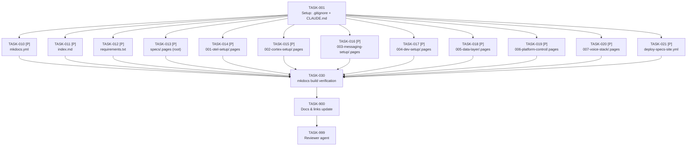

# Tasks: Specs Documentation Site

> **Spec**: 008-specs-site
> **Date**: 2026-03-01

## Dependency Graph

---

## Phase 1: Setup

- [x] [TASK-001] [ROOT] [P1] Update `.gitignore` and `CLAUDE.md`
  - Dependencies: none
  - Module: `.gitignore`, `CLAUDE.md`
  - Acceptance:
    - `.gitignore` contains `site_build/` line (FR-11)
    - `CLAUDE.md` Commands section contains `mkdocs serve -f docs/specs/mkdocs.yml  # preview specs site locally` (FR-12)

---

## Phase 2: Implementation (Fully Parallel)

All tasks in this phase are independent — different files, no shared state.

### Batch A — MkDocs Config Files

- [x] [TASK-010] [P] [DOCS] [P1] Create `docs/specs/mkdocs.yml`
  - Dependencies: TASK-001
  - Module: `docs/specs/mkdocs.yml`
  - Acceptance:
    - `site_name: "A.R.C. Platform — Specs"` (FR-1, FR-10)
    - `site_url: "https://arc-framework.github.io/arc-platform/specs-site/"` (FR-10)
    - `docs_dir: "../../specs/"` (FR-1)
    - `site_dir: "../../site_build/"` (FR-1)
    - `theme: material` with two-palette dark/light toggle (FR-7)
    - `features: [navigation.instant, navigation.sections, search.highlight, search.suggest, content.action.edit]`
    - `pymdownx.superfences` with mermaid custom fence (FR-5)
    - `plugins: [search, awesome-pages]` (FR-1, FR-6)
    - `extra_javascript: [https://unpkg.com/mermaid@10/dist/mermaid.min.js]` (FR-5)
    - `edit_uri: "edit/main/specs/"` (FR-8)

- [x] [TASK-011] [P] [DOCS] [P1] Create `docs/specs/index.md`
  - Dependencies: TASK-001
  - Module: `docs/specs/index.md`
  - Acceptance:
    - Landing page with project overview paragraph (FR-2)
    - Spec index table: columns = Feature, Name, Status, Link — 7 rows for 001–007 (FR-2)
    - Local dev instructions section with `pip install` + `mkdocs serve` commands (FR-2)

- [x] [TASK-012] [P] [DOCS] [P1] Create `docs/specs/requirements.txt`
  - Dependencies: TASK-001
  - Module: `docs/specs/requirements.txt`
  - Acceptance:
    - `mkdocs-material>=9.5` (FR-3)
    - `mkdocs-awesome-pages-plugin>=2.9` (FR-3)
    - `pymdown-extensions>=10.0` (FR-3)
    - Comment line documenting Python 3.10+ requirement (FR-3)

### Batch B — `.pages` Nav Files

- [x] [TASK-013] [P] [SPECS] [P1] Create `specs/.pages` (root nav order)
  - Dependencies: TASK-001
  - Module: `specs/.pages`
  - Acceptance:
    - `nav:` lists `index.md` first, then `001-otel-setup` through `007-voice-stack` in order (FR-4)

- [x] [TASK-014] [P] [SPECS] [P1] Create `specs/001-otel-setup/.pages`
  - Dependencies: TASK-001
  - Module: `specs/001-otel-setup/.pages`
  - Acceptance:
    - `title: "001 — OTEL Setup"` (FR-4)
    - `nav:` lists only files that exist: `spec.md`, `plan.md`, `tasks.md`, `pr-description.md`

- [x] [TASK-015] [P] [SPECS] [P1] Create `specs/002-cortex-setup/.pages`
  - Dependencies: TASK-001
  - Module: `specs/002-cortex-setup/.pages`
  - Acceptance:
    - `title: "002 — Cortex Setup"` (FR-4)
    - `nav:` lists only files that exist: `spec.md`, `plan.md`, `tasks.md`, `pr-description.md`

- [x] [TASK-016] [P] [SPECS] [P1] Create `specs/003-messaging-setup/.pages`
  - Dependencies: TASK-001
  - Module: `specs/003-messaging-setup/.pages`
  - Acceptance:
    - `title: "003 — Messaging Setup"` (FR-4)
    - `nav:` lists only files that exist: `spec.md`, `plan.md`, `tasks.md`, `pr-description.md`

- [x] [TASK-017] [P] [SPECS] [P1] Create `specs/004-dev-setup/.pages`
  - Dependencies: TASK-001
  - Module: `specs/004-dev-setup/.pages`
  - Acceptance:
    - `title: "004 — Dev Setup"` (FR-4)
    - `nav:` lists only files that exist: `spec.md`, `plan.md`, `tasks.md`, `analysis-report.md`

- [x] [TASK-018] [P] [SPECS] [P1] Create `specs/005-data-layer/.pages`
  - Dependencies: TASK-001
  - Module: `specs/005-data-layer/.pages`
  - Acceptance:
    - `title: "005 — Data Layer"` (FR-4)
    - `nav:` lists only files that exist: `spec.md`, `plan.md`, `tasks.md`, `analysis-report.md`, `pr-description.md`

- [x] [TASK-019] [P] [SPECS] [P1] Create `specs/006-platform-control/.pages`
  - Dependencies: TASK-001
  - Module: `specs/006-platform-control/.pages`
  - Acceptance:
    - `title: "006 — Platform Control"` (FR-4)
    - `nav:` lists only files that exist: `spec.md`, `plan.md`, `tasks.md`, `analysis-report.md`, `pr-description.md`

- [x] [TASK-020] [P] [SPECS] [P1] Create `specs/007-voice-stack/.pages`
  - Dependencies: TASK-001
  - Module: `specs/007-voice-stack/.pages`
  - Acceptance:
    - `title: "007 — Voice Stack"` (FR-4)
    - `nav:` lists only files that exist: `spec.md`, `plan.md`, `tasks.md`, `analysis-report.md`, `pr-description.md`

### Batch C — CI Workflow

- [x] [TASK-021] [P] [CI] [P1] Create `.github/workflows/deploy-specs-site.yml`
  - Dependencies: TASK-001
  - Module: `.github/workflows/deploy-specs-site.yml`
  - Acceptance:
    - Triggers on `push` to `main` with path filters `specs/**` and `docs/specs/**` (FR-9)
    - Job uses `ubuntu-latest`, `permissions: contents: write` (FR-9, NFR-5)
    - Steps: `actions/checkout@v4` → `actions/setup-python@v5` (Python 3.12) → `pip install -r docs/specs/requirements.txt` → `mkdocs gh-deploy --force --config-file docs/specs/mkdocs.yml` (FR-9)

---

## Phase 3: Verification

- [x] [TASK-030] [ROOT] [P1] Run `mkdocs build` and verify output
  - Dependencies: TASK-010, TASK-011, TASK-012, TASK-013, TASK-014, TASK-015, TASK-016, TASK-017, TASK-018, TASK-019, TASK-020, TASK-021
  - Module: repo root
  - Acceptance:
    - `pip install -r docs/specs/requirements.txt` completes without error (NFR-1)
    - `mkdocs build -f docs/specs/mkdocs.yml` exits 0 from repo root (SC-1)
    - `site_build/` directory created and gitignored (SC-1, FR-11)
    - `mkdocs build --strict -f docs/specs/mkdocs.yml` exits 0 — no broken links or nav warnings (SC-9)
    - All 7 spec sections visible in `site_build/` output directory

---

## Phase 4: Polish

- [x] [TASK-900] [DOCS] [P1] Docs & links update
  - Dependencies: TASK-030
  - Module: `specs/008-specs-site/spec.md`
  - Acceptance:
    - `spec.md` FR and SC checkboxes reflect implementation state
    - `specs/008-specs-site/.pages` file created with correct nav (this spec's own nav file)

- [x] [TASK-999] [REVIEW] [P1] Reviewer agent verification
  - Dependencies: ALL
  - Module: all affected modules
  - Acceptance:
    - All 14 tasks above marked `[x]` complete
    - `mkdocs build --strict` exits 0 (no warnings or errors)
    - `site_build/` produced and not committed (gitignored)
    - All 7 spec folders have `.pages` files with human-readable titles
    - Root `specs/.pages` lists all 7 folders in order
    - `docs/specs/requirements.txt` pins all three dependencies
    - `docs/specs/index.md` has spec index table with all 7 specs
    - `deploy-specs-site.yml` has correct path filters and `contents: write` permission
    - `.gitignore` contains `site_build/`
    - `CLAUDE.md` contains `mkdocs serve` command
    - Constitution V (Polyglot) and VI (Local-First) compliant
    - No TODO/FIXME without tracking

---

## Progress Summary

| Phase | Total | Done | Parallel |
|-------|-------|------|----------|
| Setup | 1 | 1 | 0 |
| Implementation | 12 | 12 | 12 |
| Verification | 1 | 1 | 0 |
| Polish | 2 | 2 | 0 |
| **Total** | **16** | **16** | **12** |
