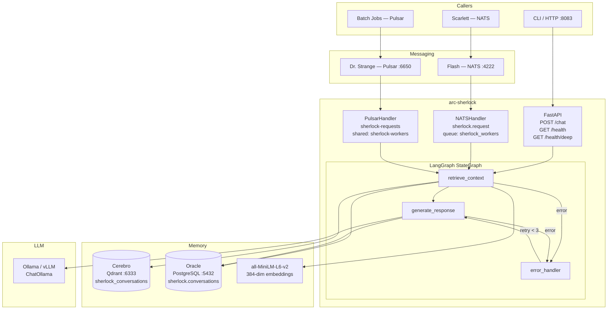
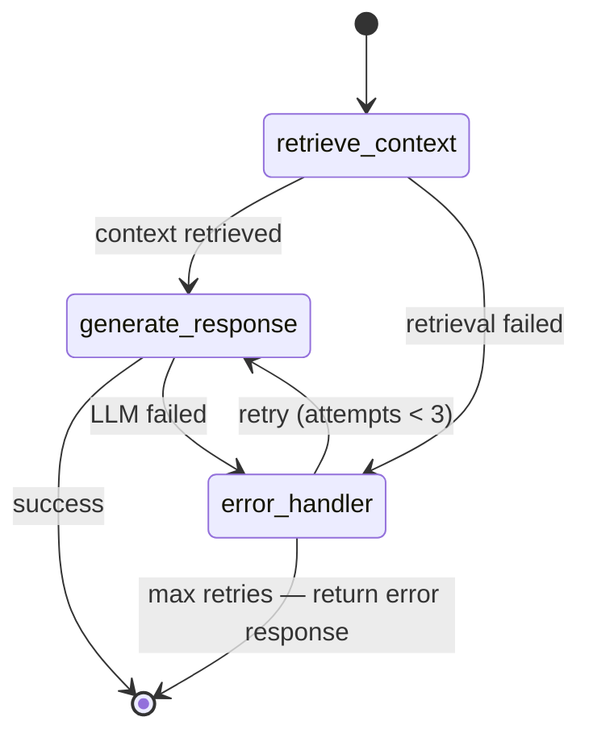
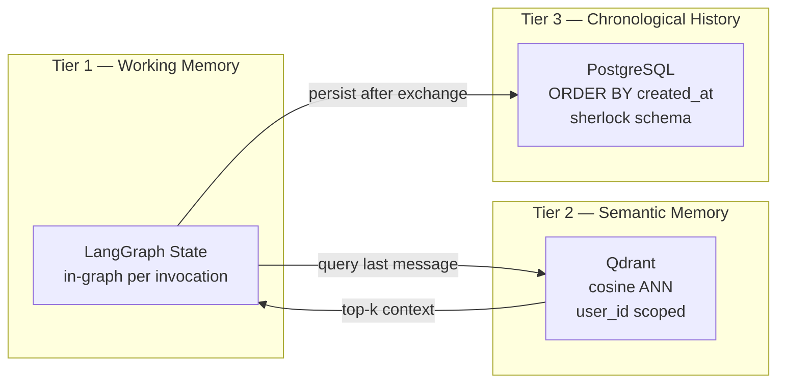
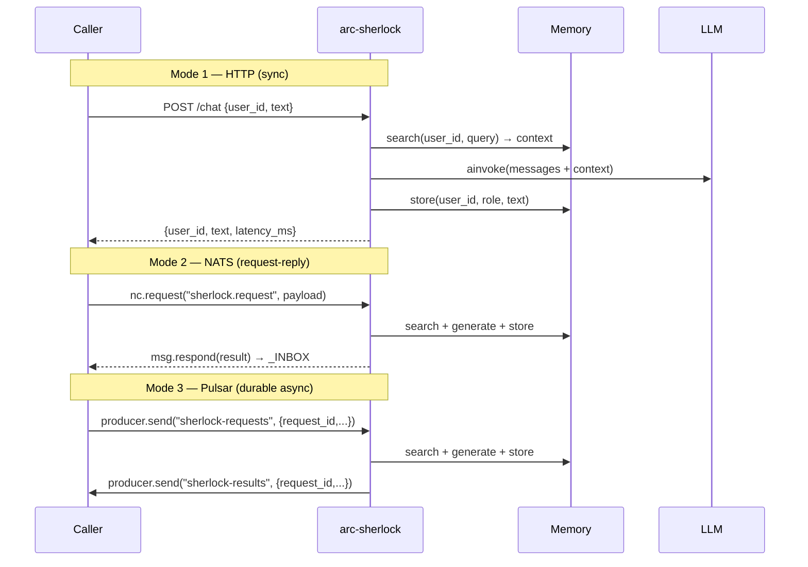

# Feature: Sherlock Reasoning Service

> **Spec**: 009-sherlock-reasoning
> **Date**: 2026-03-01
> **Status**: Draft
> **Informed by**: `specs/009-sherlock-reasoning/.work-docs/system-design.md`, `spec-doc.md`

## Target Modules

| Module | Path | Impact |
|--------|------|--------|
| Services | `services/reasoner/` | New — full Python service (19 files) |
| Services | `services/profiles.yaml` | Modify — add `reasoner` to `reason` profile |
| Services | `Makefile` | Modify — add `include services/reasoner/reasoner.mk` |

No CLI, SDK, or Docs changes in v1.

## Overview

Sherlock (`arc-sherlock`) is the first Python intelligence service in the A.R.C. monorepo. It provides stateful, context-aware reasoning via a LangGraph state machine, with conversation memory split across Qdrant (semantic ANN search) and PostgreSQL (ordered history). It accepts requests over three transports: HTTP (sync), NATS request-reply (real-time inter-service), and Pulsar (durable async, opt-in).

## Architecture

### LangGraph Graph

**AgentState** (`TypedDict` + `Annotated` reducers):

| Field | Type | Reducer |
|-------|------|---------|
| `messages` | `list[BaseMessage]` | `add_messages` (append-only) |
| `user_id` | `str` | last-write-wins |
| `context` | `Optional[list[str]]` | last-write-wins |
| `final_response` | `Optional[str]` | last-write-wins |

### Memory Architecture

### Invocation Modes

---

## User Scenarios & Testing

### P1 — Must Have

**US-1**: As an agent developer, I want to send a reasoning request via HTTP so that I can test Sherlock directly.
- **Given**: `arc-sherlock` is running with Qdrant, PostgreSQL, and Ollama available
- **When**: `POST http://localhost:8083/chat {"user_id": "u1", "text": "Hello"}`
- **Then**: Response `200 {"user_id": "u1", "text": "...", "latency_ms": N}` within 90s
- **Test**: `test_api.py::test_chat_happy_path` (mock graph)

**US-2**: As Scarlett (voice service), I want to invoke Sherlock via NATS so that I don't need an HTTP client.
- **Given**: Both `arc-messaging` (NATS) and `arc-sherlock` are running
- **When**: `nc.request("sherlock.request", {"user_id":"u1","text":"hi"}, timeout=30)`
- **Then**: Response payload `{"user_id":"u1","text":"...","latency_ms":N}` delivered to `_INBOX`
- **Test**: `test_nats_handler.py::test_request_reply` (mock nc, mock graph)

**US-3**: As a platform operator, I want `make reasoner-up` to start Sherlock so that it integrates with the platform.
- **Given**: `arc_platform_net` and `arc_otel_net` Docker networks exist
- **When**: `make reasoner-build && make reasoner-up`
- **Then**: `curl http://localhost:8083/health` → `{"status":"ok"}` within 30s
- **Test**: `make reasoner-health` exits 0

**US-4**: As a platform operator, I want `make dev PROFILE=reason` to include Sherlock so that the full dev stack is cohesive.
- **Given**: `reasoner` is listed in `services/profiles.yaml` under `reason`
- **When**: `make dev PROFILE=reason`
- **Then**: `arc-sherlock` container starts alongside cortex, messaging, cache, otel, etc.
- **Test**: `make dev-health PROFILE=reason` exits 0 with all services healthy

**US-5**: As a platform developer, I want `make reasoner-test` to pass without live services so that CI is fast and isolated.
- **Given**: All tests mock Qdrant, PostgreSQL, NATS, and LLM
- **When**: `make reasoner-test`
- **Then**: All tests pass; coverage ≥ 75% on critical paths
- **Test**: `pytest tests/ --cov=sherlock`

### P2 — Should Have

**US-6**: As a batch processing agent, I want to publish reasoning tasks via Pulsar and receive durable results so that long-running tasks survive Sherlock restarts.
- **Given**: `arc-streaming` (Pulsar) is running; `SHERLOCK_PULSAR_ENABLED=true`
- **When**: `producer.send("persistent://public/default/sherlock-requests", {"request_id":"r1","user_id":"u1","text":"..."}`
- **Then**: Result published to `sherlock-results` with matching `request_id`; message acked
- **Test**: `test_pulsar_handler.py::test_process_and_ack`

**US-7**: As a platform developer, I want `/health/deep` to report per-dependency status so that I can diagnose startup failures.
- **Given**: Sherlock running; Qdrant is unavailable
- **When**: `GET /health/deep`
- **Then**: `503 {"status":"degraded","components":{"qdrant":false,"postgres":true,"nats":true}}`
- **Test**: `test_api.py::test_health_deep_qdrant_down`

**US-8**: As a developer, I want `make reasoner-lint` to pass clean so that code quality is enforced.
- **Given**: `ruff` and `mypy` installed
- **When**: `make reasoner-lint`
- **Then**: Both tools exit 0 with no errors or warnings
- **Test**: CI gate

### P3 — Nice to Have

**US-9**: As a developer, I want content tracing to be disabled by default so that prompt/response content is not leaked to OTEL collectors.
- **Given**: `SHERLOCK_CONTENT_TRACING` is unset (default `false`)
- **When**: A `/chat` request is processed
- **Then**: OTEL spans contain no `user_id` message content; only latency + status attributes
- **Test**: `test_observability.py::test_content_tracing_disabled`

**US-10**: As a Pulsar caller that didn't provide a `reply_to`, I want the NATS handler to silently skip responding so that fire-and-forget messages don't error.
- **Given**: NATS message with no `reply` field
- **When**: Handler processes the message
- **Then**: `msg.respond()` is NOT called; no exception raised
- **Test**: `test_nats_handler.py::test_fire_and_forget`

---

## Requirements

### Functional

- [ ] **FR-1**: `POST /chat` accepts `{user_id: str, text: str}`, returns `{user_id, text, latency_ms}` (HTTP 200) or error codes 422/503/500
- [ ] **FR-2**: NATS handler subscribes to `sherlock.request` in queue group `sherlock_workers`; responds via `msg.respond()` only when `msg.reply` is set
- [ ] **FR-3**: Pulsar handler (when `SHERLOCK_PULSAR_ENABLED=true`) consumes `sherlock-requests`, publishes to `sherlock-results`, acks on success, negative-acks on failure
- [ ] **FR-4**: LangGraph executes linear graph: `START → retrieve_context → generate_response → END`, with `error_handler` conditional edge on failure
- [ ] **FR-5**: `retrieve_context` encodes the last user message with `all-MiniLM-L6-v2` (384-dim), performs cosine ANN search on `sherlock_conversations` collection, filtered by `user_id`, returns top-k results
- [ ] **FR-6**: `generate_response` builds a `ChatPromptTemplate` with system prompt + retrieved context + message history, calls `ChatOllama.ainvoke()`
- [ ] **FR-7**: After each exchange, both user turn and assistant turn are stored in Qdrant (vector) and PostgreSQL (`sherlock.conversations`)
- [ ] **FR-8**: `GET /health` → shallow liveness (checks NATS connection flag only); always 200 if process is alive
- [ ] **FR-9**: `GET /health/deep` → probes Qdrant, PostgreSQL, and NATS; returns `{"status","version","components"}` with per-component booleans; 503 if any component fails
- [ ] **FR-10**: Qdrant collection `sherlock_conversations` created on startup if absent
- [ ] **FR-11**: PostgreSQL schema `sherlock` and table `sherlock.conversations` created on startup if absent
- [ ] **FR-12**: `make reasoner-up` starts `arc-sherlock`; container joins `arc_platform_net` + `arc_otel_net`
- [ ] **FR-13**: `reasoner` added to `reason` profile in `services/profiles.yaml`
- [ ] **FR-14**: `make dev-regen` succeeds after `service.yaml` is created

### Non-Functional

- [ ] **NFR-1**: `retrieve_context` completes in < 10s (tenacity 3 retries, exponential backoff)
- [ ] **NFR-2**: `generate_response` completes in < 60s (Ollama default timeout)
- [ ] **NFR-3**: Container health check passes within 30s (`start_period: 30s` for embedding model download)
- [ ] **NFR-4**: Non-root container — user `sherlock:sherlock` (Constitution VIII)
- [ ] **NFR-5**: All env vars prefixed `SHERLOCK_`; no secrets, prompts, or responses in logs by default
- [ ] **NFR-6**: Test suite passes with ≥ 75% coverage on `sherlock/` package; no live services required
- [ ] **NFR-7**: OTEL traces, metrics, and structured logs exported to `arc-friday-collector:4317`
- [ ] **NFR-8**: `ruff check src/` and `mypy src/` both pass clean
- [ ] **NFR-9**: Host port `127.0.0.1:8083:8000` (cortex=8081, pulsar-admin=8082 — no conflict)
- [ ] **NFR-10**: `SHERLOCK_PULSAR_ENABLED=false` by default; Pulsar consumer only starts when explicitly enabled

### Key Entities

| Entity | Module | Description |
|--------|--------|-------------|
| `AgentState` | `sherlock/graph.py` | LangGraph `TypedDict` — messages, user_id, context, final_response |
| `SherlockMemory` | `sherlock/memory.py` | Dual-store manager — Qdrant (vectors) + PostgreSQL (history) |
| `AppState` | `sherlock/main.py` | FastAPI app state dataclass — holds all singletons, no module globals |
| `Settings` | `sherlock/config.py` | Pydantic `BaseSettings` — all config, `SHERLOCK_` prefix |
| `Conversation` | `sherlock/memory.py` | SQLAlchemy ORM model — `sherlock.conversations` table |
| `NATSHandler` | `sherlock/nats_handler.py` | Manages NATS connection, queue subscription, message dispatch |
| `PulsarHandler` | `sherlock/pulsar_handler.py` | `asyncio.to_thread` wrapper for blocking `pulsar-client` |
| `SherlockMetrics` | `sherlock/observability.py` | OTEL counters + histograms for requests, errors, latency, context size |

---

## Edge Cases

| Scenario | Expected Behavior |
|----------|-------------------|
| Qdrant unavailable at startup | Startup fails with clear error; healthcheck fails; container restarts |
| Qdrant becomes unavailable mid-request | `tenacity` retries 3x with exponential backoff; `/health/deep` returns 503 |
| PostgreSQL unavailable at startup | Startup fails; schema init raises exception |
| LLM (Ollama) unavailable | `RetryPolicy` retries 3x; `error_handler` node returns graceful error response |
| NATS message with no `reply` field | Handler skips `msg.respond()`; no error; message processed normally |
| Pulsar message fails during `invoke_graph` | `negative_acknowledge(msg)` → Pulsar redelivers to another replica |
| First cold start (no embedding cache) | `sentence-transformers` downloads ~90MB; `start_period: 30s` prevents premature health failures |
| `/chat` request while service not ready | Returns `503 Service not ready` (graph not yet built) |
| Missing `user_id` or `text` in request | Returns `422 Unprocessable Entity` (Pydantic validation) |
| LangGraph `recursion_limit` hit | Returns error response after `recursion_limit: 10` steps |
| `request_id` missing in Pulsar message | Handler raises `KeyError`; negative-ack; message redelivered |
| Qdrant collection exists with wrong dimensions | Collection check passes; search returns incorrect results — requires manual migration |

---

## Success Criteria

- [ ] **SC-1**: `make reasoner-up` starts `arc-sherlock`; `curl http://localhost:8083/health` returns `{"status":"ok"}` within 30s
- [ ] **SC-2**: `POST http://localhost:8083/chat {"user_id":"test","text":"Hello"}` returns `200 {"user_id":"test","text":"...","latency_ms":N}` (requires Ollama)
- [ ] **SC-3**: `make reasoner-test` passes; `pytest --cov=sherlock` reports ≥ 75% coverage on critical paths; no live services needed
- [ ] **SC-4**: `make reasoner-lint` exits 0 — both `ruff check src/` and `mypy src/` clean
- [ ] **SC-5**: NATS `nc.request("sherlock.request", payload, timeout=30)` returns valid response
- [ ] **SC-6**: `make dev PROFILE=reason && make dev-health PROFILE=reason` exits 0 with Sherlock healthy
- [ ] **SC-7**: `GET /health/deep` returns per-component booleans; returns 503 when Qdrant is stopped
- [ ] **SC-8**: `make dev-regen` succeeds; `grep sherlock .make/registry.mk` finds `SERVICE_reasoner_HEALTH` entry
- [ ] **SC-9**: Pulsar round-trip: message published to `sherlock-requests` → result appears on `sherlock-results` with matching `request_id` (requires `SHERLOCK_PULSAR_ENABLED=true`)

---

## Docs & Links Update

- [ ] Update `SERVICE.MD` — add Sherlock row to the service matrix table
- [ ] Update `specs/index.md` — add `009-sherlock-reasoning` entry
- [ ] Remove or archive `spec-doc.md` from repo root (temporary draft, not a permanent artifact)
- [ ] Verify `CLAUDE.md` monorepo layout comment for `services/reasoner/` is accurate post-implementation

### API Contracts (in `contracts/`)

| File | Standard | Describes |
|------|----------|-----------|
| `contracts/openapi.yaml` | OpenAPI 3.1 | HTTP: `POST /chat`, `GET /health`, `GET /health/deep` |
| `contracts/asyncapi.yaml` | AsyncAPI 3.0 | NATS: `sherlock.request` · Pulsar: `sherlock-requests` + `sherlock-results` |

FastAPI serves the live Swagger UI at `http://localhost:8083/docs` and raw spec at `http://localhost:8083/openapi.json`. The `contracts/openapi.yaml` is the design-time contract (spec-first) — the two should remain in sync. There is no runtime AsyncAPI server; `contracts/asyncapi.yaml` is the authoritative reference for all message-based callers.

---

## Constitution Compliance

| Principle | Applies | Compliant | Notes |
|-----------|---------|-----------|-------|
| I. Zero-Dep CLI | ✗ | n/a | Service only — no CLI changes |
| II. Platform-in-a-Box | ✓ | ✓ | `make reasoner-up` + profile integration |
| III. Modular Services | ✓ | ✓ | Self-contained `services/reasoner/` with `service.yaml` |
| IV. Two-Brain | ✓ | ✓ | Python = intelligence only; no Go in this service |
| V. Polyglot Standards | ✓ | ✓ | FastAPI + LangGraph, ruff + mypy, pytest, OTEL, `SHERLOCK_` prefix |
| VI. Local-First | ✗ | n/a | CLI principle — not applicable |
| VII. Observability | ✓ | ✓ | `/health`, `/health/deep`, OTEL traces/metrics/structlog |
| VIII. Security | ✓ | ✓ | Non-root `sherlock:sherlock`, `127.0.0.1` binding, content tracing off by default |
| IX. Declarative | ✗ | n/a | CLI principle — not applicable |
| X. Stateful Ops | ✗ | n/a | CLI principle — not applicable |
| XI. Resilience | ✓ | ✓ | `tenacity` retries, Pulsar negative-ack, health check `start_period: 30s` |
| XII. Interactive | ✗ | n/a | CLI principle — not applicable |
