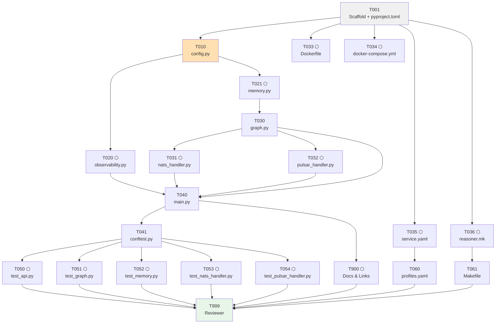

# Tasks: Sherlock Reasoning Service

> **Spec**: 009-sherlock-reasoning
> **Date**: 2026-03-01

## Task Format

```
[TASK-NNN] [P?] [MODULE] [PRIORITY] Description
  Dependencies: [TASK-XXX] or none
  Module: services/reasoner
  Acceptance: Testable criteria
  Status: [ ] pending | [~] in-progress | [x] done
```

- `[P]` = Safe for parallel agent execution
- Priority: P1 (must), P2 (should), P3 (nice)

---

## Dependency Graph



> ⬡ = parallel-safe task

---

## Quality Requirements

| Module | Coverage | Lint |
|--------|----------|------|
| `services/reasoner` (Python) | 75% critical / 60% core / 40% infra | `ruff check src/` + `mypy src/` |

---

## Phase 1: Setup

- [ ] **[TASK-001]** `[SERVICES]` `[P1]` Scaffold `services/reasoner/` directory and `pyproject.toml`
  - Dependencies: none
  - Module: `services/reasoner/`
  - Acceptance:
    - `services/reasoner/src/sherlock/__init__.py` and `tests/__init__.py` exist
    - `pyproject.toml` declares all dependencies (fastapi, uvicorn, langgraph>=1.0, langchain-core>=0.3, langchain-ollama>=0.2, qdrant-client, sqlalchemy, asyncpg, sentence-transformers, nats-py, pulsar-client, opentelemetry-*, structlog, tenacity) and dev deps (pytest, pytest-asyncio, httpx, pytest-cov, ruff, mypy)
    - `pip install -e ".[dev]"` dry-run succeeds (or `pyproject.toml` validates with `pip check`)
    - Package name: `arc-sherlock`, version `0.1.0`
  - Status: [x]

---

## Phase 2: Foundational

- [ ] **[TASK-010]** `[SERVICES]` `[P1]` Implement `config.py` — Pydantic BaseSettings foundation
  - Dependencies: TASK-001
  - Module: `services/reasoner/src/sherlock/config.py`
  - Acceptance:
    - `Settings()` instantiates with no env vars set (all defaults valid)
    - All `SHERLOCK_*` env var aliases present for: service_name, version, postgres_url, qdrant_host, qdrant_port, qdrant_collection, nats_url, nats_enabled, nats_subject, nats_queue_group, pulsar_url, pulsar_enabled (default `False`), pulsar_request_topic, pulsar_result_topic, pulsar_subscription, llm_model, llm_base_url, embedding_model, embedding_dim, context_top_k, otel_endpoint, otel_traces_enabled, otel_metrics_enabled, content_tracing (default `False`)
    - `OTEL_EXPORTER_OTLP_ENDPOINT` env var accepted as alias for `otel_endpoint`
    - Default values verified: `Settings().embedding_dim == 384`, `Settings().context_top_k == 5`, `Settings().content_tracing == False`, `Settings().pulsar_enabled == False`
    - `mypy src/sherlock/config.py` passes clean
  - Status: [x]

---

## Phase 3: Implementation

### Parallel Batch A — Independent modules (all depend only on config.py)

- [ ] **[TASK-020]** `[P]` `[SERVICES]` `[P1]` Implement `observability.py` — OTEL + structlog
  - Dependencies: TASK-010
  - Module: `services/reasoner/src/sherlock/observability.py`
  - Acceptance:
    - `configure_logging()` emits structured JSON output (structlog)
    - `init_telemetry(settings)` creates `TracerProvider` + `MeterProvider` with OTLP gRPC exporters; no exception when called
    - `instrument_app(app)` calls `FastAPIInstrumentor().instrument_app(app)` without error
    - `SherlockMetrics` exposes: counters `sherlock.requests.total` and `sherlock.errors.total`; histograms `sherlock.latency` (ms) and `sherlock.context.size`
    - When `settings.content_tracing=False` no message content added to spans
    - **[GAP-5]** `test_content_tracing_default_false`: `Settings().content_tracing == False` when `SHERLOCK_CONTENT_TRACING` is unset — security default verified
    - **[GAP-5]** `test_content_tracing_env_override`: setting `SHERLOCK_CONTENT_TRACING=true` in env → `Settings().content_tracing == True`
    - **[GAP-5]** `test_otel_span_no_content_when_disabled`: mock tracer span, call span-attribute helper with `content_tracing=False` → span has no `user_message` or `assistant_message` attributes
    - `mypy src/sherlock/observability.py` passes clean
  - Status: [x]

- [ ] **[TASK-021]** `[P]` `[SERVICES]` `[P1]` Implement `memory.py` — dual-store SherlockMemory
  - Dependencies: TASK-010
  - Module: `services/reasoner/src/sherlock/memory.py`
  - Acceptance:
    - `SherlockMemory.init()` creates Qdrant collection `sherlock_conversations` if absent (vectors `size=384`, distance `Cosine`); idempotent — re-running init does not error
    - `init()` creates PostgreSQL schema `sherlock` and table `sherlock.conversations` if absent
    - `Conversation` ORM model has fields: `id` (UUID PK), `user_id` (TEXT, indexed), `role` (TEXT — "human"|"ai"), `content` (TEXT), `created_at` (TIMESTAMPTZ DEFAULT now())
    - `search(user_id, text)` encodes `text` with `all-MiniLM-L6-v2`, queries Qdrant with `user_id` payload filter, returns `list[str]` (top-k content strings)
    - `save(user_id, role, text)` upserts to Qdrant and inserts to PostgreSQL
    - `health_check()` returns `{"qdrant": bool, "postgres": bool}` — probes each independently; one failure does not mask the other
    - `mypy src/sherlock/memory.py` passes clean
  - Status: [x]

### Parallel Batch B — Graph (depends on memory.py)

- [ ] **[TASK-030]** `[SERVICES]` `[P1]` Implement `graph.py` — LangGraph 1.0.x state machine
  - Dependencies: TASK-021
  - Module: `services/reasoner/src/sherlock/graph.py`
  - Acceptance:
    - `AgentState` TypedDict has fields: `messages` (`Annotated[list[BaseMessage], add_messages]`), `user_id` (str), `context` (`Optional[list[str]]`), `final_response` (`Optional[str]`), `error_count` (int)
    - `build_graph(memory, llm)` returns a compiled `StateGraph` using LangGraph 1.0.x API (`workflow.add_edge(START, ...)`, not `set_entry_point`)
    - Graph has three nodes: `retrieve_context`, `generate_response`, `error_handler`
    - Conditional edge: exceptions in `retrieve_context` or `generate_response` route to `error_handler`
    - `error_handler` retries `generate_response` when `error_count < 3`; returns error response string when retries exhausted
    - `invoke_graph(graph, memory, user_id, text)` runs the graph and returns `str` response
    - `ChatPromptTemplate` used to inject retrieved context into the system prompt
    - `mypy src/sherlock/graph.py` passes clean
  - Status: [x]

### Parallel Batch C — Transport handlers (both depend on graph.py)

- [ ] **[TASK-031]** `[P]` `[SERVICES]` `[P1]` Implement `nats_handler.py` — NATS request-reply handler
  - Dependencies: TASK-030
  - Module: `services/reasoner/src/sherlock/nats_handler.py`
  - Acceptance:
    - `NATSHandler.__init__` accepts `graph`, `memory`, `settings`, `metrics` (injected — no module globals)
    - `connect()` calls `nats.connect(settings.nats_url)` asynchronously
    - `subscribe()` subscribes to `settings.nats_subject` with queue group `settings.nats_queue_group`
    - `_handle(msg)` decodes JSON `{user_id, text}`, calls `invoke_graph`, increments metrics
    - **Fire-and-forget guard**: `if msg.reply: await msg.respond(...)` — missing reply subject silently skipped
    - Error response on exception: `{"error": str(e), "latency_ms": N}` (only if `msg.reply` set)
    - `is_connected()` returns connection status bool (used by `/health`)
    - `close()` drains and closes connection
    - `mypy src/sherlock/nats_handler.py` passes clean
  - Status: [x]

- [ ] **[TASK-032]** `[P]` `[SERVICES]` `[P2]` Implement `pulsar_handler.py` — durable async Pulsar consumer
  - Dependencies: TASK-030
  - Module: `services/reasoner/src/sherlock/pulsar_handler.py`
  - Acceptance:
    - `PulsarHandler.__init__` accepts `graph`, `memory`, `settings`, `metrics` (injected)
    - `start()` calls `_connect()` via `asyncio.to_thread` then spawns `_consume_loop()` as background `asyncio.Task`
    - `_connect()` creates `pulsar.Client`, subscribes with `ConsumerType.Shared` (subscription name = `settings.pulsar_subscription`), creates producer for `settings.pulsar_result_topic`
    - `_consume_loop()` calls `consumer.receive(timeout_millis=5000)` via `asyncio.to_thread`; spawns `asyncio.create_task(_process(msg))` per message
    - **[GAP-6 resolved]** `_process(msg)` failure path — two distinct outcomes:
      - **Path A — graph returned error string** (error_handler capped retries): `invoke_graph` returns a string; `_process` publishes `{"request_id":..., "error": str, "latency_ms": N}` to `sherlock-results` → **`consumer.acknowledge(msg)`** (successful processing of bad input)
      - **Path B — unhandled exception** (JSON decode failure, missing `request_id`, Pulsar send error): exception escapes before or after `invoke_graph` → **`consumer.negative_acknowledge(msg)`** → Pulsar redelivers to another replica
    - `close()` cancels consume task, calls `client.close()` via `asyncio.to_thread`
    - `mypy src/sherlock/pulsar_handler.py` passes clean
  - Status: [x]

### Parallel Batch D — Infrastructure files (depend only on T001 scaffold)

- [ ] **[TASK-033]** `[P]` `[SERVICES]` `[P1]` Write `Dockerfile` — multi-stage Alpine, non-root
  - Dependencies: TASK-001
  - Module: `services/reasoner/Dockerfile`
  - Acceptance:
    - Two stages: `builder` (python:3.13-alpine + gcc musl-dev libffi-dev) and runtime (python:3.13-alpine)
    - Builder installs deps to `/install` prefix; runtime copies `/install`
    - Runtime installs `libstdc++ libgomp` (required by sentence-transformers on Alpine)
    - `RUN addgroup -S sherlock && adduser -S -G sherlock sherlock`
    - `USER sherlock` appears before `CMD`
    - `CMD ["uvicorn", "sherlock.main:app", "--host", "0.0.0.0", "--port", "8000"]`
    - Comment noting `python:3.13-slim` fallback for arm64 Alpine failures
  - Status: [x]

- [ ] **[TASK-034]** `[P]` `[SERVICES]` `[P1]` Write `docker-compose.yml` — arc-sherlock service definition
  - Dependencies: TASK-001
  - Module: `services/reasoner/docker-compose.yml`
  - Acceptance:
    - `name: arc-platform`; service name `arc-sherlock`
    - Port binding: `127.0.0.1:8083:8000` (localhost-only, no conflict with cortex=8081, pulsar-admin=8082)
    - Networks: `arc_platform_net` and `arc_otel_net` both declared as `external: true`
    - **No `depends_on`** block (handled by `resolve-deps.sh`)
    - Healthcheck: `wget -qO- http://localhost:8000/health || exit 1`, `interval: 15s`, `timeout: 5s`, `retries: 5`, `start_period: 30s`
    - `restart: unless-stopped`
    - `image: ghcr.io/arc-framework/arc-sherlock:latest`
  - Status: [x]

- [ ] **[TASK-035]** `[P]` `[SERVICES]` `[P1]` Write `service.yaml` — service registry metadata
  - Dependencies: TASK-001
  - Module: `services/reasoner/service.yaml`
  - Acceptance:
    - Fields present: `name: arc-sherlock`, `role: reasoner`, `codename: sherlock`, `image`, `version: "0.1.0"`, `language: python`, `port: 8083`, `health: http://localhost:8083/health`, `timeout: 180`
    - `depends_on` lists exactly: `sql-db`, `vector-db`, `messaging`, `streaming`, `friday-collector`
  - Status: [x]

- [ ] **[TASK-036]** `[P]` `[SERVICES]` `[P1]` Write `reasoner.mk` — Make targets following cortex.mk pattern
  - Dependencies: TASK-001
  - Module: `services/reasoner/reasoner.mk`
  - Acceptance:
    - Uses same color macros (`COLOR_INFO`/`COLOR_OK`/`COLOR_ERR`) and `COMPOSE_VAR` pattern as `cortex.mk`
    - Implements targets: `reasoner-help`, `reasoner-build`, `reasoner-build-fresh`, `reasoner-up`, `reasoner-down`, `reasoner-health`, `reasoner-logs`, `reasoner-test`, `reasoner-test-cover`, `reasoner-lint`, `reasoner-check`, `reasoner-push`, `reasoner-publish`, `reasoner-tag`, `reasoner-clean`, `reasoner-nuke`
    - `reasoner-test` runs `pytest tests/`; `reasoner-lint` runs `ruff check src/ && mypy src/`
    - `reasoner-health` checks `http://localhost:8083/health`
    - `make reasoner-help` outputs usage without error
  - Status: [x]

---

## Phase 4: Integration

- [ ] **[TASK-040]** `[SERVICES]` `[P1]` Implement `main.py` — FastAPI app with AppState dataclass and lifespan
  - Dependencies: TASK-020, TASK-030, TASK-031, TASK-032
  - Module: `services/reasoner/src/sherlock/main.py`
  - Acceptance:
    - `AppState` dataclass holds: `memory: SherlockMemory`, `graph: CompiledGraph`, `nats: NATSHandler`, `pulsar: Optional[PulsarHandler]`, `metrics: SherlockMetrics` — no module globals
    - **[GAP-4]** No module-level assignments to `SherlockMemory`, `NATSHandler`, `PulsarHandler`, or any handler/service singleton — all initialized only inside the `@asynccontextmanager lifespan` function and stored in `AppState`. Note: `app = FastAPI(...)` at module scope is the standard ASGI entry point convention and is explicitly exempt from this rule — uvicorn requires it at module scope for service discovery.
    - **[GAP-4]** Code review confirms: no `app.state.memory = ...` outside lifespan; no bare `memory = SherlockMemory()` at module scope
    - Lifespan startup order: `configure_logging → init_telemetry → memory.init() → ChatOllama init → build_graph → nats.connect() + subscribe() → pulsar.start()` (only if `settings.pulsar_enabled`)
    - `POST /chat` calls `invoke_graph`, returns `ChatResponse(user_id, text, latency_ms)` with 200; returns 503 `{"detail":"Service not ready"}` if graph not initialized; 422 on Pydantic validation failure
    - `GET /health` returns `{"status":"ok","version":...}` 200 always (if process alive + NATS connected)
    - `GET /health/deep` calls `memory.health_check()` + NATS `is_connected()`; returns `{"status","version","components":{"qdrant","postgres","nats"}}`; 503 if any component `False`
    - `instrument_app(app)` called after app creation (OTEL FastAPI instrumentation)
    - OTEL span started per `/chat` request with `user_id` and `transport: http` attributes
    - `mypy src/sherlock/main.py` passes clean
  - Status: [x]

- [ ] **[TASK-041]** `[SERVICES]` `[P1]` Write `tests/conftest.py` — shared test fixtures
  - Dependencies: TASK-040
  - Module: `services/reasoner/tests/conftest.py`
  - Acceptance:
    - `mock_memory` fixture: `AsyncMock(SherlockMemory)` with `search()→["ctx1","ctx2"]`, `save()→None`, `health_check()→{"qdrant":True,"postgres":True}`, `init()→None`
    - `mock_graph` fixture: `MagicMock(CompiledGraph)` — `invoke_graph` patched to return `"mocked response"`
    - `mock_nats` fixture: mock `NATSHandler` with `is_connected()→True`
    - `app_state` fixture: fully-populated `AppState` using mocks above
    - `test_client` fixture: `httpx.AsyncClient` wrapping the FastAPI app with `app_state` injected
    - All fixtures `pytest.mark.asyncio` compatible; no live services required
  - Status: [x]

### Parallel Batch — Tests (all depend on T041 conftest)

- [ ] **[TASK-050]** `[P]` `[SERVICES]` `[P1]` Write `tests/test_api.py` — HTTP endpoint tests
  - Dependencies: TASK-041
  - Module: `services/reasoner/tests/test_api.py`
  - Acceptance:
    - `test_chat_happy_path`: POST `/chat` with valid body → 200 `{user_id, text, latency_ms}` (mock graph)
    - `test_chat_422_missing_user_id`: POST without `user_id` → 422
    - `test_chat_422_empty_text`: POST with `text=""` → 422
    - `test_chat_503_service_not_ready`: POST when graph is None → 503 `{"detail":"Service not ready"}`
    - `test_health_200`: GET `/health` → 200 `{"status":"ok"}`
    - `test_health_deep_all_healthy`: GET `/health/deep` with all mocks healthy → 200 `{..., "components":{"qdrant":true,"postgres":true,"nats":true}}`
    - `test_health_deep_qdrant_down`: mock `health_check()→{"qdrant":False,"postgres":True}` → 503 with `"status":"degraded"`
    - **[GAP-2]** `test_chat_response_matches_openapi_schema`: load `contracts/openapi.yaml`, extract `ChatResponse` schema, validate actual response JSON with `jsonschema.validate()` — catches silent contract drift
  - Status: [x]

- [ ] **[TASK-051]** `[P]` `[SERVICES]` `[P1]` Write `tests/test_graph.py` — LangGraph state machine tests
  - Dependencies: TASK-041
  - Module: `services/reasoner/tests/test_graph.py`
  - Acceptance:
    - `test_build_graph_returns_compiled_graph`: `build_graph(mock_memory, mock_llm)` returns a non-None compiled graph
    - `test_invoke_graph_calls_memory_search`: `memory.search()` called once per `invoke_graph()`
    - `test_invoke_graph_calls_memory_save_twice`: `memory.save()` called twice (human turn + AI turn)
    - `test_invoke_graph_returns_string`: return value is `str`
    - `test_error_handler_triggered_on_llm_failure`: when `llm.ainvoke` raises, `error_handler` node is entered; after 3 retries returns error string (not exception)
  - Status: [x]

- [ ] **[TASK-052]** `[P]` `[SERVICES]` `[P1]` Write `tests/test_memory.py` — dual-store memory tests
  - Dependencies: TASK-041
  - Module: `services/reasoner/tests/test_memory.py`
  - Acceptance:
    - `test_init_creates_qdrant_collection`: `init()` calls `qdrant_client.create_collection` when collection absent; skips if exists (idempotent)
    - `test_init_creates_postgres_schema`: `init()` executes `CREATE SCHEMA IF NOT EXISTS sherlock` + table DDL
    - `test_search_returns_list_of_strings`: `search("user1","query")` calls Qdrant with `user_id` filter, returns `list[str]`
    - `test_save_upserts_qdrant_and_inserts_postgres`: `save()` calls both `qdrant_client.upsert` and SQLAlchemy `session.execute`
    - `test_health_check_qdrant_down`: Qdrant mock raises → `health_check()` returns `{"qdrant":False,"postgres":True}` (PG still probed)
    - `test_health_check_both_healthy`: returns `{"qdrant":True,"postgres":True}`
  - Status: [x]

- [ ] **[TASK-053]** `[P]` `[SERVICES]` `[P1]` Write `tests/test_nats_handler.py` — NATS handler tests
  - Dependencies: TASK-041
  - Module: `services/reasoner/tests/test_nats_handler.py`
  - Acceptance:
    - `test_request_reply`: handler receives msg with `reply="INBOX.xxx"` → `invoke_graph` called → `msg.respond()` called with JSON bytes
    - `test_fire_and_forget`: msg with `reply=None` → `invoke_graph` called → `msg.respond()` NOT called; no exception raised
    - `test_error_response_on_exception`: `invoke_graph` raises → error JSON `{"error":str,"latency_ms":N}` sent via `msg.respond()` (only if reply set)
    - `test_is_connected_true_after_connect`: `is_connected()` returns `True` after `connect()`
    - **[GAP-2]** `test_nats_request_payload_matches_asyncapi_schema`: load `contracts/asyncapi.yaml`, extract `ReasoningRequestPayload` schema, validate test payload with `jsonschema.validate()`
  - Status: [x]

- [ ] **[TASK-054]** `[P]` `[SERVICES]` `[P2]` Write `tests/test_pulsar_handler.py` — PulsarHandler tests
  - Dependencies: TASK-041
  - Module: `services/reasoner/tests/test_pulsar_handler.py`
  - Acceptance:
    - `test_process_and_ack`: valid `{request_id, user_id, text}` msg → `invoke_graph` returns response string → result `{request_id, user_id, text, latency_ms}` published to `sherlock-results` → `consumer.acknowledge(msg)` called
    - **[GAP-6 resolved]** `test_error_handler_result_published_and_acked`: `invoke_graph` returns error string (simulating error_handler exhausted retries) → `{"request_id":..., "error": str, "latency_ms": N}` published to `sherlock-results` → `consumer.acknowledge(msg)` called — NOT negative-acked (it was successfully processed)
    - **[GAP-6 resolved]** `test_unhandled_exception_triggers_negative_ack`: `invoke_graph` raises `RuntimeError` (e.g. Pulsar send fails) → `consumer.negative_acknowledge(msg)` called → no exception propagated from `_process()`
    - `test_missing_request_id_triggers_nack`: msg without `request_id` → `KeyError` during decode → negative-ack before `invoke_graph` is called
    - `test_asyncio_to_thread_used_for_blocking_calls`: all `producer.send`, `consumer.acknowledge`, `consumer.negative_acknowledge` calls wrapped via `asyncio.to_thread` (verify with mock)
    - **[GAP-2]** `test_pulsar_result_payload_matches_asyncapi_schema`: load `contracts/asyncapi.yaml`, extract `ReasoningResultPayload` schema, validate published result payload with `jsonschema.validate()`
  - Status: [x]

---

## Phase 5: Polish

- [ ] **[TASK-060]** `[SERVICES]` `[P1]` Modify `services/profiles.yaml` — add Sherlock to `reason` profile
  - Dependencies: TASK-035
  - Module: `services/profiles.yaml`
  - Acceptance:
    - `reasoner` listed under `reason.services` array
    - `ultra-instinct: services: '*'` unchanged (auto-includes via service.yaml)
    - Sherlock NOT added to `think` profile (requires external Ollama LLM)
    - `make dev-regen && grep sherlock .make/registry.mk` returns `SERVICE_reasoner_HEALTH` entry
  - Status: [x]

- [ ] **[TASK-061]** `[SERVICES]` `[P1]` Modify root `Makefile` — include reasoner.mk
  - Dependencies: TASK-036
  - Module: `Makefile`
  - Acceptance:
    - `include services/reasoner/reasoner.mk` added after `include services/realtime/realtime.mk`
    - `make reasoner-help` runs from repo root without error
    - `make reasoner-test` and `make reasoner-lint` reachable from repo root
  - Status: [x]

- [ ] **[TASK-900]** `[P]` `[DOCS]` `[P1]` Docs & links update
  - Dependencies: TASK-040
  - Module: `docs/`, `CLAUDE.md`, `specs/`
  - Acceptance:
    - `SERVICE.MD` (or equivalent service matrix) includes Sherlock row: codename, role, tech, port
    - `specs/index.md` includes `009-sherlock-reasoning` entry with title and status
    - `spec-doc.md` removed from repo root (was a temporary draft artifact)
    - `CLAUDE.md` monorepo layout comment for `services/reasoner/` matches actual implementation
    - All internal links in spec.md, plan.md, and contracts/ are valid
  - Status: [x]

- [ ] **[TASK-999]** `[REVIEW]` `[P1]` Reviewer agent verification
  - Dependencies: ALL (T001–T900)
  - Module: all affected modules
  - Acceptance:
    - All tasks T001–T900 show `[x]` done
    - `make reasoner-test` passes; `pytest --cov=sherlock` reports ≥ 75% on critical packages
    - `make reasoner-lint` exits 0 — `ruff check src/` and `mypy src/` both clean
    - `make reasoner-build` produces a valid Docker image
    - `docker inspect arc-sherlock` confirms non-root user `sherlock`
    - `make dev-regen && grep sherlock .make/registry.mk` finds `SERVICE_reasoner_HEALTH`
    - `services/profiles.yaml` has `reasoner` under `reason`
    - `Makefile` includes `services/reasoner/reasoner.mk`
    - **[GAP-2]** `GET http://localhost:8083/openapi.json` response matches `contracts/openapi.yaml` — compare `ChatRequest`, `ChatResponse`, `DeepHealthResponse` schemas manually or with `openapi-diff`
    - **[GAP-2]** `contracts/asyncapi.yaml` `ReasoningRequestPayload`, `DurableReasoningRequestPayload`, `ReasoningResultPayload` schemas verified against `NATSHandler._handle` and `PulsarHandler._process` JSON structures
    - **[GAP-4]** `main.py` has zero module-level singleton assignments — confirmed by code review
    - Constitution compliance confirmed: II, III, IV, V, VII, VIII, XI all PASS
    - No `Co-Authored-By:` or AI attribution in any commit messages
  - Status: [x]

---

## Progress Summary

| Phase | Total | Done | Parallel-safe |
|-------|-------|------|---------------|
| Phase 1 — Setup | 1 | 1 | 0 |
| Phase 2 — Foundational | 1 | 1 | 0 |
| Phase 3 — Implementation | 10 | 10 | 9 |
| Phase 4 — Integration | 7 | 7 | 5 |
| Phase 5 — Polish | 4 | 4 | 2 |
| **Total** | **23** | **23** | **16** |

---

## Parallel Execution Guide

When running `/speckit.implement`, the following batches can be dispatched simultaneously:

| Batch | Tasks | Gate |
|-------|-------|------|
| After T001 | T010 (sequential) | scaffold exists |
| After T010 | T020, T021 in parallel | config.py exists |
| Anytime after T001 | T033, T034, T035, T036 in parallel | scaffold exists (infra has no code deps) |
| After T021 | T030 | memory.py exists |
| After T030 | T031, T032 in parallel | invoke_graph exists |
| After T020+T030+T031+T032 | T040 | all modules exist |
| After T040 | T041, T900 in parallel | main.py + AppState exist |
| After T041 | T050, T051, T052, T053, T054 in parallel | conftest fixtures exist |
| After T035 | T060 | service.yaml exists |
| After T036 | T061 | reasoner.mk exists |
| After all | T999 | reviewer gate |
