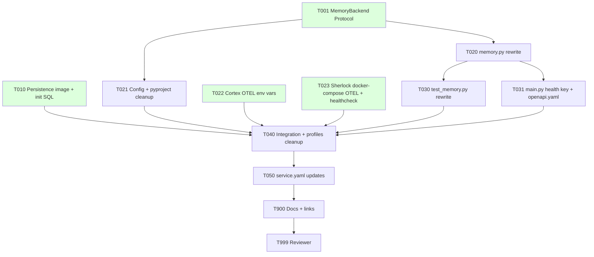

# Tasks: pgvector Migration + Observability Hardening

> **Spec**: 011-vector-setup
> **Date**: 2026-03-02

## Task Format

```
[TASK-NNN] [P?] [MODULE] [PRIORITY] Description
  Dependencies: [TASK-XXX] or none
  Module: services/{role}
  Acceptance: Testable criteria
```

- `[P]` = Safe for parallel agent execution
- Priority: P1 (must), P2 (should), P3 (nice)

## Dependency Graph



## Quality Requirements

| Module | Coverage | Lint | Notes |
|--------|----------|------|-------|
| Python (reasoner) | 75% critical / 60% core / 40% infra | ruff + mypy | `make reasoner-lint` |
| SQL (persistence) | n/a | n/a | Init scripts verified by `pg_isready` + `SELECT 1` |

---

## Phase 1: Setup

### Parallel Batch — all Phase 1 tasks are independent

- [ ] **[TASK-001]** [P] [REASONER] [P1] Define `MemoryBackend` Protocol in `memory.py`
  - Dependencies: none
  - Module: `services/reasoner/src/sherlock/memory.py`
  - Acceptance: `MemoryBackend(Protocol)` defined with `search`, `save`, `health_check` method signatures; `SherlockMemory` annotated as implementing it; mypy passes

- [ ] **[TASK-010]** [P] [PERSISTENCE] [P1] Upgrade Oracle base image to pgvector
  - Dependencies: none
  - Module: `services/persistence/Dockerfile`, `services/persistence/service.yaml`, `services/persistence/initdb/003_enable_pgvector.sql`
  - Acceptance: Dockerfile uses `FROM pgvector/pgvector:17-alpine`; `003_enable_pgvector.sql` contains `CREATE EXTENSION IF NOT EXISTS vector;`; `service.yaml` upstream updated; `docker build services/persistence/` succeeds

- [ ] **[TASK-022]** [P] [CORTEX] [P1] Add full OTEL env vars to Cortex docker-compose
  - Dependencies: none
  - Module: `services/cortex/docker-compose.yml`
  - Acceptance: All 9 `OTEL_*` env vars present (`SERVICE_NAME`, `SERVICE_VERSION`, `DEPLOYMENT_ENVIRONMENT`, `RESOURCE_ATTRIBUTES`, `EXPORTER_OTLP_ENDPOINT`, `EXPORTER_OTLP_PROTOCOL`, `TRACES_SAMPLER`, `PROPAGATORS`, `LOG_LEVEL`); `OTEL_EXPORTER_OTLP_ENDPOINT` value is `http://arc-friday-collector:4317` (service DNS — not `localhost`); comment added: `# For local binary runs override with: OTEL_EXPORTER_OTLP_ENDPOINT=127.0.0.1:4317`; no Go source changes

- [ ] **[TASK-023]** [P] [REASONER] [P1] Add full OTEL env vars + Docker healthcheck to Sherlock docker-compose
  - Dependencies: none
  - Module: `services/reasoner/docker-compose.yml`
  - Acceptance: All 9 `OTEL_*` env vars present; `OTEL_EXPORTER_OTLP_ENDPOINT` value is `http://arc-friday-collector:4317` (service DNS); `healthcheck:` block added (`wget -qO- http://localhost:8000/health`, interval=15s, retries=5, start_period=60s); `SHERLOCK_QDRANT_HOST` and `SHERLOCK_QDRANT_PORT` removed

---

## Phase 2: Foundational

- [ ] **[TASK-020]** [REASONER] [P1] Rewrite `SherlockMemory` for pgvector
  - Dependencies: TASK-001
  - Module: `services/reasoner/src/sherlock/memory.py`
  - Acceptance:
    - All `qdrant_client` imports removed
    - `Conversation` model has `embedding: Mapped[list] = mapped_column(Vector(384), nullable=True)`
    - `_on_connect` event hook registers pgvector type with asyncpg
    - `init()` creates schema, runs `create_all`, creates HNSW index (`USING hnsw (embedding vector_cosine_ops)`)
    - `search()` uses `order_by(Conversation.embedding.cosine_distance(vector)).limit(top_k)` with `user_id` filter
    - `save()` encodes content, inserts single row with embedding
    - `health_check()` returns `{"postgres": bool}` — no `qdrant` key
    - `ruff check src/` and `mypy src/` pass
    - `rg 'qdrant' services/reasoner/src/ --type py` returns zero matches
    - `SherlockMemory` satisfies `MemoryBackend` protocol — verified by `mypy --strict`

- [ ] **[TASK-021]** [P] [REASONER] [P1] Remove Qdrant config settings and dependency
  - Dependencies: TASK-001
  - Module: `services/reasoner/src/sherlock/config.py`, `services/reasoner/pyproject.toml`
  - Acceptance: `qdrant_host`, `qdrant_port`, `qdrant_collection` fields deleted from `Settings`; `qdrant-client>=1.9` removed from `pyproject.toml`; `pgvector>=0.3.0` added; `pip install` resolves cleanly

---

## Phase 3: Implementation

### Parallel Batch A — depends on TASK-020

- [ ] **[TASK-030]** [P] [REASONER] [P1] Rewrite `test_memory.py` for pgvector
  - Dependencies: TASK-020
  - Module: `services/reasoner/tests/test_memory.py`
  - Acceptance:
    - All `AsyncQdrantClient`, `PointStruct`, `FieldCondition`, `MatchValue` mocks removed
    - Tests use `AsyncMock` on `AsyncSession` or `AsyncEngine`
    - Test coverage: `init()` idempotent (called twice — no error), `search()` returns list of strings with user_id filter, `save()` inserts embedding, `health_check()` returns `{"postgres": bool}`
    - Integration test with real async engine confirms vector codec loads: insert a row with embedding, retrieve it, verify cosine distance ordering
    - `make reasoner-test` passes (all 40 tests green)

- [ ] **[TASK-031]** [P] [REASONER] [P1] Remove `qdrant` from health check response in `main.py` and `openapi.yaml`
  - Dependencies: TASK-020
  - Module: `services/reasoner/src/sherlock/main.py`, `services/reasoner/contracts/openapi.yaml`
  - Acceptance:
    - `components` dict in `health_deep` has only `postgres` and `nats` keys
    - `DeepHealthResponse` still uses `dict[str, bool]` — no schema change needed
    - `openapi.yaml` `/health/deep` response schema `components` object removes `qdrant` property
    - `curl localhost:8083/health/deep` returns `{"status":"ok","components":{"postgres":true,"nats":true}}`

---

## Phase 4: Integration

- [ ] **[TASK-040]** [PLATFORM] [P1] Wire profiles + add persistence healthcheck + verify end-to-end
  - Dependencies: TASK-010, TASK-020, TASK-021, TASK-022, TASK-023, TASK-030, TASK-031
  - Module: `services/profiles.yaml`, `services/persistence/docker-compose.yml`
  - Acceptance:
    - `vector-db` removed from `think` profile in `profiles.yaml`
    - `services/persistence/docker-compose.yml` has `healthcheck:` block (`pg_isready -U arc`, interval=10s, retries=5, start_period=30s)
    - `make dev` starts without `arc-vector-db` container
    - `make dev-health` reports all services healthy
    - `curl -X POST localhost:8083/chat -d '{"user_id":"test","text":"hello"}' -H 'Content-Type: application/json'` returns `ChatResponse` with non-empty `text`
    - Second call returns response with context from pgvector search (vector round-trip verified: save → encode → search → cosine-ordered results)
    - Cortex health endpoint returns 200 OK

---

## Phase 5: Polish

- [ ] **[TASK-050]** [P] [REASONER] [P2] Update `service.yaml` for Sherlock
  - Dependencies: TASK-040
  - Module: `services/reasoner/service.yaml`
  - Acceptance: `vector-db` removed from `depends_on`; description updated (no mention of Qdrant); `healthcheck:` block added matching docker-compose values

- [ ] **[TASK-900]** [P] [DOCS] [P2] Update docs and links
  - Dependencies: TASK-040
  - Module: `specs/011-vector-setup/spec.md`, `specs/index.md`, `services/reasoner/service.yaml`
  - Acceptance:
    - `specs/index.md` shows `011 | Vector Setup | Implemented`
    - `spec.md` status updated from `Draft` → `Implemented`
    - No broken links in specs site (`make specs-dev` renders without 404s)

- [ ] **[TASK-999]** [REVIEW] [P1] Reviewer agent verification
  - Dependencies: ALL
  - Module: all affected modules
  - Acceptance:
    - `make reasoner-test` — all tests pass, zero Qdrant imports in source
    - `make reasoner-lint` — ruff + mypy clean
    - `docker build -f services/persistence/Dockerfile services/persistence/` — succeeds
    - `curl localhost:8083/health/deep` — no `qdrant` key in response
    - `make dev` — `arc-vector-db` container absent; all others healthy
    - SigNoz UI (`:3301`) — Sherlock and Cortex visible with `service.namespace=arc-platform`
    - `pgvector>=0.3.0` in `pyproject.toml`; `qdrant-client` absent
    - `vector-db` absent from `think` profile
    - Constitution II, III, V, VII, VIII all PASS

---

## Progress Summary

| Phase | Total | Done | Parallel |
|-------|-------|------|----------|
| Setup | 4 | 0 | 4 |
| Foundational | 2 | 0 | 1 |
| Implementation | 2 | 0 | 2 |
| Integration | 1 | 0 | 0 |
| Polish | 3 | 0 | 2 |
| **Total** | **12** | **0** | **9** |
