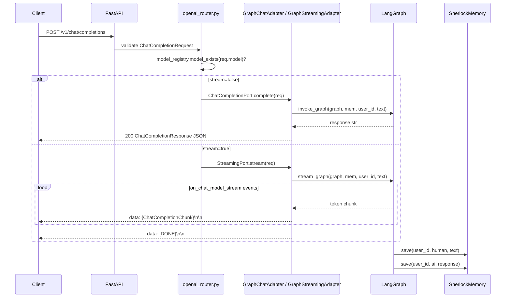
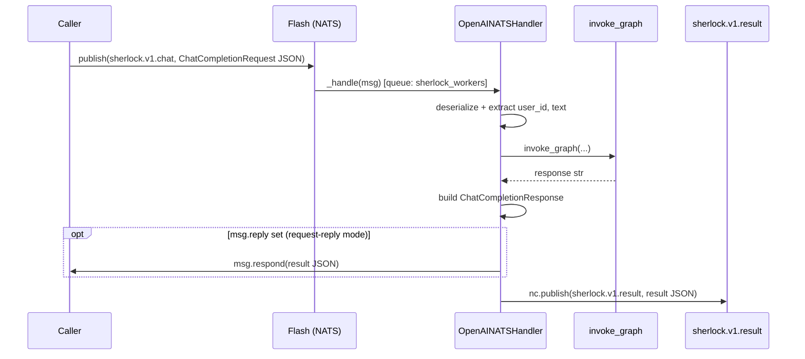
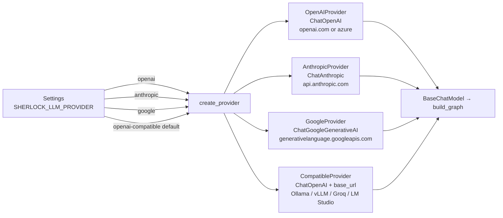
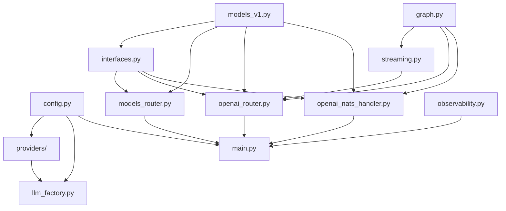
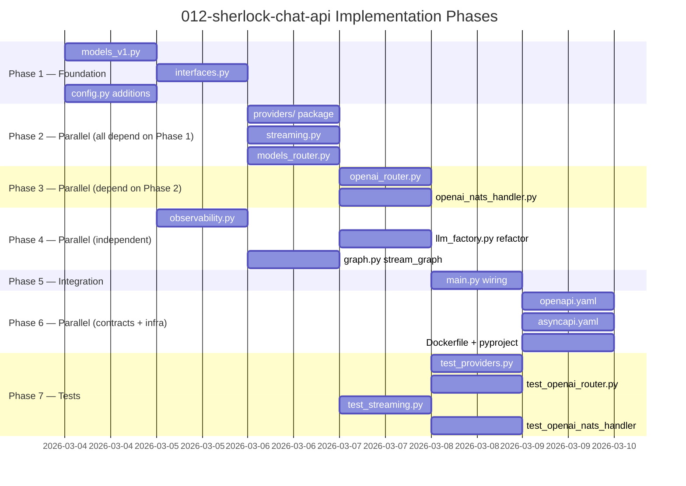

# Implementation Plan: Sherlock Chat API — Provider-Agnostic Layer

> **Spec**: 012-sherlock-chat-api
> **Date**: 2026-03-03

## Summary

Add a provider-agnostic `/v1/*` chat API to Sherlock by introducing a `providers/` package (4 LangChain-backed implementations behind `LLMProviderPort`), OpenAI-compatible Pydantic models, SSE streaming via `graph.astream_events`, two new FastAPI routers, a NATS v1 handler, and a static AsyncAPI HTML UI. All existing endpoints remain unchanged. `llm_factory.py` is refactored to delegate to the new factory while preserving its call signature for backward compatibility.

## Target Modules

| Module | Language | Changes |
|--------|----------|---------|
| `services/reasoner/` | Python 3.13 | New files: providers package, models_v1, interfaces, streaming, two routers, NATS v1 handler. Modified: main, config, llm_factory, observability, contracts, pyproject, Dockerfile |

## Technical Context

| Aspect | Value |
|--------|-------|
| Language | Python 3.13 |
| Framework | FastAPI 0.115+, LangGraph 1.0+, Pydantic v2 |
| LLM providers | `langchain-openai` (existing), `langchain-anthropic` (new), `langchain-google-genai` (new) |
| Async messaging | nats-py 2.9+ (existing) |
| SSE streaming | sse-starlette 2.1+ (new) |
| Token counting | tiktoken 0.7+ (new) |
| AsyncAPI UI | `@asyncapi/html-template` — Node build step in Dockerfile, static output |
| Testing | pytest + pytest-asyncio, httpx TestClient |
| Linting | ruff + mypy strict |
| Key pattern | `AppState` dataclass — no module-level singletons, all deps in lifespan |

## Architecture

### Request Flow — HTTP sync vs stream



### NATS v1 Async Flow



### Provider Factory



### Module Dependency Graph



## Constitution Check

| # | Principle | Status | Evidence |
|---|-----------|--------|----------|
| I | Zero-Dep CLI | N/A | No CLI changes |
| II | Platform-in-a-Box | PASS | Default provider `openai-compatible` preserves local LM Studio / Ollama — no new required infra |
| III | Modular Services | PASS | All changes inside `services/reasoner/` — additive only, no new service dir |
| IV | Two-Brain | PASS | Python only — LLM provider abstraction belongs in the intelligence brain |
| V | Polyglot Standards | PASS | FastAPI, Pydantic v2, ruff + mypy strict, pytest fixtures; comments only where why isn't obvious |
| VI | Local-First | N/A | CLI only |
| VII | Observability | PASS | 4 new `sherlock.v1.*` OTEL metrics; all handlers emit structured logs (metadata only); content gate preserved |
| VIII | Security | PASS | API keys via env vars + Pydantic SecretStr; never logged; content never in traces by default |
| IX | Declarative | N/A | CLI only |
| X | Stateful Ops | N/A | CLI only |
| XI | Resilience | PASS | Provider init fail → startup error (fail-fast); HTTP 503 when not ready; NATS error ACK on exception |
| XII | Interactive | N/A | CLI only |

## Project Structure

```
services/reasoner/
├── src/sherlock/
│   ├── providers/                        ← NEW package
│   │   ├── __init__.py                   # exports create_provider
│   │   ├── base.py                       # LLMProviderPort Protocol
│   │   ├── openai_provider.py            # OpenAI / Azure
│   │   ├── anthropic_provider.py         # Anthropic Claude
│   │   ├── google_provider.py            # Google Gemini
│   │   ├── compatible_provider.py        # any OpenAI-compatible endpoint (default)
│   │   └── factory.py                    # create_provider(settings) → LLMProviderPort
│   ├── interfaces.py                     ← NEW — all 7 Protocol definitions
│   ├── models_v1.py                      ← NEW — OpenAI-compatible Pydantic models
│   ├── streaming.py                      ← NEW — stream_graph() + GraphStreamingAdapter
│   ├── openai_router.py                  ← NEW — /v1/chat/completions + /v1/responses
│   ├── models_router.py                  ← NEW — GET /v1/models + StaticModelRegistry
│   ├── openai_nats_handler.py            ← NEW — OpenAINATSHandler
│   ├── main.py                           ← MODIFY — routers, AppState, lifespan, async-docs
│   ├── config.py                         ← MODIFY — 8 new settings
│   ├── llm_factory.py                    ← MODIFY — shim to providers/factory.py
│   ├── graph.py                          ← MODIFY — add stream_graph()
│   └── observability.py                  ← MODIFY — 4 new v1 metrics
├── tests/
│   ├── test_providers.py                 ← NEW
│   ├── test_openai_router.py             ← NEW
│   ├── test_streaming.py                 ← NEW
│   └── test_openai_nats_handler.py       ← NEW
├── contracts/
│   ├── openapi.yaml                      ← MODIFY — /v1/* paths + schemas
│   └── asyncapi.yaml                     ← MODIFY — v1 NATS channels
├── pyproject.toml                        ← MODIFY — new deps
└── Dockerfile                            ← MODIFY — Node build for AsyncAPI HTML
```

## Key Technical Decisions

### TD-1: `llm_factory.py` — Shim, Not Delete

`llm_factory.py`'s `create_llm(settings) → (ChatOpenAI, bool)` call signature is used in `main.py`. Rather than touching `main.py` in two places, `llm_factory.py` becomes a backward-compat shim:

```python
# llm_factory.py (refactored)
def create_llm(settings: Settings) -> tuple[BaseChatModel, bool]:
    provider = create_provider(settings)
    return provider.create_llm(), provider.supports_system_role()
```

`_detect_supports_system_role()` and `_NO_SYSTEM_ROLE_FAMILIES` move into `CompatibleProvider` where they belong.

### TD-2: `stream_graph()` — Add to `graph.py`, Not a New File

`stream_graph()` is the streaming sibling of `invoke_graph()` — same module, same file. Adding it elsewhere would split the graph's public API across two files.

```python
async def stream_graph(
    graph: Any,
    memory: SherlockMemory,
    user_id: str,
    text: str,
) -> AsyncIterator[str]:
    """Yield text tokens via astream_events(version="v2").
    Filters on_chat_model_stream events only.
    Best-effort persists both turns after stream completes.
    """
```

### TD-3: Lazy Provider Imports

Each provider file imports its LangChain dep inside the class constructor:

```python
# anthropic_provider.py
class AnthropicProvider:
    def create_llm(self) -> BaseChatModel:
        from langchain_anthropic import ChatAnthropic  # lazy — avoids ImportError
        return ChatAnthropic(model=self._model, api_key=self._api_key)
```

This prevents import-time failures when optional deps are absent.

### TD-4: `user_id` Derivation

`user` field absent → deterministic UUID v5 from SHA-256 of joined message contents. Keeps `user_id` stable across identical requests without requiring the caller to supply one.

```python
def _derive_user_id(messages: list[ChatMessage]) -> str:
    content = "|".join(m.content or "" for m in messages if m.role == "user")
    return str(uuid.uuid5(uuid.NAMESPACE_URL, content))
```

### TD-5: `api_key` Handling

`CompatibleProvider` defaults `api_key` to `"lm-studio"` (preserving existing hardcoded behaviour). All other providers require `SHERLOCK_LLM_API_KEY` to be set. Validation at startup — fail-fast before the service claims to be ready.

### TD-6: AsyncAPI UI — Dev Fallback

When `async_docs_enabled=True` but `/app/async-docs/` directory doesn't exist (local dev without Docker), the endpoint returns:
```json
{"detail": "AsyncAPI docs not available — run via Docker to generate UI"}
```
Not a 500 — a graceful 404 that doesn't mask real errors.

## Parallel Execution Strategy



### Agent parallelization groups

| Group | Tasks | Can run together? |
|-------|-------|-------------------|
| A | `models_v1.py` + `config.py` additions | Yes — zero shared state |
| B | `providers/` all 4 impls + `compatible_provider.py` | Yes — each is independent |
| C | `streaming.py` + `models_router.py` | Yes — both only need models_v1 + interfaces |
| D | `openai_router.py` + `openai_nats_handler.py` | Yes — both call invoke_graph / stream_graph |
| E | `openapi.yaml` + `asyncapi.yaml` + `Dockerfile` | Yes — no code deps |
| F | All 4 test files | Yes — each covers a different module |

**Sequential gates**: `interfaces.py` must exist before Group B/C/D starts. `main.py` must be last before contracts.

## Reviewer Checklist

- [ ] All 11 FRs from spec.md implemented and testable
- [ ] NFR-1 + NFR-2 verified: no message content in logs or spans (`grep -r "messages=" src/sherlock/` returns only model definitions, not log calls)
- [ ] `ruff check src/ && mypy src/ --strict` pass with zero errors
- [ ] `pytest tests/ --cov=sherlock` shows ≥ 75% on `providers/`, `openai_router.py`, `streaming.py`, `openai_nats_handler.py`
- [ ] `curl http://localhost:8083/v1/models` returns valid OpenAI model list
- [ ] `curl -X POST .../v1/chat/completions -d '{"stream":false,...}'` returns `ChatCompletionResponse`
- [ ] `curl -N -X POST .../v1/chat/completions -d '{"stream":true,...}'` streams tokens + `[DONE]`
- [ ] `curl -X POST .../v1/responses` returns `ResponsesResponse`
- [ ] `curl http://localhost:8083/async-docs` returns HTML (via Docker)
- [ ] Switching `SHERLOCK_LLM_PROVIDER=anthropic` (with valid key/model) routes to Claude
- [ ] Existing tests (`pytest tests/ -k "not v1"`) still pass unchanged
- [ ] `service.yaml` version bumped to `0.2.0`
- [ ] `openapi.yaml` documents all new `/v1/*` paths
- [ ] `asyncapi.yaml` documents `sherlock.v1.chat` and `sherlock.v1.result`

## Risks & Mitigations

| Risk | Impact | Mitigation |
|------|--------|------------|
| `langchain-google-genai` API changes frequently | M | Pin to `>=2.0,<3` in pyproject.toml; lazy import means startup only fails when `google` provider selected |
| `astream_events(version="v2")` event schema changes in LangGraph | M | Filter only `on_chat_model_stream` — most stable event type; pin `langgraph>=1.0,<2` |
| `@asyncapi/html-template` npm install in Docker build slows CI | L | Use `--prefer-offline` in Docker layer; cache the npm layer before COPY src step |
| Provider API key absent at startup for non-compatible providers | H | `create_provider()` validates key presence for `openai`/`anthropic`/`google` and raises `ValueError` with actionable message before service binds to port |
| `_OTELStructlogHandler` silently forwards new log fields to SigNoz | H | NFR-2 in spec + reviewer checklist grep step enforces this at review time |
| SSE stream connection drop before `[DONE]` leaves memory unsaved | L | `asyncio.shield(memory.save(...))` in `stream_graph` teardown — decouples storage from connection lifetime |
