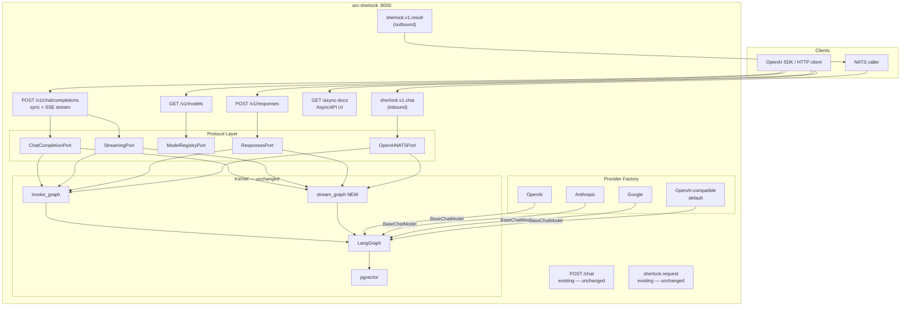
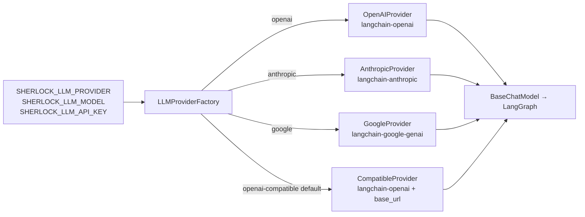

# Feature: Sherlock Chat API — Provider-Agnostic Layer

> **Spec**: 012-sherlock-chat-api
> **Date**: 2026-03-03
> **Status**: Draft
> **Informed by**: `specs/012-sherlock-chat-api/.work-docs/system-design.md`

## Target Modules

| Module | Path | Impact |
|--------|------|--------|
| Services | `services/reasoner/` | Modify — add v1 API layer, provider abstraction, NATS v1 channels |

No CLI, SDK, or Docs changes in v1.

## Overview

Sherlock's existing `POST /chat` endpoint uses a custom `{user_id, text}` schema, requiring every client to build a Sherlock-specific integration. This feature adds a **provider-agnostic, industry-standard chat API** (`/v1/*`) on top of the existing reasoning kernel. Clients use the OpenAI wire format — the industry de facto standard — while the operator configures any LLM provider (OpenAI, Anthropic, Google, or any OpenAI-compatible endpoint) via a single env var at startup. All existing endpoints remain unchanged.

## Architecture

### Provider Swap (startup config only)

## User Scenarios & Testing

### P1 — Must Have

**US-1**: As an API client using the OpenAI Python SDK, I want to point it at Sherlock without code changes so that I can use any configured LLM provider transparently.
- **Given**: Sherlock is running with `SHERLOCK_LLM_PROVIDER=anthropic` and `SHERLOCK_LLM_MODEL=claude-opus-4-6`
- **When**: I call `client.chat.completions.create(model="claude-opus-4-6", messages=[{"role":"user","content":"Hello"}])` with `base_url=http://localhost:8083/v1`
- **Then**: I receive a valid `ChatCompletion` object with `choices[0].message.content` populated
- **Test**: `curl -X POST http://localhost:8083/v1/chat/completions -d '{"model":"claude-opus-4-6","messages":[{"role":"user","content":"Hello"}]}'` returns 200 with OpenAI-format JSON

**US-2**: As a client, I want to stream token-by-token responses so that I can display real-time output without waiting for the full response.
- **Given**: Sherlock is running with any provider
- **When**: I POST `/v1/chat/completions` with `"stream": true`
- **Then**: I receive `text/event-stream` SSE events, each with `data: {"choices":[{"delta":{"content":"<token>"}}]}`, terminated by `data: [DONE]`
- **Test**: `curl -N -X POST .../v1/chat/completions -d '{"stream":true,...}'` streams tokens, ends with `[DONE]`

**US-3**: As an operator, I want to switch LLM providers by changing a single env var so that I can deploy Sherlock against any backend without code changes.
- **Given**: A Sherlock deployment
- **When**: I set `SHERLOCK_LLM_PROVIDER=google SHERLOCK_LLM_MODEL=gemini-2.0-flash` and restart
- **Then**: All `/v1/*` endpoints use Google Gemini for inference; all other behaviour is identical
- **Test**: `GET /v1/models` returns `{"data":[{"id":"gemini-2.0-flash"}]}`; chat completions succeed

**US-4**: As a NATS-based service, I want to publish an OpenAI-format chat request asynchronously so that I can integrate without HTTP.
- **Given**: NATS is running, Sherlock has `SHERLOCK_NATS_V1_ENABLED=true`
- **When**: I publish `ChatCompletionRequest` JSON to `sherlock.v1.chat`
- **Then**: Sherlock processes it and publishes `ChatCompletionResponse` JSON to `sherlock.v1.result`
- **Test**: `nats pub sherlock.v1.chat '{"model":"...","messages":[...]}' && nats sub sherlock.v1.result` receives valid response

### P2 — Should Have

**US-5**: As a client using the newer OpenAI Responses API, I want `POST /v1/responses` so that I can use the recommended agentic interface.
- **Given**: Sherlock running with any provider
- **When**: I POST `/v1/responses` with `{"model":"...","input":"Hello","user":"u1"}`
- **Then**: I receive a `ResponsesResponse` with `output[0].content[0].text` populated
- **Test**: Response body matches `{"object":"response","output":[{"type":"message","content":[{"type":"output_text","text":"..."}]}]}`

**US-6**: As a developer, I want `GET /async-docs` to show a live AsyncAPI UI so that I can understand the NATS event contracts without reading YAML.
- **Given**: Sherlock running with `SHERLOCK_ASYNC_DOCS_ENABLED=true`
- **When**: I navigate to `http://localhost:8083/async-docs`
- **Then**: A browser-viewable AsyncAPI HTML UI loads, showing all channels and message schemas
- **Test**: `curl http://localhost:8083/async-docs` returns HTML with AsyncAPI UI content

### P3 — Nice to Have

**US-7**: As a client, I want `GET /v1/models` so that I can discover the configured model ID programmatically.
- **Given**: Sherlock running with `SHERLOCK_LLM_MODEL=gpt-4o`
- **When**: `GET /v1/models`
- **Then**: Returns `{"object":"list","data":[{"id":"gpt-4o","object":"model","owned_by":"arc-platform"}]}`
- **Test**: Response matches OpenAI models list schema

## Requirements

### Functional

- [ ] FR-1: `POST /v1/chat/completions` accepts `model`, `messages`, `stream`, `user`, `temperature`, `max_tokens`, `top_p` and returns OpenAI-format `ChatCompletionResponse`
- [ ] FR-2: `POST /v1/chat/completions` with `stream: true` returns `text/event-stream` SSE with `ChatCompletionChunk` events terminated by `data: [DONE]`
- [ ] FR-3: `POST /v1/responses` accepts `model`, `input` (string or items), `instructions`, `user` and returns OpenAI Responses API format
- [ ] FR-4: `GET /v1/models` returns a model list with the single configured model
- [ ] FR-5: `GET /async-docs` serves the static AsyncAPI HTML UI built from `contracts/asyncapi.yaml`
- [ ] FR-6: NATS subject `sherlock.v1.chat` accepts `ChatCompletionRequest` JSON (fire-and-forget + request-reply); results published to `sherlock.v1.result`
- [ ] FR-7: Four provider classes (`OpenAIProvider`, `AnthropicProvider`, `GoogleProvider`, `CompatibleProvider`) each implement `LLMProviderPort` and return a configured `BaseChatModel`
- [ ] FR-8: `SHERLOCK_LLM_PROVIDER` selects the provider at startup; default is `openai-compatible` (existing behaviour preserved)
- [ ] FR-9: All existing endpoints (`POST /chat`, `GET /health`, `GET /health/deep`, NATS `sherlock.request`, Pulsar topics) remain unchanged and fully functional
- [ ] FR-10: `user` field in `/v1/chat/completions` and `/v1/responses` maps to `user_id` in `invoke_graph`; absent `user` falls back to a deterministic UUID derived from the message hash
- [ ] FR-11: `system` role message in `messages[]` overrides `SHERLOCK_SYSTEM_PROMPT` for that request

### Non-Functional

- [ ] NFR-1: Message content (`messages`, `content`, `text`, `input`, `output`) is **never** logged or added to OTEL span attributes except via the existing `add_span_content_attributes()` gate (`SHERLOCK_CONTENT_TRACING=false` default)
- [ ] NFR-2: All new handlers emit only metadata in logs: `model`, `user_id`, `latency_ms`, `transport`, `stream`, `message_count` (integer)
- [ ] NFR-3: All new code passes `ruff` + `mypy --strict`
- [ ] NFR-4: New Python packages are not imported at module level — all provider imports are lazy (inside provider class constructors) to avoid import errors when optional deps are absent
- [ ] NFR-5: `/v1/chat/completions` and `/v1/responses` return HTTP 503 when `AppState` is not ready (same pattern as existing `/chat`)
- [ ] NFR-6: `/v1/chat/completions` returns HTTP 404 with OpenAI error format `{"error":{"type":"invalid_request_error","code":"model_not_found"}}` when the requested model is not the configured model
- [ ] NFR-7: All new OTEL metrics (`sherlock.v1.*`) use structural attributes only (`endpoint`, `transport`, `api_version`, `model`, `stream`)
- [ ] NFR-8: Test coverage ≥ 75% on new modules (`providers/`, `openai_router.py`, `streaming.py`, `openai_nats_handler.py`)

### Key Entities

| Entity | Module | Description |
|--------|--------|-------------|
| `LLMProviderPort` | `providers/base.py` | Protocol — factory interface for all LLM providers |
| `OpenAIProvider` | `providers/openai_provider.py` | Wraps `ChatOpenAI` for direct OpenAI / Azure |
| `AnthropicProvider` | `providers/anthropic_provider.py` | Wraps `ChatAnthropic` for Claude models |
| `GoogleProvider` | `providers/google_provider.py` | Wraps `ChatGoogleGenerativeAI` for Gemini |
| `CompatibleProvider` | `providers/compatible_provider.py` | Wraps `ChatOpenAI` with custom `base_url` — default |
| `ChatCompletionRequest` | `models_v1.py` | Pydantic model — OpenAI `/v1/chat/completions` request |
| `ChatCompletionResponse` | `models_v1.py` | Pydantic model — sync response |
| `ChatCompletionChunk` | `models_v1.py` | Pydantic model — SSE stream chunk |
| `ResponsesRequest` | `models_v1.py` | Pydantic model — OpenAI Responses API request |
| `ResponsesResponse` | `models_v1.py` | Pydantic model — Responses API response |
| `ModelList` | `models_v1.py` | Pydantic model — `/v1/models` response |
| `stream_graph()` | `graph.py` | New async generator — yields tokens via `astream_events` |
| `OpenAINATSHandler` | `openai_nats_handler.py` | NATS handler for `sherlock.v1.chat` / `sherlock.v1.result` |
| `StaticModelRegistry` | `models_router.py` | `ModelRegistryPort` impl — reads configured model from settings |

## Edge Cases

| Scenario | Expected Behavior |
|----------|-------------------|
| `user` field absent in `/v1/chat/completions` | Derive `user_id` as `sha256(sorted message contents)[:16]` — deterministic, no PII in error logs |
| `model` field doesn't match `SHERLOCK_LLM_MODEL` | HTTP 404 with `{"error":{"type":"invalid_request_error","code":"model_not_found","message":"The model '...' does not exist"}}` |
| `messages` contains only `system` role (no `user`) | HTTP 422 validation error — at least one `user` message required |
| `stream: true` but LLM does not support streaming | Fall back to `invoke_graph()`, emit single chunk + `[DONE]` |
| Provider API key missing or invalid | HTTP 503 on first request; error logged (type only, not key value); health deep returns `degraded` |
| `SHERLOCK_LLM_PROVIDER=anthropic` but `langchain-anthropic` not installed | Startup fails with clear error: `"langchain-anthropic is required for provider 'anthropic'. Install with: pip install langchain-anthropic"` |
| NATS `sherlock.v1.chat` message with no `user` messages in `messages[]` | NATS error response `{"error":"no user message found","latency_ms":N}` — no crash |
| `GET /async-docs` when `SHERLOCK_ASYNC_DOCS_ENABLED=false` | HTTP 404 |
| `GET /async-docs` when static dir not present (local dev without Docker build) | HTTP 404 with JSON body `{"detail":"AsyncAPI docs not available in this environment"}` |
| SSE stream interrupted by client disconnect | Generator cancelled cleanly; memory persistence still attempted via `asyncio.shield` |

## Success Criteria

- [ ] SC-1: `openai.OpenAI(base_url="http://localhost:8083/v1", api_key="any").chat.completions.create(...)` succeeds against Sherlock with any configured provider
- [ ] SC-2: `curl -N .../v1/chat/completions -d '{"stream":true,...}'` streams token chunks and ends with `data: [DONE]`
- [ ] SC-3: Restarting Sherlock with `SHERLOCK_LLM_PROVIDER=anthropic` (valid key + model) routes all inference to Claude — zero code changes
- [ ] SC-4: `nats pub sherlock.v1.chat '...'` produces a result on `sherlock.v1.result` within 30s
- [ ] SC-5: `GET /async-docs` renders a browser-viewable AsyncAPI UI showing `sherlock.v1.chat` and `sherlock.v1.result` channels
- [ ] SC-6: `ruff check src/ && mypy src/ --strict` passes with zero errors on all new files
- [ ] SC-7: `pytest tests/ --cov=sherlock --cov-report=term` shows ≥ 75% coverage on new modules
- [ ] SC-8: No chat message content appears in SigNoz logs or traces when `SHERLOCK_CONTENT_TRACING=false` (default)
- [ ] SC-9: Existing `POST /chat`, `GET /health`, `GET /health/deep`, NATS `sherlock.request` — all pass existing tests unchanged

## Docs & Links Update

- [ ] Update `services/reasoner/contracts/openapi.yaml` — add `/v1/models`, `/v1/chat/completions`, `/v1/responses` paths and all new schemas
- [ ] Update `services/reasoner/contracts/asyncapi.yaml` — add `sherlock.v1.chat` + `sherlock.v1.result` channels, operations, and message schemas
- [ ] Update `services/reasoner/service.yaml` — bump version to `0.2.0`, note new endpoints

## Constitution Compliance

| Principle | Applies | Compliant | Notes |
|-----------|---------|-----------|-------|
| I. Zero-Dep CLI | [ ] | — | Not applicable — no CLI changes |
| II. Platform-in-a-Box | [x] | [x] | `openai-compatible` default preserves local LM Studio / Ollama behaviour — no new required infra |
| III. Modular Services | [x] | [x] | All new code is additive inside `services/reasoner/` — no new service directory needed |
| IV. Two-Brain | [x] | [x] | Python only — provider abstraction lives entirely in the intelligence brain |
| V. Polyglot Standards | [x] | [x] | FastAPI, Pydantic v2, ruff + mypy strict, pytest with fixtures, `# TODO:` only |
| VI. Local-First | [ ] | — | Not applicable — CLI only |
| VII. Observability | [x] | [x] | 4 new OTEL metrics; all v1 handlers emit traces + structured logs; content gated by `SHERLOCK_CONTENT_TRACING` |
| VIII. Security | [x] | [x] | API keys via env vars only, never logged; message content never in logs/traces by default; no secrets in code |
| IX. Declarative | [ ] | — | Not applicable — CLI only |
| X. Stateful Ops | [ ] | — | Not applicable — CLI only |
| XI. Resilience | [x] | [x] | Provider init failure → startup error (fail-fast); HTTP 503 when not ready; NATS error response on exception |
| XII. Interactive | [ ] | — | Not applicable — CLI only |
