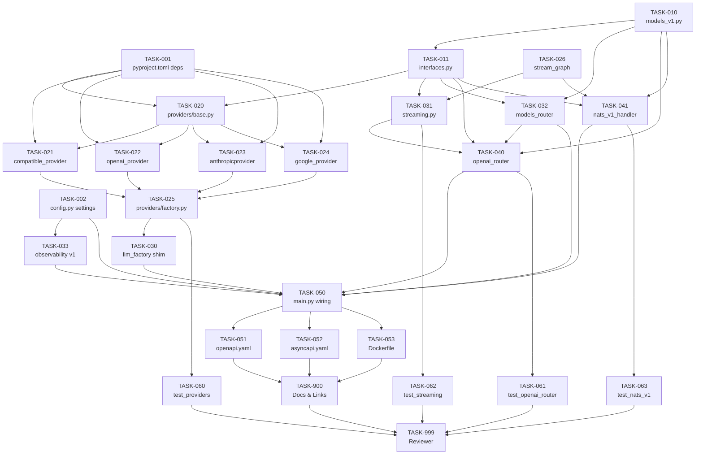

# Tasks: Sherlock Chat API — Provider-Agnostic Layer

> **Spec**: 012-sherlock-chat-api
> **Date**: 2026-03-03

## Task Format

```
[TASK-NNN] [P?] [MODULE] [PRIORITY] Description
  Dependencies: [TASK-XXX] or none
  Module: services/reasoner/
  Acceptance: Testable criteria
  Status: [ ] pending | [~] in-progress | [x] done
```

- `[P]` = Safe for parallel agent execution
- Priority: P1 (must), P2 (should), P3 (nice)

---

## Dependency Graph



## Quality Requirements

| Module | Coverage | Lint | Notes |
|--------|----------|------|-------|
| `providers/` | 75% | ruff + mypy strict | Critical path — provider correctness |
| `openai_router.py` | 75% | ruff + mypy strict | Critical path — primary API surface |
| `streaming.py` | 75% | ruff + mypy strict | Critical path — SSE correctness |
| `openai_nats_handler.py` | 75% | ruff + mypy strict | Critical path — async events |
| `models_v1.py` | 60% | ruff + mypy strict | Model validation tested via router tests |
| `models_router.py` | 60% | ruff + mypy strict | Simple, low complexity |

---

## Phase 1: Setup

- [x] [TASK-001] [services/reasoner] [P1] Add new Python dependencies to pyproject.toml
  - Dependencies: none
  - Module: `services/reasoner/pyproject.toml`
  - Acceptance: `langchain-anthropic>=0.3`, `langchain-google-genai>=2.0`, `sse-starlette>=2.1`, `tiktoken>=0.7` present in `[project.dependencies]`; `pip install -e ".[dev]"` succeeds

- [ ] [TASK-002] [P] [services/reasoner] [P1] Add 8 new settings to config.py
  - Dependencies: none
  - Module: `services/reasoner/src/sherlock/config.py`
  - Acceptance: `llm_provider`, `llm_api_key`, `openai_base_url`, `google_project_id`, `nats_v1_chat_subject`, `nats_v1_result_subject`, `nats_v1_enabled`, `async_docs_enabled` fields present in `Settings`; `mypy` passes; defaults match spec §10 table

---

## Phase 2: Foundational

- [ ] [TASK-010] [P] [services/reasoner] [P1] Create models_v1.py — all OpenAI-compatible Pydantic models
  - Dependencies: none
  - Module: `services/reasoner/src/sherlock/models_v1.py`
  - Acceptance: `ChatMessage`, `ChatCompletionRequest`, `ChatCompletionResponse`, `ChatCompletionChunk`, `ChoiceDelta`, `StreamChoice`, `UsageInfo`, `ResponsesRequest`, `ResponsesResponse`, `ResponseInputItem`, `ResponseOutputItem`, `ModelObject`, `ModelList` all importable; `mypy --strict` passes; `stream: bool = False` default; `n: int = Field(1)` max 1

- [ ] [TASK-011] [services/reasoner] [P1] Create interfaces.py — 7 Protocol definitions
  - Dependencies: TASK-010
  - Module: `services/reasoner/src/sherlock/interfaces.py`
  - Acceptance: `LLMProviderPort`, `ChatCompletionPort`, `StreamingPort`, `ModelRegistryPort`, `ResponsesPort`, `AsyncDocPort`, `OpenAINATSPort` all defined as `runtime_checkable` Protocols; `mypy --strict` passes; each Protocol has correct method signatures matching spec §8

---

## Phase 3: Implementation

### Batch A — Providers + Core (all parallel, depends on TASK-001 + TASK-011)

- [ ] [TASK-020] [P] [services/reasoner] [P1] Create providers/base.py + providers/__init__.py
  - Dependencies: TASK-001, TASK-011
  - Module: `services/reasoner/src/sherlock/providers/`
  - Acceptance: `LLMProviderPort` Protocol in `base.py`; `providers/__init__.py` exports `create_provider`; `isinstance(any_provider, LLMProviderPort)` returns `True` for all 4 impls

- [ ] [TASK-021] [P] [services/reasoner] [P1] Create providers/compatible_provider.py — default OpenAI-compatible
  - Dependencies: TASK-020
  - Module: `services/reasoner/src/sherlock/providers/compatible_provider.py`
  - Acceptance: Wraps `ChatOpenAI` with `base_url=settings.llm_base_url`, `api_key=settings.llm_api_key or "lm-studio"`; migrates `_detect_supports_system_role()` + `_NO_SYSTEM_ROLE_FAMILIES` from `llm_factory.py`; `provider_name()` returns `"openai-compatible"`; `create_llm()` returns `ChatOpenAI` instance; `mypy --strict` passes

- [ ] [TASK-022] [P] [services/reasoner] [P1] Create providers/openai_provider.py — OpenAI / Azure
  - Dependencies: TASK-020
  - Module: `services/reasoner/src/sherlock/providers/openai_provider.py`
  - Acceptance: Lazy import `from langchain_openai import ChatOpenAI` inside `create_llm()`; `api_key` read from `settings.llm_api_key`; raises `ValueError` with actionable message if `llm_api_key` is empty; optional `settings.openai_base_url` used when set (Azure); `supports_system_role()` always `True`; `provider_name()` returns `"openai"`

- [ ] [TASK-023] [P] [services/reasoner] [P1] Create providers/anthropic_provider.py — Claude
  - Dependencies: TASK-020
  - Module: `services/reasoner/src/sherlock/providers/anthropic_provider.py`
  - Acceptance: Lazy import `from langchain_anthropic import ChatAnthropic`; raises clear `ImportError` message if `langchain-anthropic` not installed; raises `ValueError` if `llm_api_key` empty; `supports_system_role()` always `True`; `provider_name()` returns `"anthropic"`

- [ ] [TASK-024] [P] [services/reasoner] [P1] Create providers/google_provider.py — Gemini
  - Dependencies: TASK-020
  - Module: `services/reasoner/src/sherlock/providers/google_provider.py`
  - Acceptance: Lazy import `from langchain_google_genai import ChatGoogleGenerativeAI`; raises clear `ImportError` message if `langchain-google-genai` not installed; raises `ValueError` if `llm_api_key` empty; optional `settings.google_project_id` passed when set; `supports_system_role()` always `True`; `provider_name()` returns `"google"`

- [ ] [TASK-025] [P] [services/reasoner] [P1] Create providers/factory.py — create_provider()
  - Dependencies: TASK-021, TASK-022, TASK-023, TASK-024
  - Module: `services/reasoner/src/sherlock/providers/factory.py`
  - Acceptance: `create_provider(settings) -> LLMProviderPort` uses `match settings.llm_provider` to select provider; unknown values fall back to `CompatibleProvider`; function exported from `providers/__init__.py`

- [ ] [TASK-026] [P] [services/reasoner] [P1] Add stream_graph() to graph.py
  - Dependencies: none
  - Module: `services/reasoner/src/sherlock/graph.py`
  - Acceptance: `stream_graph(graph, memory, user_id, text) -> AsyncIterator[str]` filters `on_chat_model_stream` events from `astream_events(version="v2")`; yields only non-empty `chunk.content` strings; best-effort persists both turns after stream via `asyncio.shield`; does not modify `invoke_graph()` or any other existing function; `mypy --strict` passes

### Batch B — Adapters + Support (all parallel, depends on Batch A)

- [ ] [TASK-030] [P] [services/reasoner] [P1] Refactor llm_factory.py as backward-compat shim
  - Dependencies: TASK-025
  - Module: `services/reasoner/src/sherlock/llm_factory.py`
  - Acceptance: `create_llm(settings) -> tuple[BaseChatModel, bool]` delegates to `create_provider(settings)`; `_detect_supports_system_role()` removed (moved to `CompatibleProvider`); existing callers (`main.py`) unchanged; `mypy --strict` passes

- [ ] [TASK-031] [P] [services/reasoner] [P1] Create streaming.py — GraphStreamingAdapter
  - Dependencies: TASK-011, TASK-026
  - Module: `services/reasoner/src/sherlock/streaming.py`
  - Acceptance: `GraphStreamingAdapter` implements `StreamingPort`; `stream(req: ChatCompletionRequest) -> AsyncIterator[ChatCompletionChunk]` builds correct SSE chunks with `id`, `model`, `created`, `delta.content`; emits final chunk with `finish_reason="stop"`; `EventSourceResponse` not included here (that's the router's job — adapter yields chunks only); `mypy --strict` passes

- [ ] [TASK-032] [P] [services/reasoner] [P2] Create models_router.py — GET /v1/models
  - Dependencies: TASK-010, TASK-011
  - Module: `services/reasoner/src/sherlock/models_router.py`
  - Acceptance: `StaticModelRegistry` implements `ModelRegistryPort`; `list_models()` returns `ModelList` with one `ModelObject` whose `id == settings.llm_model`; `model_exists(model_id)` returns `True` only for configured model; `build_models_router() -> APIRouter` returns router with `GET /models` endpoint returning `ModelList`; router prefix `/v1` applied in `main.py`

- [ ] [TASK-033] [P] [services/reasoner] [P1] Extend observability.py — 4 new v1 OTEL metrics
  - Dependencies: TASK-002
  - Module: `services/reasoner/src/sherlock/observability.py`
  - Acceptance: `SherlockMetrics.__init__` creates `sherlock.v1.requests.total` (Counter), `sherlock.v1.errors.total` (Counter), `sherlock.v1.latency` (Histogram, unit="ms"), `sherlock.v1.stream.chunks` (Counter); all existing instruments untouched; `mypy --strict` passes

### Batch C — Routers + NATS Handler (parallel, depends on Batch B)

- [ ] [TASK-040] [P] [services/reasoner] [P1] Create openai_router.py — /v1/chat/completions + /v1/responses
  - Dependencies: TASK-010, TASK-011, TASK-031, TASK-032
  - Module: `services/reasoner/src/sherlock/openai_router.py`
  - Acceptance: `build_openai_router() -> APIRouter`; `POST /chat/completions` returns `ChatCompletionResponse` (sync) or `EventSourceResponse` (SSE stream via sse-starlette); `POST /responses` returns `ResponsesResponse`; both return HTTP 503 when AppState not ready; both return HTTP 404 with `{"error":{"type":"invalid_request_error","code":"model_not_found"}}` when model unknown; `user` field absent → `_derive_user_id(messages)` using UUID v5; system role message overrides system prompt; logs only `model`, `user_id`, `message_count`, `stream`, `latency_ms` — never message content; v1 OTEL metrics emitted; `mypy --strict` passes

- [ ] [TASK-041] [P] [services/reasoner] [P1] Create openai_nats_handler.py — OpenAINATSHandler
  - Dependencies: TASK-010, TASK-011, TASK-002, TASK-026
  - Module: `services/reasoner/src/sherlock/openai_nats_handler.py`
  - Acceptance: `OpenAINATSHandler` implements `OpenAINATSPort`; mirrors `NATSHandler` structure exactly (`connect`, `subscribe`, `_handle`, `is_connected`, `close`); subscribes to `settings.nats_v1_chat_subject` in queue group `sherlock_workers`; deserializes `ChatCompletionRequest`; extracts `user_id` from `req.user` or `_derive_user_id(req.messages)`; extracts `text` from last user message; calls `invoke_graph()`; builds `ChatCompletionResponse`; responds to `msg.reply` if set; always publishes to `settings.nats_v1_result_subject`; logs `subject`, `transport`, `model` at DEBUG — never message content; handles missing user messages with error response; `mypy --strict` passes

---

## Phase 4: Integration

- [ ] [TASK-050] [services/reasoner] [P1] Wire everything in main.py
  - Dependencies: TASK-030, TASK-031, TASK-032, TASK-033, TASK-040, TASK-041
  - Module: `services/reasoner/src/sherlock/main.py`
  - Acceptance: `AppState` has `openai_nats: OpenAINATSHandler | None` and `model_registry: StaticModelRegistry | None` fields; `lifespan` calls `create_provider(settings)` instead of `create_llm(settings)` (via refactored `llm_factory.py`); `StaticModelRegistry(settings)` created; `OpenAINATSHandler` started when `nats_v1_enabled and nats_enabled`; `OpenAINATSHandler.close()` in shutdown; `app.include_router(build_openai_router(), prefix="/v1")` and `app.include_router(build_models_router(), prefix="/v1")`; `StaticFiles` mounted at `/async-docs` when `async_docs_enabled` and dir exists (else endpoint returns 404 JSON); all existing tests pass unchanged

- [ ] [TASK-051] [P] [services/reasoner] [P2] Update contracts/openapi.yaml — add /v1/* paths
  - Dependencies: TASK-050
  - Module: `services/reasoner/contracts/openapi.yaml`
  - Acceptance: Paths `/v1/models`, `/v1/chat/completions`, `/v1/responses` added; all request/response schemas documented; streaming response documented with `content: text/event-stream`; existing `/chat`, `/health`, `/health/deep` paths untouched; valid OpenAPI 3.1.0

- [ ] [TASK-052] [P] [services/reasoner] [P2] Update contracts/asyncapi.yaml + bump service.yaml
  - Dependencies: TASK-050
  - Module: `services/reasoner/contracts/asyncapi.yaml`, `services/reasoner/service.yaml`
  - Acceptance: `sherlockV1Chat` channel (address: `sherlock.v1.chat`) and `sherlockV1Result` channel (address: `sherlock.v1.result`) added; `receiveV1ChatRequest` and `publishV1ChatResult` operations added; `V1ChatRequest` and `V1ChatResult` message schemas added mirroring `ChatCompletionRequest` / `ChatCompletionResponse`; existing channels untouched; AsyncAPI 3.0.0 valid; `service.yaml` version bumped to `0.2.0`

- [ ] [TASK-053] [services/reasoner] [P2] Add AsyncAPI HTML generation to Dockerfile
  - Dependencies: TASK-050
  - Module: `services/reasoner/Dockerfile`
  - Acceptance: Builder stage installs Node.js (slim version); runs `npx -y @asyncapi/cli generate fromFile contracts/asyncapi.yaml @asyncapi/html-template -o /async-docs-build`; runtime stage copies `/async-docs-build` to `/app/async-docs/`; multi-stage layers preserved (no regression on image size beyond Node step); `docker build` completes without error

---

## Phase 5: Tests

- [ ] [TASK-060] [P] [services/reasoner] [P1] test_providers.py — provider factory + all 4 impls
  - Dependencies: TASK-025
  - Module: `services/reasoner/tests/test_providers.py`
  - Acceptance: `create_provider` returns correct class for each `SHERLOCK_LLM_PROVIDER` value; unknown value falls back to `CompatibleProvider`; `OpenAIProvider` raises `ValueError` when `llm_api_key` empty; `AnthropicProvider` raises `ImportError` with message when dep absent (mock import); `GoogleProvider` same; `CompatibleProvider.supports_system_role()` returns `False` for mistral/llama/gemma model names, `True` otherwise; `pytest tests/test_providers.py` passes

- [ ] [TASK-061] [P] [services/reasoner] [P1] test_openai_router.py — /v1/chat/completions + /v1/responses
  - Dependencies: TASK-040
  - Module: `services/reasoner/tests/test_openai_router.py`
  - Acceptance: `POST /v1/chat/completions` with valid body → 200 `ChatCompletionResponse`; `stream=true` → 200 `text/event-stream` with at least one `data:` line and `data: [DONE]`; missing model → 404 with `model_not_found` error; no AppState → 503; absent `user` field → response has valid `user_id`; `POST /v1/responses` with string `input` → 200 `ResponsesResponse`; no message content in any log output; `pytest tests/test_openai_router.py` passes

- [ ] [TASK-062] [P] [services/reasoner] [P1] test_streaming.py — stream_graph + GraphStreamingAdapter
  - Dependencies: TASK-031
  - Module: `services/reasoner/tests/test_streaming.py`
  - Acceptance: `stream_graph` with mocked `astream_events` yields tokens from `on_chat_model_stream` events only; non-streaming events skipped; empty `chunk.content` not yielded; memory `save()` called after stream with full accumulated response; memory failure does not raise; `GraphStreamingAdapter.stream()` yields `ChatCompletionChunk` objects with correct `object`, `id`, `model`, `delta.content`; `pytest tests/test_streaming.py` passes

- [ ] [TASK-063] [P] [services/reasoner] [P1] test_openai_nats_handler.py — OpenAINATSHandler
  - Dependencies: TASK-041
  - Module: `services/reasoner/tests/test_openai_nats_handler.py`
  - Acceptance: Fire-and-forget (no reply): result published to result subject, no `msg.respond()`; request-reply (`msg.reply` set): responds to inbox AND publishes to result subject; missing user message in payload → error response published, no crash; `invoke_graph` exception → error response published; `ChatCompletionResponse` JSON is valid; no message content in log calls; `pytest tests/test_openai_nats_handler.py` passes

---

## Phase 6: Polish

- [ ] [TASK-900] [P] [services/reasoner] [P2] Docs & Links Update
  - Dependencies: TASK-051, TASK-052, TASK-053
  - Module: `services/reasoner/contracts/`, `services/reasoner/service.yaml`
  - Acceptance: `openapi.yaml` documents all endpoints including streaming schema; `asyncapi.yaml` documents both v1 NATS channels with message examples; `service.yaml` version is `0.2.0`; all YAML files are valid (no syntax errors)

- [ ] [TASK-999] [REVIEW] [P1] Reviewer Agent Verification
  - Dependencies: ALL tasks
  - Module: `services/reasoner/`
  - Acceptance:
    - `ruff check src/ && mypy src/ --strict` — zero errors
    - `pytest tests/ --cov=sherlock --cov-report=term` — ≥ 75% on `providers/`, `openai_router.py`, `streaming.py`, `openai_nats_handler.py`
    - `grep -rn "messages=" src/sherlock/ | grep -v "\.py:.*messages:" | grep log` — returns zero matches (no message content in log calls)
    - All 9 success criteria from spec.md verified
    - Existing tests (`pytest tests/test_api.py tests/test_graph.py tests/test_memory.py tests/test_nats_handler.py tests/test_pulsar_handler.py tests/test_observability.py`) still pass
    - `service.yaml` version is `0.2.0`
    - Both contract files valid YAML with new endpoints/channels documented

---

## Progress Summary

| Phase | Total | Done | Parallel |
|-------|-------|------|----------|
| Setup | 2 | 0 | 1 |
| Foundational | 2 | 0 | 1 |
| Implementation (Batch A) | 7 | 0 | 7 |
| Implementation (Batch B) | 4 | 0 | 4 |
| Implementation (Batch C) | 2 | 0 | 2 |
| Integration | 4 | 0 | 2 |
| Tests | 4 | 0 | 4 |
| Polish | 2 | 0 | 1 |
| **Total** | **27** | **0** | **22** |
