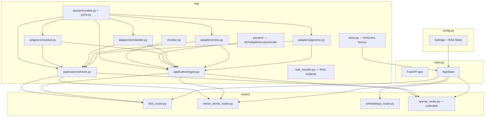
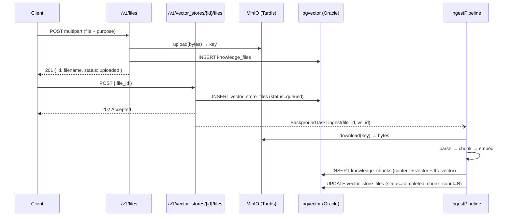
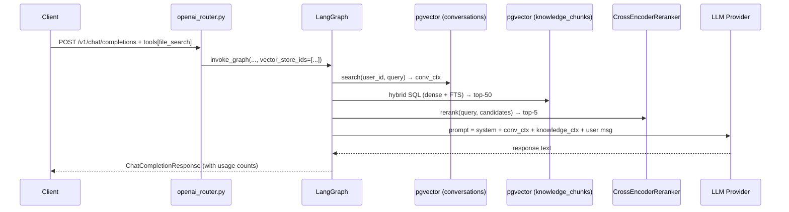
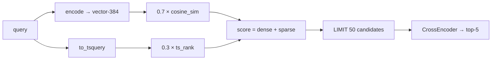
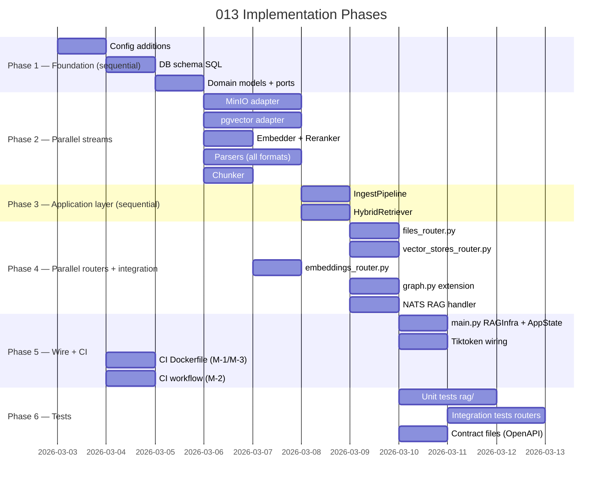

# Implementation Plan: Sherlock Universal RAG API

> **Spec**: 013-sherlock-rag-api
> **Date**: 2026-03-03

---

## Summary

013 extends Sherlock (012) into a Universal RAG engine by adding an OpenAI-compatible Files API, Vector Stores API, and Embeddings API on top of the existing chat surface. RAG is strictly additive: gated by `SHERLOCK_RAG_ENABLED` (default `false`), it initializes only in the `reason`/`ultra-instinct` profiles. All 012 routes and tests remain untouched when the flag is off.

The implementation lives entirely in `services/reasoner/` (new `rag/` package + 3 new routers). Persistence changes are additive SQL tables in `services/persistence/`. A new MinIO bucket (`sherlock-files`) is added to the `reason` profile compose.

---

## Target Modules

| Module | Language | Changes |
|--------|----------|---------|
| `services/reasoner/` | Python | New `rag/` package; 3 new routers; graph extension; config additions; RAGInfra in AppState |
| `services/persistence/` | SQL | 4 new tables in `sherlock` schema (init script additive) |
| `services/storage/` | Config | No change to service; `sherlock-files` bucket provisioned at startup by RAGInfra |
| `services/reasoner/docker-compose.yml` | YAML | Add `arc-storage` to `reason` profile depends; add `SHERLOCK_RAG_*` env vars |
| `services/reasoner/service.yaml` | YAML | Bump to `0.3.0`; add `storage` to `depends_on` |
| `services/reasoner/pyproject.toml` | TOML | Add `minio>=7.2`, `pypdf>=4.0`, `python-docx>=1.1`; wire `tiktoken` |
| `services/reasoner/Dockerfile` | Docker | Add CPU-only torch constraint (CI build optimization) |
| `.github/workflows/reasoner-images.yml` | YAML | Add `pip cache` to typecheck/test jobs |

---

## Technical Context

| Aspect | Value |
|--------|-------|
| Language | Python 3.13 |
| Frameworks | FastAPI, LangGraph, SQLAlchemy async, pgvector |
| Storage | PostgreSQL 17 (pgvector) + MinIO (via `minio` SDK) |
| Testing | pytest + httpx, `pytest-asyncio`, ≥ 75% coverage on `rag/` + new routers |
| New Dependencies | `minio>=7.2`, `pypdf>=4.0`, `python-docx>=1.1` |
| Existing (already installed) | `sentence-transformers`, `tiktoken`, `pgvector`, `sqlalchemy`, `asyncpg` |
| Lint | `ruff check src/ && mypy src/ --strict` (zero errors) |

---

## Architecture

### Component Overview



### Ingestion Flow



### RAG Chat Flow



### Hybrid Search SQL



---

## Constitution Check

| # | Principle | Status | Evidence |
|---|-----------|--------|----------|
| I | Zero-Dep CLI | N/A | No CLI changes |
| II | Platform-in-a-Box | PASS | `rag_enabled=false` default — `think` profile byte-for-byte identical to 012; MinIO only in `reason` |
| III | Modular Services | PASS | All changes inside `services/reasoner/`; MinIO referenced via existing `arc-storage` service |
| IV | Two-Brain | PASS | Python only — parsing, chunking, embedding, reranking are intelligence concerns |
| V | Polyglot Standards | PASS | FastAPI + Pydantic v2 + ruff + mypy strict + pytest fixtures; no AI attribution in commits |
| VI | Local-First | N/A | No CLI component |
| VII | Observability | PASS | 6 new OTEL metrics (`uploads.total`, `ingest.latency`, `retrieval.latency`, `search.latency`, `embed.latency`, `rag.errors`); every route follows counter/timer/error pattern |
| VIII | Security | PASS | MinIO creds via `SecretStr` in Settings; file content never logged or put in spans (`SHERLOCK_CONTENT_TRACING=false` default) |
| IX | Declarative | N/A | No CLI component |
| X | Stateful Ops | N/A | No CLI component |
| XI | Resilience | PASS | Ingest failure → `status=failed` + `error_message` in DB, API unaffected; pgvector down → empty knowledge ctx, chat responds from conv memory only |
| XII | Interactive | N/A | No CLI component |

---

## Project Structure

```
services/reasoner/
├── src/sherlock/
│   ├── config.py                     # + rag_enabled, minio_*, hybrid_alpha, max_file_bytes, sync_timeout_s
│   ├── main.py                       # + RAGInfra in AppState; lifespan init; router mounts
│   ├── openai_router.py              # + file_search tool detection → vector_store_ids passthrough
│   ├── graph.py                      # + rag_retrieve node (no-op when vector_store_ids absent)
│   ├── files_router.py               # NEW — POST/GET/DELETE /v1/files + /content
│   ├── vector_stores_router.py       # NEW — CRUD + /files sub-resource + /search
│   ├── embeddings_router.py          # NEW — POST /v1/embeddings
│   └── rag/
│       ├── __init__.py
│       ├── store.py                  # RAGInfra factory + dataclass
│       ├── chunker.py                # Fixed-size chunker (512 tokens, 50 overlap)
│       ├── nats_handler.py           # sherlock.v1.rag.{ingest,chat,search,embed}.*
│       ├── domain/
│       │   ├── models.py             # VectorStore, KnowledgeFile, VectorStoreFile, KnowledgeChunk, SearchResult, IngestJob
│       │   └── ports.py              # FileStorePort, VectorStorePort, EmbedderPort, RerankerPort (Protocols)
│       ├── adapters/
│       │   ├── pgvector.py           # VectorStorePort impl — init tables, upsert_chunks, search_hybrid, delete_vs
│       │   ├── minio.py              # FileStorePort impl — upload, download, delete
│       │   ├── embedder.py           # EmbedderPort impl — wraps existing SentenceTransformer
│       │   └── reranker.py           # RerankerPort impl — lazy CrossEncoder(ms-marco-MiniLM-L-6-v2)
│       ├── parsers/
│       │   ├── __init__.py           # dispatch_parser(filename, bytes) → ParsedDocument
│       │   ├── base.py               # ParsedDocument dataclass + ParserPort Protocol
│       │   ├── text_parser.py        # .txt, .md, .rst, .py, .go, .ts, .js, .tsx, .jsx (UTF-8 passthrough)
│       │   ├── pdf_parser.py         # .pdf → pypdf
│       │   ├── docx_parser.py        # .docx → python-docx
│       │   ├── json_parser.py        # .json → pretty-print string
│       │   └── csv_parser.py         # .csv → row-per-chunk
│       └── application/
│           ├── ingest.py             # IngestPipeline.ingest(file_id, vs_id) → chunk_count
│           └── retrieve.py           # HybridRetriever.search(query, vs_ids, alpha) → list[SearchResult]
│
services/persistence/
└── initdb/
    └── 004_sherlock_rag_schema.sql   # NEW — 4 tables: vector_stores, knowledge_files, vector_store_files, knowledge_chunks

services/reasoner/
├── pyproject.toml                    # + minio>=7.2, pypdf>=4.0, python-docx>=1.1
├── service.yaml                      # version: 0.3.0; depends_on += storage
├── docker-compose.yml                # + SHERLOCK_RAG_ENABLED, MINIO_* env vars
└── Dockerfile                        # CPU-only torch constraint (CI build fix)

specs/013-sherlock-rag-api/
└── contracts/
    ├── openapi.yaml                  # + 13 new paths + schemas
    └── asyncapi.yaml                 # + 4 sherlock.v1.rag.* channel pairs

.github/workflows/
└── reasoner-images.yml               # + pip cache on typecheck/test jobs
```

---

## Key Technical Decisions

### 1. RAGInfra dataclass in AppState (not a service singleton)

`RAGInfra` holds `file_store`, `vector_store`, `embedder`, `reranker`, `ingest_pipeline`, `retriever`. Injected into `AppState.rag: RAGInfra | None`. Routers check `state.rag` and return `503` immediately if `None` — zero impact on existing code paths.

### 2. Shared SentenceTransformer instance

`SherlockMemory` already holds a `SentenceTransformer` for conversation embeddings. `EmbedderAdapter` accepts an encoder instance — `main.py` passes `memory._encoder` when constructing `RAGInfra`. No second model load.

### 3. `fts_vector` as GENERATED ALWAYS column

```sql
fts_vector tsvector GENERATED ALWAYS AS (to_tsvector('english', content)) STORED
```
Eliminates application-side tsvector construction. pgvector adapter only inserts `content` + `embedding`.

### 4. Hybrid search as a single SQL query

```sql
SELECT id, content, file_id, chunk_index,
    ($1::vector <=> embedding) * (-0.7) + ts_rank(fts_vector, query) * 0.3 AS score
FROM sherlock.knowledge_chunks
WHERE vector_store_id = ANY($2)
  AND ($3::tsquery IS NULL OR fts_vector @@ $3::tsquery)
ORDER BY score DESC
LIMIT 50
```
`hybrid_alpha=0.0` → coalesce dense weight to 0; `hybrid_alpha=1.0` → coalesce FTS weight to 0.

### 5. `?sync=true` with configurable timeout

`IngestPipeline.ingest()` is awaited directly (no `BackgroundTask`). A `asyncio.wait_for(..., timeout=settings.sync_timeout_s)` wraps it. On `TimeoutError` → falls back to creating a `BackgroundTask` and returns `202`.

### 6. DB tables created by `pgvector.py` adapter `init_schema()`

Called inside `RAGInfra` init (after `memory.init()`). Mirrors the existing `SherlockMemory.init()` pattern: `CREATE TABLE IF NOT EXISTS`, best-effort, logs warning on failure.

### 7. Tiktoken wiring (FR-14 — fixes 012 gap)

`openai_router.py` already imports `tiktoken` but returns `(0, 0, 0)`. Add `_count_tokens(model, messages) → int` helper using `tiktoken.encoding_for_model` with fallback to `cl100k_base`. Wire into both `/v1/chat/completions` and `/v1/embeddings` response objects.

---

## Parallel Execution Strategy



**Parallelizable agent groups:**
- **Group A** (Phase 2): `minio.py` + `pgvector.py` + `embedder.py` + `reranker.py` + parsers + `chunker.py`
- **Group B** (Phase 4): `files_router.py` + `vector_stores_router.py` + `embeddings_router.py`
- **Group C** (Phase 5): CI Dockerfile changes + CI workflow changes (independent of Python code)

---

## New Settings Fields (config.py additions)

```python
# RAG feature gate
rag_enabled: bool = Field(False, alias="SHERLOCK_RAG_ENABLED")

# MinIO (Tardis)
minio_endpoint: str = Field("arc-storage:9000", alias="SHERLOCK_MINIO_ENDPOINT")
minio_access_key: SecretStr = Field("minioadmin", alias="SHERLOCK_MINIO_ACCESS_KEY")
minio_secret_key: SecretStr = Field("minioadmin", alias="SHERLOCK_MINIO_SECRET_KEY")
minio_bucket: str = Field("sherlock-files", alias="SHERLOCK_MINIO_BUCKET")
minio_secure: bool = Field(False, alias="SHERLOCK_MINIO_SECURE")

# RAG tunables
max_file_bytes: int = Field(50 * 1024 * 1024, alias="SHERLOCK_MAX_FILE_BYTES")  # 50 MB
hybrid_alpha: float = Field(0.7, alias="SHERLOCK_HYBRID_ALPHA")  # 0=FTS, 1=dense
chunk_size_tokens: int = Field(512, alias="SHERLOCK_CHUNK_SIZE_TOKENS")
chunk_overlap_tokens: int = Field(50, alias="SHERLOCK_CHUNK_OVERLAP_TOKENS")
retrieval_candidate_k: int = Field(50, alias="SHERLOCK_RETRIEVAL_CANDIDATE_K")
retrieval_top_k: int = Field(5, alias="SHERLOCK_RETRIEVAL_TOP_K")
reranker_model: str = Field(
    "cross-encoder/ms-marco-MiniLM-L-6-v2", alias="SHERLOCK_RERANKER_MODEL"
)
sync_timeout_s: float = Field(30.0, alias="SHERLOCK_SYNC_TIMEOUT_S")
```

---

## DB Schema (004_sherlock_rag_schema.sql)

```sql
-- Requires: 003_enable_pgvector.sql (CREATE EXTENSION vector already applied)

CREATE TABLE IF NOT EXISTS sherlock.vector_stores (
    id          text PRIMARY KEY DEFAULT 'vs-' || gen_random_uuid()::text,
    name        text NOT NULL,
    file_count  integer NOT NULL DEFAULT 0,
    created_at  timestamptz NOT NULL DEFAULT now(),
    updated_at  timestamptz NOT NULL DEFAULT now()
);

CREATE TABLE IF NOT EXISTS sherlock.knowledge_files (
    id          text PRIMARY KEY DEFAULT 'file-' || gen_random_uuid()::text,
    filename    text NOT NULL,
    purpose     text NOT NULL DEFAULT 'assistants',
    bytes       bigint NOT NULL DEFAULT 0,
    minio_key   text NOT NULL,
    status      text NOT NULL DEFAULT 'uploaded',
    created_at  timestamptz NOT NULL DEFAULT now()
);

CREATE TABLE IF NOT EXISTS sherlock.vector_store_files (
    vector_store_id text NOT NULL REFERENCES sherlock.vector_stores(id) ON DELETE CASCADE,
    file_id         text NOT NULL REFERENCES sherlock.knowledge_files(id) ON DELETE CASCADE,
    status          text NOT NULL DEFAULT 'queued',
    chunk_count     integer,
    error_message   text,
    created_at      timestamptz NOT NULL DEFAULT now(),
    updated_at      timestamptz NOT NULL DEFAULT now(),
    PRIMARY KEY (vector_store_id, file_id)
);

CREATE TABLE IF NOT EXISTS sherlock.knowledge_chunks (
    id              uuid PRIMARY KEY DEFAULT gen_random_uuid(),
    vector_store_id text NOT NULL REFERENCES sherlock.vector_stores(id) ON DELETE CASCADE,
    file_id         text NOT NULL REFERENCES sherlock.knowledge_files(id) ON DELETE CASCADE,
    chunk_index     integer NOT NULL,
    content         text NOT NULL,
    embedding       vector(384),
    fts_vector      tsvector GENERATED ALWAYS AS (to_tsvector('english', content)) STORED,
    created_at      timestamptz NOT NULL DEFAULT now()
);

CREATE INDEX IF NOT EXISTS idx_knowledge_chunks_vs_id
    ON sherlock.knowledge_chunks (vector_store_id);
CREATE INDEX IF NOT EXISTS idx_knowledge_chunks_embedding
    ON sherlock.knowledge_chunks USING hnsw (embedding vector_cosine_ops);
CREATE INDEX IF NOT EXISTS idx_knowledge_chunks_fts
    ON sherlock.knowledge_chunks USING gin (fts_vector);
```

---

## Cross-Module Dependencies

| Dependency | Direction | Notes |
|------------|-----------|-------|
| `services/reasoner` → `services/persistence` | Startup: DDL via `pgvector.py init_schema()` | Tables created idempotently; safe on 012 cold start if `rag_enabled=false` (skipped) |
| `services/reasoner` → `services/storage` | Runtime: MinIO S3 API `:9000` | Only when `rag_enabled=true`; `reason` profile includes `arc-storage` |
| `services/persistence/initdb/004_...sql` | `initdb` (first Oracle boot only) | Additive — does not alter existing tables |

---

## Risks & Mitigations

| Risk | Impact | Mitigation |
|------|--------|------------|
| CrossEncoder lazy download (~200 MB) blocks first request | M | Lazy init on first `rerank()` call with cached instance; document in README |
| MinIO unreachable at startup | H | `minio.py` `upload()` raises `StorageUnavailableError` → router returns `503`; startup continues |
| `fts_vector` GENERATED column requires PG 12+ | L | Oracle uses PG 17 — no risk |
| `hybrid_alpha` edge cases (`0.0`, `1.0`) | M | SQL handles via `CASE WHEN alpha = 0.0 THEN 0 ELSE ...` weight; tested in unit tests |
| mypy strict on `minio` SDK (minimal type stubs) | L | `[[tool.mypy.overrides]] module = ["sherlock.rag.adapters.minio"] ignore_missing_imports = true` |
| Large DOCX/PDF parse time blocks HTTP request | M | Ingest runs in `BackgroundTask` by default (async, non-blocking) |
| CI build >20 min (H-1/H-4) | M | Dockerfile CPU-torch + uv (M-1 + M-3) — implement before merge |

---

## Reviewer Checklist

- [ ] `SHERLOCK_RAG_ENABLED=false` (default): `think` profile starts, all 012 tests pass unchanged
- [ ] `SHERLOCK_RAG_ENABLED=true`: all 6 success criteria (SC-1 through SC-6) pass
- [ ] `ruff check src/ && mypy src/ --strict` — zero errors
- [ ] `pytest tests/ --cov=sherlock` — ≥ 75% on `rag/`, `files_router.py`, `vector_stores_router.py`, `embeddings_router.py`
- [ ] All 012 tests pass: `pytest tests/ -k "not rag"`
- [ ] `usage.prompt_tokens` + `completion_tokens` non-zero in all chat responses (SC-8)
- [ ] NATS RAG subjects wired and tested (SC-9)
- [ ] `service.yaml` bumped to `0.3.0`, `storage` in `depends_on`
- [ ] `openapi.yaml` and `asyncapi.yaml` updated with new paths/channels
- [ ] File content never appears in logs or OTEL spans
- [ ] `SecretStr` used for all MinIO credentials
- [ ] CI: `torch.version.cuda` returns `None` in rebuilt image (BC-4)
- [ ] No AI attribution in any commit messages
