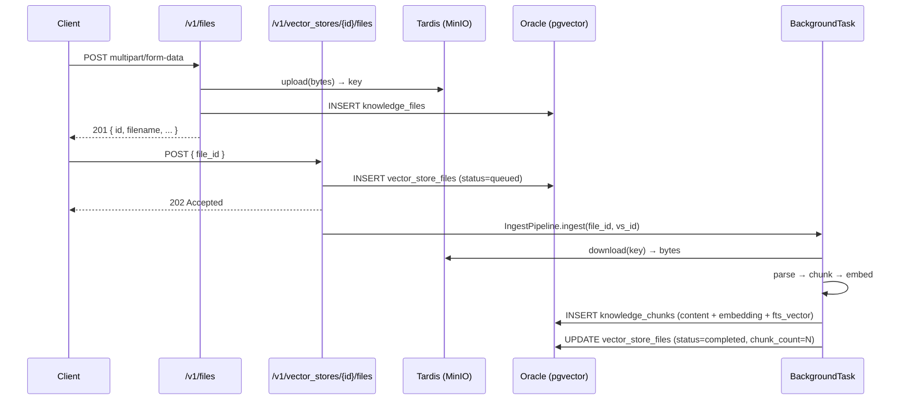
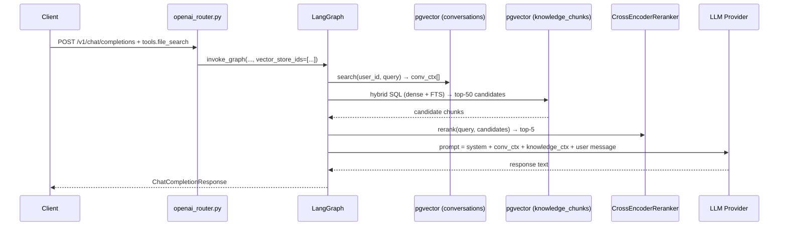
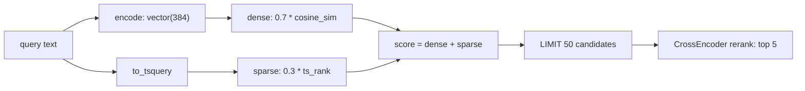
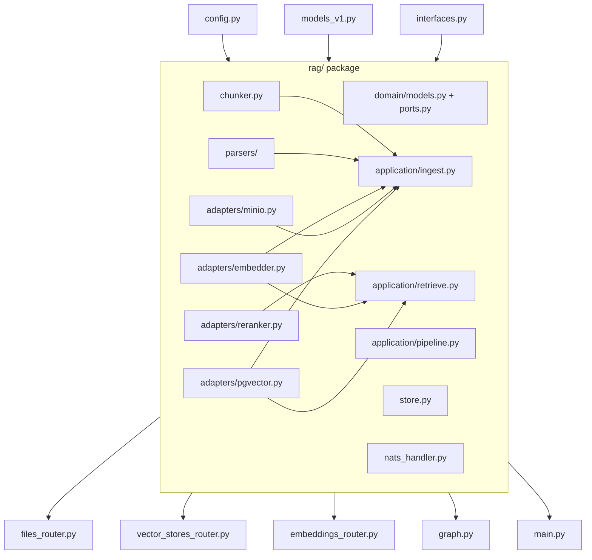

# Feature: Sherlock Universal RAG API

> **Spec**: 013-sherlock-rag-api
> **Author**: arc-platform
> **Date**: 2026-03-03
> **Status**: Approved

## Target Modules

| Module | Path | Impact |
|--------|------|--------|
| Reasoner | `services/reasoner/` | New `rag/` package, 3 new routers, graph extension, config, models, NATS handler |
| Persistence | `services/persistence/` | 4 new tables in `sherlock` schema |
| Storage | `services/storage/` | New MinIO bucket `sherlock-files` — added to `reason` profile only |

## Overview

013 transforms Sherlock from a text-to-text LLM API into a **Universal RAG engine**. It adds an OpenAI-compatible Files API and Vector Stores API on top of the 012 chat surface, so any client already using the OpenAI SDK can upload documents, build knowledge collections, and send RAG-augmented chat completions — all pointing at Sherlock.

The core chat logic (012) is unchanged. RAG is a conditional extension: when a request includes `tools: [{ type: "file_search", vector_store_ids: [...] }]`, knowledge context is retrieved from pgvector and merged into the LLM prompt. Without that field, the request is processed identically to today.

---

## Architecture

### Ingestion Flow



### RAG Chat Flow



### Hybrid Search Query



### Module Dependency Graph



---

## User Scenarios & Testing

### P1 — Must Have

**US-1**: As an API client, I want to upload a document so that I can later query it.
- **Given**: Sherlock running with `SHERLOCK_RAG_ENABLED=true`
- **When**: `POST /v1/files` with `file=@doc.txt` multipart
- **Then**: `201 { "id": "file-xxx", "object": "file", "filename": "doc.txt", "status": "uploaded" }`
- **Test**: `curl -X POST http://localhost:8083/v1/files -F "file=@doc.txt" -F "purpose=assistants"`

**US-2**: As an API client, I want to create a knowledge collection so that I can organize documents by topic.
- **Given**: RAG enabled
- **When**: `POST /v1/vector_stores { "name": "Q4 Financials" }`
- **Then**: `201 { "id": "vs-xxx", "name": "Q4 Financials", "file_count": 0 }`
- **Test**: `curl -X POST http://localhost:8083/v1/vector_stores -d '{"name":"Q4 Financials"}'`

**US-3**: As an API client, I want to add a file to a vector store so that it gets ingested and indexed.
- **Given**: A file and a vector store both exist
- **When**: `POST /v1/vector_stores/vs-xxx/files { "file_id": "file-xxx" }`
- **Then**: `202 { "status": "queued" }` — file is ingested asynchronously into pgvector
- **Test**: Poll `GET /v1/vector_stores/vs-xxx/files/file-xxx` until `"status": "completed"`

**US-4**: As an API client, I want to send a chat request with file_search so that the LLM answers using my documents.
- **Given**: A vector store with completed chunks exists
- **When**: `POST /v1/chat/completions` with `tools: [{ "type": "file_search", "vector_store_ids": ["vs-xxx"] }]`
- **Then**: `200 ChatCompletionResponse` — answer is grounded in document content
- **Test**: Upload a fact-specific doc, ask a question that requires it; verify answer

**US-5**: As an API client, I want to embed text so that I can use Sherlock's encoder in my own pipeline.
- **Given**: RAG enabled
- **When**: `POST /v1/embeddings { "input": "hello world" }`
- **Then**: `200 { "data": [{ "embedding": [...384 floats...], "index": 0 }] }`
- **Test**: Check `len(response.data[0].embedding) == 384`

**US-6**: As an API client, I want to delete a file so that its chunks are removed from all vector stores.
- **Given**: A file with ingested chunks
- **When**: `DELETE /v1/files/file-xxx`
- **Then**: `200` — `knowledge_chunks` rows deleted, `knowledge_files` row deleted, MinIO object deleted
- **Test**: Verify `GET /v1/files/file-xxx` returns `404`

**US-7**: As an API client with `SHERLOCK_RAG_ENABLED=false`, I want to get a clear error when hitting RAG routes so that I understand the feature is disabled.
- **Given**: RAG disabled (default `think` profile)
- **When**: Any `/v1/files`, `/v1/vector_stores`, `/v1/embeddings` request
- **Then**: `503 { "detail": "RAG is not enabled — set SHERLOCK_RAG_ENABLED=true" }`
- **Test**: `docker compose --profile think up && curl http://localhost:8083/v1/files`

### P2 — Should Have

**US-8**: As an API client, I want to run a standalone hybrid search against a vector store so that I can inspect what the retriever finds without triggering a full chat.
- **Given**: Vector store with chunks
- **When**: `POST /v1/vector_stores/vs-xxx/search { "query": "...", "top_k": 5 }`
- **Then**: `200 { "results": [{ "content": "...", "score": 0.87, "file_id": "...", "chunk_index": 3 }] }`
- **Test**: Verify results are ordered by descending score

**US-9**: As an API client, I want to trigger synchronous ingestion for small files so that I don't need to poll status.
- **Given**: RAG enabled, small file
- **When**: `POST /v1/vector_stores/vs-xxx/files?sync=true { "file_id": "file-xxx" }`
- **Then**: `200 { "status": "completed", "chunk_count": 12 }` (blocking response)
- **Test**: Response arrives with `status=completed` without polling

**US-10**: As an API client, I want to list my files and vector stores so that I can audit what is indexed.
- **Given**: Multiple files and vector stores exist
- **When**: `GET /v1/files` and `GET /v1/vector_stores`
- **Then**: `200 { "object": "list", "data": [...] }` paginated, consistent with OpenAI list format
- **Test**: Create 3 files → list → verify count

**US-11**: As an API client, I want to control the hybrid search blend per request so that I can optimize for my use case.
- **Given**: RAG enabled
- **When**: `POST /v1/chat/completions` with `tools: [{ "type": "file_search", "hybrid_alpha": 0.3 }]`
- **Then**: Retriever uses 0.3 dense + 0.7 keyword (overrides `SHERLOCK_HYBRID_ALPHA`)
- **Test**: Keyword-heavy query, low alpha → higher recall on exact terms

**US-12**: As an API client, I want async NATS-based ingestion and RAG chat so that I can integrate without HTTP.
- **Given**: NATS running, RAG enabled
- **When**: Publish `{ "file_id": "...", "vector_store_id": "..." }` to `sherlock.v1.rag.ingest.request`
- **Then**: `sherlock.v1.rag.ingest.result` receives `{ "status": "completed", "chunk_count": N }`
- **Test**: `nats sub sherlock.v1.rag.ingest.result` while publishing

**US-13**: As an API client, I want token counts in API responses so that I can track usage accurately.
- **Given**: 012 returns `usage: (0, 0, 0)` — tiktoken is installed but not wired
- **When**: Any `/v1/chat/completions` or `/v1/embeddings` request
- **Then**: `usage.prompt_tokens`, `completion_tokens`, `total_tokens` contain real values
- **Test**: Send a known-length message → verify token count matches tiktoken estimate

### P3 — Nice to Have

**US-14**: As an API client, I want to download the original file I uploaded so that I can verify what was stored.
- **Given**: A file was uploaded
- **When**: `GET /v1/files/file-xxx/content`
- **Then**: Raw file bytes streamed with `Content-Type` matching original upload
- **Test**: Upload → download → diff original and downloaded bytes

**US-15**: As an API client, I want to delete an entire vector store so that all its chunks and files are cleaned up.
- **Given**: Vector store with multiple ingested files
- **When**: `DELETE /v1/vector_stores/vs-xxx`
- **Then**: Cascades: `knowledge_chunks` deleted, `vector_store_files` deleted, `vector_stores` row deleted, MinIO objects deleted
- **Test**: Verify `GET /v1/vector_stores/vs-xxx` returns `404`

---

## Requirements

### Functional

- [ ] **FR-1**: `POST /v1/files` — upload document (`.txt`, `.md`, `.rst`, `.pdf`, `.json`, `.py`, `.go`, `.ts`, `.js`, `.tsx`, `.jsx`, `.docx`, `.csv`) → MinIO + `knowledge_files` row → `201`
- [ ] **FR-2**: `GET /v1/files`, `GET /v1/files/{id}`, `DELETE /v1/files/{id}` — standard file CRUD
- [ ] **FR-3**: `GET /v1/files/{id}/content` — stream original bytes from MinIO
- [ ] **FR-4**: `POST /v1/vector_stores` + `GET /v1/vector_stores` + `GET /v1/vector_stores/{id}` + `DELETE /v1/vector_stores/{id}` — collection CRUD
- [ ] **FR-5**: `POST /v1/vector_stores/{id}/files` — async ingestion (202 default, `?sync=true` → 200)
- [ ] **FR-6**: `GET /v1/vector_stores/{id}/files` + `DELETE /v1/vector_stores/{id}/files/{fid}` — file-within-store CRUD
- [ ] **FR-7**: `POST /v1/vector_stores/{id}/search` — hybrid search with configurable `mode` and `hybrid_alpha`
- [ ] **FR-8**: `POST /v1/embeddings` — encode text via the shared `SentenceTransformer` (384-dim)
- [ ] **FR-9**: `POST /v1/chat/completions` — when `tools[].type == "file_search"`, retrieve and inject knowledge context
- [ ] **FR-10**: IngestPipeline: parse → chunk → embed → INSERT `knowledge_chunks` (content + `vector(384)` + `fts_vector` GENERATED)
- [ ] **FR-11**: HybridRetriever: single SQL — `0.7 × cosine_similarity + 0.3 × ts_rank` → top-50 candidates → cross-encoder rerank → top-5
- [ ] **FR-12**: NATS handlers: `sherlock.v1.rag.ingest.*`, `sherlock.v1.rag.chat.*`, `sherlock.v1.rag.search.*`, `sherlock.v1.rag.embed.*`
- [ ] **FR-13**: `SHERLOCK_RAG_ENABLED=false` → all RAG routes return `503` with actionable message
- [ ] **FR-14**: Token counting: wire `tiktoken` for `usage.prompt_tokens` + `completion_tokens` in all responses (fix 012 gap)
- [ ] **FR-15**: DB tables created at startup if not exist: `sherlock.vector_stores`, `sherlock.knowledge_files`, `sherlock.vector_store_files`, `sherlock.knowledge_chunks`

### Non-Functional

- [ ] **NFR-1**: No file content, chunk text, or message content in logs or traces (same gate as 012 — `SHERLOCK_CONTENT_TRACING=false` default)
- [ ] **NFR-2**: Ingestion failure → `status: failed` + `error_message` in DB — API endpoints unaffected, no unhandled exception
- [ ] **NFR-3**: `SHERLOCK_RAG_ENABLED=false` leaves the `think` profile byte-for-byte identical to 012 startup
- [ ] **NFR-4**: `ruff check src/ && mypy src/ --strict` — zero errors
- [ ] **NFR-5**: `pytest tests/ --cov=sherlock` — ≥ 75% coverage on `rag/`, `files_router.py`, `vector_stores_router.py`, `embeddings_router.py`
- [ ] **NFR-6**: Hybrid search latency ≤ 100ms for collections of up to 100k chunks on the local dev machine
- [ ] **NFR-7**: Reranker latency ≤ 20ms per call (cross-encoder/ms-marco-MiniLM-L-6-v2, 50 candidates)
- [ ] **NFR-8**: All enterprise OTEL standards from 012 maintained — every new route must follow the counter/timer/error pattern
- [ ] **NFR-9**: All existing 012 tests pass unchanged (`pytest tests/ -k "not rag"`)

### Key Entities

| Entity | Module | Description |
|--------|--------|-------------|
| `VectorStore` | `rag/domain/models.py` | Named collection of knowledge chunks — `sherlock.vector_stores` |
| `KnowledgeFile` | `rag/domain/models.py` | Uploaded document metadata — `sherlock.knowledge_files` |
| `VectorStoreFile` | `rag/domain/models.py` | Join table + ingest status — `sherlock.vector_store_files` |
| `KnowledgeChunk` | `rag/domain/models.py` | Text chunk with `vector(384)` + `tsvector` — `sherlock.knowledge_chunks` |
| `ParsedDocument` | `rag/parsers/base.py` | `{ text: str, metadata: dict }` — output of every parser |
| `SearchResult` | `rag/domain/models.py` | `{ content, score, file_id, chunk_index }` — retriever output |
| `IngestJob` | `rag/domain/models.py` | Represents a background ingest — tracks status in DB + memory |
| `RAGInfra` | `main.py` | Dataclass held in `AppState` — `rag: RAGInfra | None` |
| `FileStorePort` | `rag/domain/ports.py` | Protocol: `upload`, `download`, `delete` |
| `VectorStorePort` | `rag/domain/ports.py` | Protocol: `upsert_chunks`, `search_hybrid`, `delete_vs` |
| `EmbedderPort` | `rag/domain/ports.py` | Protocol: `encode(texts) → list[list[float]]` |
| `RerankerPort` | `rag/domain/ports.py` | Protocol: `rerank(query, texts) → list[float]` (scores) |

---

## Edge Cases

| Scenario | Expected Behavior |
|----------|-------------------|
| Upload file with unsupported extension | `400 { "error": "unsupported_file_type" }` |
| File upload exceeds max size (`SHERLOCK_MAX_FILE_BYTES`, default 50 MB) | `400 { "error": "file_too_large" }` |
| Ingest fails (PDF corrupt, parser exception) | `status=failed`, `error_message` in DB; `GET /v1/vector_stores/{id}/files/{fid}` shows failure; API unaffected |
| MinIO unreachable during upload | `503 { "detail": "Storage unavailable" }` — not a 500 |
| pgvector unavailable during search | Empty knowledge context → chat responds from conversation memory only (graceful degradation) |
| `vector_store_ids` contains non-existent VS | Search over that ID returns empty, rest still searched |
| Same file added to VS twice | Second `POST` is idempotent — returns existing `VectorStoreFile` row, does not re-ingest |
| `hybrid_alpha=0.0` (pure keyword) | FTS only — `ts_rank` score, no pgvector distance |
| `hybrid_alpha=1.0` (pure dense) | Dense cosine only — `fts_vector` column unused in scoring |
| `?sync=true` on large file (> 30s) | Configurable timeout; if exceeded → returns `202` with background continuation |
| Delete file while ingest is in-progress | `status=failed` + `error_message="file deleted during ingestion"` in `vector_store_files` |
| `SHERLOCK_RAG_ENABLED=false` | All RAG routes → `503`; `/v1/chat/completions` and all 012 routes → unchanged |
| Empty `messages` in RAG chat | `400 { "error": "bad_request" }` |
| Reranker model not downloaded | First call triggers download (lazy init), subsequent calls cached |

---

## Success Criteria

- [ ] **SC-1**: `curl http://localhost:8083/v1/files` returns `200 { "object": "list" }` (RAG enabled)
- [ ] **SC-2**: Full ingest cycle — upload → add to VS → poll → `status=completed` — works end-to-end
- [ ] **SC-3**: RAG chat returns answer grounded in an uploaded document (not hallucinated)
- [ ] **SC-4**: `POST /v1/embeddings` returns a 384-element vector
- [ ] **SC-5**: `SHERLOCK_RAG_ENABLED=false` → all RAG routes return `503`; existing 012 routes unaffected
- [ ] **SC-6**: `ruff check src/ && mypy src/ --strict` — zero errors
- [ ] **SC-7**: `pytest tests/ --cov=sherlock` — ≥ 75% on `rag/`, `files_router.py`, `vector_stores_router.py`, `embeddings_router.py`; all 012 tests still pass
- [ ] **SC-8**: `usage.prompt_tokens` + `completion_tokens` are non-zero in all chat responses (tiktoken wired)
- [ ] **SC-9**: NATS ingest: publish to `sherlock.v1.rag.ingest.request` → result on `sherlock.v1.rag.ingest.result` with `status=completed`
- [ ] **SC-10**: Hybrid search — keyword query with `hybrid_alpha=0.2` returns higher keyword-match results than dense-only `alpha=1.0` for the same query
- [ ] **SC-11**: SigNoz shows `sherlock.rag.uploads.total`, `sherlock.rag.ingest.latency`, `sherlock.rag.retrieval.latency` metrics populated after a full ingest+chat cycle
- [ ] **SC-12**: `service.yaml` version bumped to `0.3.0`, `storage` added to `depends_on`

---

## Docs & Links Update

- [ ] Update `services/reasoner/contracts/openapi.yaml` — add all 13 new paths + schemas
- [ ] Update `services/reasoner/contracts/asyncapi.yaml` — add 4 `sherlock.v1.rag.*` channel pairs
- [ ] Bump `services/reasoner/service.yaml` version to `0.3.0`, add `storage` depends_on
- [ ] Update `services/reasoner/pyproject.toml` — new deps: `qdrant-client` removed if planned, `minio>=7.2`, `pypdf>=4.0`, `python-docx>=1.1`, `sentence-transformers` (existing), `tiktoken` (existing, wire it)
- [ ] Verify internal links in `.specify/docs/architecture/013-sherlock-rag-api.md` point to correct module paths after implementation

---

## CI Build Performance Investigation

> **Observed**: `arc-sherlock` image takes ~20 minutes to build in GitHub Actions.
> **Target**: ≤ 5 minutes cold build, ≤ 2 minutes with layer cache hit.
> **When to fix**: After 013 implementation is complete (before merge to main).

### Root Cause Hypotheses (priority order)

| # | Hypothesis | Evidence | Expected Impact |
|---|------------|----------|-----------------|
| H-1 | `sentence-transformers` pulls full **CUDA PyTorch** (~2.5 GB) instead of CPU-only (~200 MB) | `pyproject.toml` has no torch variant constraint; default PyPI torch includes CUDA | **Saves 8–12 min** — biggest win |
| H-2 | Docker GHA layer cache eviction — 10 GB limit means torch layer is evicted between runs | `_reusable-build.yml` uses `type=gha,scope=arc-sherlock`; torch layer alone exceeds 1 GB compressed | **Saves 10 min on cache miss** |
| H-3 | `typecheck` and `test` CI jobs each run `pip install ".[dev]"` from scratch — no pip cache | `reasoner-images.yml` has no `actions/setup-python cache: pip`; they both download torch fresh | **Saves 5 min per job × 2** |
| H-4 | `pip` used in Dockerfile instead of `uv` despite `uv.lock` being present in the repo | `uv.lock` referenced in change detection paths but `Dockerfile` uses `pip install` | **Saves 2–4 min** on resolution + install |
| H-5 | `all-MiniLM-L6-v2` model (~90 MB) downloaded at runtime on every cold container start | `SherlockMemory.__init__` calls `SentenceTransformer(...)` — no pre-download at image build | **Not build time** but adds 30s to cold start |

### Investigation Steps

Run these to confirm which hypotheses are true before writing any code:

```bash
# 1. Check what torch variant is actually installed (CUDA vs CPU-only)
docker run --rm arc-sherlock:latest pip show torch | grep -E "Version|Location"
docker run --rm arc-sherlock:latest python -c "import torch; print(torch.__version__); print(torch.version.cuda)"

# 2. Check installed package sizes
docker run --rm arc-sherlock:latest du -sh /usr/local/lib/python3.13/site-packages/torch

# 3. Check GHA cache hit rate — look at recent workflow runs
gh run list --workflow=reasoner-images.yml --limit=10 --json databaseId,conclusion,createdAt
# Then for each run: gh run view {id} --log | grep -i "cache"

# 4. Time each Dockerfile stage locally (simulate cold build)
docker buildx build --no-cache --progress=plain services/reasoner/ 2>&1 | grep -E "^#[0-9]+ \[" | head -40

# 5. Confirm uv.lock is fully resolved and usable
cd services/reasoner && uv lock --check && uv export --format requirements-txt | grep torch
```

### Mitigations to Evaluate

Each mitigation is independent. Implement in order — stop when target is met.

#### M-1: Switch to PyTorch CPU-only (fix H-1) — **implement first**

In `services/reasoner/Dockerfile`, install CPU-only torch before the full `pip install`:

```dockerfile
# Install CPU-only torch first — prevents pip from resolving CUDA variant (~2.5 GB → ~200 MB)
RUN pip install --prefix=/install --no-cache-dir \
    torch --index-url https://download.pytorch.org/whl/cpu
RUN pip install --prefix=/install --no-cache-dir ".[dev]" --no-deps-for torch
```

Or constrain in `pyproject.toml`:
```toml
[tool.uv.sources]
torch = { index = "pytorch-cpu" }

[[tool.uv.index]]
name = "pytorch-cpu"
url = "https://download.pytorch.org/whl/cpu"
explicit = true
```

Expected result: builder stage drops from ~10 min to ~2 min.

#### M-2: Add pip cache to CI quality jobs (fix H-3) — **quick win**

In `reasoner-images.yml`, update `typecheck` and `test` jobs:

```yaml
- uses: actions/setup-python@v5
  with:
    python-version: '3.13'
    cache: 'pip'                    # ← add this line
    cache-dependency-path: services/reasoner/pyproject.toml
```

Expected result: second and subsequent CI runs skip torch download entirely in these jobs.

#### M-3: Switch Dockerfile to `uv` (fix H-4) — **install speed**

```dockerfile
FROM python:3.13-slim AS builder

RUN pip install uv

WORKDIR /build
COPY pyproject.toml uv.lock ./
RUN mkdir -p src/sherlock && touch src/sherlock/__init__.py

# uv sync uses the lockfile — no resolution needed, 10-100x faster than pip
RUN uv sync --frozen --no-dev --no-install-project

COPY src/ ./src/
RUN uv sync --frozen --no-dev
```

Expected result: dependency install step drops from ~8 min to ~1 min (uv resolves from lockfile directly).

#### M-4: Pre-download the embedding model at build time (fix H-5) — **cold start**

```dockerfile
# After pip install, pre-download model to /home/sherlock/.cache/huggingface
# SHERLOCK_ENCODER_MODEL is the model name, default all-MiniLM-L6-v2
ARG ENCODER_MODEL=sentence-transformers/all-MiniLM-L6-v2
RUN python -c "from sentence_transformers import SentenceTransformer; SentenceTransformer('${ENCODER_MODEL}')"
```

This bakes the 90 MB model into the image layer. The layer is cached in GHA and GHCR — no download on startup. Trade-off: larger image, model is hardcoded to build arg.

#### M-5: Split into a base image (fix H-2 permanently) — **if M-1+M-2+M-3 still not enough**

Build a `arc-sherlock-base` image containing only the heavy deps (torch, sentence-transformers). Trigger rebuild only when `pyproject.toml` changes. The main `Dockerfile` uses:

```dockerfile
FROM ghcr.io/arc-framework/arc-sherlock-base:latest AS builder
COPY src/ ./src/
RUN pip install "." --no-deps
```

Cold builds then only download `arc-sherlock-base` from GHCR cache — zero pip install for heavy deps. Requires a separate base image workflow.

### Success Criteria

- [ ] **BC-1**: Cold build (no layer cache) completes in ≤ 5 minutes
- [ ] **BC-2**: Warm build (layer cache hit on deps layer) completes in ≤ 90 seconds
- [ ] **BC-3**: `typecheck` and `test` CI jobs complete in ≤ 3 minutes each (with pip cache)
- [ ] **BC-4**: `torch` installed is CPU-only variant — `torch.version.cuda` returns `None`
- [ ] **BC-5**: No regression — all existing tests pass in CI after Dockerfile changes

---

## Constitution Compliance

| Principle | Applies | Compliant | Notes |
|-----------|---------|-----------|-------|
| I. Zero-Dep CLI | [ ] | N/A | No CLI changes |
| II. Platform-in-a-Box | [x] | [x] | `rag_enabled=false` default — `think` profile unchanged; MinIO only in `reason` |
| III. Modular Services | [x] | [x] | All changes inside `services/reasoner/` — additive, no new service directory |
| IV. Two-Brain | [x] | [x] | Python only — parsing, chunking, embedding, reranking are intelligence concerns |
| V. Polyglot Standards | [x] | [x] | FastAPI + Pydantic v2 + ruff + mypy strict + pytest fixtures |
| VI. Local-First | [ ] | N/A | No CLI component |
| VII. Observability | [x] | [x] | 6 new OTEL metrics; every route follows counter/timer/error pattern; `event_type` on all logs |
| VIII. Security | [x] | [x] | MinIO creds via env + Pydantic `SecretStr`; file content never in logs or spans |
| IX. Declarative | [ ] | N/A | No CLI component |
| X. Stateful Ops | [ ] | N/A | No CLI component |
| XI. Resilience | [x] | [x] | Ingest failure → `status:failed`, API unaffected; pgvector down → empty ctx, chat still works |
| XII. Interactive | [ ] | N/A | No CLI component |
