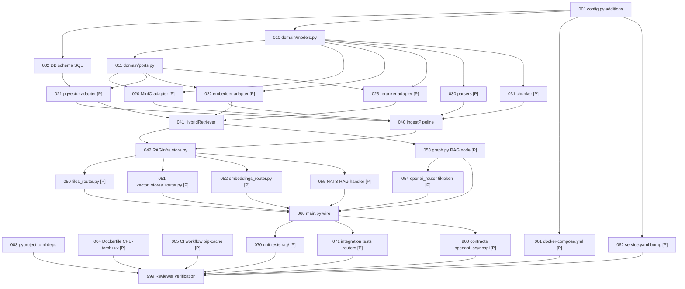

# Tasks: Sherlock Universal RAG API

> **Spec**: 013-sherlock-rag-api
> **Date**: 2026-03-03

## Task Format

```
[TASK-NNN] [P?] [MODULE] [PRIORITY] Description
  Dependencies: [TASK-XXX] or none
  Module: path
  Acceptance: Testable criteria
  Status: [ ] pending | [~] in-progress | [x] done
```

- `[P]` = Safe for parallel agent execution
- Priority: P1 (must), P2 (should), P3 (nice)

---

## Dependency Graph



---

## Quality Requirements

| Module | Coverage | Lint |
|--------|----------|------|
| `rag/` | ≥ 75% | `ruff check src/ && mypy src/ --strict` |
| `files_router.py` | ≥ 75% | same |
| `vector_stores_router.py` | ≥ 75% | same |
| `embeddings_router.py` | ≥ 75% | same |
| All 012 tests | pass unchanged | `pytest tests/ -k "not rag"` |

---

## Phase 1: Setup

- [ ] **[TASK-001]** [REASONER] [P1] Add RAG settings fields to `config.py`
  - Dependencies: none
  - Module: `services/reasoner/src/sherlock/config.py`
  - Acceptance: `Settings` class has `rag_enabled`, `minio_endpoint`, `minio_access_key` (SecretStr), `minio_secret_key` (SecretStr), `minio_bucket`, `minio_secure`, `max_file_bytes`, `hybrid_alpha`, `chunk_size_tokens`, `chunk_overlap_tokens`, `retrieval_candidate_k`, `retrieval_top_k`, `reranker_model`, `sync_timeout_s` with correct env aliases and defaults; `mypy --strict` passes

- [ ] **[TASK-002]** [PERSISTENCE] [P1] Add RAG schema SQL init script
  - Dependencies: TASK-001
  - Module: `services/persistence/initdb/004_sherlock_rag_schema.sql`
  - Acceptance: File creates tables `sherlock.vector_stores`, `sherlock.knowledge_files`, `sherlock.vector_store_files`, `sherlock.knowledge_chunks` with correct columns, FK constraints, HNSW index, GIN FTS index, and `fts_vector GENERATED ALWAYS AS` column; all `IF NOT EXISTS` guarded

- [ ] **[TASK-003]** [REASONER] [P1] Add new dependencies to `pyproject.toml`
  - Dependencies: none
  - Module: `services/reasoner/pyproject.toml`
  - Acceptance: `minio>=7.2`, `pypdf>=4.0`, `python-docx>=1.1` added to `[project.dependencies]`; `mypy.overrides` for `sherlock.rag.adapters.minio` with `ignore_missing_imports = true` added; `uv lock` runs clean

- [ ] **[TASK-004]** [P] [CI] [P2] Switch Dockerfile to CPU-only torch + uv (M-1 + M-3)
  - Dependencies: none
  - Module: `services/reasoner/Dockerfile`
  - Acceptance: `torch` installed via `--index-url https://download.pytorch.org/whl/cpu` before full `pip install`; or `uv sync --frozen --no-dev` used; `docker build` completes; `python -c "import torch; print(torch.version.cuda)"` returns `None`

- [ ] **[TASK-005]** [P] [CI] [P2] Add pip cache to CI typecheck/test jobs
  - Dependencies: none
  - Module: `.github/workflows/reasoner-images.yml`
  - Acceptance: `typecheck` and `test` jobs use `actions/setup-python@v5` with `cache: 'pip'` and `cache-dependency-path: services/reasoner/pyproject.toml`; second CI run shows cache hit log

---

## Phase 2: Foundational

- [ ] **[TASK-010]** [REASONER] [P1] Create `rag/domain/models.py` with all entity dataclasses
  - Dependencies: TASK-001
  - Module: `services/reasoner/src/sherlock/rag/domain/models.py`
  - Acceptance: Defines `VectorStore`, `KnowledgeFile`, `VectorStoreFile`, `KnowledgeChunk`, `SearchResult`, `IngestJob`, `ParsedDocument`; all are Pydantic `BaseModel` or `dataclass`; `mypy --strict` passes; `rag/__init__.py` and `rag/domain/__init__.py` exist

- [ ] **[TASK-011]** [REASONER] [P1] Create `rag/domain/ports.py` with all port Protocols
  - Dependencies: TASK-010
  - Module: `services/reasoner/src/sherlock/rag/domain/ports.py`
  - Acceptance: Defines `FileStorePort` (upload/download/delete), `VectorStorePort` (init_schema/upsert_chunks/search_hybrid/delete_by_file/delete_vs), `EmbedderPort` (encode), `RerankerPort` (rerank); all use `typing.Protocol` with `@runtime_checkable`; `mypy --strict` passes

---

## Phase 3: Implementation

### Parallel Batch A — Adapters (run concurrently after TASK-011)

- [ ] **[TASK-020]** [P] [REASONER] [P1] Implement `rag/adapters/minio.py` (MinIO file store)
  - Dependencies: TASK-010, TASK-011
  - Module: `services/reasoner/src/sherlock/rag/adapters/minio.py`
  - Acceptance: Implements `FileStorePort`; `upload(key, data)` creates bucket if absent; `download(key)` returns bytes; `delete(key)` removes object; `MinioUnavailableError` raised (not `500`) when MinIO unreachable; `mypy --strict` passes (with mypy override for minio stubs)

- [ ] **[TASK-021]** [P] [REASONER] [P1] Implement `rag/adapters/pgvector.py` (vector + FTS store)
  - Dependencies: TASK-010, TASK-011, TASK-002
  - Module: `services/reasoner/src/sherlock/rag/adapters/pgvector.py`
  - Acceptance: Implements `VectorStorePort`; `init_schema()` is idempotent (CREATE IF NOT EXISTS); `upsert_chunks(vs_id, file_id, chunks, embeddings)` inserts into `knowledge_chunks`; `search_hybrid(query_vec, query_text, vs_ids, alpha, candidate_k)` executes single SQL with `alpha`-weighted dense + FTS scoring; `delete_by_file(file_id)` cascades chunks; `alpha=0.0` uses FTS-only, `alpha=1.0` uses dense-only; `mypy --strict` passes

- [ ] **[TASK-022]** [P] [REASONER] [P1] Implement `rag/adapters/embedder.py` (SentenceTransformer wrapper)
  - Dependencies: TASK-010, TASK-011
  - Module: `services/reasoner/src/sherlock/rag/adapters/embedder.py`
  - Acceptance: Implements `EmbedderPort`; accepts `SentenceTransformer` instance (injected, not created); `encode(texts) → list[list[float]]`; returns 384-dim vectors; handles empty input gracefully; `mypy --strict` passes

- [ ] **[TASK-023]** [P] [REASONER] [P1] Implement `rag/adapters/reranker.py` (CrossEncoder wrapper)
  - Dependencies: TASK-010, TASK-011
  - Module: `services/reasoner/src/sherlock/rag/adapters/reranker.py`
  - Acceptance: Implements `RerankerPort`; lazy `CrossEncoder` init on first call (model name from settings); `_instance` cached as class variable after first load — never reloaded; `rerank(query, texts) → list[float]` wraps `CrossEncoder.predict()` with `asyncio.to_thread(...)` since it is a synchronous CPU call; `mypy --strict` passes
  - Note (W-3): First call triggers model download (~200 MB, `cross-encoder/ms-marco-MiniLM-L-6-v2`). The latency spike on the first RAG chat request is expected and documented. Subsequent calls use the cached model. Pre-downloading at image build time (M-4 in spec CI section) is a later optimisation, not MVP.

### Parallel Batch B — Parsers + Chunker (run concurrently after TASK-010)

- [ ] **[TASK-030]** [P] [REASONER] [P1] Implement `rag/parsers/` (all format parsers)
  - Dependencies: TASK-010
  - Module: `services/reasoner/src/sherlock/rag/parsers/`
  - Acceptance: `base.py` defines `ParsedDocument(text: str, metadata: dict)` and `ParserPort` Protocol; `text_parser.py` handles `.txt,.md,.rst,.py,.go,.ts,.js,.tsx,.jsx` (UTF-8); `pdf_parser.py` uses `pypdf`; `docx_parser.py` uses `python-docx`; `json_parser.py` pretty-prints; `csv_parser.py` yields one chunk per row; `__init__.py` exports `dispatch_parser(filename, data) → ParsedDocument`; unsupported extension raises `UnsupportedFileTypeError`; `mypy --strict` passes

- [ ] **[TASK-031]** [P] [REASONER] [P1] Implement `rag/chunker.py` (token-aware text chunker)
  - Dependencies: TASK-010
  - Module: `services/reasoner/src/sherlock/rag/chunker.py`
  - Acceptance: `chunk_text(text, chunk_size, overlap) → list[str]`; uses `tiktoken` (`cl100k_base`) for token counting; respects `chunk_size_tokens` and `chunk_overlap_tokens` from settings; empty input → empty list; `mypy --strict` passes

### Application Layer (sequential within stream)

- [ ] **[TASK-040]** [REASONER] [P1] Implement `rag/application/ingest.py` (IngestPipeline)
  - Dependencies: TASK-020, TASK-021, TASK-022, TASK-030, TASK-031
  - Module: `services/reasoner/src/sherlock/rag/application/ingest.py`
  - Acceptance: `IngestPipeline.ingest(file_id, vs_id) → int` downloads file from MinIO, dispatches parser, chunks, embeds, batch-inserts `knowledge_chunks`, updates `vector_store_files.status` to `completed`/`failed`; on exception sets `status=failed` and `error_message` in DB; returns `chunk_count`; `mypy --strict` passes

- [ ] **[TASK-041]** [REASONER] [P1] Implement `rag/application/retrieve.py` (HybridRetriever)
  - Dependencies: TASK-021, TASK-022, TASK-023
  - Module: `services/reasoner/src/sherlock/rag/application/retrieve.py`
  - Acceptance: `HybridRetriever.search(query, vs_ids, alpha, candidate_k, top_k) → list[SearchResult]`; encodes query, calls `search_hybrid`, then reranks to `top_k`; non-existent `vs_id` → empty results (no error); `alpha` per-request overrides default; `mypy --strict` passes

- [ ] **[TASK-042]** [REASONER] [P1] Implement `rag/store.py` (RAGInfra factory + dataclass)
  - Dependencies: TASK-040, TASK-041
  - Module: `services/reasoner/src/sherlock/rag/store.py`
  - Acceptance: `RAGInfra` dataclass holds `file_store`, `vector_store`, `embedder`, `reranker`, `ingest_pipeline`, `retriever`, `settings`; `async build_rag_infra(settings, encoder) → RAGInfra` wires all adapters and application objects; calls `pgvector_adapter.init_schema()` and MinIO bucket creation on startup; `mypy --strict` passes

### Parallel Batch C — HTTP Routers (run concurrently after TASK-042)

- [ ] **[TASK-050]** [P] [REASONER] [P1] Implement `files_router.py` (US-1, US-6, FR-1/2/3)
  - Dependencies: TASK-042
  - Module: `services/reasoner/src/sherlock/files_router.py`
  - Acceptance: `POST /v1/files` → 201 (multipart); validates extension + size (`UnsupportedFileTypeError` → 400, size > `max_file_bytes` → 400); uploads to MinIO, inserts `knowledge_files`; `GET /v1/files` → 200 list; `GET /v1/files/{id}` → 200 or 404; `DELETE /v1/files/{id}` → 200 (cascades chunks + MinIO delete); `GET /v1/files/{id}/content` → streamed bytes; all routes return 503 when `state.rag is None`; OTEL counter `sherlock.rag.uploads.total`; `mypy --strict` passes

- [ ] **[TASK-051]** [P] [REASONER] [P1] Implement `vector_stores_router.py` (US-2/3/8/9/10, FR-4/5/6/7)
  - Dependencies: TASK-042
  - Module: `services/reasoner/src/sherlock/vector_stores_router.py`
  - Acceptance: `POST /v1/vector_stores` → 201; `GET/DELETE /v1/vector_stores/{id}` → 200/404; `POST /v1/vector_stores/{id}/files` → 202 async (`BackgroundTask`) or 200 sync (`?sync=true`); `?sync=true` uses `asyncio.wait_for(settings.sync_timeout_s)`, falls back to 202 on timeout; `GET /v1/vector_stores/{id}/files/{fid}` → shows status/chunk_count/error; `DELETE /v1/vector_stores/{id}/files/{fid}` → removes chunks; `POST /v1/vector_stores/{id}/search` → hybrid search with optional `hybrid_alpha` override; same-file-twice → idempotent (returns existing row); all routes 503 when `state.rag is None`; OTEL timers `sherlock.rag.ingest.latency`, `sherlock.rag.search.latency`; `mypy --strict` passes

- [ ] **[TASK-052]** [P] [REASONER] [P1] Implement `embeddings_router.py` (US-5, FR-8)
  - Dependencies: TASK-042
  - Module: `services/reasoner/src/sherlock/embeddings_router.py`
  - Acceptance: `POST /v1/embeddings` → 200 `{ "object": "list", "data": [{ "embedding": [...384 floats...], "index": 0, "object": "embedding" }] }`; uses shared `EmbedderAdapter`; supports batch input (`input` as string or list); `usage.prompt_tokens` populated via tiktoken; 503 when `state.rag is None`; OTEL timer `sherlock.rag.embed.latency`; `mypy --strict` passes

- [ ] **[TASK-053]** [P] [REASONER] [P1] Extend `graph.py` with RAG retrieve node (FR-9)
  - Dependencies: TASK-041
  - Module: `services/reasoner/src/sherlock/graph.py`
  - Acceptance: New `rag_retrieve` node runs when `vector_store_ids` is non-empty; calls `HybridRetriever.search`; injects knowledge context into LLM prompt after system prompt and conv memory; when `vector_store_ids` is absent/empty node is a no-op (all existing 012 tests pass unchanged); `invoke_graph` signature extended with optional `vector_store_ids: list[str] | None = None`; `mypy --strict` passes

- [ ] **[TASK-054]** [P] [REASONER] [P1] Wire tiktoken token counts + file_search tool detection in `openai_router.py` (FR-9, FR-14, US-13)
  - Dependencies: TASK-053
  - Module: `services/reasoner/src/sherlock/openai_router.py`
  - Acceptance: `_count_tokens(model, text) → int` helper using `tiktoken.encoding_for_model` with `cl100k_base` fallback; `usage.prompt_tokens` and `completion_tokens` are non-zero in all `/v1/chat/completions` responses; when `req.tools` contains `{ "type": "file_search", "vector_store_ids": [...] }` → extracts `vector_store_ids` and passes to `invoke_graph`; when `req.tools` contains `hybrid_alpha` → passes to graph; all existing streaming + non-streaming code paths pass; `mypy --strict` passes

- [ ] **[TASK-055]** [P] [REASONER] [P2] Implement `rag/nats_handler.py` (RAG NATS subjects, US-12)
  - Dependencies: TASK-042
  - Module: `services/reasoner/src/sherlock/rag/nats_handler.py`
  - Acceptance: Subscribes to `sherlock.v1.rag.ingest.request` → runs `IngestPipeline.ingest` → publishes to `sherlock.v1.rag.ingest.result`; subscribes to `sherlock.v1.rag.search.request` → runs `HybridRetriever.search` → publishes result; subscribes to `sherlock.v1.rag.embed.request` → runs `EmbedderAdapter.encode` → publishes result; subscribes to `sherlock.v1.rag.chat.request` → runs graph with `vector_store_ids` → publishes result; `mypy --strict` passes

---

## Phase 4: Integration

- [ ] **[TASK-060]** [REASONER] [P1] Wire `RAGInfra` into `main.py` (AppState + lifespan + router mounts)
  - Dependencies: TASK-042, TASK-050, TASK-051, TASK-052, TASK-053, TASK-054, TASK-055
  - Module: `services/reasoner/src/sherlock/main.py`
  - Acceptance: `AppState` has `rag: RAGInfra | None = None`; lifespan calls `build_rag_infra(settings, memory._encoder)` only when `settings.rag_enabled`; `files_router`, `vector_stores_router`, `embeddings_router` included with prefix `/v1`; NATS RAG handler started when `rag_enabled and nats_enabled`; `/health/deep` adds `"minio": await state.rag.file_store.health_check()` to the `components` dict when `state.rag is not None` — MinIO unhealthy → overall status 503 (W-2); startup log shows `rag_enabled=true/false`; `mypy --strict` passes

- [ ] **[TASK-061]** [P] [REASONER] [P1] Update `docker-compose.yml` with RAG env vars
  - Dependencies: TASK-001
  - Module: `services/reasoner/docker-compose.yml`
  - Acceptance: Add to `arc-sherlock` environment block: `SHERLOCK_RAG_ENABLED: "false"` (default off), `SHERLOCK_MINIO_ENDPOINT: "arc-storage:9000"`, `SHERLOCK_MINIO_ACCESS_KEY: "arc"`, `SHERLOCK_MINIO_SECRET_KEY: "arc-minio-dev"` (matches `services/storage/docker-compose.yml` `MINIO_ROOT_*`), `SHERLOCK_MINIO_BUCKET: "sherlock-files"`; no other structural changes needed — `arc-storage` service wiring is handled by `services/profiles.yaml` (`reason` profile already includes `storage`) and `service.yaml` startup ordering is handled by `resolve-deps.sh` (W-1, W-4)

- [ ] **[TASK-062]** [P] [REASONER] [P1] Bump `service.yaml` to v0.3.0, add `storage` depends_on
  - Dependencies: TASK-001
  - Module: `services/reasoner/service.yaml`
  - Acceptance: `version: "0.3.0"`; `depends_on` list includes `storage`; `description` updated to mention RAG

- [ ] **[TASK-070]** [P] [REASONER] [P1] Write unit tests for `rag/` package
  - Dependencies: TASK-060
  - Module: `services/reasoner/tests/rag/`
  - Acceptance: Tests cover `domain/models.py`, `adapters/embedder.py`, `adapters/reranker.py`, `parsers/` (all formats + dispatch), `chunker.py`, `application/ingest.py` (mocked adapters), `application/retrieve.py` (mocked adapters); `hybrid_alpha=0.0` and `alpha=1.0` SQL edge cases tested; `IngestPipeline` exception → `status=failed`; `pytest tests/ -k "rag" --cov=sherlock.rag` ≥ 75%

- [ ] **[TASK-071]** [P] [REASONER] [P1] Write integration tests for all 3 new routers + RAG chat
  - Dependencies: TASK-060
  - Module: `services/reasoner/tests/`
  - Acceptance: `httpx.AsyncClient` tests for `POST /v1/files`, `GET /v1/files`, `DELETE /v1/files/{id}`, `POST /v1/vector_stores`, `POST /v1/vector_stores/{id}/files`, `GET /v1/vector_stores/{id}/files/{fid}`, `POST /v1/vector_stores/{id}/search`, `POST /v1/embeddings`; `SHERLOCK_RAG_ENABLED=false` → all new routes return 503; `usage.prompt_tokens` non-zero in chat response; all 012 tests still pass (`pytest tests/ -k "not rag"`); overall rag router coverage ≥ 75%

---

## Phase 5: Polish

- [ ] **[TASK-900]** [P] [DOCS] [P1] Update OpenAPI and AsyncAPI contracts
  - Dependencies: TASK-060
  - Module: `specs/013-sherlock-rag-api/contracts/openapi.yaml`, `specs/013-sherlock-rag-api/contracts/asyncapi.yaml`
  - Acceptance: `openapi.yaml` includes all 13 new paths (`/v1/files`, `/v1/files/{id}`, `/v1/files/{id}/content`, `/v1/vector_stores`, `/v1/vector_stores/{id}`, `/v1/vector_stores/{id}/files`, `/v1/vector_stores/{id}/files/{fid}`, `/v1/vector_stores/{id}/search`, `/v1/embeddings`) with request/response schemas; `asyncapi.yaml` includes 4 channel pairs (`sherlock.v1.rag.ingest.*`, `sherlock.v1.rag.chat.*`, `sherlock.v1.rag.search.*`, `sherlock.v1.rag.embed.*`); files pass YAML lint

- [ ] **[TASK-999]** [REVIEW] [P1] Reviewer agent verification
  - Dependencies: ALL tasks
  - Module: all affected modules
  - Acceptance: All tasks above are `[x]` done; `ruff check src/ && mypy src/ --strict` zero errors; `pytest tests/ --cov=sherlock` ≥ 75% on rag/ + new routers; `pytest tests/ -k "not rag"` all pass; `usage.prompt_tokens` non-zero; NATS RAG subjects verified; `service.yaml` version = `0.3.0`; `openapi.yaml` and `asyncapi.yaml` updated; no file content in logs/spans; `SecretStr` on MinIO creds; `SHERLOCK_RAG_ENABLED=false` → 012 identical; CI Dockerfile produces CPU-only torch

---

## Progress Summary

| Phase | Total | Done | Parallel |
|-------|-------|------|----------|
| Setup | 5 | 0 | 2 |
| Foundational | 2 | 0 | 0 |
| Implementation | 15 | 0 | 12 |
| Integration | 6 | 0 | 4 |
| Polish | 2 | 0 | 1 |
| **Total** | **30** | **0** | **19** |
