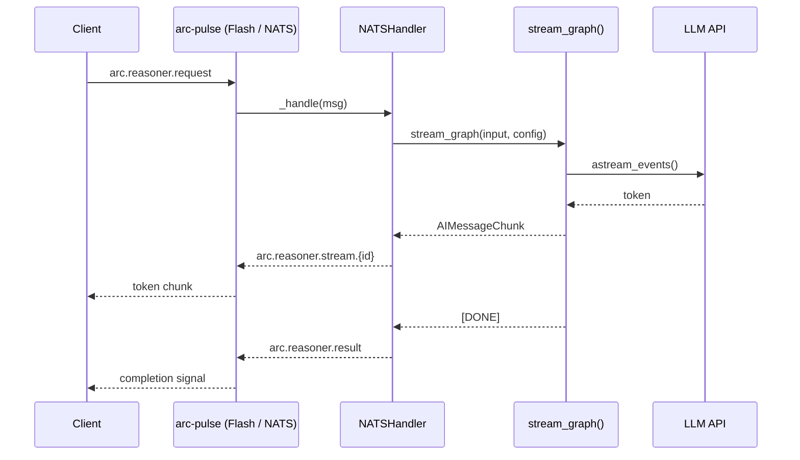
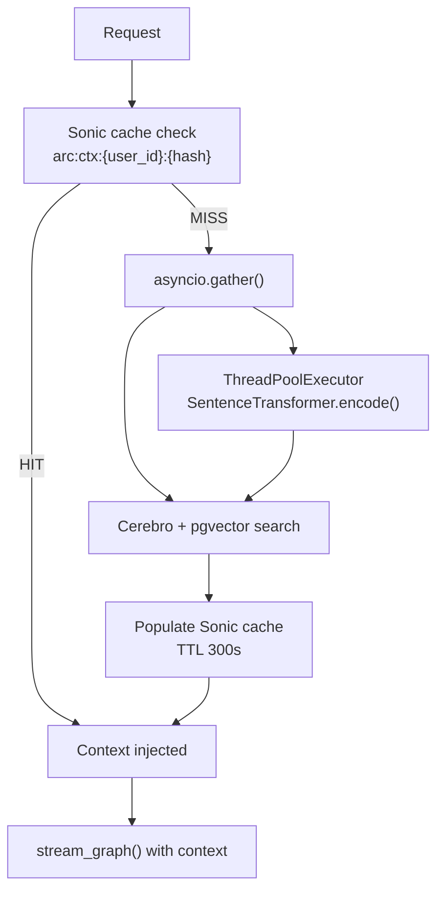
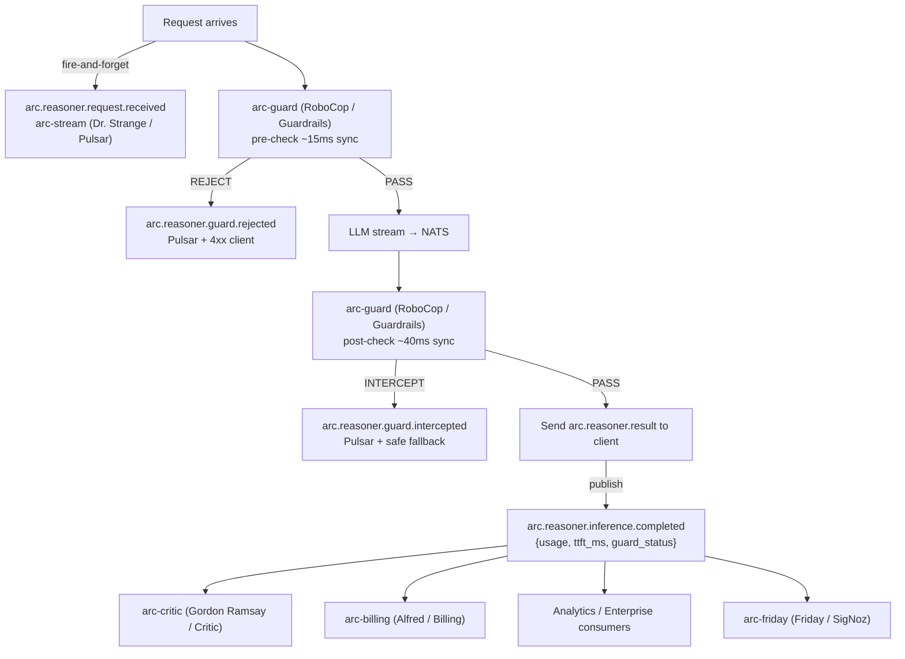

# Implementation Plan: Nervous System

> **Spec**: 015-nervous-system
> **Date**: 2026-03-05
> **HLD**: `docs/ard/NERVOUS-SYSTEM-HLD.md`

## Summary

Wire arc-pulse (Flash / NATS), arc-stream (Dr. Strange / Pulsar), and arc-db-cache (Sonic / Redis) into a streaming-first inference backbone for arc-brain (Sherlock / LangGraph). Three sequential phases, each ending with a **stabilization gate** (lint → test → commit) so the system is safe and deployable before the next phase begins. Phase 1 streams tokens over NATS to achieve sub-200ms TTFT. Phase 2 parallelizes retrieval and adds Redis caching. Phase 3 establishes Pulsar as the platform-wide event backbone — publishing every request and response — enabling billing, analytics, guardrails, and the accuracy loop to subscribe without touching Sherlock.

---

## Target Modules

| Module | Language | Changes |
|--------|----------|---------|
| `services/reasoner/src/reasoner/` | Python | nats_handler, openai_nats_handler, pulsar_handler, memory, observability, config, graph, models_v1 |
| `services/reasoner/contracts/` | YAML | asyncapi.yaml — full event contract |
| `services/reasoner/tests/` | Python | test_nats_handler, test_pulsar_handler, test_memory, test_observability |
| `services/streaming/` | YAML | service.yaml — verify Dr. Strange healthy in reason profile |

---

## Technical Context

| Aspect | Value |
|--------|-------|
| Language | Python 3.11+ |
| Frameworks | FastAPI, LangGraph, nats-py, pulsar-client |
| Messaging | arc-pulse (Flash / NATS), arc-stream (Dr. Strange / Pulsar) |
| Cache | arc-db-cache (Sonic / Redis) — redis-py async |
| Testing | pytest + pytest-asyncio |
| Linting | ruff + mypy (strict) |
| Key Dependencies | `nats-py`, `pulsar-client`, `redis[asyncio]`, `structlog`, `opentelemetry-sdk` |

---

## Architecture

### Phase 1 — Token Streaming



### Phase 2 — Parallel Retrieval



### Phase 3 — Pulsar Event Backbone



---

## Constitution Check

| # | Principle | Status | Evidence |
|---|-----------|--------|----------|
| I | Zero-Dep CLI | N/A | No CLI changes |
| II | Platform-in-a-Box | PASS | Phase 3 Pulsar backbone enables full platform event fan-out |
| III | Modular Services | PASS | All Pulsar subscribers are independent; Sherlock not modified post-Phase 3 |
| IV | Two-Brain | PASS | Python only; Go infra unchanged |
| V | Polyglot Standards | PASS | ruff + mypy; Pydantic models for all events; asyncapi.yaml contract |
| VI | Local-First | PASS | Pulsar degrades gracefully (`SHERLOCK_PULSAR_ENABLED` flag); NATS path unaffected |
| VII | Observability | PASS | `ttft_seconds` histogram; OTEL trace context on all Pulsar events |
| VIII | Security | PASS | RoboCop pre/post on all transports; no secrets in event payloads |
| IX | Declarative | PASS | asyncapi.yaml defines all topics + schemas |
| X | Stateful Ops | PASS | Redis cache with explicit invalidation; Pulsar durable queue for NATS fallback |
| XI | Resilience | PASS | Pulsar fail-open; Redis fail-open; RoboCop fail-open; NATS/Pulsar fallback |
| XII | Interactive | N/A | No TUI changes |

---

## Project Structure

```
services/reasoner/
├── src/reasoner/
│   ├── config.py                    # + NATS subjects, Pulsar topics, Redis URL, sonic_url
│   ├── graph.py                     # + pass token usage to completion; context inject mid-stream
│   ├── memory.py                    # + ThreadPoolExecutor for encode(); Redis cache layer
│   ├── models_v1.py                 # + RequestReceivedEvent, InferenceCompletedEvent, TokenUsage
│   ├── nats_handler.py              # replace invoke_graph → stream_graph; add guard pre/post hooks
│   ├── openai_nats_handler.py       # replace invoke_graph → stream_graph
│   ├── observability.py             # + ttft_seconds histogram
│   ├── pulsar_handler.py            # + publish request.received; publish inference.completed w/ usage
│   └── streaming.py                 # existing GraphStreamingAdapter — reused unchanged
├── contracts/
│   └── asyncapi.yaml                # full event contract (NATS subjects + Pulsar topics + schemas)
└── tests/
    ├── test_nats_handler.py         # + streaming path tests, guard hook tests
    ├── test_openai_nats_handler.py  # + streaming path tests
    ├── test_pulsar_handler.py       # + request.received publish, inference.completed w/ token usage
    ├── test_memory.py               # + Redis cache layer tests, invalidation tests
    └── test_observability.py        # + ttft_seconds histogram tests
```

---

## Parallel Execution Strategy

```mermaid
gantt
    title 015-nervous-system — Parallel Execution
    dateFormat  YYYY-MM-DD
    axisFormat  Day %j

    section Phase 1 — Fast Nerves
    T1 NATS streaming (nats_handler + openai_nats_handler)  :t1, 2026-03-06, 2d
    T2 Embedding off critical path (memory.py)              :t2, 2026-03-06, 1d
    T3 TTFT metrics (observability.py)                      :t3, 2026-03-06, 1d
    T4 NATS subject schema (asyncapi.yaml Phase 1)          :t4, 2026-03-06, 1d
    STABILIZE-1: lint + test + commit                       :milestone, s1, after t1, 0d

    section Phase 2 — Muscle Memory
    T5 Parallel retrieve + LLM start (graph.py)             :t5, after s1, 2d
    T6 Redis cache layer (memory.py)                        :t6, after s1, 2d
    T7 Config additions (sonic_url, cache_ttl)              :t7, after s1, 1d
    STABILIZE-2: lint + test + commit                       :milestone, s2, after t5, 0d

    section Phase 3 — Spinal Cord
    T8 Event models (models_v1.py)                          :t8, after s2, 1d
    T9 Pulsar publish on request.received                   :t9, after t8, 1d
    T10 RoboCop pre/post hooks (nats_handler.py)            :t10, after t8, 2d
    T11 inference.completed w/ token usage (pulsar_handler) :t11, after t8, 2d
    T12 NATS → Pulsar fallback                              :t12, after t9, 1d
    T13 Full asyncapi.yaml contract                         :t13, after t11, 1d
    STABILIZE-3: lint + test + commit                       :milestone, s3, after t13, 0d
```

### What can run in parallel within each phase

**Phase 1** (all parallelizable — no shared file edits):
- T1: `nats_handler.py` + `openai_nats_handler.py` (streaming path)
- T2: `memory.py` (ThreadPoolExecutor for encode)
- T3: `observability.py` (ttft_seconds histogram)
- T4: `asyncapi.yaml` (NATS subject definitions)

**Phase 2** (T5 + T6 + T7 are independent files):
- T5: `graph.py` (parallel retrieve restructure)
- T6: `memory.py` (Redis cache layer — after T2 is merged)
- T7: `config.py` (sonic_url, cache_ttl settings)

**Phase 3** (T8 unblocks T9/T10/T11 in parallel):
- T8: `models_v1.py` first — defines event schemas all other tasks use
- T9 + T10 + T11: parallelizable once T8 is done
- T12: after T9 (depends on `request.received` topic existing)
- T13: after T11 (full schema only writable once all events are defined)

---

## Stabilization Gates

Each gate must pass before the next phase begins. **No exceptions.**

### Gate 1 — After Phase 1

```bash
# Lint
cd services/reasoner && ruff check src/ && mypy src/

# Test (Phase 1 scope)
pytest tests/test_nats_handler.py tests/test_openai_nats_handler.py \
       tests/test_observability.py -v

# Verify TTFT metric exists
pytest tests/test_observability.py::test_ttft_histogram_registered -v

# Commit
git add services/reasoner/src/reasoner/{nats_handler,openai_nats_handler,memory,observability,config}.py
git add services/reasoner/contracts/asyncapi.yaml
git add services/reasoner/tests/
git commit -m "feat(reasoner): Phase 1 — NATS token streaming + embedding off critical path"
```

**Gate 1 passes when:**
- [ ] ruff + mypy: zero errors
- [ ] All Phase 1 tests green
- [ ] `ttft_seconds` histogram registered in `observability.py`
- [ ] `stream_graph()` is the default path in both NATS handlers
- [ ] No `invoke_graph()` calls remain in NATS handlers

### Gate 2 — After Phase 2

```bash
# Lint
cd services/reasoner && ruff check src/ && mypy src/

# Test (Phase 1 + 2 scope)
pytest tests/test_nats_handler.py tests/test_openai_nats_handler.py \
       tests/test_memory.py tests/test_observability.py -v

# Verify cache behaviour
pytest tests/test_memory.py::test_cache_hit_skips_vector_search -v
pytest tests/test_memory.py::test_cache_invalidated_on_new_message -v

# Commit
git add services/reasoner/src/reasoner/{graph,memory,config}.py
git add services/reasoner/tests/test_memory.py
git commit -m "feat(reasoner): Phase 2 — parallel retrieval + arc-db-cache (Sonic / Redis) context cache"
```

**Gate 2 passes when:**
- [ ] ruff + mypy: zero errors
- [ ] All Phase 1 + 2 tests green
- [ ] Cache hit test: no Cerebro/pgvector call on repeated query
- [ ] Cache invalidation test: new message DELs the cache key
- [ ] P50 TTFT measurably reduced from Phase 1 baseline (manual verification in Friday)

### Gate 3 — After Phase 3

```bash
# Lint
cd services/reasoner && ruff check src/ && mypy src/

# Full test suite
pytest tests/ -v --tb=short

# Verify Pulsar events
pytest tests/test_pulsar_handler.py::test_request_received_published_on_arrival -v
pytest tests/test_pulsar_handler.py::test_inference_completed_has_token_usage -v
pytest tests/test_nats_handler.py::test_guard_pre_check_rejects_injection -v
pytest tests/test_nats_handler.py::test_guard_post_check_intercepts_unsafe_output -v

# Verify asyncapi contract exists and is valid
python -c "import yaml; yaml.safe_load(open('contracts/asyncapi.yaml'))"

# Commit
git add services/reasoner/src/reasoner/{models_v1,pulsar_handler,nats_handler,config}.py
git add services/reasoner/contracts/asyncapi.yaml
git add services/reasoner/tests/
git commit -m "feat(reasoner): Phase 3 — Pulsar event backbone, RoboCop guards, billing events"
```

**Gate 3 passes when:**
- [ ] ruff + mypy: zero errors
- [ ] Full test suite green (all tests/)
- [ ] `arc.reasoner.request.received` published on every request (including rejected)
- [ ] `arc.reasoner.inference.completed` carries non-zero `usage.total_tokens`
- [ ] RoboCop pre-check rejects known injection without calling LLM
- [ ] RoboCop post-check intercepts known unsafe output before completion signal
- [ ] asyncapi.yaml is valid YAML and covers all arc.* topics
- [ ] NATS path TTFT unaffected by Pulsar publish (fire-and-forget confirmed)

---

## Risks & Mitigations

| Risk | Impact | Mitigation |
|------|--------|------------|
| `stream_graph()` has subtle differences from `invoke_graph()` in error handling | H | Read `streaming.py` + `graph.py` carefully before T1; add error path tests |
| ThreadPoolExecutor in async context causes event loop blocking | M | Use `loop.run_in_executor()` not `asyncio.run()`; test with concurrent requests |
| Pulsar client connection adds latency on first request | M | Initialize client at startup (lazy singleton), not per-request |
| RoboCop service not yet built — pre/post hooks need a stub | M | Phase 3 uses feature flag `SHERLOCK_GUARD_ENABLED=false` by default; hooks are no-ops until RoboCop exists |
| Redis unavailable causes cache errors that propagate | M | Wrap cache calls in try/except; fail-open with log warning; test Redis-down scenario |
| asyncapi.yaml schema drift from actual event payloads | L | Generate schema from Pydantic models in models_v1.py; keep them the single source of truth |
| Phase 3 tests require arc-stream (Dr. Strange / Pulsar) running locally | M | Use mocked Pulsar client in unit tests; integration tests gated by `SHERLOCK_PULSAR_ENABLED=true` |

---

## Reviewer Checklist

After implementation of each phase, the reviewer verifies:

**Phase 1**
- [ ] `invoke_graph()` no longer called from `nats_handler.py` or `openai_nats_handler.py`
- [ ] Token chunks published to `arc.reasoner.stream.{request_id}` (not reply-to inbox)
- [ ] `SentenceTransformer.encode()` wrapped in `run_in_executor` — not blocking the event loop
- [ ] `ttft_seconds` histogram records time from request receipt to first token (not LLM call)
- [ ] ruff + mypy clean; all Phase 1 tests pass

**Phase 2**
- [ ] `asyncio.gather()` used for parallel embed + vector search
- [ ] Redis cache key follows `arc:ctx:{user_id}:{sha256(embedding)}` schema
- [ ] Cache TTL is configurable via `context_cache_ttl` in `config.py`
- [ ] Explicit cache invalidation on conversation history change
- [ ] Fail-open when Redis unavailable — no request errors
- [ ] ruff + mypy clean; all Phase 1 + 2 tests pass

**Phase 3**
- [ ] `arc.reasoner.request.received` published before any processing (including pre-check)
- [ ] `arc.reasoner.inference.completed` payload matches `InferenceCompletedEvent` Pydantic model
- [ ] `usage.{input_tokens, output_tokens, total_tokens}` all non-zero for successful inferences
- [ ] RoboCop pre-check runs before `stream_graph()` on all transports (NATS + HTTP)
- [ ] RoboCop post-check runs after stream completes, before completion signal to client
- [ ] `SHERLOCK_GUARD_ENABLED` flag allows disabling RoboCop (default: false until arc-guard exists)
- [ ] NATS → Pulsar fallback publishes to `arc.reasoner.requests.durable` on timeout
- [ ] asyncapi.yaml covers all `arc.*` topics defined in this spec
- [ ] Full test suite passes; ruff + mypy clean
