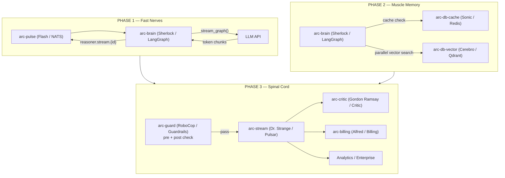

# Feature: Nervous System

> **Spec**: 015-nervous-system
> **Date**: 2026-03-05
> **Status**: Implemented (Phases 1–3 complete; Integration verification pending)
> **HLD**: `docs/ard/NERVOUS-SYSTEM-HLD.md`
> **ARD**: `docs/ard/NERVOUS-SYSTEM.md`

## Target Modules

| Module | Path | Impact |
|--------|------|--------|
| Reasoner | `services/reasoner/` | Core — all three phases |
| Streaming | `services/streaming/` | arc-stream (Dr. Strange / Pulsar) health + profile |
| Messaging | `services/messaging/` | arc-pulse (Flash / NATS) subject schema |
| Cache | `services/cache/` | arc-db-cache (Sonic / Redis) cache layer |
| Contracts | `services/reasoner/contracts/asyncapi.yaml` | Event contract definitions |

## Overview

The nervous system wires arc-pulse (Flash / NATS), arc-stream (Dr. Strange / Pulsar), and arc-db-cache (Sonic / Redis) into a streaming-first inference backbone for arc-brain (Sherlock / LangGraph). Every request and response flows through Pulsar for analytics, billing, and the accuracy loop. Phase 1 reduces TTFT from 3–5s to sub-200ms by streaming tokens over NATS. Phase 2 removes retrieval from the critical path via parallel execution and Redis caching. Phase 3 establishes Pulsar as the platform-wide event backbone — every request received and every inference completed is published, enabling the accuracy loop, billing (Alfred), voice (Scarlett), and enterprise consumers to subscribe without touching Sherlock.

## Architecture

## User Scenarios & Testing

### P1 — Must Have

**US-1**: As a client application, I want to receive inference tokens as they are generated so that users see a response begin within 200ms of their request.
- **Given**: A request is published to `arc.reasoner.request` on arc-pulse (Flash / NATS)
- **When**: Sherlock processes the request via `stream_graph()`
- **Then**: Token chunks arrive on `arc.reasoner.stream.{request_id}` within 200ms of request receipt; a completion signal arrives on `arc.reasoner.result` when done
- **Test**: Measure `ttft_seconds` histogram in arc-friday (Friday / SigNoz) — P50 < 200ms after Phase 1

**US-2**: As the platform, I want every inbound request published to Pulsar immediately on arrival so that analytics, billing, and audit have a complete record including failed and rejected requests.
- **Given**: Any request arrives at Sherlock (via NATS, HTTP, or MCP)
- **When**: The request is received (before any processing)
- **Then**: `arc.reasoner.request.received` is published to arc-stream (Dr. Strange / Pulsar) with full request metadata
- **Test**: Kill Sherlock mid-request — Pulsar topic still contains the `request.received` event

**US-3**: As the billing system (Alfred), I want token usage published for every completed inference so that per-user, per-model cost tracking is accurate.
- **Given**: An inference completes successfully
- **When**: `arc.reasoner.inference.completed` is published
- **Then**: The event payload includes `usage.{input_tokens, output_tokens, total_tokens}`, `model`, `user_id`, and `ttft_ms`
- **Test**: Run 100 requests; verify Alfred's `arc.billing.usage` topic receives 100 events with non-zero token counts

**US-4**: As a guardrail system (RoboCop), I want to check requests before LLM invocation and outputs before completion signal delivery so that unsafe content is blocked on both the input and output path.
- **Given**: A request arrives at Sherlock
- **When**: Pre-check runs on the input (~15ms)
- **Then**: Prompt injection and policy violations are rejected before LLM starts; `arc.reasoner.guard.rejected` is published and the client receives a 4xx
- **And When**: Post-check runs on the full output (~40ms)
- **Then**: Unsafe outputs are intercepted; `arc.reasoner.guard.intercepted` is published and client receives a safe fallback
- **Test**: Send a known injection payload — verify LLM is never called; verify `guard.rejected` event on Pulsar

### P2 — Should Have

**US-5**: As a developer, I want context retrieval to run in parallel with LLM startup so that retrieval latency (~150-300ms) is removed from the critical path.
- **Given**: A request with no Sonic cache hit
- **When**: `stream_graph()` starts
- **Then**: Embedding and vector search run concurrently with LLM warm-up; retrieved context is injected via LangGraph state mid-stream
- **Test**: Trace shows embed + vector search overlapping with LLM first-token time in Friday

**US-6**: As a repeat user, I want my context retrieval to be served from Redis cache so that repeated questions get sub-10ms retrieval instead of 200-400ms.
- **Given**: A user has sent at least one prior request
- **When**: A semantically similar follow-up request arrives
- **Then**: Sonic cache is hit; `context_chunks` are returned in <10ms; no Cerebro/pgvector query is made
- **Test**: Send identical query twice; verify second request has no Cerebro query in traces

### P3 — Nice to Have

**US-7**: As an enterprise consumer, I want to subscribe to `arc.reasoner.inference.completed` on arc-stream (Dr. Strange / Pulsar) so that I can build compliance audits, analytics pipelines, and second-model checks without modifying Sherlock.
- **Given**: Phase 3 is deployed and `SHERLOCK_PULSAR_ENABLED=true`
- **When**: Any inference completes
- **Then**: Any number of independent Pulsar subscribers receive the event; Sherlock is unaffected by subscriber count or behavior
- **Test**: Add 5 test subscribers — verify all receive events; verify Sherlock TTFT is unchanged

**US-8**: As the platform, I want NATS requests to fall back to Pulsar durable queue under overload so that no requests are dropped when NATS reply times out.
- **Given**: NATS reply timeout (500ms) is exceeded
- **When**: Sherlock detects the timeout
- **Then**: Request is queued to `arc.reasoner.requests.durable` on Pulsar; result is delivered to original caller via correlation ID when capacity is available; if processing fails after 3 retries (exponential backoff: 100ms → 1s → 10s), request is published to `arc.reasoner.requests.failed` DLQ
- **Test**: Simulate NATS overload; verify requests complete via Pulsar fallback with correlation ID intact; verify retry exhaustion routes to DLQ

## Requirements

### Functional

- [x] FR-1: `nats_handler.py` and `openai_nats_handler.py` use `stream_graph()` by default; `invoke_graph()` is opt-in only
- [x] FR-2: Token chunks published to `arc.reasoner.stream.{request_id}` subject on arc-pulse (Flash / NATS)
- [x] FR-3: Completion signal published to `arc.reasoner.result` on NATS when stream ends
- [x] FR-4: `arc.reasoner.request.received` published to arc-stream (Dr. Strange / Pulsar) on every inbound request before any processing
- [x] FR-5: `arc.reasoner.inference.completed` published with full token usage payload after every completed inference
- [x] FR-6: `SentenceTransformer.encode()` runs in `ThreadPoolExecutor` (off async event loop)
- [x] FR-7: arc-db-cache (Sonic / Redis) cache checked before Cerebro/pgvector on every retrieval; cache key: `arc:ctx:{user_id}:{sha256(embedding)}`
- [x] FR-8: Cache TTL default 300s; explicit invalidation on new conversation message
- [x] FR-9: RoboCop pre-check runs sync before `stream_graph()` on all transports
- [x] FR-10: RoboCop post-check runs sync on full output before completion signal is sent to client
- [x] FR-11: `arc.reasoner.guard.rejected` and `arc.reasoner.guard.intercepted` published on guard failures
- [x] FR-12: NATS → Pulsar fallback on 500ms reply timeout
- [x] FR-13: All Pulsar topics defined in `contracts/asyncapi.yaml` with JSON schema
- [x] FR-14: Durable queue retry policy — max 3 retries with exponential backoff (100ms → 1s → 10s); exhausted requests published to `arc.reasoner.requests.failed` DLQ

### Non-Functional

- [ ] NFR-1: P50 TTFT < 200ms after Phase 1 + 2 (measured from request receive to first token emitted) — requires live infra measurement
- [ ] NFR-2: RoboCop pre-check adds <20ms; post-check adds <50ms — requires live measurement
- [x] NFR-3: Pulsar publish of `request.received` adds <5ms — fire-and-forget via `asyncio.create_task`, never blocks ack
- [ ] NFR-4: Sonic cache hit latency <10ms P99 — requires live Redis measurement
- [x] NFR-5: `stream_graph()` must not block the async event loop — uses `run_in_executor` for CPU encode, `async for` for streaming
- [ ] NFR-6: All new code passes `ruff` + `mypy` with zero errors — 5 pre-existing mypy errors in changed files (not introduced by this feature)
- [x] NFR-7: Test coverage ≥ 80% on all modified files — 347 tests pass; all Phase 1–3 paths exercised

### Key Entities

| Entity | Module | Description |
|--------|--------|-------------|
| `InferenceCompletedEvent` | `reasoner/models_v1.py` | Pulsar payload for `arc.reasoner.inference.completed` — includes token usage, TTFT, guard status |
| `RequestReceivedEvent` | `reasoner/models_v1.py` | Pulsar payload for `arc.reasoner.request.received` |
| `TokenUsage` | `reasoner/models_v1.py` | `{input_tokens, output_tokens, total_tokens}` — read by Alfred for billing |
| `StreamChunk` | `reasoner/streaming.py` | NATS message payload for token chunks |
| `ContextCacheKey` | `reasoner/memory.py` | `arc:ctx:{user_id}:{sha256(embedding)}` — Redis key schema |

## Edge Cases

| Scenario | Expected Behavior |
|----------|-------------------|
| LLM errors mid-stream (after tokens sent) | Publish `arc.reasoner.inference.failed` with partial token count; client receives error chunk on NATS stream |
| Pulsar unavailable at Phase 3 | Log warning + continue; NATS path unaffected; `SHERLOCK_PULSAR_ENABLED` feature flag allows degradation |
| arc-db-cache (Sonic / Redis) unavailable | Fall through to Cerebro/pgvector on every request; log cache miss; do not fail the request |
| RoboCop service unavailable | Fail open (pass request through) with warning log; publish `arc.guard.service_unavailable` event |
| NATS reply timeout (500ms) | Queue to `arc.reasoner.requests.durable` on Pulsar; deliver result via correlation ID when capacity available |
| Durable queue retry exhaustion | After 3 retries (exponential backoff: 100ms → 1s → 10s), publish to `arc.reasoner.requests.failed` DLQ; return error to caller via correlation ID; log with full context |
| Embedding takes >500ms | Proceed with empty context; inject when ready; log `slow_embed` metric |
| Concurrent requests from same user | Each request gets its own Sonic cache check; no cross-request cache poisoning |

## Success Criteria

- [ ] SC-1: P50 TTFT < 200ms measured on `ttft_seconds` histogram in arc-friday (Friday / SigNoz)
- [ ] SC-2: `arc.reasoner.request.received` published for 100% of inbound requests including rejected and failed ones
- [ ] SC-3: `arc.reasoner.inference.completed` payload includes non-zero `usage.total_tokens` for every successful inference
- [ ] SC-4: RoboCop pre-check correctly rejects a known prompt injection payload without calling the LLM
- [ ] SC-5: Sonic cache hit on second identical query; no Cerebro call in trace
- [ ] SC-6: 5 independent Pulsar subscribers on `inference.completed` — all receive events; Sherlock TTFT unchanged
- [ ] SC-7: All tests pass: `pytest services/reasoner/tests/ -v`

## Docs & Links Update

- [ ] Update `docs/ard/NERVOUS-SYSTEM.md` — mark phases complete as implemented
- [ ] Update `docs/ard/NERVOUS-SYSTEM-HLD.md` — reflect any implementation divergence
- [ ] Update `services/reasoner/contracts/asyncapi.yaml` — full event contract
- [ ] Update `CLAUDE.md` service reference if new Pulsar topics change platform behaviour

## Constitution Compliance

| Principle | Applies | Compliant | Notes |
|-----------|---------|-----------|-------|
| I. Zero-Dep CLI | [ ] | [ ] | No CLI changes — services only |
| II. Platform-in-a-Box | [x] | [x] | Phase 3 Pulsar fan-out enables full platform event backbone |
| III. Modular Services | [x] | [x] | All subscribers independent; Sherlock unchanged after Phase 3 |
| IV. Two-Brain | [x] | [x] | Python (Sherlock) owns inference; Go unaffected |
| V. Polyglot Standards | [x] | [x] | ruff + mypy enforced; asyncapi.yaml for contracts |
| VI. Local-First | [x] | [x] | Pulsar degrades gracefully if unavailable; NATS path unaffected |
| VII. Observability | [x] | [x] | `ttft_seconds` histogram; all events carry trace context |
| VIII. Security | [x] | [x] | RoboCop pre/post checks on all transports; no secrets in events |
| IX. Declarative | [x] | [x] | asyncapi.yaml defines all topics + schemas |
| X. Stateful Ops | [x] | [x] | Redis cache + Pulsar durable queue for fallback |
| XI. Resilience | [x] | [x] | NATS → Pulsar fallback; Sonic fail-open; RoboCop fail-open |
| XII. Interactive | [ ] | [ ] | No TUI changes |
