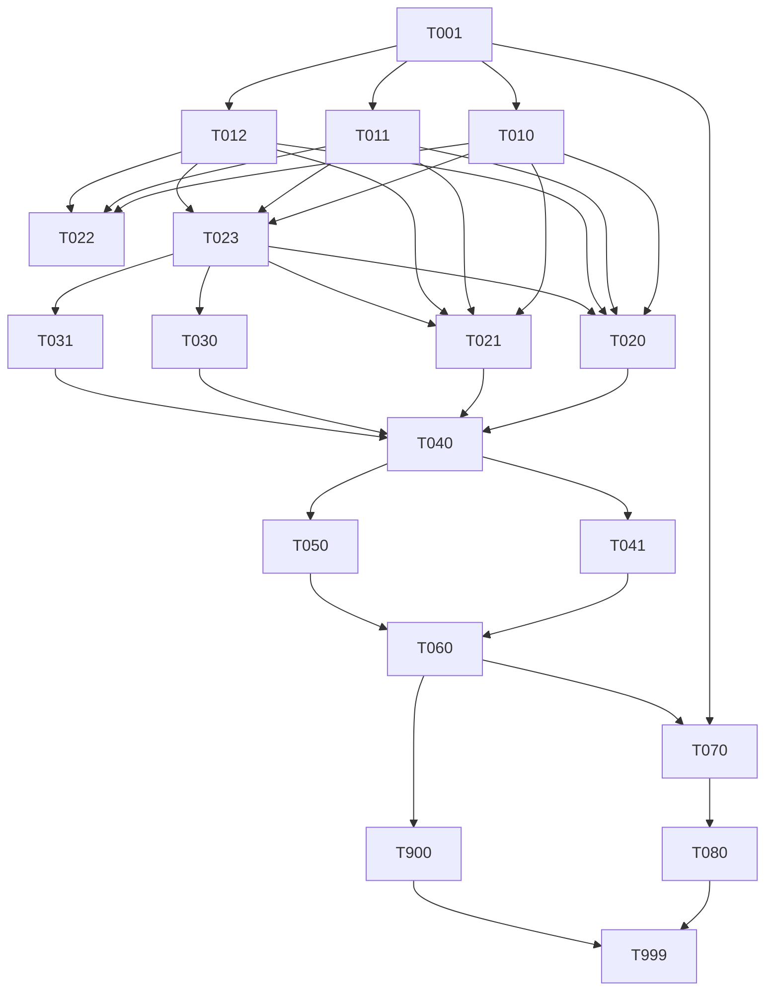

# Analysis Report: Voice System

> **Feature**: 016-voice-system
> **Date**: 2026-03-07 (rev 3 — all blockers and gaps resolved)
> **Status**: READY — all blockers resolved, implementation can proceed

---

## Resolution Summary

| Finding | Fix Applied | File |
|---------|-------------|------|
| BLOCKER-1 (pulsar-client wheel) | Pinned `pulsar-client==3.10.0`; cp313 wheels verified for macOS, manylinux, musllinux, Windows | tasks.md TASK-001 |
| BLOCKER-2 (worker shutdown) | Added 5 s cancellation timeout, ordered teardown (worker → Pulsar → NATS), integration test checkpoint | tasks.md TASK-050 |
| BLOCKER-3 (NATS timeout) | `VOICE_BRIDGE_TIMEOUT_MS` in TASK-010; error_type mapping in TASK-040 | tasks.md (inline) |
| BLOCKER-4 (service.yaml port) | Added `port: 8803` and piper binary path to TASK-001 acceptance | tasks.md TASK-001 |
| GAP-1 (ErrorResponse) | Added inline to TASK-023 | tasks.md |
| GAP-2 (HealthCheckResponse) | Added inline to TASK-023 | tasks.md |
| GAP-3 (coverage targets) | Added per-module targets to TASK-999 | tasks.md |
| GAP-4 (auth delegation) | Added note to FR-2/FR-3 | spec.md |
| GAP-5 (Pulsar retention) | Added NFR-8 (7-day default retention) | spec.md |
| MISSING-1 (latency test) | Added TASK-041 [P] — p95 ≤ 1550 ms benchmark | tasks.md |
| WARN-3 (error_type Literal) | Added inline to TASK-040 | tasks.md |
| WARN-4 (NATS subject) | TASK-010 references Spec 015 final state | tasks.md |

---

## Coverage Matrix

| Req ID | Description | Plan Section | Task ID | Status |
|--------|-------------|--------------|---------|--------|
| FR-1 | Create `services/voice/` scaffold | Target Modules | TASK-001 | OK |
| FR-2 | `POST /v1/audio/transcriptions` | REST APIs | TASK-020 | OK — auth delegation noted |
| FR-3 | `POST /v1/audio/speech` | REST APIs | TASK-021 | OK — auth delegation noted |
| FR-4 | Health endpoints | Health Router | TASK-022 | OK — schemas in TASK-023 |
| FR-5 | LiveKit worker | Room Mode | TASK-040 | OK |
| FR-6 | Bridge voice → reasoner | Room Mode | TASK-030 | OK |
| FR-7 | Publish durable events | Events | TASK-031 | OK |
| FR-8 | Contracts (OpenAPI + AsyncAPI) | Contracts | TASK-060 | OK |
| FR-9 | Add voice to `reason` profile | Infra | TASK-070 | OK |
| FR-10 | OTEL observability | Observability | TASK-012 + routers | OK |
| FR-11 | CI/release workflows | Infra | TASK-080 | OK |
| FR-12 | Reuse realtime infra | Dependencies | — (no new work) | OK |
| NFR-1 | Non-root container | Constitution VIII | TASK-001 | OK |
| NFR-2 | Default = no external creds | Constitution VI | TASK-010, 020, 021 | OK |
| NFR-3 | Health checks (degraded not 500) | Health Router | TASK-022 | OK |
| NFR-4 | OTEL latency metrics | Observability | TASK-012 + routers | OK |
| NFR-5 | No secrets/audio in events | Security | TASK-023, TASK-031 | OK |
| NFR-6 | Async contract uses streaming | Event Design | TASK-031, TASK-060 | OK |
| NFR-7 | ruff + mypy + pytest | Quality | All Python tasks | OK |
| NFR-8 | 7-day Pulsar retention | Events | TASK-031, TASK-060 | OK — added |
| SC-1 | Boots in `reason` profile | Infra | TASK-070 | OK |
| SC-2 | Transcriptions endpoint valid | REST | TASK-020 | OK |
| SC-3 | Speech endpoint streams WAV | REST | TASK-021 | OK |
| SC-4 | Room turn 750–1550 ms | Room Mode | TASK-041 | OK — added |
| SC-5 | Events on arc-streaming | Events | TASK-031 | OK |
| SC-6 | OTEL spans per turn | Observability | TASK-012 + TASK-040 | OK |
| SC-7 | Local providers, no cloud creds | Local-First | TASK-020, TASK-021 | OK |

---

## Parallel Opportunities

- Phase 2 (TASK-010/011/012/023): fully parallel [4 agents]
- Phase 3 Batch A (TASK-020/021/022): fully parallel [3 agents]
- Phase 3 Batch B (TASK-030/031): fully parallel [2 agents]
- Phase 4 (TASK-041 + TASK-050): parallel after TASK-040 [2 agents]
- Phase 5 (TASK-070 + TASK-080): parallel [2 agents]; TASK-070 can start as early as TASK-001 completes
- Phase 6 (TASK-900): starts after TASK-060

Total: **18 tasks, 15 parallelizable.**

---

## Constitution Compliance

| # | Principle | Status | Evidence |
|---|-----------|--------|----------|
| I | Zero-Dep CLI | N/A | No CLI changes |
| II | Platform-in-a-Box | WARNING (justified) | `reason` profile only; model footprint too large for `think`; documented in plan.md + TASK-999 |
| III | Modular Services | PASS | `services/voice/` self-contained |
| IV | Two-Brain | PASS | Python owns speech intelligence; Go infra untouched |
| V | Polyglot Standards | PASS | FastAPI + ruff + mypy + pytest |
| VI | Local-First | PASS | `faster-whisper` + `piper` defaults; no cloud creds |
| VII | Observability | PASS | OTEL histograms per stage; `/health` + `/health/deep` |
| VIII | Security | PASS | Non-root Dockerfile; no secrets/audio in events or logs |
| IX | Declarative | PASS | openapi.yaml + asyncapi.yaml are source of truth |
| X | Stateful Ops | N/A | CLI-only principle |
| XI | Resilience | PASS | Graceful degradation for cache/storage; VoiceTurnFailedEvent for all error paths |
| XII | Interactive | N/A | No TUI scope |

**No violations. Constitution II WARNING is justified and documented.**

---

## Final Assessment

**READY. All blockers and gaps resolved. Proceed to `/speckit.implement`.**

18 tasks total, 15 of which are parallelizable. No architectural rework needed.
