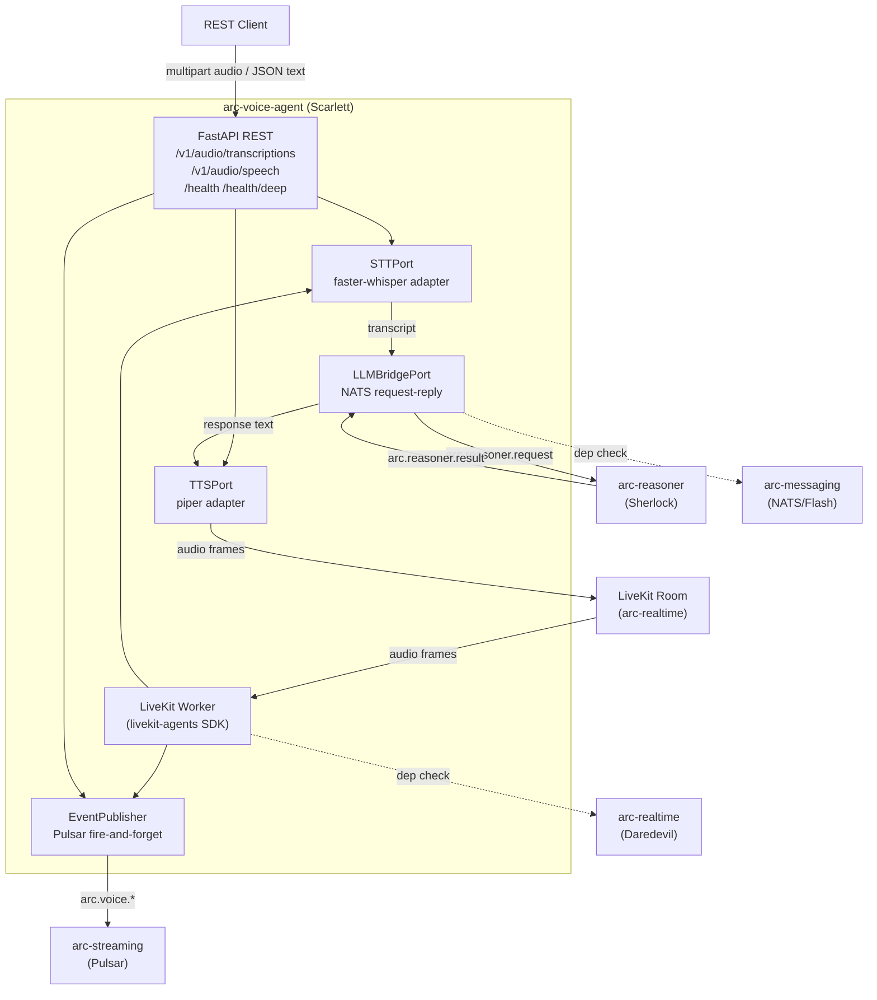
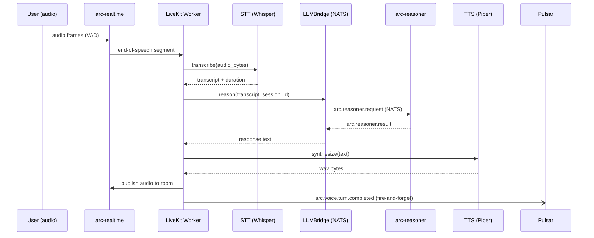
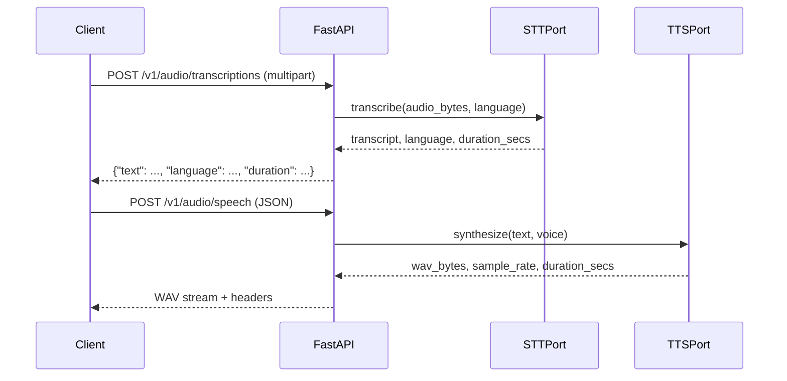
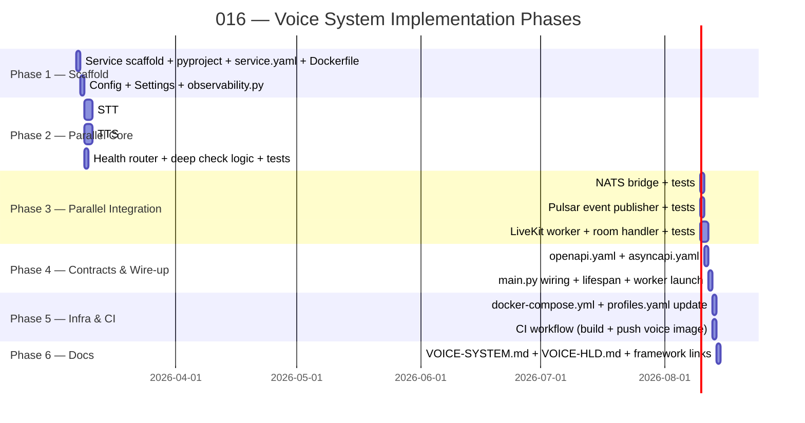

# Implementation Plan: Voice System

> **Spec**: 016-voice-system
> **Date**: 2026-03-07

## Summary

Build `services/voice/` as `arc-voice-agent` (Scarlett) — a Python FastAPI service that exposes OpenAI-compatible STT/TTS REST APIs, runs a LiveKit worker for room-based voice sessions, and bridges all reasoning turns to `arc-reasoner` over NATS. Scarlett publishes durable voice lifecycle events to `arc-streaming` (Pulsar) for analytics and billing. Local-first by default: `faster-whisper` for STT, `piper` for TTS.

## Target Modules

| Module | Language | Changes |
|--------|----------|---------|
| `services/voice/` | Python | New — `arc-voice-agent` service scaffold, src, tests, contracts |
| `services/profiles.yaml` | YAML | Add `voice` to `reason` profile |
| `.github/workflows/` | YAML | New voice image build + release workflow |
| `docs/ard/` | MDX | New `VOICE-SYSTEM.md`, update `VOICE-HLD.md` |

## Technical Context

| Aspect | Value |
|--------|-------|
| Language | Python 3.13+ |
| Framework | FastAPI + uvicorn |
| LiveKit | `livekit-agents` SDK (worker mode) |
| STT (default) | `faster-whisper` (local, offline) |
| TTS (default) | `piper-tts` (local, offline) |
| Reasoning bridge | NATS request-reply → `arc.reasoner.request` |
| Async events | Pulsar → `arc.voice.*` topics |
| Observability | OTEL — `opentelemetry-api/sdk` + histogram per pipeline stage |
| Linting | `ruff` + `mypy` |
| Testing | `pytest` + `pytest-asyncio` |
| Packaging | `uv` + `pyproject.toml` |
| Pattern baseline | Mirror `services/reasoner/` layout |

## Architecture

### Component Overview



### Turn Sequence (Room Mode)



### REST Turn Sequence



## Constitution Check

| # | Principle | Status | Evidence |
|---|-----------|--------|----------|
| I | Zero-Dep CLI | N/A | No CLI changes |
| II | Platform-in-a-Box | WARNING (justified) | Voice model footprint too heavy for `think`; `reason` profile only — documented |
| III | Modular Services | PASS | `services/voice/` is self-contained with own `service.yaml`, Dockerfile, health checks |
| IV | Two-Brain | PASS | Python owns speech intelligence; Go infra untouched |
| V | Polyglot Standards | PASS | FastAPI + ruff + mypy + pytest — mirrors reasoner baseline |
| VI | Local-First | PASS | `faster-whisper` + `piper` default; no cloud credentials required |
| VII | Observability | PASS | OTEL histograms (stt_latency, bridge_latency, tts_latency, turn_latency); `/health` + `/health/deep` |
| VIII | Security | PASS | Non-root container; no secrets/audio in events; no raw audio in logs |
| IX | Declarative | PASS | `contracts/openapi.yaml` + `contracts/asyncapi.yaml` are source of truth |
| X | Stateful Ops | N/A | CLI-only principle; session lifecycle tracked via Pulsar events |
| XI | Resilience | PASS | `arc-realtime` unavailable → REST still boots; `arc-messaging` down → fail-fast + event; cache/storage fail-open |
| XII | Interactive | N/A | No TUI scope |

## Project Structure

```
services/voice/
├── service.yaml                    # arc-voice-agent metadata, deps, health
├── Dockerfile                      # non-root, multi-stage, mirrors reasoner
├── docker-compose.yml              # local dev compose override
├── pyproject.toml                  # arc-voice-agent package, deps
├── uv.lock                         # pinned lockfile
├── voice.mk                        # Makefile targets (build, test, lint)
├── contracts/
│   ├── openapi.yaml                # STT + TTS + health endpoints
│   └── asyncapi.yaml               # arc.voice.* Pulsar topics
└── src/voice/
    ├── __init__.py
    ├── main.py                     # FastAPI app factory, lifespan, OTEL setup
    ├── config.py                   # Settings (pydantic-settings, 12-factor)
    ├── models_v1.py                # Pydantic I/O models + event schemas
    ├── observability.py            # OTEL tracer, meter, histograms
    ├── interfaces.py               # STTPort, TTSPort, LLMBridgePort (Protocol)
    ├── health_router.py            # GET /health, GET /health/deep
    ├── stt_router.py               # POST /v1/audio/transcriptions
    ├── tts_router.py               # POST /v1/audio/speech
    ├── worker.py                   # LiveKit worker entrypoint + room handler
    ├── nats_bridge.py              # LLMBridgePort impl — NATS request-reply
    ├── pulsar_events.py            # EventPublisher — Pulsar fire-and-forget
    └── providers/
        ├── __init__.py
        ├── stt_whisper.py          # faster-whisper STTPort adapter
        ├── stt_openai.py           # OpenAI STT adapter (optional)
        ├── tts_piper.py            # piper-tts TTSPort adapter
        └── tts_openai.py           # OpenAI TTS adapter (optional)
tests/
├── conftest.py                     # fixtures: mock NATS, mock Pulsar, mock providers
├── test_stt_router.py
├── test_tts_router.py
├── test_health_router.py
├── test_nats_bridge.py
├── test_pulsar_events.py
├── test_worker.py                  # LiveKit worker logic (mocked room)
└── test_providers/
    ├── test_stt_whisper.py
    └── test_tts_piper.py
```

## Key Design Decisions

### Ports & Adapters (Hexagonal)
`STTPort`, `TTSPort`, `LLMBridgePort` are `typing.Protocol` interfaces in `interfaces.py` — same pattern as reasoner's `interfaces.py`. Providers are injected at startup via `config.py` provider selection, enabling easy adapter swap (local → cloud) without touching orchestration logic.

### NATS Bridge vs. Direct HTTP
The `LLMBridgePort` uses NATS request-reply (same `arc.reasoner.request` subject) rather than HTTP, matching the low-latency path already used by Sherlock's `nats_handler.py`. This avoids introducing a direct HTTP service-to-service dependency and reuses the existing NATS queue group.

### Pulsar Events — Fire and Forget
Event publishing to `arc-streaming` is always fire-and-forget using `asyncio.create_task()`. A publishing failure never blocks the room response path (mirrors reasoner's `pulsar_handler.py` pattern from Spec 015).

### Worker Mode
The LiveKit worker runs as a background task within the same FastAPI process (using `livekit-agents` dispatch mode). This avoids a separate process, simplifies deployment, and shares the OTEL context.

### Provider Configuration
```
VOICE_STT_PROVIDER=faster-whisper   # or: openai
VOICE_TTS_PROVIDER=piper            # or: openai
VOICE_BRIDGE_NATS_SUBJECT=arc.reasoner.request
VOICE_LIVEKIT_URL=ws://arc-realtime:7880
VOICE_LIVEKIT_API_KEY=...
VOICE_LIVEKIT_API_SECRET=...
```

## Parallel Execution Strategy



**Parallelizable groups:**
- Phase 2: STT track / TTS track / Health track — fully independent
- Phase 3: NATS bridge / Pulsar events — independent; LiveKit worker depends on both STT + NATS
- Phase 5: CI workflow / compose/profiles — independent
- Phase 6: Docs can start as soon as contracts are stable

## Reviewer Checklist

- [ ] All tasks in tasks.md completed
- [ ] `uv run python -m pytest tests/ -q` passes in `services/voice/`
- [ ] `uv run ruff check src/` passes (zero warnings)
- [ ] `uv run mypy src/` passes (strict)
- [ ] `services/voice/` starts without external credentials (local providers)
- [ ] `GET /health` returns 200 when process is alive
- [ ] `GET /health/deep` returns degraded (not 500) when `arc-realtime` is down
- [ ] `POST /v1/audio/transcriptions` returns valid JSON with transcript + metadata
- [ ] `POST /v1/audio/speech` returns WAV bytes with correct headers
- [ ] Voice events publish to Pulsar without blocking room path
- [ ] `voice` appears in `reason` profile in `profiles.yaml`
- [ ] `service.yaml` has correct `depends_on` and health check
- [ ] `Dockerfile` uses non-root user
- [ ] `contracts/openapi.yaml` and `contracts/asyncapi.yaml` are valid
- [ ] No secrets, raw audio, or PII in log output or event payloads
- [ ] OTEL spans visible for STT, NATS bridge, and TTS per turn
- [ ] Constitution II WARNING documented (reason-profile-only, model footprint)

## Risks & Mitigations

| Risk | Impact | Mitigation |
|------|--------|------------|
| `faster-whisper` cold start adds 2–5 s to first STT request | M | Model pre-load at startup (lifespan); emit latency metric; health check does not wait for model |
| `piper` binary path varies by platform/container | M | Resolve `piper` path from env var `VOICE_PIPER_BIN`; Dockerfile installs to known path |
| LiveKit `livekit-agents` dispatch model may conflict with FastAPI event loop | H | Run worker via `asyncio.create_task()` in lifespan; verify uvicorn + livekit-agents compatibility in tests |
| NATS bridge subject migration (`reasoner.request` → `arc.reasoner.request`) | L | Bridge subject is env-configurable; default matches current Sherlock subject |
| `pulsar-client` binary wheel unavailable for Python 3.13 | M | Mirror reasoner's Dockerfile multi-stage; pin pulsar-client version matching reasoner's uv.lock |
| Provider import errors for optional cloud adapters | L | Lazy imports inside provider adapters; ImportError surfaced at instantiation, not import time |
