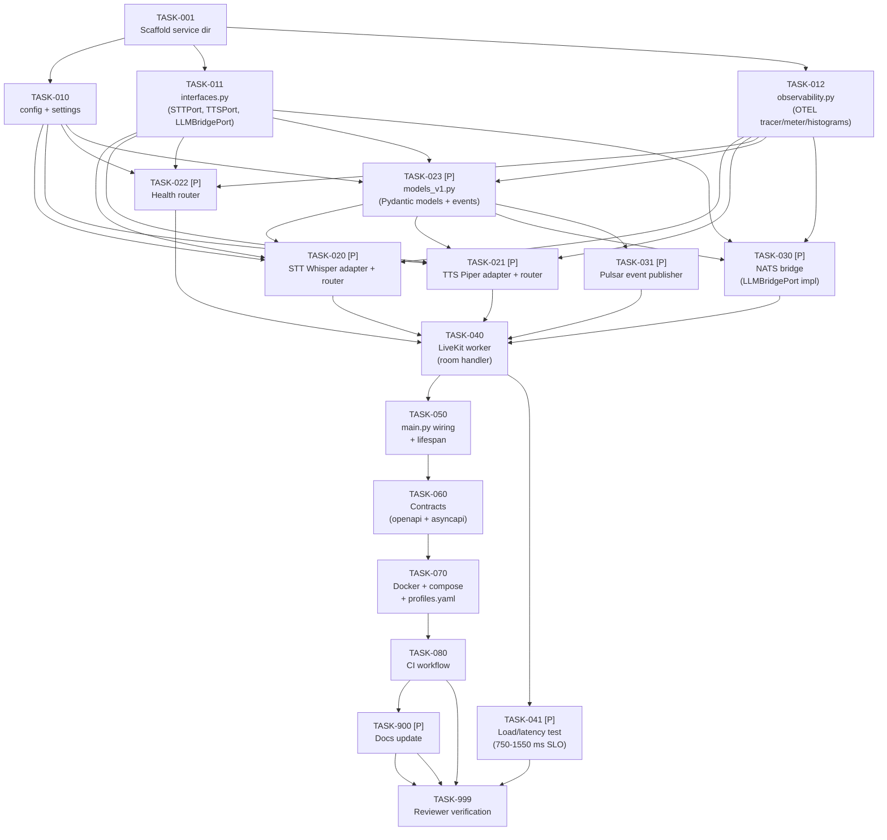

# Tasks: Voice System

> **Spec**: 016-voice-system
> **Date**: 2026-03-07

## Task Format

```
[TASK-NNN] [P?] [MODULE] [PRIORITY] Description
  Dependencies: [TASK-XXX] or none
  Module: services/voice/...
  Acceptance: Testable criteria
  Status: [ ] pending | [~] in-progress | [x] done
```

- `[P]` = Safe for parallel agent execution
- Priority: P1 (must), P2 (should), P3 (nice)

## Dependency Graph



## Quality Requirements

| Module | Coverage | Lint |
|--------|----------|------|
| `services/voice/` (Python) | 75% critical / 60% core / 40% infra | `ruff` + `mypy` |

---

## Phase 1: Setup

- [x] [TASK-001] [VOICE] [P1] Create `services/voice/` directory structure with service.yaml, Dockerfile, pyproject.toml, uv.lock placeholder, and voice.mk
  - Dependencies: none
  - Module: `services/voice/`
  - Acceptance: `services/voice/service.yaml` declares `name: arc-voice-agent`, `codename: scarlett`, `port: 8803`, correct `depends_on` (messaging, streaming, realtime, friday-collector, cache); Dockerfile uses non-root user, mirrors reasoner multi-stage build, and installs `piper` binary to `/usr/local/bin/piper`; `pyproject.toml` declares `arc-voice-agent` package with fastapi, uvicorn, pydantic-settings, livekit-agents, faster-whisper, piper-tts, nats-py, `pulsar-client==3.10.0` (matches `services/reasoner/uv.lock` — cp313 wheels verified for all target platforms), opentelemetry-api/sdk deps; `uv lock` runs cleanly

---

## Phase 2: Foundational

- [x] [TASK-010] [P] [VOICE] [P1] Implement `src/voice/config.py` — pydantic-settings `Settings` class with all env vars
  - Dependencies: TASK-001
  - Module: `services/voice/src/voice/config.py`
  - Acceptance: `Settings` covers `VOICE_STT_PROVIDER`, `VOICE_TTS_PROVIDER`, `VOICE_BRIDGE_NATS_SUBJECT` (default `arc.reasoner.request` — matches Spec 015 final state; see `services/reasoner/src/reasoner/nats_handler.py`), `VOICE_BRIDGE_TIMEOUT_MS` (default `10000`), `VOICE_LIVEKIT_URL`, `VOICE_LIVEKIT_API_KEY`, `VOICE_LIVEKIT_API_SECRET`, `VOICE_OTEL_ENDPOINT`, `VOICE_PORT` (default 8803), `VOICE_LOG_LEVEL`; all vars have sane defaults; `Settings()` instantiates with no env vars set

- [x] [TASK-011] [P] [VOICE] [P1] Implement `src/voice/interfaces.py` — `STTPort`, `TTSPort`, `LLMBridgePort` Protocol interfaces + result dataclasses
  - Dependencies: TASK-001
  - Module: `services/voice/src/voice/interfaces.py`
  - Acceptance: `STTPort.transcribe(audio_bytes, language) -> TranscriptResult` defined; `TTSPort.synthesize(text, voice) -> SynthesisResult` defined; `LLMBridgePort.reason(transcript, session_id, correlation_id) -> str` defined; `TranscriptResult` has `text`, `language`, `duration_secs`; `SynthesisResult` has `wav_bytes`, `sample_rate`, `duration_secs`; `mypy` passes on the file

- [x] [TASK-012] [P] [VOICE] [P1] Implement `src/voice/observability.py` — OTEL tracer, meter, and per-stage histograms
  - Dependencies: TASK-001
  - Module: `services/voice/src/voice/observability.py`
  - Acceptance: `setup_telemetry(settings)` configures OTEL exporter and returns tracer + meter; histograms defined: `voice.stt.latency_seconds`, `voice.tts.latency_seconds`, `voice.bridge.latency_seconds`, `voice.turn.latency_seconds`; `get_tracer()` / `get_meter()` accessors exported; works with no OTEL endpoint (no-op exporter fallback)

- [x] [TASK-023] [P] [VOICE] [P1] Implement `src/voice/models_v1.py` — Pydantic I/O models and event schemas
  - Dependencies: TASK-001
  - Module: `services/voice/src/voice/models_v1.py`
  - Acceptance: `TranscriptionRequest`, `TranscriptionResponse` (OpenAI-compatible: `text`, `language`, `duration`); `SpeechRequest` (`model`, `input`, `voice`, `response_format`); `VoiceSessionStartedEvent`, `VoiceSessionEndedEvent`, `VoiceTurnCompletedEvent`, `VoiceTurnFailedEvent` with `session_id`, `room_id`, `correlation_id`, `timestamp`, latency/duration fields; no secrets or audio payload fields; `mypy` passes
  - **GAP-1** `ErrorResponse(error_type: Literal['unsupported_format', 'provider_unavailable', 'invalid_input'], message: str, correlation_id: str)` — used by STT and TTS routers for 400/502 responses
  - **GAP-2** `HealthCheckDetail(status: Literal['ok', 'degraded', 'unhealthy'], reason: str | None, latency_ms: float | None)` and `HealthCheckResponse(status: Literal['ok', 'degraded', 'unhealthy'], checks: dict[str, HealthCheckDetail])` — used by `/health/deep`

---

## Phase 3: Implementation

### Parallel Batch A — REST Handlers

- [x] [TASK-020] [P] [VOICE] [P1] Implement faster-whisper STT adapter and `POST /v1/audio/transcriptions` router
  - Dependencies: TASK-010, TASK-011, TASK-012, TASK-023
  - Module: `services/voice/src/voice/providers/stt_whisper.py`, `services/voice/src/voice/stt_router.py`, `tests/test_stt_router.py`, `tests/test_providers/test_stt_whisper.py`
  - Acceptance: `WhisperSTTAdapter` implements `STTPort`; `POST /v1/audio/transcriptions` accepts multipart `file` field; returns JSON `{text, language, duration}`; rejects unsupported MIME types with typed 400; provider failure returns typed 502; OTEL span wraps transcription; tests pass with mocked Whisper model; `ruff` + `mypy` clean

- [x] [TASK-021] [P] [VOICE] [P1] Implement piper TTS adapter and `POST /v1/audio/speech` router
  - Dependencies: TASK-010, TASK-011, TASK-012, TASK-023
  - Module: `services/voice/src/voice/providers/tts_piper.py`, `services/voice/src/voice/tts_router.py`, `tests/test_tts_router.py`, `tests/test_providers/test_tts_piper.py`
  - Acceptance: `PiperTTSAdapter` implements `TTSPort`; `POST /v1/audio/speech` accepts JSON `{input, voice, model}`; returns `StreamingResponse` with `Content-Type: audio/wav`, `X-Duration-Seconds`, `X-Sample-Rate` headers; empty `input` returns 400; provider failure returns typed 502; OTEL span wraps synthesis; tests pass with mocked piper binary; `ruff` + `mypy` clean

- [x] [TASK-022] [P] [VOICE] [P1] Implement `GET /health` and `GET /health/deep` router
  - Dependencies: TASK-010, TASK-012
  - Module: `services/voice/src/voice/health_router.py`, `tests/test_health_router.py`
  - Acceptance: `GET /health` returns `{status: "ok"}` 200 when process is alive (no deps checked); `GET /health/deep` checks `arc-realtime` connectivity (LiveKit API ping) and `arc-messaging` connectivity (NATS ping); returns `{status: "degraded", checks: {...}}` with 200 when deps down (not 500); individual check failures report reason; tests cover all combinations; `ruff` + `mypy` clean

### Parallel Batch B — Messaging

- [ ] [TASK-030] [P] [VOICE] [P1] Implement NATS bridge (`LLMBridgePort` impl) for reasoner request-reply
  - Dependencies: TASK-011, TASK-012, TASK-023
  - Module: `services/voice/src/voice/nats_bridge.py`, `tests/test_nats_bridge.py`
  - Acceptance: `NATSBridge` implements `LLMBridgePort`; publishes to `VOICE_BRIDGE_NATS_SUBJECT` with `request_id` correlation; awaits `arc.reasoner.result` reply with configurable timeout; on timeout or `arc.reasoner.error` raises typed `BridgeError`; OTEL span wraps the round-trip; `_nc` connection shared via lifespan; tests use mock NATS server or `AsyncMock`; `ruff` + `mypy` clean

- [ ] [TASK-031] [P] [VOICE] [P1] Implement Pulsar event publisher (fire-and-forget) for voice lifecycle events
  - Dependencies: TASK-023
  - Module: `services/voice/src/voice/pulsar_events.py`, `tests/test_pulsar_events.py`
  - Acceptance: `VoiceEventPublisher` wraps Pulsar client; exposes `publish_session_started`, `publish_session_ended`, `publish_turn_completed`, `publish_turn_failed`; each wraps `asyncio.create_task()` so publishing never blocks caller; Pulsar unavailability logs warning and returns without raising; event payloads match `models_v1.py` schemas; no secrets or audio bytes in payloads; tests verify fire-and-forget behaviour (await `asyncio.sleep(0)` to drain); `ruff` + `mypy` clean

---

## Phase 4: Integration

- [ ] [TASK-040] [VOICE] [P1] Implement LiveKit worker — VAD → STT → NATSBridge → TTS → room audio
  - Dependencies: TASK-020, TASK-021, TASK-030, TASK-031
  - Module: `services/voice/src/voice/worker.py`, `tests/test_worker.py`
  - Acceptance: `VoiceWorker` connects to LiveKit room as agent; VAD detects end-of-speech; calls `STTPort.transcribe()`; calls `LLMBridgePort.reason()`; calls `TTSPort.synthesize()`; publishes audio frames back to room; publishes `VoiceTurnCompletedEvent` on success and `VoiceTurnFailedEvent` on any exception; OTEL turn span wraps full pipeline; room failure publishes failure event and logs without crashing worker loop; tests mock LiveKit room and all ports; `ruff` + `mypy` clean
  - **WARN-3** Exception → `error_type` mapping for `VoiceTurnFailedEvent`: `STTError` → `'stt_error'`; `BridgeError` with timeout → `'bridge_timeout'`; `BridgeError` with reasoner error → `'bridge_error'`; `TTSError` → `'tts_error'`; any other unhandled exception → `'unknown'`; `error_type` must be a `Literal` field in `VoiceTurnFailedEvent` (defined in TASK-023)

- [ ] [TASK-041] [P] [VOICE] [P2] Load and latency validation — confirm end-to-end turn budget (750–1550 ms) under concurrent rooms
  - Dependencies: TASK-040
  - Module: `tests/test_latency.py` (or `tests/test_load.py`)
  - Acceptance: Pytest benchmark or `locust` script simulates ≥3 concurrent room turns with mocked STT/TTS/NATS providers returning fixed-latency stubs; asserts p95 end-to-end turn latency ≤ 1550 ms across 50 iterations; OTEL histogram `voice.turn.latency_seconds` records each measurement; results logged to stdout for CI visibility; test is skipped (`pytest.mark.skip`) in short mode via `--no-load-test` flag

- [ ] [TASK-050] [VOICE] [P1] Implement `src/voice/main.py` — FastAPI app factory, lifespan, router registration, worker launch
  - Dependencies: TASK-040, TASK-022
  - Module: `services/voice/src/voice/main.py`
  - Acceptance: `create_app()` factory wires routers (STT, TTS, health); lifespan starts NATS connection, Pulsar client, OTEL, then launches `VoiceWorker` as `asyncio.create_task()`; lifespan teardown cancels `VoiceWorker` task with **5 s timeout** (log error and continue if exceeded), then closes Pulsar client, then closes NATS connection (shutdown order: worker → Pulsar → NATS); integration test: pytest fixture boots the full app with `httpx.AsyncClient(app=create_app(), ..., lifespan='on')` and confirms clean startup + teardown without deadlock; `uvicorn main:create_app()` starts without error with only local env vars set; `ruff` + `mypy` clean

---

## Phase 5: Contracts & Infrastructure

- [ ] [TASK-060] [P] [VOICE] [P1] Write `contracts/openapi.yaml` and `contracts/asyncapi.yaml`
  - Dependencies: TASK-050
  - Module: `services/voice/contracts/`
  - Acceptance: `openapi.yaml` documents `/v1/audio/transcriptions`, `/v1/audio/speech`, `/health`, `/health/deep` with request/response schemas matching `models_v1.py`; `asyncapi.yaml` documents `arc.voice.session.started`, `arc.voice.session.ended`, `arc.voice.turn.completed`, `arc.voice.turn.failed` topics with full payload schemas; both files are valid YAML; schemas match what the service actually produces

- [ ] [TASK-070] [P] [VOICE] [P1] Add docker-compose.yml, update `services/profiles.yaml` to add `voice` to `reason` profile
  - Dependencies: TASK-001
  - Module: `services/voice/docker-compose.yml`, `services/profiles.yaml`
  - Acceptance: `services/voice/docker-compose.yml` defines `arc-voice-agent` service with correct env vars, port (8803), `depends_on` (arc-realtime, arc-messaging, arc-streaming, arc-friday-collector, arc-cache), and health check; `services/profiles.yaml` `reason` profile includes `voice`; `ultra-instinct` profile still resolves correctly (uses `*`); `make dev PROFILE=reason` starts without compose errors

- [ ] [TASK-080] [P] [VOICE] [P2] Add CI workflow for voice image build, test, and release
  - Dependencies: TASK-001
  - Module: `.github/workflows/voice.yml`
  - Acceptance: Workflow triggers on push to `services/voice/**` and tags `voice/v*`; runs `uv run ruff check src/`, `uv run mypy src/`, `uv run python -m pytest tests/ -q`; builds and pushes `ghcr.io/arc-framework/arc-voice-agent` on tag; mirrors structure of existing service workflows

---

## Phase 6: Polish

- [ ] [TASK-900] [P] [DOCS] [P1] Create `docs/ard/VOICE-SYSTEM.md`, update `docs/ard/VOICE-HLD.md`, and link to framework doc
  - Dependencies: TASK-060
  - Module: `docs/ard/`
  - Acceptance: `VOICE-SYSTEM.md` documents service codename (Scarlett), ports (8803), dependencies, event topics, local provider defaults, and latency budget; `VOICE-HLD.md` updated with architecture diagram reflecting final implementation; `docs/ard/ARC-ENTERPRISE-AI-FRAMEWORK.md` links to voice system doc; all internal links resolve; no broken references

- [ ] [TASK-999] [REVIEW] [P1] Reviewer agent verification — validate all tasks complete, quality gates met
  - Dependencies: ALL
  - Module: all (`services/voice/`, `services/profiles.yaml`, `.github/workflows/`, `docs/ard/`)
  - Acceptance:
    - All TASK-001 through TASK-900 marked `[x]` done
    - `uv run python -m pytest tests/ -q` passes (zero failures) in `services/voice/`
    - `uv run ruff check src/` passes (zero warnings)
    - `uv run mypy src/` passes (no errors)
    - `GET /health` returns 200; `GET /health/deep` returns 200 or degraded (not 500) with realtime down
    - `POST /v1/audio/transcriptions` returns valid JSON with transcript + language + duration
    - `POST /v1/audio/speech` returns WAV stream with correct headers
    - `voice` present in `reason` profile in `profiles.yaml`
    - `service.yaml` has non-root Dockerfile, correct health check, correct depends_on
    - `contracts/openapi.yaml` and `contracts/asyncapi.yaml` are valid and consistent with implementation
    - No secrets, raw audio, or PII in any log output or event payload
    - Constitution II WARNING documented (reason-profile-only, model footprint)
    - **GAP-3** Per-module coverage targets met: `interfaces.py` ≥95%, `nats_bridge.py` ≥90%, `worker.py` ≥85%, `health_router.py` ≥80%, `stt_router.py` + `tts_router.py` ≥80%, `providers/*` ≥75%, `pulsar_events.py` ≥75%

---

## Progress Summary

| Phase | Total | Done | Parallel |
|-------|-------|------|----------|
| Setup | 1 | 0 | 0 |
| Foundational | 4 | 0 | 4 |
| Implementation | 5 | 0 | 5 |
| Integration | 3 | 0 | 1 |
| Contracts & Infra | 3 | 0 | 3 |
| Polish | 2 | 0 | 1 |
| **Total** | **18** | **0** | **14** |
