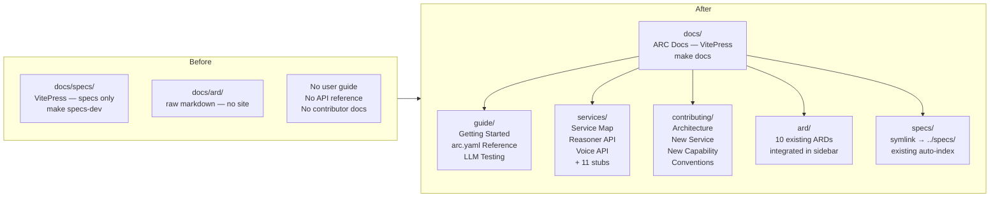
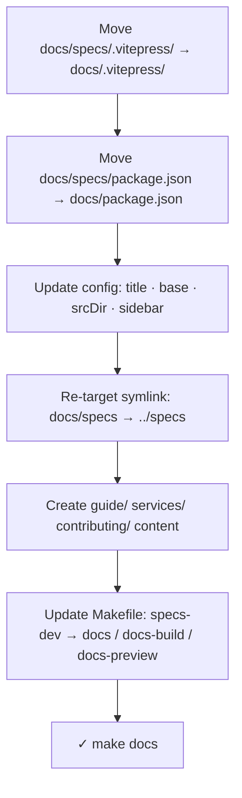
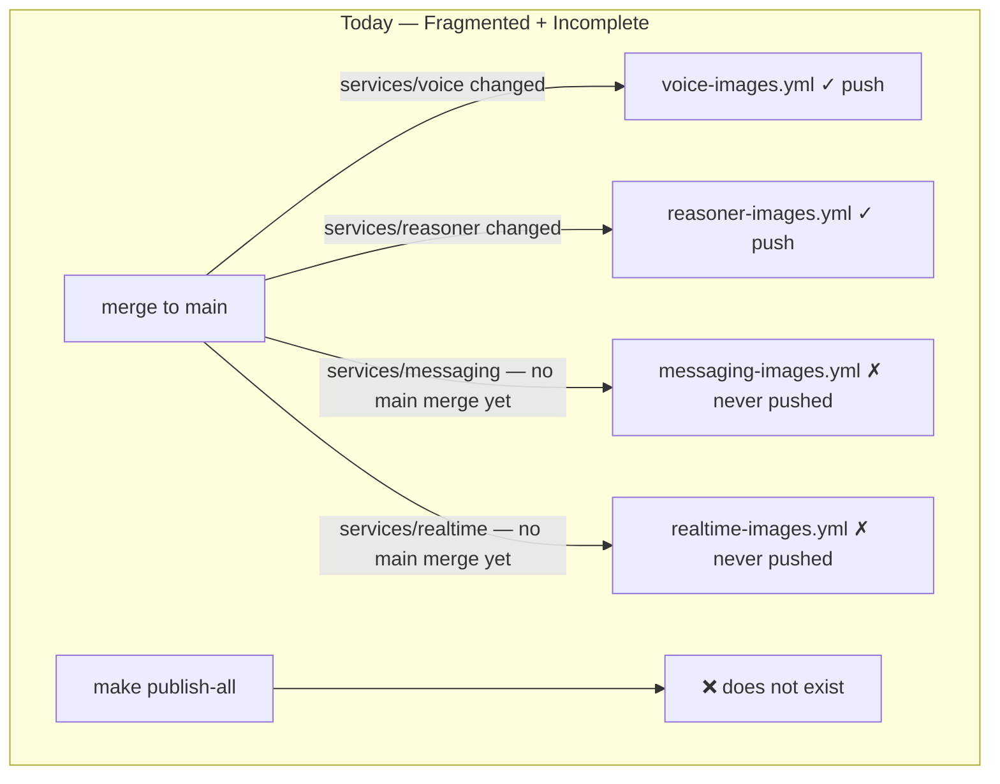
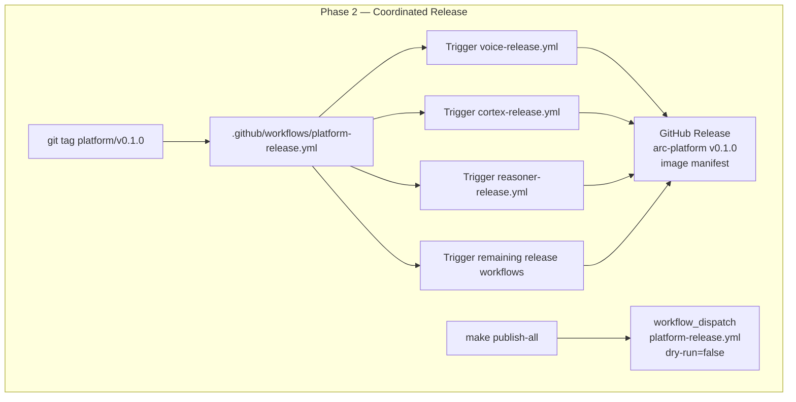
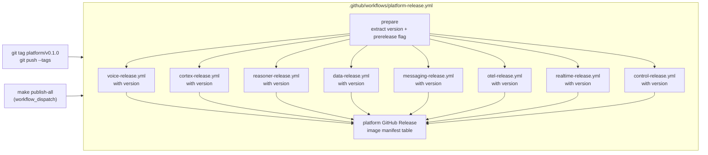

# Feature: pre-release — Unified Docs Site + Platform Release Pipeline

> **Spec**: 017-pre-release
> **Author**: arc-framework
> **Date**: 2026-03-10
> **Status**: Approved

This spec covers two phases that together constitute the platform's pre-release readiness:

| Phase | Scope | Branch Gate |
|-------|-------|------------|
| **Phase 1 — Unified Docs** | Migrate `docs/specs/` → `docs/`, create user/contributor/service docs | `make docs` works |
| **Phase 2 — Release Pipeline** | Coordinated multi-service publish, `make publish-all`, platform tag workflow | All images in GHCR |

## Target Modules

| Module | Path | Impact |
|--------|------|--------|
| Docs | `docs/` | Phase 1 — VitePress site migrated, new content sections created |
| CI | `.github/workflows/` | Phase 2 — new platform-release workflow, `make publish-all` |
| Makefile | `Makefile` | Phase 1 + 2 — `make docs`, `make publish-all` |
| CLI | `cli/` | None |
| SDK | `sdk/` | None |

## Overview — Phase 1

The platform currently has two disconnected documentation surfaces: a VitePress site at `docs/specs/` scoped exclusively to internal feature specifications, and a `docs/ard/` directory of raw Architecture Decision Records with no discoverable home. Neither surface serves users who want to run the platform or contributors who want to extend it.

This feature consolidates everything into a single VitePress site rooted at `docs/`, titled **ARC Docs**, accessible via one command (`make docs`). The site adds a Guide section for users, a Services section for operators, a Contributing section for contributors, and integrates the existing ARDs and feature specs under a unified sidebar.

## Architecture

**Migration path:**

## User Scenarios & Testing

### P1 — Must Have

**US-1**: As a developer forking ARC Platform, I want a single command to start the documentation site so I can read how to run the platform before writing any code.

- **Given**: The repository is cloned and `node` + `npm` are installed
- **When**: I run `make docs` from the repository root
- **Then**: A VitePress dev server starts at `http://localhost:5173/arc-platform/docs/` with a home page, a five-section sidebar (Guide, Services, Contributing, Architecture, Specs), and the site title "ARC Docs"
- **Test**: `make docs` exits 0 and `curl -s -o /dev/null -w "%{http_code}" http://localhost:5173/arc-platform/docs/` returns `200`

---

**US-2**: As a new user, I want a Getting Started guide that takes me from cloning the repo to a running platform with a verified health check so I don't have to piece together information from multiple files.

- **Given**: I have Go, Docker, and the `arc` CLI installed
- **When**: I follow `guide/getting-started.md`
- **Then**: The guide covers prerequisites → fork/clone → `arc workspace init` → `arc run --profile think` → `make dev-health`, with the expected output at each step
- **Test**: Every command in the guide is runnable verbatim; no step references a file that doesn't exist

---

**US-3**: As a developer wanting to test the LLM capability, I want working `curl` examples so I can verify the reasoning service without writing any code.

- **Given**: `arc run --profile think` has completed and `make dev-health` shows all services healthy
- **When**: I copy-paste a `curl` command from `guide/llm-testing.md`
- **Then**: The command produces the documented response — a JSON chat completion for the sync endpoint, an SSE stream for the streaming endpoint
- **Test**: Each `curl` example in the guide uses the correct port (`8802`) and returns the documented response structure

---

**US-4**: As a contributor adding a new service, I want a step-by-step guide that tells me exactly which files to create and which registries to update so I can complete the task without asking anyone.

- **Given**: I read `contributing/new-service.md` from start to finish
- **When**: I follow the seven steps in order
- **Then**: My new service appears in `make dev-health`, has OTEL instrumentation, and has a docs page — without any undocumented steps
- **Test**: A reviewer unfamiliar with the codebase can add a stub service by following the guide alone

---

**US-5**: As an operator, I want a service map page listing every service with its port, codename, profile membership, and a link to its detail page so I can answer "which port does X run on?" in under ten seconds.

- **Given**: The `services/index.md` page is open
- **When**: I look up any service by name
- **Then**: I can find its port, health URL, tier membership, and a link to its detail page in the table
- **Test**: All 14 active services from `SERVICE.MD` have an entry in the table with a non-broken link to their detail page (planned services such as guard, critic, gym are out of scope)

### P2 — Should Have

**US-6**: As an operator enabling the voice capability, I want a dedicated page for the Voice service that shows the `curl` commands for STT and TTS derived from the source code so I can use it as a reference without reading FastAPI internals.

- **Given**: I open `services/voice.md`
- **When**: I look up the STT or TTS endpoint
- **Then**: I find `curl` examples for `/v1/audio/transcriptions` (port 8803) and `/v1/audio/speech` (port 8803) with the correct request format and field names
- **Test**: The endpoint paths, port, and request field names in the examples match the FastAPI route definitions in `services/voice/src/` — no live service required for verification

---

**US-7**: As a contributor, I want an `arc.yaml` reference page that lists all valid tier values and capabilities with what each activates so I know exactly what to write in a workspace manifest.

- **Given**: I open `guide/arc-yaml-reference.md`
- **When**: I look up the `capabilities` field
- **Then**: I see a table of all valid capability names (`voice`, `observe`, `security`, `storage`), the services each activates, and an example manifest for each use case
- **Test**: The capability names and service lists in the reference match `services/profiles.yaml`

### P3 — Nice to Have

**US-8**: As an architect reviewing past decisions, I want all ten ARD files accessible from the site sidebar under an "Architecture" section so I can navigate to them without knowing their file names.

- **Given**: The ARC Docs site is running
- **When**: I click "Architecture" in the sidebar
- **Then**: All 10 ARD files appear as navigable entries with their descriptive titles (not raw filenames)
- **Test**: `ls docs/ard/*.md | wc -l` returns 10 and each file appears in `ardSidebar()` in `config.ts`

## Requirements

### Functional

- [ ] FR-1: `make docs` starts the VitePress dev server at `http://localhost:5173/arc-platform/docs/`
- [ ] FR-2: `make docs-build` produces a static build in `docs/.vitepress/dist/` with exit code 0
- [ ] FR-3: The VitePress site title is "ARC Docs" in both the browser tab and navbar
- [ ] FR-4: The site base URL is `/arc-platform/docs/`
- [ ] FR-5: The sidebar exposes five top-level sections: Guide, Services, Contributing, Architecture (ARDs), Specs
- [ ] FR-6: `docs/guide/getting-started.md` covers prerequisites → fork/clone → `arc workspace init` → `arc run --profile think` → `make dev-health`
- [ ] FR-7: `docs/guide/llm-testing.md` includes `curl` examples for sync chat, streaming chat, model list, STT, and TTS
- [ ] FR-8: `docs/guide/arc-yaml-reference.md` documents all valid `tier` values and `capabilities` with a deprecation notice for the old `features` map and old tier IDs (`super-saiyan`, `super-saiyan-blue`)
- [ ] FR-9: `docs/services/index.md` lists all 14 active platform services with port, codename, and tier membership (planned services out of scope)
- [ ] FR-10: `docs/services/reasoner.md` and `docs/services/voice.md` contain full API reference (all endpoints, request/response schemas, make targets, async interfaces)
- [ ] FR-11: Each remaining 11 infrastructure service has a stub page with port, health URL, tier, and make targets
- [ ] FR-12: `docs/contributing/architecture.md` documents the Two-Brain model, Core vs. Capability classification, and service resolution flow with mermaid diagrams
- [ ] FR-13: `docs/contributing/new-service.md` provides a seven-step checklist to add a service end-to-end
- [ ] FR-14: `docs/contributing/new-capability.md` provides a six-step checklist to define a new capability
- [ ] FR-15: `docs/contributing/conventions.md` documents Go, Python, git, Docker, OTEL, and service naming conventions
- [ ] FR-16: All 10 existing ARD files are accessible under the Architecture sidebar section
- [ ] FR-17: All existing feature specs (001–016) remain accessible under the Specs sidebar section via the `docs/specs → ../specs` symlink
- [ ] FR-18: `make specs-dev` is removed; `make docs`, `make docs-build`, `make docs-preview` replace it
- [ ] FR-19: The old `docs/specs/` VitePress root is deleted; no orphaned config files remain

### Non-Functional

- [ ] NFR-1: `make docs-build` completes with no errors (dead-link warnings for `localhost` URLs are suppressed via `ignoreDeadLinks`)
- [ ] NFR-2: All mermaid diagrams in new content pages render correctly (site uses `vitepress-plugin-mermaid`)
- [ ] NFR-3: The `docs/specs` symlink preserves symlink resolution (`resolve.preserveSymlinks: true` in Vite config) so the specs auto-index continues to work
- [ ] NFR-4: No existing spec pages (001–016) break — all sidebar links resolve to the same content as before migration
- [ ] NFR-5: The Git changelog plugin (`@nolebase/vitepress-plugin-git-changelog`) continues to work after the srcDir change to `.`

### Key Entities

| Entity | Module | Description |
|--------|--------|-------------|
| `docs/.vitepress/config.ts` | `docs/` | Unified VitePress config — title, base, srcDir, multi-section sidebar |
| `docs/package.json` | `docs/` | npm manifest, renamed `arc-platform-docs` (was `arc-platform-specs`) |
| `docs/specs` | `docs/` | Symlink `→ ../specs` — replaces old `docs/specs/content → ../../specs` |
| `docs/guide/` | `docs/` | New directory: 3 user-facing markdown pages |
| `docs/services/` | `docs/` | New directory: service map + 13 service pages |
| `docs/contributing/` | `docs/` | New directory: 4 contributor guide pages |
| `docs/ard/` | `docs/` | Existing 10 ARD files — now inside VitePress srcDir |
| `Makefile` | root | `specs-dev` target replaced by `docs` / `docs-build` / `docs-preview` |

## Edge Cases

| Scenario | Expected Behavior |
|----------|-------------------|
| `make docs` run before `npm install` | Target runs `npm install --silent` automatically before `npm run dev` |
| `docs/specs` symlink broken (specs dir not present) | Build fails with a clear VitePress error about missing srcDir; not a silent failure |
| `TARGETARCH` empty in Dockerfile build | The voice Dockerfile `case` statement hits `*` and exits with an explicit error message |
| Old `make specs-dev` invoked | `make` prints "no rule to make target 'specs-dev'" — user reads `make docs` from `## docs:` help |
| ARD file added to `docs/ard/` without updating `ardSidebar()` | File exists but does not appear in sidebar; it is reachable by direct URL; contributor must manually add to `config.ts` |
| `docs/specs/index.md` (inside the symlinked specs dir) overrides site root | VitePress resolves `/specs/` to `specs/index.md` — this is the correct behavior |
| Existing spec page links that used old `/arc-platform/specs` base URL | Links break; external references to the old base URL must be updated — see Docs & Links Update |

## Success Criteria

- [ ] SC-1: `make docs` starts the dev server; `curl http://localhost:5173/arc-platform/docs/` returns HTTP 200
- [ ] SC-2: Site title "ARC Docs" is present in `docs/.vitepress/config.ts` and rendered in the browser
- [ ] SC-3: `make docs-build` exits 0 with no errors in stdout/stderr (excluding suppressed dead-link warnings)
- [ ] SC-4: Five sidebar sections are present: Guide, Services, Contributing, Architecture, Specs
- [ ] SC-5: `guide/getting-started.md` contains the phrase "arc run --profile think" and a health-check verification step
- [ ] SC-6: `guide/llm-testing.md` contains at least 5 `curl` examples covering sync chat, streaming, model list, STT, TTS
- [ ] SC-7: `ls docs/services/*.md | wc -l` returns ≥ 13 (service map + 2 full refs + 11 stubs)
- [ ] SC-8: `ls docs/ard/*.md | wc -l` returns ≥ 10 and all 10 appear in `ardSidebar()`
- [ ] SC-9: `ls docs/specs/001-otel-setup/` shows `spec.md` — symlink resolves correctly
- [ ] SC-10: `grep -q "specs-dev" Makefile` exits non-zero — old target removed
- [ ] SC-11: `[ -L docs/specs ]` is true — `docs/specs` is a symlink, not a directory; old VitePress root is gone

## Docs & Links Update

- [ ] Update `Makefile` help comment to reference `make docs` instead of `make specs-dev`
- [ ] Update `CLAUDE.md` `Commands` section: `cd docs/specs && npm install && npm run build` → `make docs`
- [x] Updated `specs/index.md` — replaced old dev URL with new `localhost:5173/arc-platform/docs/`
- [ ] Update any `README.md` or contributor guides that reference `docs/specs/` as the site root
- [ ] Verify that the `editLink.pattern` in `config.ts` points to the correct GitHub path after srcDir changes from `./content` to `.`

## Constitution Compliance

| Principle | Applies | Compliant | Notes |
|-----------|---------|-----------|-------|
| I. Zero-Dep CLI | [ ] | [ ] | Not applicable — docs module only |
| II. Platform-in-a-Box | [x] | [x] | `make docs` is the single command to bring up the doc surface; aligns with the Platform-in-a-Box philosophy |
| III. Modular Services | [ ] | [ ] | Not applicable |
| IV. Two-Brain | [ ] | [ ] | Not applicable — no new code in Go or Python |
| V. Polyglot Standards | [x] | [x] | VitePress config is TypeScript; no new Python or Go; commenting conventions applied to all new markdown (why, not what) |
| VI. Local-First | [x] | [x] | `make docs` runs entirely offline; no network required for dev server or build |
| VII. Observability | [ ] | [ ] | Not applicable — docs module |
| VIII. Security | [ ] | [ ] | Not applicable — static site, no secrets |
| IX. Declarative | [x] | [x] | `docs/.vitepress/config.ts` is the declarative source of truth for all sidebar structure; no imperative sidebar manipulation at runtime |
| X. Stateful Ops | [ ] | [ ] | Not applicable |
| XI. Resilience | [ ] | [ ] | Not applicable |
| XII. Interactive | [ ] | [ ] | Not applicable — VitePress handles the interactive experience |

---

## Phase 2 — Platform Release Pipeline

### Current State (Gap Analysis)

**Published in GHCR today: 6 of 19 active images** (arc-flags counts; arc-sherlock is stale and excluded).

**Workflow → Image Manifest** (8 release workflows, 19 active images total):

| Workflow | Images produced |
|----------|----------------|
| `control` | arc-gateway, arc-vault, arc-flags |
| `cortex` | arc-cortex |
| `data` | arc-sql-db, arc-vector-db, arc-storage |
| `messaging` | arc-messaging, arc-streaming, arc-cache |
| `otel` | arc-friday, arc-friday-collector, arc-friday-clickhouse, arc-friday-migrator, arc-friday-zookeeper |
| `realtime` | arc-realtime, arc-realtime-ingress, arc-realtime-egress |
| `reasoner` | arc-reasoner |
| `voice` | arc-voice-agent |

| Workflow | Image | Status |
|----------|-------|--------|
| control | arc-gateway | ✗ missing |
| control | arc-vault | ✗ missing |
| control | arc-flags | ✓ published |
| cortex | arc-cortex | ✓ published |
| data | arc-sql-db | ✓ published |
| data | arc-vector-db | ✗ missing |
| data | arc-storage | ✗ missing |
| messaging | arc-messaging | ✗ missing |
| messaging | arc-streaming | ✗ missing |
| messaging | arc-cache | ✗ missing |
| otel | arc-friday | ✗ missing |
| otel | arc-friday-collector | ✓ published |
| otel | arc-friday-clickhouse | ✗ missing |
| otel | arc-friday-migrator | ✗ missing |
| otel | arc-friday-zookeeper | ✗ missing |
| realtime | arc-realtime | ✗ missing |
| realtime | arc-realtime-ingress | ✗ missing |
| realtime | arc-realtime-egress | ✗ missing |
| reasoner | arc-reasoner | ✓ published |
| voice | arc-voice-agent | ✓ published |
| *(stale)* | arc-sherlock | old codename — delete |

**Root cause:** Each `*-images.yml` only pushes on merge to `main`. The 13 missing services have had no changes land on `main`, so their workflows have never run in push mode.

**Problems:**
1. **13 images missing** — `arc run` on a clean machine fails to pull these; `_reusable-publish-group.yml` only covers vendor/observability images, not first-party services.
2. **No bootstrap mechanism** — no way to force-publish all 20 images without merging dummy changes to `main` for each service.
3. **No `make publish-all`** — no local command exists to trigger a full image publish.
4. **No platform-level version tag** — no `platform/v0.1.0` concept that pins a compatible set of all 20 images.
5. **Stale `arc-sherlock` package** — old codename; should be deleted from GHCR.

### Decision

A single `platform/v*` tag triggers all per-service release workflows in parallel and creates a platform-level GitHub Release that lists every image tag published.

### Phase 2 Architecture

### Phase 2 User Scenarios

**US-P2-1**: As a maintainer doing a pre-release, I want to publish all service images with a single tag push so I don't have to push 9 separate service tags.

- **Given**: All service changes are merged to `main`
- **When**: `git tag platform/v0.1.0-rc1 && git push --tags`
- **Then**: All 8 service release workflows run in parallel; all images publish to GHCR tagged `v0.1.0-rc1`, `sha-{short}`, `latest-rc1`; a GitHub Release is created listing every image
- **Test**: After tag push, `gh release view platform/v0.1.0-rc1` shows all 8 service images in the release body

---

**US-P2-2**: As a maintainer, I want `make publish-all` to trigger the full release pipeline via `workflow_dispatch` so I can publish from the CLI without touching GitHub UI.

- **Given**: I have `gh` CLI authenticated and write access to the repo
- **When**: `VERSION=v0.1.0 make publish-all`
- **Then**: `gh workflow run platform-release.yml -f version=v0.1.0` triggers; all images are pushed to GHCR; exit code 0
- **Test**: `VERSION=v0.1.0 make publish-all` exits 0 and `gh run list --workflow=platform-release.yml` shows a new run in progress

### Phase 2 Requirements

#### Functional

- [ ] FR-P2-1: `.github/workflows/platform-release.yml` exists and triggers on `platform/v*` tags
- [ ] FR-P2-2: The platform release workflow calls each service release workflow (`voice`, `cortex`, `reasoner`, `data`, `messaging`, `otel`, `realtime`, `control`) in parallel using `workflow_call` or `workflow_dispatch`
- [ ] FR-P2-3: Each triggered service workflow uses the platform version extracted from the tag (e.g., `platform/v0.1.0` → service image tag `v0.1.0`)
- [ ] FR-P2-4: The platform release workflow creates a GitHub Release listing every service image published, with pull commands
- [ ] FR-P2-5: `make publish-all` exists in the `Makefile`; invoked as `VERSION=v0.1.0 make publish-all`; passes version via `gh workflow run platform-release.yml -f version=$VERSION --ref main`; guards on `gh auth status` and VERSION being set
- [ ] FR-P2-6: Pre-release tags (`platform/v*-rc*`, `platform/v*-alpha`, `platform/v*-beta`) create a GitHub pre-release (not a full release)
- [ ] FR-P2-7: Voice images workflow branch list is updated to remove `016-voice-system` once that branch is merged to `main`

#### Non-Functional

- [ ] NFR-P2-1: All 8 service builds run in parallel — total wall-clock time ≤ max single-service build time + 2 min overhead
- [ ] NFR-P2-2: A single service build failure does not block the GitHub Release creation — the release is created with a partial manifest and a warning for failed services
- [ ] NFR-P2-3: `make publish-all` requires `gh` CLI to be authenticated; prints a clear error if not

### Phase 2 Files

| File | Action |
|------|--------|
| `.github/workflows/platform-release.yml` | Create — platform-level orchestrator |
| `Makefile` | Add `make publish-all` target |
| `.github/workflows/voice-images.yml` | Update branch list post-merge (remove `016-voice-system`) |

### Phase 2 Success Criteria

- [ ] SC-P2-1: `git tag platform/v0.1.0-rc1 && git push --tags` triggers all 8 service release workflows
- [ ] SC-P2-2: `make publish-all` exits 0 and shows a new workflow run via `gh run list`
- [ ] SC-P2-3: `gh release view platform/v0.1.0-rc1` body lists all 8 workflows (19 images) with `docker pull ghcr.io/arc-framework/<name>:v0.1.0-rc1` pull commands
- [ ] SC-P2-4: A pre-release tag creates a GitHub pre-release (marked as pre-release in GitHub UI)
- [ ] SC-P2-5: If one service build fails, remaining services still publish and the release is created with a warning

### Phase 2 Edge Cases

| Scenario | Expected Behavior |
|----------|-------------------|
| `make publish-all` run without `gh` authenticated | Exits 1 with: `gh: not logged in — run 'gh auth login'` |
| `make publish-all` run without `VERSION` set | Exits 1 with: `Usage: VERSION=v0.1.0 make publish-all` |
| A service has no changes since last release | Service release workflow still runs and publishes an image (idempotent — same SHA, same tag) |
| `platform/v0.1.0` tag pushed twice | Second push is a no-op; GitHub Release already exists; workflow exits with a warning |
| One service release workflow fails (e.g., GHCR auth) | Other services continue; platform GitHub Release is created with partial manifest and ❌ for the failed service |
| Pre-release tag `platform/v0.1.0-rc1` pushed | All service images are tagged `v0.1.0-rc1`; GitHub Release marked `prerelease: true` |
