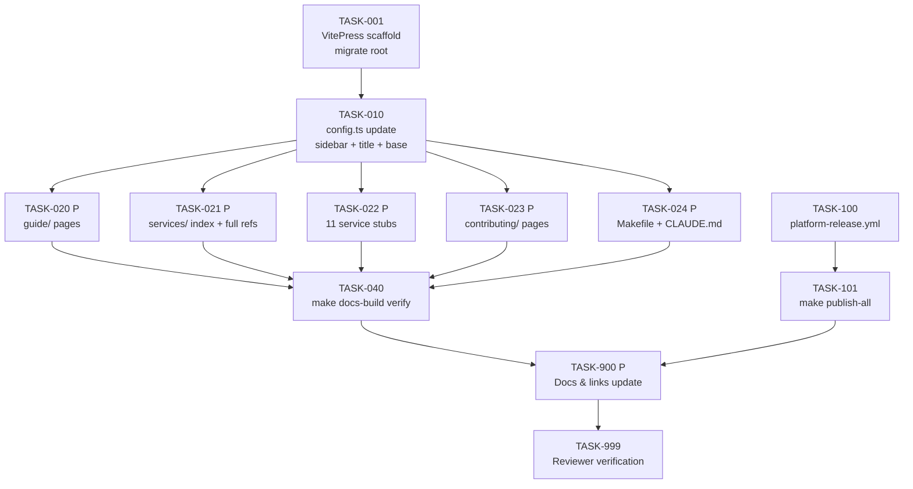

# Tasks: 017-pre-release — Unified Docs Site + Platform Release Pipeline

> **Spec**: 017-pre-release
> **Date**: 2026-03-10

## Dependency Graph

## Quality Requirements

| Module | Coverage | Lint | Notes |
|--------|----------|------|-------|
| `docs/` | N/A — no code | N/A | `make docs-build` must exit 0 |
| `.github/` | N/A | YAML valid | Workflow syntax verified by `gh workflow view` |

---

## Phase 1: Setup

- [x] [TASK-001] [DOCS] [P1] VitePress root migration — move `.vitepress/`, `package.json`, `package-lock.json` from `docs/specs/` → `docs/`; replace `docs/specs/content` symlink with `docs/specs → ../specs`
  - Dependencies: none
  - Module: `docs/`
  - Acceptance:
    - `docs/.vitepress/config.ts` exists
    - `docs/package.json` exists with `"name": "arc-platform-docs"`
    - `[ -L docs/specs ]` is true — docs/specs is a symlink, not a directory
    - `readlink docs/specs` returns `../specs`
    - `docs/specs/001-otel-setup/spec.md` resolves through the symlink
    - `git ls-tree HEAD docs/specs` shows a single symlink entry (not a tree/directory)
    - `ls docs/specs/.vitepress 2>/dev/null` returns empty — no old VitePress dir remains
    - No `node_modules/` exists under `docs/specs/`

---

## Phase 2: Foundational

- [x] [TASK-010] [DOCS] [P1] Update `docs/.vitepress/config.ts` — title, base, srcDir, multi-section sidebar with Guide / Services / Contributing / Architecture (ARD) / Specs sections
  - Dependencies: TASK-001
  - Module: `docs/.vitepress/config.ts`
  - Acceptance:
    - `title: 'ARC Docs'`
    - `base: '/arc-platform/docs/'`
    - `srcDir: '.'`
    - `CONTENT_DIR` points to `resolve(__dirname, '../specs')` for the auto-index
    - Sidebar has 5 top-level sections: Guide, Services, Contributing, Architecture, Specs
    - `srcExclude` covers `node_modules/**` and `.vitepress/**`
    - `editLink.pattern` updated to `docs/:path`
    - `resolve.preserveSymlinks: true` retained

---

## Phase 3: Implementation

### Parallel Batch A — Content (all depend on TASK-010, all parallel)

- [x] [TASK-020] [P] [DOCS] [P1] Create `docs/guide/` — `getting-started.md`, `llm-testing.md`, `arc-yaml-reference.md`
  - Dependencies: TASK-010
  - Module: `docs/guide/`
  - Acceptance:
    - `getting-started.md`: covers prerequisites → fork/clone → `arc workspace init` → `arc run --profile think` → `make dev-health`; phrase `arc run --profile think` present
    - `llm-testing.md`: ≥ 5 curl examples (sync chat 8802, streaming chat 8802, model list, STT 8803, TTS 8803)
    - `arc-yaml-reference.md`: documents all `tier` values (`think`, `observe`, `reason`, `ultra-instinct`) and `capabilities`; includes deprecation notice for old tier IDs (`super-saiyan`, `super-saiyan-blue`)

- [x] [TASK-021] [P] [DOCS] [P1] Create `docs/services/index.md`, `docs/services/reasoner.md`, `docs/services/voice.md`
  - Dependencies: TASK-010
  - Module: `docs/services/`
  - Acceptance:
    - `services/index.md`: table of all 15 services with codename, port, health URL, profile membership; all 15 service names from `SERVICE.MD` present
    - `services/reasoner.md`: full API reference — all HTTP endpoints (chat, stream, responses, model list), request/response schemas, port 8802, health URL, make targets, NATS async interface
    - `services/voice.md`: full API reference — STT (`/v1/audio/transcriptions`), TTS (`/v1/audio/speech`), port 8803, health URL, make targets; curl examples match actual FastAPI routes

- [x] [TASK-022] [P] [DOCS] [P1] Create 11 infrastructure service stub pages under `docs/services/`
  - Dependencies: TASK-010
  - Module: `docs/services/`
  - Files: `gateway.md`, `vault.md`, `flags.md`, `sql-db.md`, `vector-db.md`, `storage.md`, `messaging.md`, `streaming.md`, `cache.md`, `realtime.md`, `friday.md`
  - Acceptance:
    - Each stub has: codename, port(s), health URL, profile membership, make targets (up/down/health/logs)
    - `ls docs/services/*.md | wc -l` ≥ 13 (11 stubs + reasoner + voice + index)
    - All 11 stubs appear in the Services sidebar in `config.ts`

- [x] [TASK-023] [P] [DOCS] [P1] Create `docs/contributing/` — `architecture.md`, `new-service.md`, `new-capability.md`, `conventions.md`
  - Dependencies: TASK-010
  - Module: `docs/contributing/`
  - Acceptance:
    - `architecture.md`: Two-Brain separation diagram (mermaid), capability system diagram, service resolution flow (`core + capabilities → running services`)
    - `new-service.md`: 7-step checklist (directory + Dockerfile + service.yaml + profiles.yaml + CI workflow + docs page + health check)
    - `new-capability.md`: 6-step checklist (define capability → add to profiles.yaml → add services → test with `make dev PROFILE` → docs → ARD if needed)
    - `conventions.md`: Go (Effective Go, golangci-lint, table tests), Python (ruff + mypy, pytest, Pydantic), git (no AI footers, kebab-case branches), Docker (non-root, multi-stage), OTEL (every handler), naming (codenames vs role dirs)

- [x] [TASK-024] [P] [DOCS] [P1] Update `Makefile` and `CLAUDE.md` — replace `specs-dev` target; add `docs`, `docs-build`, `docs-preview`; update commands section in CLAUDE.md
  - Dependencies: TASK-010
  - Module: `Makefile`, `CLAUDE.md`
  - Acceptance:
    - `grep -q "specs-dev" Makefile` exits non-zero
    - `make docs` target runs `cd docs && npm install --silent && npm run dev`
    - `make docs-build` target runs `cd docs && npm install --silent && npm run build`
    - `make docs-preview` target runs `cd docs && npm run preview`
    - Help comment for `docs` section added (matching existing help comment style)
    - CLAUDE.md `Commands` section: `cd docs/specs && npm install && npm run build` replaced with `make docs`

### Parallel Batch B — Phase 2 Release Pipeline (independent of Phase 1 content)

- [x] [TASK-100] [P] [CI] [P1] Create `.github/workflows/platform-release.yml` — orchestrator triggered on `platform/v*` tags and `workflow_dispatch`; dispatches all 8 `*-images.yml` in parallel with `mode=release`; creates GitHub Release with image manifest
  - Dependencies: none
  - Module: `.github/workflows/platform-release.yml`
  - Acceptance:
    - Triggers on: `push.tags: ['platform/v*']` and `workflow_dispatch` (with `version` input)
    - `prepare` job extracts version from tag (`${GITHUB_REF#refs/tags/platform/}`); detects prerelease (`-rc`, `-alpha`, `-beta`)
    - 8 parallel dispatch jobs: `voice`, `cortex`, `reasoner`, `data`, `messaging`, `otel`, `realtime`, `control` — each calls corresponding `*-images.yml` via `gh workflow run` with `mode=release` and the extracted version
    - `release` job (runs with `if: always()` after all parallel jobs): creates GitHub Release using `gh release create`; body is a markdown table mapping each workflow to its images (see spec Phase 2 image manifest table); `--prerelease` flag set when prerelease detected
    - `continue-on-error: true` on all build dispatch jobs so one failure does not block the release
    - Workflow YAML explicitly declares `permissions: { contents: write, actions: write }` — required for same-repo `workflow_dispatch` calls

- [x] [TASK-101] [P] [CI] [P1] Add `make publish-all` to `Makefile` — triggers `platform-release.yml` via `gh workflow run`; guards on `gh auth status`
  - Dependencies: TASK-100
  - Module: `Makefile`
  - Acceptance:
    - `make publish-all` calls `gh auth status` first; if not logged in, prints `"gh: not logged in — run 'gh auth login'"` and exits 1
    - `gh workflow view platform-release.yml` check runs before dispatch; if not found, prints `"platform-release.yml not found — ensure TASK-100 is complete"` and exits 1
    - Accepts `VERSION=v0.1.0 make publish-all`; passes it as `-f version=$VERSION` to `gh workflow run platform-release.yml --ref main`
    - When `VERSION` is not set, prints usage: `"Usage: VERSION=v0.1.0 make publish-all"` and exits 1
    - Help comment added: `## publish-all: Trigger the full platform release pipeline (requires gh auth and VERSION=vX.Y.Z)`

---

## Phase 4: Integration

- [x] [TASK-040] [DOCS] [P1] Verify `make docs-build` — full static build passes with no errors; all sidebar sections present; all symlinked spec pages resolve
  - Dependencies: TASK-020, TASK-021, TASK-022, TASK-023, TASK-024
  - Module: `docs/`
  - Acceptance:
    - `make docs-build` exits 0 with no error output (warnings about localhost URLs suppressed by `ignoreDeadLinks`)
    - `ls docs/.vitepress/dist/index.html` exists
    - `grep -r "ARC Docs" docs/.vitepress/dist/` finds at least one match
    - `ls docs/specs/001-otel-setup/spec.md` resolves (symlink intact after build)
    - Five sidebar sections present in generated HTML: "Guide", "Services", "Contributing", "Architecture", "Specs"

---

## Phase 5: Polish

- [x] [TASK-900] [P] [DOCS] [P1] Docs & links update — update `specs/index.md` old URL references; verify `editLink` pattern; verify all `docs/ard/*.md` appear in `ardSidebar()`
  - Dependencies: TASK-040, TASK-101
  - Module: `docs/`, `specs/`
  - Acceptance:
    - `grep -r "specs-site" docs/` returns no matches
    - `grep -r "specs-site" specs/` returns no matches (update any spec that references old dev URL)
    - `ls docs/ard/*.md | wc -l` ≥ 10 and each file has a corresponding entry in `ardSidebar()` in `config.ts`
    - `editLink.pattern` in `config.ts` resolves to correct GitHub path: `...edit/main/docs/:path` for docs content and `...edit/main/specs/:path` for specs content

- [x] [TASK-999] [REVIEW] [P1] Reviewer agent verification
  - Dependencies: ALL
  - Module: all affected modules
  - Acceptance:
    - All tasks above marked `[x]`
    - `make docs-build` exits 0
    - `grep -q "specs-dev" Makefile` exits non-zero
    - `docs/specs/` is a symlink, not a directory (`[ -L docs/specs ]` is true)
    - `ls docs/services/*.md | wc -l` ≥ 13
    - `ls docs/ard/*.md | wc -l` ≥ 10
    - `docs/guide/getting-started.md` contains `arc run --profile think`
    - `platform-release.yml` exists and has `tags: ['platform/v*']` trigger
    - `make publish-all` target exists in `Makefile`
    - No TODO/FIXME without tracking issue

---

## Progress Summary

| Phase | Total | Done | Parallel |
|-------|-------|------|----------|
| Setup | 1 | 1 | 0 |
| Foundational | 1 | 1 | 0 |
| Implementation | 7 | 7 | 7 |
| Integration | 1 | 1 | 0 |
| Polish | 2 | 2 | 1 |
| **Total** | **12** | **12** | **8** |
